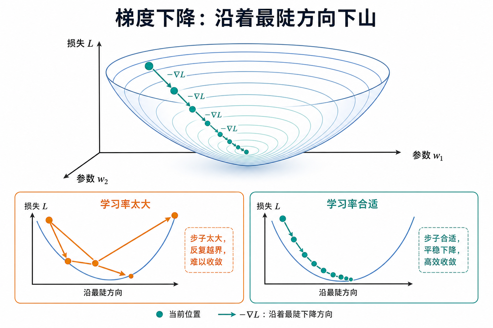
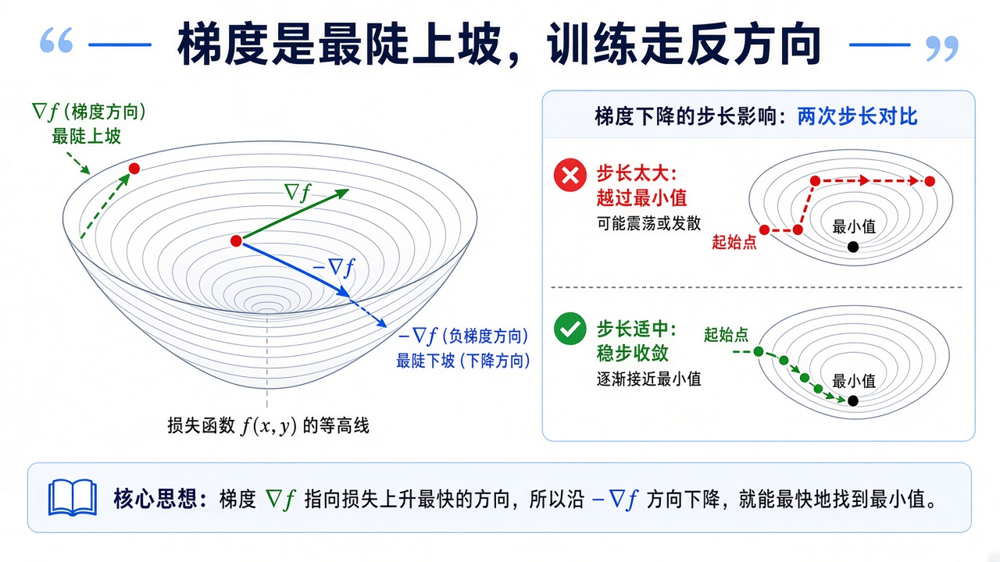
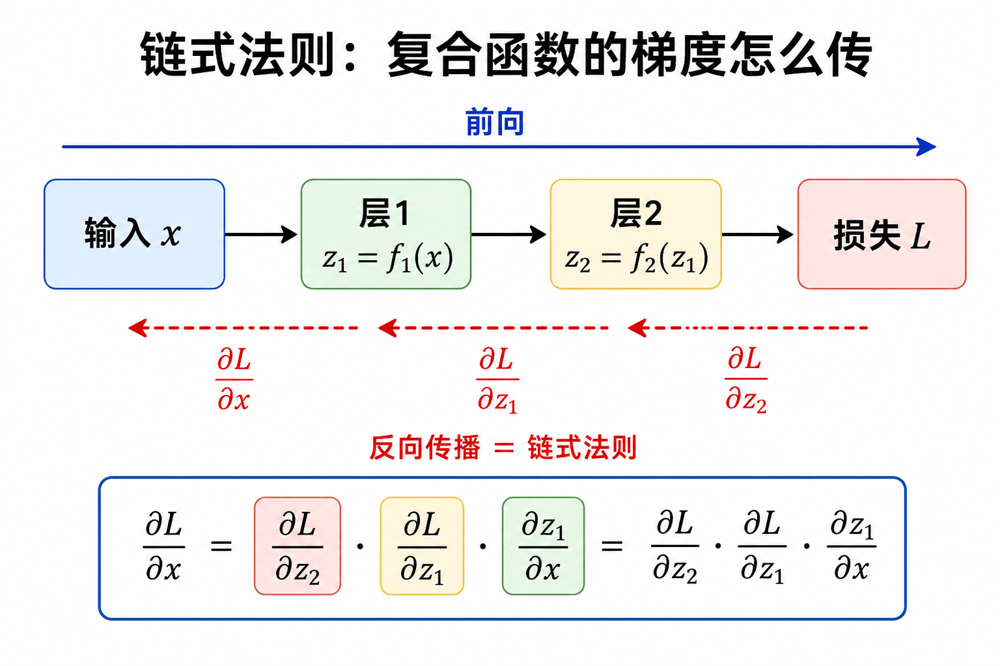
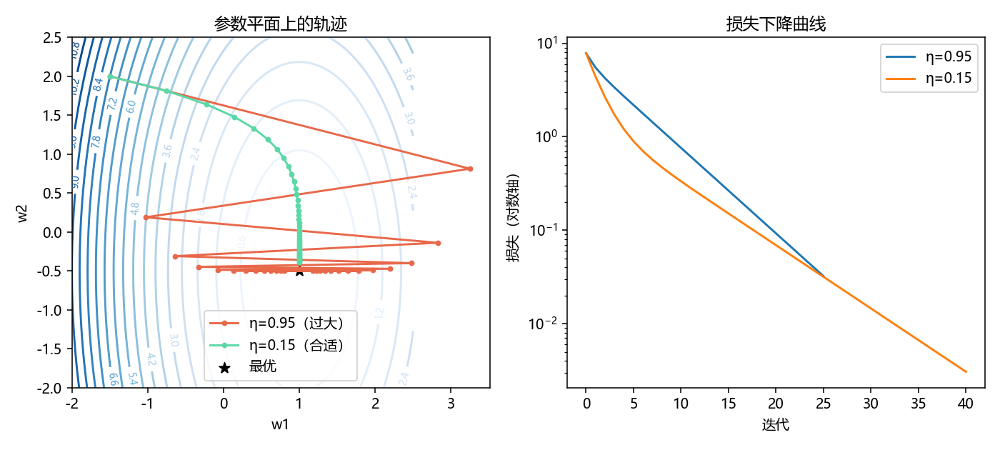

# 优化与梯度：损失怎么变成更新

> [!WARNING]
> 🧪 Beta公测版本提示：教程主体已完成，正在优化细节，欢迎大家提Issue反馈问题或建议。

> 训练一个模型 = 选一个损失 $L(\theta)$，再找让它变小的参数 $\theta$。本章只讲：**梯度是什么、梯度下降怎么走、学习率的坑、链式法则为何等于反向传播**。凸优化理论点到为止。链式法则的几何在 [导数与微分](/math/derivative/)；损失里的「平均」来自 [大数定律](/math/clt/)；线代前置从 [向量](/math/linear-algebra/) 到 [特征值](/math/eigen/)。

---

## 一、损失曲面与梯度

把参数想成地图上的坐标，损失想成海拔。**梯度** $\nabla_\theta L$ 指向**上升最快**的方向；要下山就走反方向：

$$
\theta \leftarrow \theta - \eta\,\nabla_\theta L(\theta).
$$

- $\eta$：**学习率**（步长）。太大振荡或发散，太小爬得极慢。
- 一阶方法只看当地坡度，不保证一次走到谷底——深度网络几乎总是非凸的，但 SGD 在实践中够用。

> **图解说明**：等高线谷底是目标；橙色折线是步子过大；平滑轨迹是合适学习率。

<video controls muted loop playsinline preload="metadata" style="width:100%;max-width:960px;border-radius:8px;background:#f7fafc;margin:0.6rem 0;">
  <source src="./images/gd_anim.mp4" type="video/mp4">
</video>

> **动画说明**：同一起点。$\eta=0.95$ 在谷里振荡；$\eta=0.15$ 沿着等高线走进 $(1,-0.5)$。

**随机梯度下降（SGD）**：每次只用一个小批量估计 $\nabla L$，噪声反而有时帮着逃离差的峡谷。Adam 等自适应方法 = 给各维度不同的有效学习率，细节留给深度学习章。

> **图解说明**：等高线碗底。绿箭头 $\nabla f$ 上坡，蓝箭头 $-\nabla f$ 下山。步长过大在谷里振荡。

::: details 逐步推导：线性回归 MSE 的梯度为什么是 $X^\top(Xw-y)$（点击展开）

$L(w)=\tfrac12\|Xw-y\|^2=\tfrac12(Xw-y)^\top(Xw-y)$。对 $w$ 微分：把 $Xw$ 当线性映射，残差 $r=Xw-y$，

$$
\mathrm{d}L=r^\top(X\,\mathrm{d}w)=(X^\top r)^\top\mathrm{d}w.
$$

梯度是「与 $\mathrm{d}w$ 配对的那个向量」，故 $\nabla_w L=X^\top r=X^\top(Xw-y)$。每一行 $x_i$ 把标量残差 $r_i$ 沿着特征方向推回去——多层网络只是把 $X^\top$ 换成各层雅可比的转置，这就是反向传播。

**从误差递推看“振荡”和“发散”的区别。** 对正定二次函数
$L(w)=\tfrac12(w-w_*)^\top H(w-w_*)$，梯度为 $H(w-w_*)$。
令 $e_t=w_t-w_*$，则
$e_{t+1}=(I-\eta H)e_t$。
将对称矩阵写成 $H=Q\Lambda Q^\top$，在特征坐标 $u_t=Q^\top e_t$ 中，每个方向独立满足

$
u_{t+1,j}=(1-\eta\lambda_j)u_{t,j},\qquad
u_{t,j}=(1-\eta\lambda_j)^t u_{0,j}.
$

因此所有方向收敛需要 $0<\eta<2/\lambda_{\max}$。某方向 $0<\eta\lambda_j<1$ 时不翻号地靠近；$1<\eta\lambda_j<2$ 时翻号但幅度变小，是**衰减振荡**；$\eta\lambda_j=2$ 时等幅振荡；超过 2 才沿该方向发散（初始误差非零时）。

本例 $H=\operatorname{diag}(2,0.5)$，稳定区间为 $0<\eta<1$。
$\eta=0.95$ 时两个倍率为 $-0.9,0.525$，所以会振荡但仍收敛，损失逐步下降；
$\eta=0.15$ 时倍率为 $0.7,0.925$，两个坐标都不翻号，但平坦方向收敛较慢。
不能把左图的折返误读成右图损失发散，也不能在步数 25 与 40 不同时声称做了同预算优劣比较。
若要演示真正发散，可另试 $\eta>1$，例如 $1.05$ 对应陡轴倍率 $-1.1$。

:::

---

## 二、常见损失的梯度直觉

| 损失 | 典型用途 | 梯度在说什么 |
|------|----------|--------------|
| MSE $\frac12(y-\hat y)^2$ | 回归 | 把预测往标签拉 |
| 交叉熵 | 分类 / 语言模型 | 提高正确类概率 |
| Hinge | SVM | 只惩罚间隔不够的点 |

线性回归 $L=\frac12\|Xw-y\|^2$ 的梯度有闭式：

$$
\nabla_w L = X^\top(Xw-y).
$$

这就是「误差反投射回特征」——后面链式法则是同一思想的多层版。

---

## 三、链式法则 = 反向传播

复合 $L = f_3(f_2(f_1(x)))$：

$$
\frac{\partial L}{\partial x}
=
\frac{\partial L}{\partial z_3}
\frac{\partial z_3}{\partial z_2}
\frac{\partial z_2}{\partial z_1}
\frac{\partial z_1}{\partial x}.
$$

神经网络前向算激活，反向把 $\partial L/\partial z$ 从输出一层层乘回去——**反向传播不是新魔法，就是系统化的链式法则**。

> **图解说明**：上边前向出损失，下边反传梯度。自动求导框架替你记账，但形状与「谁乘谁」要心里有数。

标量链条中局部导数的绝对值若持续大于 1 或小于 1，多层相乘可能爆炸或消失；向量情形还需看雅可比乘积的方向与奇异值——这是深度网络要残差、归一化、合适激活的原因之一。

---

## 四、正则与约束（直觉）

只最小化训练损失容易过拟合。常见补丁：

- **L2 正则** $\frac\lambda2\|\theta\|^2$：把参数往 0 拉，等效「别用太大的权重」；
- **早停 / Dropout**：优化路径上的工程正则；
- **投影 / 裁剪**：梯度爆炸时把更新限制在球内。

世界模型里的 free-bits、KL balancing，也是「别让某一项梯度把表示掐死」的优化经验。

---

## 五、代码在做什么

`demo.py` 在二维碗状损失 $L(w)=(w_1-1)^2+0.25(w_2+0.5)^2$ 上跑梯度下降，对比大学习率与小学习率轨迹，并画损失曲线。

---

## 六、小结

| 概念 | 一句话 |
|------|--------|
| 梯度 | 上升最快方向；训练走负梯度 |
| 学习率 | 步长，太大抖、太小慢 |
| SGD | 用小批量估计梯度 |
| 链式法则 | 复合函数求导；反传的数学本质 |
| 下游 | 所有可训练神经网络与凸/非凸 ML |

> 下一章 [信息论精简](/math/information/)：交叉熵与 KL 从何而来，为何分类和世界模型都在用。通信、容量与编码见 [信息论](/information/)。

## 📥 Code

| File | View | Download |
|------|------|----------|
| demo.py | [Open](./code-demo) | <a href="/notebook/code/math/optimization/demo.py" target="_blank" download>Download</a> |
| exercise.py | [Open](./code-exercise) | <a href="/notebook/code/math/optimization/exercise.py" target="_blank" download>Download</a> |

## 参考

1. Boyd & Vandenberghe, *Convex Optimization*（选读前几章）
2. Nielsen, *Neural Networks and Deep Learning*（反传推导清晰）
