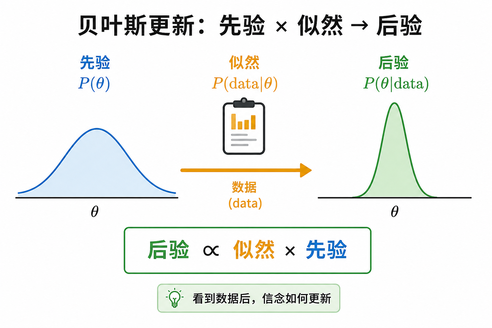
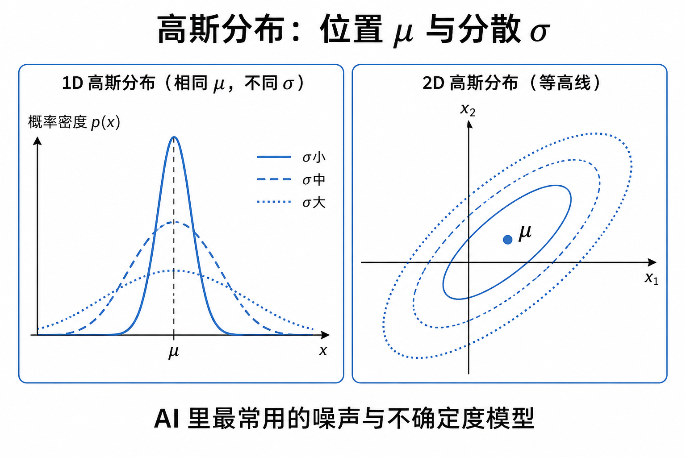
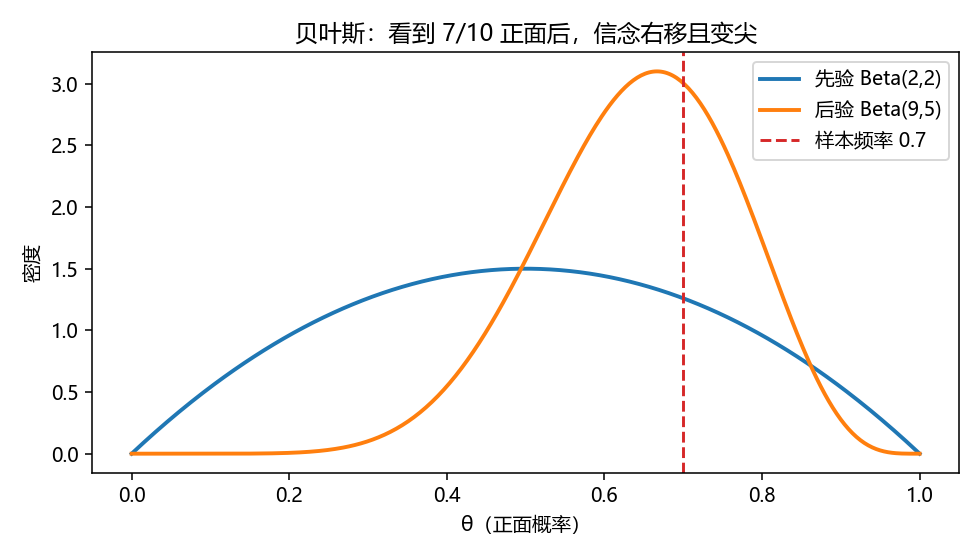
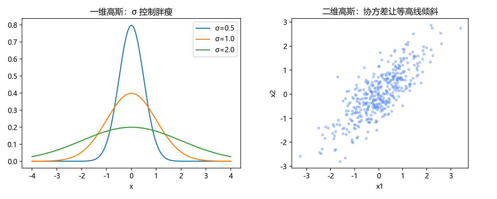

# 概率与贝叶斯：用数字写「不确定」

> [!WARNING]
> 🧪 Beta公测版本提示：教程主体已完成，正在优化细节，欢迎大家提Issue反馈问题或建议。

> 模型预测的不是「真理」，而是**在数据下更合理的信念**。本章只抓四块：随机变量与期望、条件概率、贝叶斯更新、高斯分布——足够读线性回归噪声假设、EM/GMM、PETS 的不确定度、以及世界模型里的先验/后验。

---

## 一、随机变量、期望、方差

- **随机变量** $X$：取值带概率（离散）或密度（连续）。
- **期望** $\mathbb{E}[X]$：按概率加权的平均值——「长期玩下去的中心」。
- **方差** $\mathrm{Var}(X)=\mathbb{E}[(X-\mathbb{E}X)^2]$：分散程度。

机器学习里的损失，多数是某种期望的样本平均：

$$
\mathbb{E}_{(x,y)\sim\mathcal{D}}[\ell(f_\theta(x),y)]
\approx
\frac1n\sum_{i=1}^n \ell(f_\theta(x_i),y_i).
$$

大数定律保证：样本够多，平均会靠近真期望——这是「用训练集代理真实风险」的合法借口（还要小心过拟合，那是下一阶段的故事）。

---

## 二、条件概率与独立性

$$
P(A\mid B)=\frac{P(A,B)}{P(B)}
\quad(P(B)>0).
$$

- $P(A\mid B)$：已知 $B$ 发生后，$A$ 的新概率。
- **独立**：$P(A,B)=P(A)P(B)$，等价于 $P(A\mid B)=P(A)$——知道 $B$ 不改变对 $A$ 的信念。

分类器输出的「类别概率」、语言模型的 $P(\text{下一词}\mid\text{上文})$，写的都是条件概率。

---

## 三、贝叶斯：先验 × 似然 → 后验

$$
P(\theta\mid \mathrm{data})
=
\frac{P(\mathrm{data}\mid\theta)\,P(\theta)}{P(\mathrm{data})}
\propto
P(\mathrm{data}\mid\theta)\,P(\theta).
$$

| 名词 | 含义 |
|------|------|
| 先验 $P(\theta)$ | 看数据前对参数的信念 |
| 似然 $P(\mathrm{data}\mid\theta)$ | 参数固定时，数据有多「像会被生成」 |
| 后验 $P(\theta\mid\mathrm{data})$ | 看完数据后的更新信念 |
| 证据 $P(\mathrm{data})$ | 归一化常数，保证后验积分为 1 |

> **图解说明**：先验被似然「拧」成后验。数据越强，后验越尖；先验越强，后验越难被拧走。

世界模型里的说法几乎一一对应：

- **先验** $p(z_t\mid z_{t-1},a_{t-1})$：不看当前观测的预测；
- **后验** $q(z_t\mid \ldots,o_t)$：看到 $o_t$ 后的修正。

训练时常让先验追后验（KL）——贝叶斯更新的工程版。

---

## 四、高斯：AI 里的默认噪声

一维：

$$
\mathcal{N}(x;\mu,\sigma^2)
=
\frac{1}{\sqrt{2\pi}\sigma}
\exp\Big(-\frac{(x-\mu)^2}{2\sigma^2}\Big).
$$

- $\mu$：中心；$\sigma$：胖瘦。
- 平方误差损失 $\propto -\log\mathcal{N}(y;\hat y,\sigma^2)$（$\sigma$ 固定时）——所以「最小二乘」常是高斯假设的最大似然。

多维高斯用均值向量与协方差矩阵 $\Sigma$ 描述椭圆等高线。对角 $\Sigma$：轴对齐；全 $\Sigma$：可倾斜相关。

> **图解说明**：同一 $\mu$、不同 $\sigma$ 控制分散；2D 椭圆是协方差的几何形状。PETS / RSSM 里的「不确定」经常就是这套语言。

---

## 五、代码在做什么

`demo.py`：

1. 用抛硬币的 Beta-Binomial 玩具演示先验 → 后验如何随正面次数移动；
2. 画不同 $\sigma$ 的一维高斯，并采样二维相关高斯散点。

---

## 六、小结

| 概念 | 一句话 |
|------|--------|
| 期望 / 方差 | 中心与分散 |
| 条件概率 | 已知部分信息后的信念 |
| 贝叶斯 | 先验被似然更新为后验 |
| 高斯 | 最常用的噪声与不确定模型 |
| 下游 | 回归、EM、贝叶斯深度学习、世界模型先验/后验 |

> 下一章 [优化与梯度](/math/optimization/)：信念写成损失后，参数怎么下山。

## 📥 Code

| File | View | Download |
|------|------|----------|
| demo.py | [Open](./code-demo) | <a href="/notebook/code/math/probability/demo.py" target="_blank" download>Download</a> |
| exercise.py | [Open](./code-exercise) | <a href="/notebook/code/math/probability/exercise.py" target="_blank" download>Download</a> |

## 参考

1. Blitzstein & Hwang, *Introduction to Probability*
2. MacKay, *Information Theory, Inference, and Learning Algorithms*（贝叶斯视角极佳）
