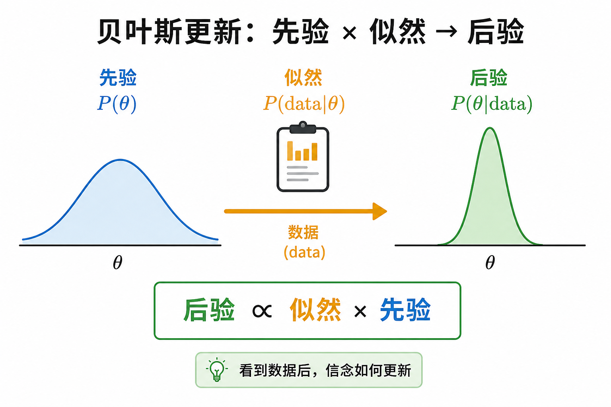
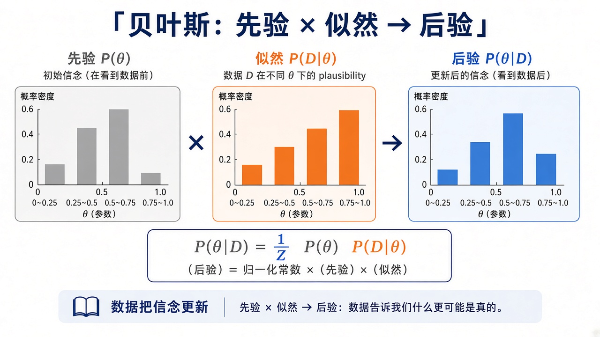
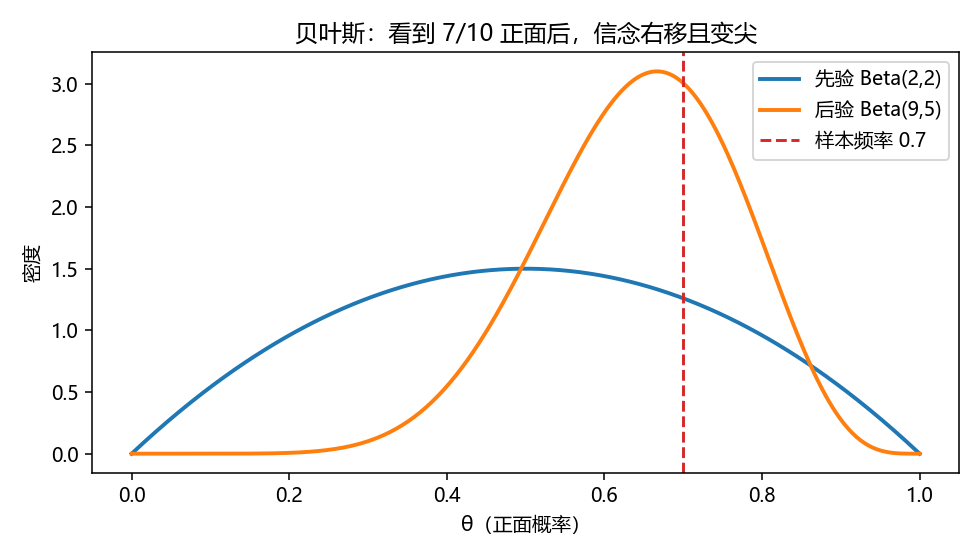
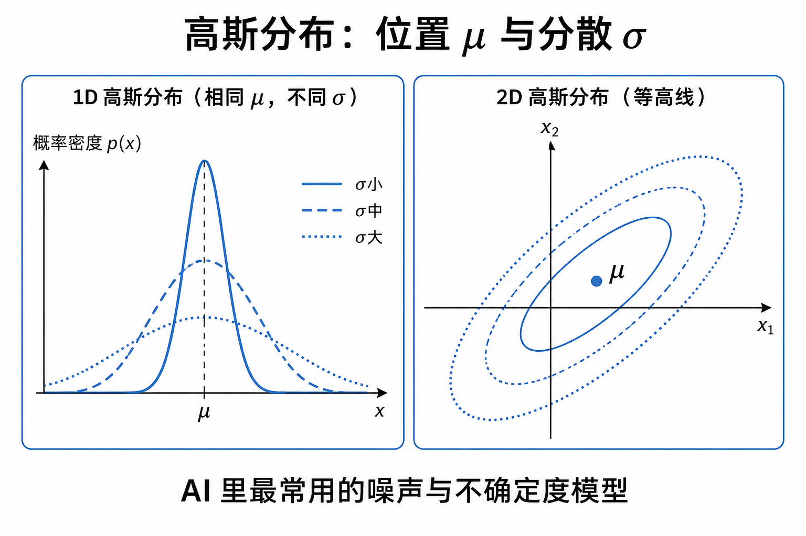
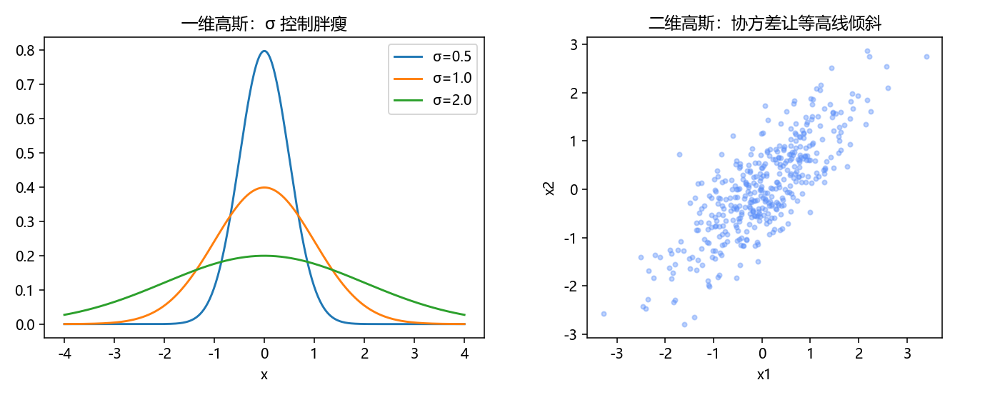

# 概率与贝叶斯：用数字写「不确定」

> [!WARNING]
> 🧪 Beta公测版本提示：教程主体已完成，正在优化细节，欢迎大家提Issue反馈问题或建议。

> 模型预测的不是「真理」，而是**在数据下更合理的信念**。本章只抓四块：随机变量与期望、条件概率、贝叶斯更新、高斯分布——足够读线性回归噪声假设、EM/GMM、PETS 的不确定度、以及世界模型里的先验/后验。常见分布清单见 [常见分布](/math/distributions/)；用样本反推参数见 [估计](/math/estimation/)；平均为何像高斯见 [CLT](/math/clt/)。领域地图：[数学基础](/math/)。

---

## 一、随机变量、期望、方差

- **随机变量** $X$：取值带概率（离散）或密度（连续）。不是「未知常数」——它是一台会吐出不同数字的机器，每次运行的结果按一张固定的表出现。
- **期望** $\mathbb{E}[X]$：按概率加权的平均值——「长期玩下去的中心」。
- **方差** $\mathrm{Var}(X)=\mathbb{E}[(X-\mathbb{E}X)^2]$：分散程度。标准差是它的平方根，和 $X$ 同一单位。

离散时把「加权」写开就是求和：

$$
\mathbb{E}[X]=\sum_x x\,P(X=x),\qquad
\mathrm{Var}(X)=\mathbb{E}[X^2]-(\mathbb{E}[X])^2.
$$

机器学习里的损失，多数是某种期望的样本平均：

$$
\mathbb{E}_{(x,y)\sim\mathcal{D}}[\ell(f_\theta(x),y)]
\approx
\frac1n\sum_{i=1}^n \ell(f_\theta(x_i),y_i).
$$

大数定律保证：样本够多，平均会靠近真期望——这是「用训练集代理真实风险」的合法借口（还要小心过拟合）。定理表述与直方图见 [大数定律与中心极限](/math/clt/)。

**保姆级数字例。** C++ `stats.hpp` 对集合 $\{1,2,3,4,5\}$ 当作五个等权样本：

| 量 | 算法 | 值 |
|----|------|----|
| 均值 | $(1+2+3+4+5)/5$ | $3$ |
| 离差平方和 | $(1-3)^2+\cdots+(5-3)^2=4+1+0+1+4$ | $10$ |
| MLE / 总体方差 | $10/5$ | $2$ |
| 无偏样本方差 | $10/4$ | $2.5$ |

同一堆数，除以 $n$ 还是 $n-1$ 差 $0.5$——不是四舍五入的问题，是「这五个数是总体，还是更大总体里抽出的样本」。估计章会把这件事钉死。

**卡点。** 期望不是「最可能出现的值」。公平骰子期望 $3.5$，骰子上根本没有 $3.5$ 这一点。方差也不是「最大偏差」：它惩罚远离中心的平方，极端值会把 $\mathrm{Var}$ 拉得很大。

::: details 逐步推导：从「长期平均」到 $\mathbb{E}[X]=3$、$\mathrm{Var}=2$（点击展开）

把 $X$ 想成从 $\{1,2,3,4,5\}$ 里均匀抽一个（每个概率 $1/5$）。抽 $N$ 次，大约各出现 $N/5$ 次，总和大约

$$
\frac{N}{5}(1+2+3+4+5)=3N,
$$

平均就是 $3$。把「大约」换成精确的加权：

$$
\mathbb{E}[X]=\frac15\cdot 1+\frac15\cdot 2+\cdots+\frac15\cdot 5=3.
$$

方差先算离差平方的平均：

$$
\mathbb{E}[(X-3)^2]=\frac15(4+1+0+1+4)=2.
$$

等价地先算二阶矩 $\mathbb{E}[X^2]=(1+4+9+16+25)/5=11$，再减 $(\mathbb{E}X)^2$：

$$
\mathrm{Var}(X)=11-9=2.
$$

这是**总体**方差（五个点就是整个世界）。若把这五个点看成样本，$s^2=10/(5-1)=2.5$ 才无偏——因为用 $\bar X$ 代替了未知的 $\mu$，少了一个自由度。线性性质后面处处用：$\mathbb{E}[aX+b]=a\mathbb{E}X+b$，$\mathrm{Var}(aX+b)=a^2\mathrm{Var}(X)$（加常数不改分散，乘 $a$ 会把偏差也乘 $a$，平方后变 $a^2$）。独立时方差可加：$\mathrm{Var}(X+Y)=\mathrm{Var}X+\mathrm{Var}Y$。

训练损失的样本平均，就是把上面的 $\frac1N\sum$ 换成 minibatch。合法的前提是 i.i.d.（或足够接近）；相关样本会让「有效 $N$」变小，方差公式不能照搬。

:::

---

## 二、条件概率与独立性

$$
P(A\mid B)=\frac{P(A,B)}{P(B)}
\quad(P(B)>0).
$$

- $P(A\mid B)$：已知 $B$ 发生后，$A$ 的新概率。分母是「先缩小到 $B$ 这块」，分子是「$A$ 与 $B$ 重叠的那一块」。
- **独立**：$P(A,B)=P(A)P(B)$，等价于 $P(A\mid B)=P(A)$——知道 $B$ 不改变对 $A$ 的信念。
- 乘法法则（总是对，不管独不独立）：$P(A,B)=P(A\mid B)P(B)$。链式往下写就是语言模型 $P(w_1)P(w_2\mid w_1)P(w_3\mid w_1,w_2)\cdots$。

分类器输出的「类别概率」、语言模型的 $P(\text{下一词}\mid\text{上文})$，写的都是条件概率。

**保姆级数字例。** 公平硬币抛两次。记 $A=$「第一次正面」，$B=$「至少一次正面」。样本空间 $\{\mathrm{HH},\mathrm{HT},\mathrm{TH},\mathrm{TT}\}$ 各 $1/4$。$P(B)=3/4$，$P(A\cap B)=P(\{\mathrm{HH},\mathrm{HT}\})=1/2$，于是

$$
P(A\mid B)=\frac{1/2}{3/4}=\frac23.
$$

无条件下 $P(A)=1/2$。知道「至少有一次正面」之后，第一次是正面的机会从 $1/2$ 涨到 $2/3$——因为 $\mathrm{TT}$ 被删掉了。这就是「条件」在做的事：扔掉与 $B$ 矛盾的世界，把剩下的概率重新归一化。

**卡点。** $P(A\mid B)$ 和 $P(B\mid A)$ 不是一回事。检验阳性 $\mid$ 有病，与有病 $\mid$ 检验阳性，差的就是先验 $P(\text{有病})$。贝叶斯一节专门拧这件事。

---

## 三、贝叶斯：先验 × 似然 → 后验

$$
P(\theta\mid \mathrm{data})
=
\frac{P(\mathrm{data}\mid\theta)\,P(\theta)}{P(\mathrm{data})}
\propto
P(\mathrm{data}\mid\theta)\,P(\theta).
$$

| 名词 | 含义 |
|------|------|
| 先验 $P(\theta)$ | 看数据前对参数的信念 |
| 似然 $P(\mathrm{data}\mid\theta)$ | 参数固定时，数据有多「像会被生成」 |
| 后验 $P(\theta\mid\mathrm{data})$ | 看完数据后的更新信念 |
| 证据 $P(\mathrm{data})$ | 归一化常数，保证后验积分为 1 |

> **图解说明**：先验被似然「拧」成后验。数据越强，后验越尖；先验越强，后验越难被拧走。

> **图解说明**：灰先验、橙似然，乘完再归一化得到蓝后验。数据把信念从「猜」更新成「看过之后的猜」。

demo 用 **Beta-Binomial** 把这件事做成可画的曲线：先验 $\mathrm{Beta}(2,2)$（略偏好中间），观测 $10$ 次里 $7$ 次正面，后验精确地是 $\mathrm{Beta}(9,5)$。样本频率 $7/10=0.7$ 画成竖虚线——后验峰会靠向它，但不会完全贴上去，因为先验还在把信念往 $0.5$ 拉。

**保姆级数字例（与 `demo.py` 同一组）。** $\mathrm{Beta}(\alpha,\beta)$ 的均值是 $\alpha/(\alpha+\beta)$：

| | $\alpha$ | $\beta$ | 均值 |
|--|----------|---------|------|
| 先验 $\mathrm{Beta}(2,2)$ | $2$ | $2$ | $2/4=0.5$ |
| 后验 $\mathrm{Beta}(9,5)$ | $2+7$ | $2+3$ | $9/14\approx 0.643$ |

$0.643$ 介于 $0.5$ 与 $0.7$ 之间：它是「先验伪计数 $4$ 次（均值 $0.5$）」和「数据 $10$ 次（均值 $0.7$）」的加权平均

$$
\frac{4\cdot 0.5+10\cdot 0.7}{14}=\frac{9}{14}.
$$

数据再多，权会压过先验，后验均值贴向 $0.7$，峰也更尖。

世界模型里的说法几乎一一对应：

- **先验** $p(z_t\mid z_{t-1},a_{t-1})$：不看当前观测的预测；
- **后验** $q(z_t\mid \ldots,o_t)$：看到 $o_t$ 后的修正。

训练时常让先验追后验（KL）——贝叶斯更新的工程版。

**卡点。** 「似然」不是「$\theta$ 有多可能」，而是「$\theta$ 固定时，数据有多像会被吐出来」。$P(\mathrm{data}\mid\theta)$ 对 $\theta$ 积分不必等于 $1$；对 data 才归一。把似然当成后验直接用，等于偷偷假设了平坦先验。

::: details 逐步推导：Beta-Binomial 后验为何是 $\mathrm{Beta}(9,5)$（点击展开）

抛币 $n$ 次、正面 $k$ 次，似然是二项（$\theta$ 未知）：

$$
P(\mathrm{data}\mid\theta)=\binom{n}{k}\theta^k(1-\theta)^{n-k}.
$$

先验取 $\mathrm{Beta}(\alpha,\beta)$，密度 $\propto \theta^{\alpha-1}(1-\theta)^{\beta-1}$（$\alpha=\beta=2$ 时是倒扣的碗，中间高、两端低）。乘在一起：

$$
P(\theta\mid\mathrm{data})
\propto
\theta^k(1-\theta)^{n-k}\cdot\theta^{\alpha-1}(1-\theta)^{\beta-1}
=\theta^{\alpha+k-1}(1-\theta)^{\beta+n-k-1}.
$$

这正是 $\mathrm{Beta}(\alpha+k,\,\beta+n-k)$ 的核。代入 $\alpha=\beta=2$、$k=7$、$n=10$：

$$
\alpha'=2+7=9,\quad \beta'=2+3=5.
$$

证据 $P(\mathrm{data})$ 是把先验与似然的乘积对 $\theta\in[0,1]$ 积分，刚好是 Beta 的归一化常数 $B(\alpha',\beta')$ 那一项——共轭先验的好处是**不用数值积分**，更新 = 往 $\alpha,\beta$ 上加计数。

> **图解说明**：蓝线 $\mathrm{Beta}(2,2)$ 对称蹲在 $0.5$；橙线 $\mathrm{Beta}(9,5)$ 右移且变尖；红虚线是样本频率 $0.7$。后验均值 $9/14\approx 0.643$，被先验从 $0.7$ 往回拽了一截。

离散版贝叶斯（事件而不是参数）是同一公式。设 $H$ 为假设、$D$ 为数据：

$$
P(H\mid D)=\frac{P(D\mid H)P(H)}{P(D)},\qquad
P(D)=\sum_{H'}P(D\mid H')P(H').
$$

分母把「所有能产生 $D$ 的故事」加起来。漏加某个 $H'$，后验会被错误地抬高——这就是忽略基础比率（base-rate neglect）的代数来源。

:::

---

## 四、高斯：AI 里的默认噪声

一维：

$$
\mathcal{N}(x;\mu,\sigma^2)
=
\frac{1}{\sqrt{2\pi}\sigma}
\exp\Big(-\frac{(x-\mu)^2}{2\sigma^2}\Big).
$$

- $\mu$：中心；$\sigma$：胖瘦。demo 画 $\sigma=0.5,1,2$ 三条：$\sigma$ 翻倍，峰高减半、腰变宽（面积始终为 $1$）。
- 平方误差损失 $\propto -\log\mathcal{N}(y;\hat y,\sigma^2)$（$\sigma$ 固定时）——所以「最小二乘」常是高斯假设的最大似然。

多维高斯用均值向量与协方差矩阵 $\Sigma$ 描述椭圆等高线。对角 $\Sigma$：轴对齐；全 $\Sigma$：可倾斜相关。demo 的二维例子

$$
\Sigma=\begin{pmatrix}1&0.8\\0.8&1\end{pmatrix}
$$

两个分量各自方差为 $1$，相关系数 $0.8$，所以云团沿 $y=x$ 方向拉长。

> **图解说明**：同一 $\mu$、不同 $\sigma$ 控制分散；2D 椭圆是协方差的几何形状。PETS / RSSM 里的「不确定」经常就是这套语言。

**卡点。** 高斯的「薄尾」：偏离 $\mu$ 超过 $3\sigma$ 的概率约 $0.3\%$。真实噪声若有尖峰（传感器跳变、标注错误），最小二乘会被那几个点绑架——这是改用 Laplace / Huber 损失的动机。另一个卡点：$\sigma\to 0$ 时密度在 $\mu$ 处炸成脉冲，数值上 $-\log p$ 会溢出；实现里常对 $\sigma$ 设下限。

::: details 逐步推导：平方误差为何是高斯的负对数似然（点击展开）

假设 $y=\hat y+\varepsilon$，$\varepsilon\sim\mathcal{N}(0,\sigma^2)$，则 $y\sim\mathcal{N}(\hat y,\sigma^2)$。一条样本的负对数密度

$$
-\log\mathcal{N}(y;\hat y,\sigma^2)
=\frac12\log(2\pi\sigma^2)+\frac{(y-\hat y)^2}{2\sigma^2}.
$$

$n$ 条 i.i.d. 加起来，第一项与 $\hat y$ 无关。$\sigma$ 若固定，最小化 $-\log L$ **等价于**最小化 $\sum(y_i-\hat y_i)^2$。这就是「最小二乘 = 高斯噪声下的 MLE」。

$\sigma$ 也未知时，MLE 会同时估 $\hat\sigma^2=\frac1n\sum(y_i-\hat y_i)^2$（除以 $n$，有偏，见 [估计](/math/estimation/)）。

二维密度多一个行列式：

$$
\mathcal{N}(x;\mu,\Sigma)
=\frac{1}{(2\pi)^{d/2}\sqrt{\det\Sigma}}
\exp\Big(-\frac12(x-\mu)^\top\Sigma^{-1}(x-\mu)\Big).
$$

指数里的 $(x-\mu)^\top\Sigma^{-1}(x-\mu)$ 叫马氏距离：先用 $\Sigma^{-1}$ 把椭圆拧成圆，再量欧氏长度。$\Sigma$ 的特征方向就是椭圆的长轴、短轴——这和 [特征值](/math/eigen/) 是同一套几何。

demo 一维曲线用的就是 $\mu=0$、$\sigma\in\{0.5,1,2\}$ 代入上式；二维散点从 $\mathcal{N}(0,\Sigma)$ 抽 $400$ 个点。

> **图解说明**：左：$\sigma$ 越小峰越尖。右：$\rho=0.8$ 的相关云，轴对齐的圆被拧成斜椭圆。

:::

---

## 五、代码在做什么

`demo.py`：

1. 用抛硬币的 Beta-Binomial 玩具演示先验 → 后验如何随正面次数移动（先验 $\mathrm{Beta}(2,2)$，数据 $7/10$ 正面，后验 $\mathrm{Beta}(9,5)$）；
2. 画不同 $\sigma$ 的一维高斯，并采样二维相关高斯散点（$\Sigma_{12}=0.8$）。

C++ `stats.hpp` 不算贝叶斯积分，只把「期望 / 方差是样本的函数」写成循环：对 $\{1,2,3,4,5\}$ 印均值 $3$、无偏方差 $2.5$、MLE 方差 $2$。

---

## 六、小结

| 概念 | 一句话 |
|------|--------|
| 期望 / 方差 | 中心与分散；同一堆数除以 $n$ 或 $n-1$ 含义不同 |
| 条件概率 | 已知部分信息后，把样本空间缩小再归一化 |
| 贝叶斯 | 先验被似然更新为后验；Beta 对二项是共轭 |
| 高斯 | 最常用的噪声与不确定模型；固定 $\sigma$ 时 MLE = 最小二乘 |
| 下游 | 回归、EM、贝叶斯深度学习、世界模型先验/后验 |

> 下一章 [常见分布](/math/distributions/)：似然里那些 $p(x\mid\theta)$ 具体长什么样。优化见 [梯度](/math/optimization/)。

## 📥 Code

| File | View | Download |
|------|------|----------|
| demo.py | [Open](./code-demo) | <a href="/notebook/code/math/probability/demo.py" target="_blank" download>Download</a> |
| stats.hpp | — | <a href="/notebook/code/math/probability/stats.hpp" target="_blank" download>Download</a> |
| demo.cpp | — | <a href="/notebook/code/math/probability/demo.cpp" target="_blank" download>Download</a> |
| exercise.py | [Open](./code-exercise) | <a href="/notebook/code/math/probability/exercise.py" target="_blank" download>Download</a> |

## 参考

1. Blitzstein & Hwang, *Introduction to Probability*
2. MacKay, *Information Theory, Inference, and Learning Algorithms*（贝叶斯视角极佳）
