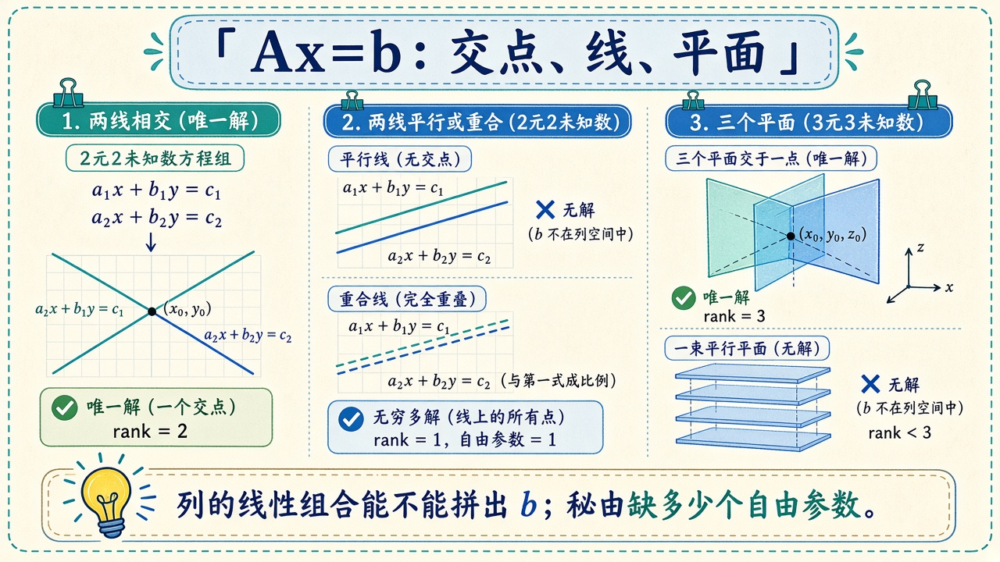
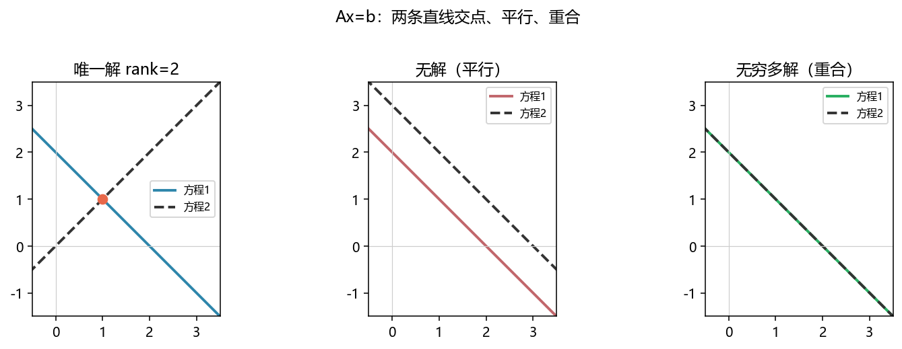

# 线性方程组与秩：有没有解，解有几个

> [!WARNING]
> 🧪 Beta公测版本提示：教程主体已完成，正在优化细节，欢迎大家提Issue反馈问题或建议。

> 上一章把矩阵看成「捏空间」。这一章问更硬的一句：**给定 $A$ 和 $b$，方程 $Ax=b$ 有没有解？** 几何上是「直线 / 平面交不交」；代数上是「$b$ 能不能写成 $A$ 的各列的线性组合」。学完应能读懂最小二乘为何要写成 $A^\top A\hat x=A^\top b$，以及「秩亏」为什么让训练炸掉。前置：[线性代数直觉](/math/linear-algebra/)。

---

## 一、$Ax=b$ 三种结局

把两元方程看成平面上的直线 $a x + b y = c$：

| 几何 | 代数 | 秩 |
|------|------|----|
| 两线交于一点 | 唯一解 | $\mathrm{rank}(A)=\mathrm{rank}([A\mid b])=n$ |
| 两线平行 | 无解 | $\mathrm{rank}(A) < \mathrm{rank}([A\mid b])$ |
| 两线重合 | 无穷多解 | $\mathrm{rank}(A)=\mathrm{rank}([A\mid b])<n$ |

$n$ 是未知数个数。增广矩阵 $[A\mid b]$ 比 $A$ 多一列 $b$：如果 $b$ 带来了新的独立方向，方程互相打架。



> **图解说明**：左是唯一交点；中是平行无交；右把故事抬到三维（三张平面）。底栏那句话是列空间语言：列的线性组合能不能拼出 $b$。

列空间 $\mathrm{Col}(A)$ 就是所有 $Ax$ 能到达的点。**有解 $\Leftrightarrow b\in\mathrm{Col}(A)$。** 秩 $\mathrm{rank}(A)$ 是列空间的维数，也等于非零行数（消元之后）。

---

## 二、高斯消元在干什么

把第 $j$ 列的主元变成 $1$，再用它把同列其他行削成 $0$。部分主元（选绝对值最大的行对调）避免除以接近 $0$ 的数。走完若主元全在，就得到唯一解；某列扫不到主元，秩就掉一档。

三维教科书例子：

$$
\begin{pmatrix}
2 & 1 & -1 \\
-3 & -1 & 2 \\
-2 & 1 & 2
\end{pmatrix}
\begin{pmatrix}x\\ y\\ z\end{pmatrix}
=
\begin{pmatrix}8\\ -11\\ -3\end{pmatrix}
\quad\Rightarrow\quad
(x,y,z)=(2,3,-1).
$$

`demo.py` 的 `gauss_solve` 与 `gauss.hpp` 写的是同一套循环。对照 `numpy.linalg.solve` 只为验算，不是再学一个黑盒。

最小二乘是「$b$ 不在列空间里」时的退路：把 $b$ 正交投影到 $\mathrm{Col}(A)$ 上再解。正规方程 $A^\top A\hat x=A^\top b$ 正是在投。线性回归见 [线性回归](/ml/foundations/linear-regression/)。

---

## 三、秩、自由未知数、病态

- 满秩方阵：可逆，唯一解。
- 行线性相关（例如第二行是第一行的两倍）：$\mathrm{rank}<n$，要么无解要么自由变量。
- **数值秩**：奇异值大于阈值的个数。浮点里「精确相关」几乎不出现，要用阈值。练习就是在数这个个数。
- 条件数大：解对 $b$ 的扰动过敏。上一章提过名字，这里会在消元里碰到「主元特别小」。

---

## 四、代码在做什么

Python 画三组直线，并对手写 3×3 消元与 NumPy 对答案。C++ `gauss.hpp` 印同一组解，以及一个秩为 2 的相关矩阵。



编译：

```bash
cd docs/math/systems/code
python demo.py
g++ -std=c++17 demo.cpp -o systems_demo
```

Windows 直接跑 `systems_demo.exe`。不要链 Eigen。

---

## 五、小结

| 概念 | 一句话 |
|------|--------|
| $Ax=b$ | $b$ 是否在列空间里 |
| 秩 | 独立列（或行）的个数 |
| 高斯消元 | 用主元清列，读出解或秩 |
| 增广矩阵 | 多看 $b$ 这一列，判断有没有打架 |
| 下游 | 最小二乘、可观测性、[特征值](/math/eigen/) |

> 下一章 [特征值与二次型](/math/eigen/)：不解 $Ax=b$，改为找「只被拉伸的方向」。

## 📥 Code

| File | View | Download |
|------|------|----------|
| demo.py | [Open](./code-demo) | <a href="/notebook/code/math/systems/demo.py" target="_blank" download>Download</a> |
| gauss.hpp | — | <a href="/notebook/code/math/systems/gauss.hpp" target="_blank" download>Download</a> |
| demo.cpp | — | <a href="/notebook/code/math/systems/demo.cpp" target="_blank" download>Download</a> |
| exercise.py | [Open](./code-exercise) | <a href="/notebook/code/math/systems/exercise.py" target="_blank" download>Download</a> |

## 参考

1. Strang, G. *Introduction to Linear Algebra*（列空间与消元）
2. Trefethen & Bau, *Numerical Linear Algebra*（主元与条件数）
