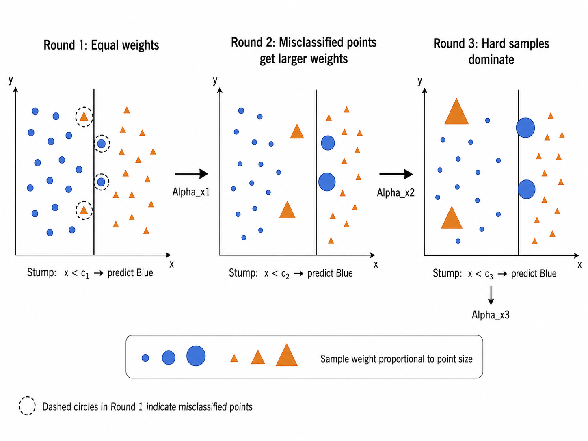
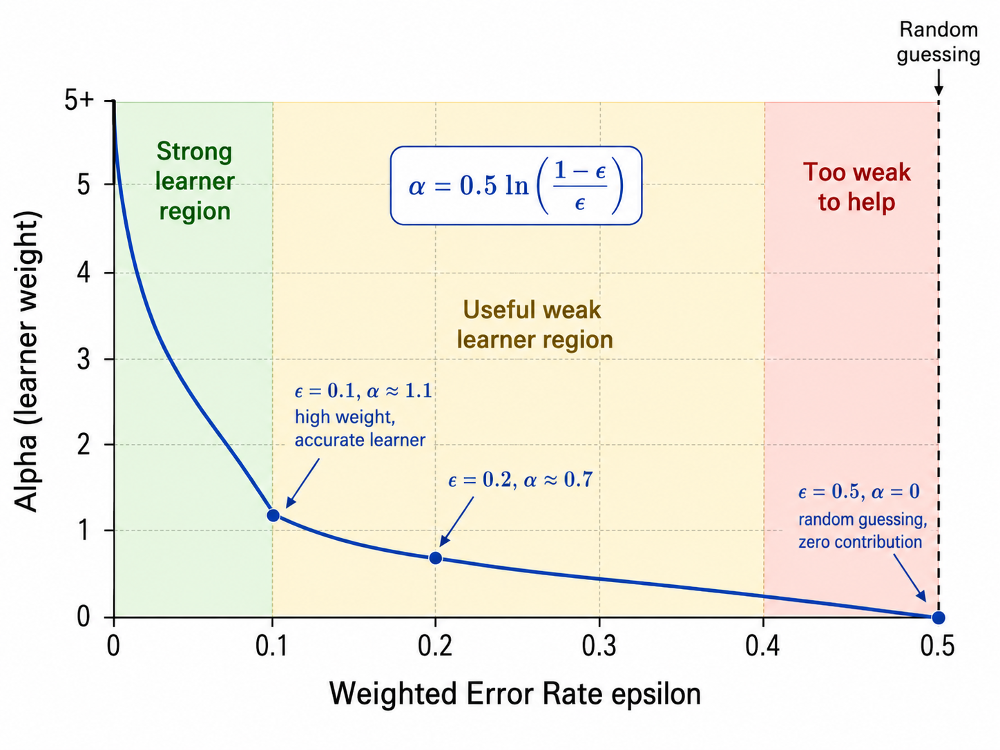
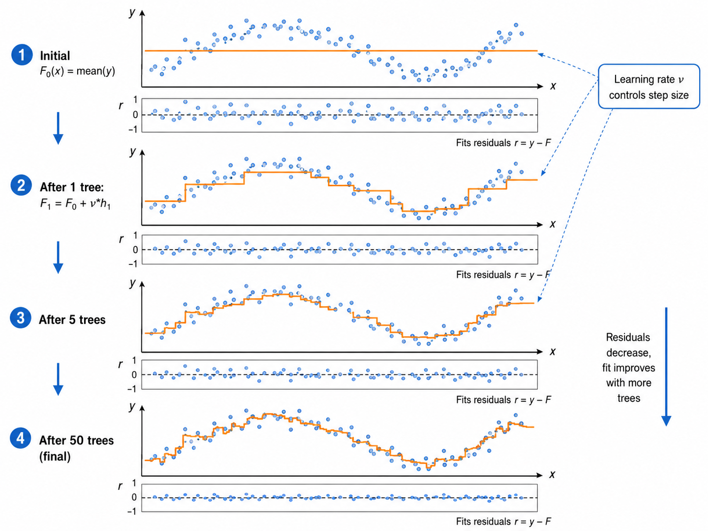
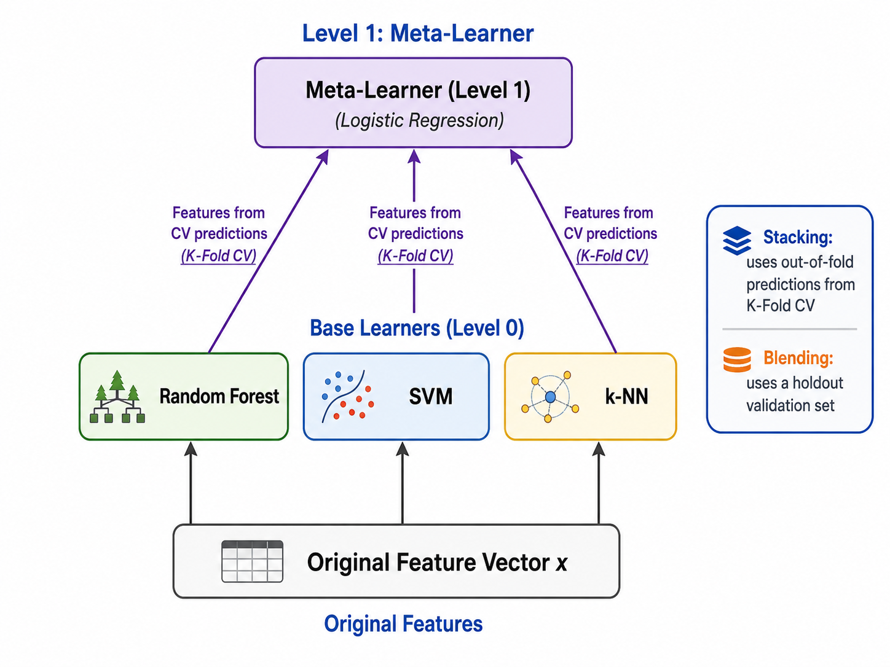

# 集成学习：Boosting 与 Stacking

> [!WARNING]
> 🧪 Beta公测版本提示：教程主体已完成，正在优化细节，欢迎大家提Issue反馈问题或建议。


## 1. Boosting 的哲学：从弱学习器到强学习器

### 1.1 Bagging vs Boosting

在 ml06 中我们学习了 Bagging——多个模型**并行**独立训练，通过投票降低方差。Boosting 则走了一条完全不同的路：**串行**训练，每个新模型专注于修正前一个模型的错误。

Boosting 的核心思想可以追溯到**PAC 学习理论**中的一个问题：能否将弱学习器（仅比随机猜测稍好，如错误率 49%）提升为强学习器（任意低的错误率）？答案是肯定的——这就是 Boosting 名称的来源。

与 Bagging 降低方差不同，Boosting 主要**降低偏差**。每个后续模型都试图纠正前序模型的系统性错误（即偏差），因此 Boosting 的基学习器通常是非常简单的"弱学习器"（如深度仅为 1-3 的决策树桩）。



### 1.2 前向分步加法模型（Forward Stagewise Additive Modeling）

Boosting 可以统一理解为前向分步加法模型：

$$
F_m(\mathbf{x}) = F_{m-1}(\mathbf{x}) + \alpha_m \cdot h_m(\mathbf{x})
$$

其中：
- $F_{m-1}$ 是前 $m-1$ 个学习器的累加
- $h_m$ 是第 $m$ 个新加入的基学习器
- $\alpha_m$ 是 $h_m$ 的权重

每一步选择 $h_m$ 和 $\alpha_m$ 来最小化某个损失函数。不同的 Boosting 算法使用不同的损失函数和优化策略。

---

## 2. AdaBoost：指数损失与样本重加权

### 2.1 算法原理

AdaBoost（Adaptive Boosting）是最经典的 Boosting 算法，使用**指数损失**（Exponential Loss）：

$$
L(y, F(\mathbf{x})) = \exp(-y \cdot F(\mathbf{x}))
$$

其中 $y \in \{-1, +1\}$。指数损失对分类错误（$yF < 0$）施加极高的惩罚——错误越大，损失指数增长。

### 2.2 算法步骤

1. 初始化样本权重：$w_i^{(1)} = 1/n$

2. 对 $m = 1, 2, \dots, M$：
   - 用当前样本权重训练基学习器 $h_m$，最小化加权错误率
   - 计算加权错误率：
     $$\epsilon_m = \frac{\sum_{i=1}^{n} w_i^{(m)} \mathbb{I}(h_m(\mathbf{x}_i) \neq y_i)}{\sum_i w_i^{(m)}}$$
   - 计算基学习器权重：
     $$\alpha_m = \frac{1}{2} \ln\left(\frac{1 - \epsilon_m}{\epsilon_m}\right)$$
   - 更新样本权重（错误样本权重增大）：
     $$w_i^{(m+1)} = w_i^{(m)} \cdot \exp\left(\alpha_m \cdot \mathbb{I}(h_m(\mathbf{x}_i) \neq y_i)\right)$$
   - 归一化权重：$w_i^{(m+1)} \leftarrow w_i^{(m+1)} / \sum_j w_j^{(m+1)}$

3. 最终分类器：
   $$F(\mathbf{x}) = \text{sign}\left(\sum_{m=1}^{M} \alpha_m h_m(\mathbf{x})\right)$$

### 2.3 权重更新的直觉

- 如果 $\epsilon_m = 0.5$（随机猜测）：$\alpha_m = 0$，该学习器被丢弃
- 如果 $\epsilon_m < 0.5$：$\alpha_m > 0$，权重为正值
- 错误样本的权重乘 $\exp(\alpha_m)$ 被放大——迫使下一轮的学习器更加关注这些"难题"
- 如果某一轮的 $\epsilon_m = 0$（完美分类），$\alpha_m \to \infty$——这意味着训练已经完成



---

## 3. 梯度提升：GBDT 与函数空间的梯度下降

### 3.1 从 AdaBoost 到梯度提升

AdaBoost 使用指数损失，这可以被证明等价于在函数空间中对指数损失做前向分步优化。梯度提升（Gradient Boosting）将这个思想推广到**任意可微的损失函数**。

核心洞察：Boosting 本质上是在**函数空间**中执行梯度下降。

### 3.2 GBDT 的数学框架

设当前集成模型为 $F_{m-1}(\mathbf{x})$，损失函数为 $L(y, F(\mathbf{x}))$。我们想要找到一个新的基学习器 $h_m$ 来改进模型。

关键步骤——**计算负梯度**（也称为伪残差）：

$$
r_i^{(m)} = -\left[ \frac{\partial L(y_i, F(\mathbf{x}_i))}{\partial F(\mathbf{x}_i)} \right]_{F = F_{m-1}}
$$

然后训练 $h_m$ 去拟合这些伪残差——即用 $\{(\mathbf{x}_i, r_i^{(m)})\}$ 作为训练数据：

$$
h_m = \arg\min_h \sum_{i=1}^{n} (h(\mathbf{x}_i) - r_i^{(m)})^2
$$

最后用线搜索确定步长（学习率）$\eta$：

$$
F_m(\mathbf{x}) = F_{m-1}(\mathbf{x}) + \eta \cdot h_m(\mathbf{x})
$$

**为什么叫"梯度提升"？** 因为每一步我们都在函数空间中沿负梯度方向前进——这是最速下降法（Steepest Descent）在函数空间中的推广。

### 3.3 常用损失函数及其负梯度

| 任务 | 损失函数 $L(y, F)$ | 负梯度 $-\partial L / \partial F$ |
|------|-------------------|-----------------------------------|
| 回归 (MSE) | $\frac{1}{2}(y - F)^2$ | $y - F$（残差本身） |
| 回归 (MAE) | $\|y - F\|$ | $\text{sign}(y - F)$ |
| 分类 (Log Loss) | $\ln(1 + e^{-yF})$ | $\frac{y}{1 + e^{yF}}$ |

当使用平方损失（MSE）时，负梯度恰好就是残差 $y - F$——这就是为什么 GBDT 有时候被称为"拟合残差的树"。



---

## 4. XGBoost 的核心创新

XGBoost（eXtreme Gradient Boosting）是 GBDT 的高效工程实现，它在 GBDT 基础上做了多个关键创新：

### 4.1 二阶泰勒近似

GBDT 只用了一阶梯度（负梯度）。XGBoost 用**二阶泰勒展开**来更精确地近似损失函数的变化：

$$
L^{(m)} \approx \sum_i \left[ L(y_i, \hat{y}_i^{(m-1)}) + g_i f_m(\mathbf{x}_i) + \frac{1}{2} h_i f_m^2(\mathbf{x}_i) \right] + \Omega(f_m)
$$

其中 $g_i = \partial_{\hat{y}^{(m-1)}} L(y_i, \hat{y}^{(m-1)})$ 是一阶梯度，$h_i = \partial^2_{\hat{y}^{(m-1)}} L(y_i, \hat{y}^{(m-1)})$ 是二阶梯度（Hessian）。

二阶信息让 XGBoost 能做更精准的步长估计，通常收敛更快。

### 4.2 显式正则化

XGBoost 在目标函数中加入了显式的正则化项：

$$
\Omega(f) = \gamma T + \frac{1}{2} \lambda \sum_{j=1}^{T} w_j^2
$$

其中：
- $T$：树的叶节点数量（结构复杂度）
- $\gamma$：每个新增叶节点的惩罚（剪枝强度）
- $w_j$：叶节点权重（预测值）
- $\lambda$：L2 正则化系数

这与 CART 的代价复杂度剪枝 $R_\alpha(T) = R(T) + \alpha |T|$ 有相似之处，但 XGBoost 进一步正则化了叶节点的值 $w_j$。

### 4.3 列采样（Column Subsampling）

借鉴随机森林的思想，XGBoost 在每个分裂节点也引入**列采样**——随机选择一部分特征来评估分裂。这进一步降低了过拟合风险，同时加快了计算速度。

### 4.4 加权分位数草图（Weighted Quantile Sketch）

对于大规模数据，XGBoost 使用**加权分位数草图**来寻找近似最优分裂点，而不是像 CART 那样扫描每个取值。这是 XGBoost 在大数据集上远快于传统 GBDT 的关键原因。

### 4.5 关键参数概览

| 参数 | 作用 | 典型值 |
|------|------|--------|
| `learning_rate` ($\eta$) | 每棵树的贡献收缩 | 0.01 - 0.3 |
| `max_depth` | 树的最大深度 | 3 - 10 |
| `n_estimators` | 树的总数 | 100 - 1000+ |
| `subsample` | 行采样比例 | 0.5 - 1.0 |
| `colsample_bytree` | 列采样比例 | 0.5 - 1.0 |
| `gamma` ($\gamma$) | 分裂的最小损失减少 | 0 - 0.5 |
| `lambda` ($\lambda$) | L2 正则化 | 0 - 10 |
| `alpha` | L1 正则化 | 0 - 10 |

---

## 5. Stacking 与 Blending

### 5.1 Stacking（堆叠泛化）

**Stacking** 将多个基学习器的输出作为**元学习器（meta-learner）**的输入特征。它不是简单的投票或平均，而是**训练一个模型来学习如何最好地组合基学习器的预测**。

两层 Stacking 的工作流程：
1. **Level 0（基学习器层）**：训练 $K$ 个不同的基学习器（如 SVM、随机森林、k-NN）
2. **Level 1（元学习器层）**：用基学习器的输出（而非原始特征）作为输入，训练一个简单的分类器（如逻辑回归）

为避免数据泄漏，Level 0 使用 **K-Fold 交叉验证**来生成 Level 1 的训练数据——每个基学习器在不同的 fold 上预测，拼接后作为 Level 1 的特征。

### 5.2 Blending

Blending 是 Stacking 的简化版本：用训练集的一部分（如 80%）训练 Level 0 模型，用剩下的（20%）来生成 Level 1 的特征。比 Stacking 简单但容易浪费数据。

### 5.3 Stacking vs Blending

| 特性 | Stacking | Blending |
|------|----------|----------|
| 数据利用 | K-Fold CV，数据利用率高 | Holdout，浪费 20% 数据 |
| 过拟合风险 | 较低（CV 版本的 out-of-fold 预测） | 较高（Level 1 只看了小数据） |
| 实现复杂度 | 较高（需要 CV 循环） | 较低（简单拆分） |
| 适用场景 | 数据量充足时 | 快速原型或数据量很大时 |



---

## 6. 从零实现 AdaBoost 与简单 GBDT

### 6.1 AdaBoost 实现要点

```python
class AdaBoost:
    def fit(self, X, y):
        n_samples = len(y)
        w = np.ones(n_samples) / n_samples  # 初始化权重
        
        for m in range(self.n_estimators):
            # 1. 用加权样本训练弱学习器
            stump = DecisionStump()
            stump.fit(X, y, sample_weight=w)
            
            # 2. 计算加权错误率
            pred = stump.predict(X)
            err = np.sum(w * (pred != y)) / np.sum(w)
            
            # 3. 计算学习器权重
            alpha = 0.5 * np.log((1 - err) / max(err, 1e-10))
            
            # 4. 更新样本权重
            w = w * np.exp(alpha * (pred != y))
            w = w / np.sum(w)
```

### 6.2 简单 GBDT 回归实现

```python
class SimpleGBDT:
    def fit(self, X, y):
        F = np.mean(y)  # 初始化: 常数预测（均值）
        
        for m in range(self.n_estimators):
            # 1. 计算伪残差 (MSE 下 = 普通残差)
            residuals = y - F
            
            # 2. 训练回归树拟合残差
            tree = DecisionTreeRegressor(max_depth=self.max_depth)
            tree.fit(X, residuals)
            
            # 3. 更新集成
            F += self.learning_rate * tree.predict(X)
```

当使用平方损失时，伪残差就是普通的残差 $y - \hat{y}$，GBDT 退化为"反复拟合残差"。对于其他损失函数，伪残差通过 $-\partial L / \partial F$ 计算。

---

## 本章总结

| 概念 | 公式/描述 | 关键点 |
|------|-----------|--------|
| 前向分步模型 | $F_m = F_{m-1} + \alpha_m h_m$ | Boosting 的统一框架 |
| 指数损失 | $\exp(-y F(\mathbf{x}))$ | AdaBoost 的损失函数 |
| 学习器权重 | $\alpha = \frac{1}{2}\ln\frac{1-\epsilon}{\epsilon}$ | $\epsilon$ 越小 $\alpha$ 越大 |
| 样本权重更新 | $w_i \leftarrow w_i \cdot \exp(\alpha \cdot \mathbb{I}(\text{error}))$ | 错误样本被放大 |
| 伪残差 | $-\partial L / \partial F$ | GBDT 在函数空间的梯度 |
| 平方损失残差 | $y - F$ | MSE 下伪残差 = 原始残差 |
| 二阶近似 | $g_i f_m + \frac{1}{2} h_i f_m^2$ | XGBoost 的核心优势 |
| XGBoost 正则化 | $\gamma T + \frac{1}{2}\lambda\sum w_j^2$ | 结构 + 权重双重正则化 |
| Stacking | Level 0 基学习器 + Level 1 元学习器 | 元学习器学习最优组合 |
| Blending | Holdout + 元学习器 | 简化版 Stacking |

---

## 参考

1. Freund, Y., & Schapire, R. E. (1997). A decision-theoretic generalization of on-line learning and an application to boosting. *Journal of Computer and System Sciences*, 55(1), 119-139. DOI: [10.1006/jcss.1997.1504](https://doi.org/10.1006/jcss.1997.1504) (AdaBoost)
2. Friedman, J. H. (2001). Greedy function approximation: A gradient boosting machine. *Annals of Statistics*, 29(5), 1189-1232. DOI: [10.1214/aos/1013203451](https://doi.org/10.1214/aos/1013203451) (GBDT)
3. Friedman, J. H. (2002). Stochastic gradient boosting. *Computational Statistics & Data Analysis*, 38(4), 367-378. DOI: [10.1016/S0167-9473(01)00065-2](https://doi.org/10.1016/S0167-9473(01)00065-2)
4. Chen, T., & Guestrin, C. (2016). XGBoost: A scalable tree boosting system. *KDD 2016*, 785-794. DOI: [10.1145/2939672.2939785](https://doi.org/10.1145/2939672.2939785) arXiv: [1603.02754](https://arxiv.org/abs/1603.02754)
5. Ke, G., et al. (2017). LightGBM: A highly efficient gradient boosting decision tree. *NIPS 2017*, 3146-3154. [Link](https://papers.nips.cc/paper/2017/hash/6449f44a102fde848669bdd9eb6b76fa-Abstract.html)
6. Wolpert, D. H. (1992). Stacked generalization. *Neural Networks*, 5(2), 241-259. DOI: [10.1016/S0893-6080(05)80023-1](https://doi.org/10.1016/S0893-6080(05)80023-1)
7. Hastie, T., Tibshirani, R., & Friedman, J. (2009). *The Elements of Statistical Learning* (2nd ed.). Springer. DOI: [10.1007/978-0-387-84858-7](https://doi.org/10.1007/978-0-387-84858-7) 第 10 章

---

## 📥 Code

- [demo.py 下载](https://github.com/DeconBear/notebook/blob/master/docs/ml/advanced/boosting/code/demo.py)
- [exercise.py 下载](https://github.com/DeconBear/notebook/blob/master/docs/ml/advanced/boosting/code/exercise.py)
- [代码详解（保姆级教学）](./code-demo)
- [练习指南](./code-exercise)

### 上一章： [ml06 集成学习：Bagging](/ml/advanced/random-forest/)
