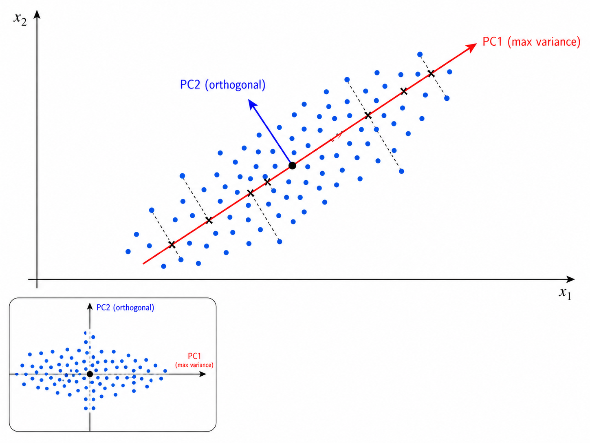
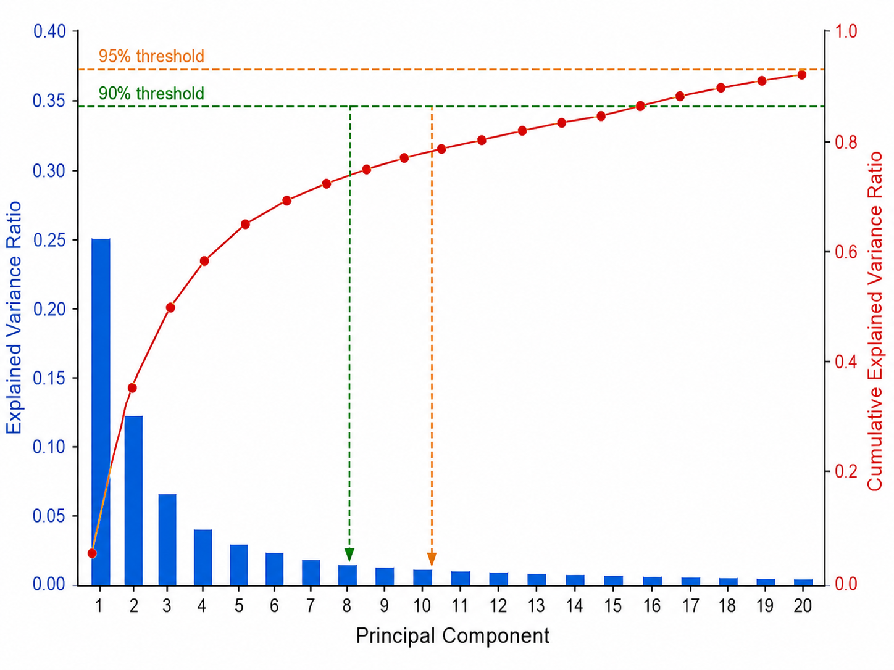
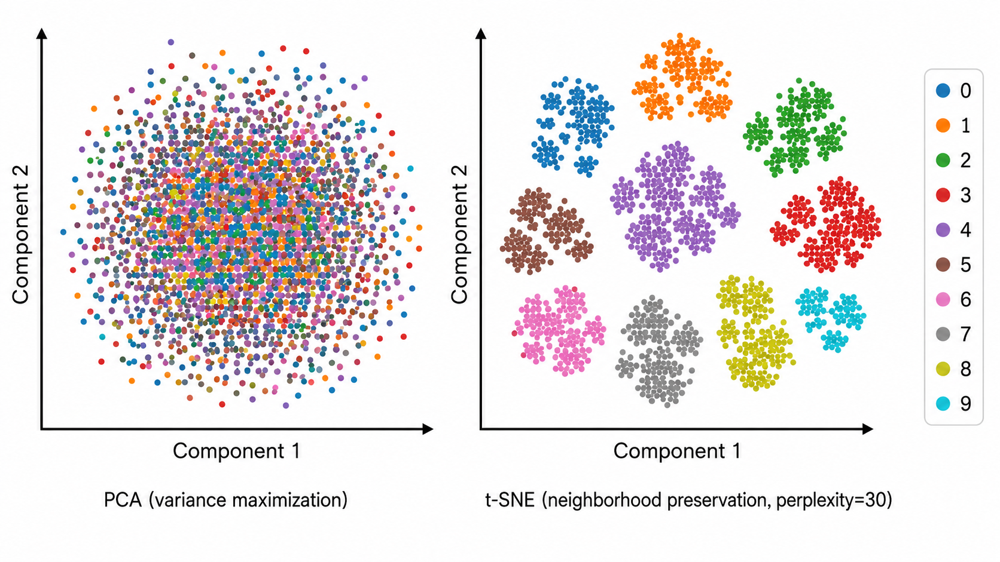
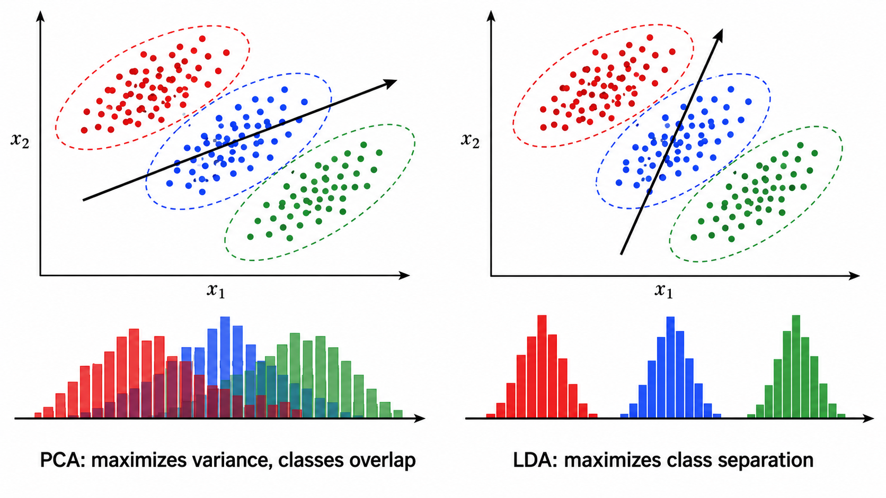

# ml09 降维与特征工程

> [!WARNING]
> 🧪 Beta公测版本提示：教程主体已完成，正在优化细节，欢迎大家提Issue反馈问题或建议。


> 高维数据的诅咒、PCA 的优雅数学、t-SNE 的可视化魔法、LDA 的判别能力——降维不是压缩，是"去芜存菁"。

---

## 一、为什么需要降维？

**维度灾难（Curse of Dimensionality）** 是机器学习的核心挑战之一。随着特征维度的增加：
- 数据变得**极其稀疏**——在 $d$ 维空间中，要维持同样的密度需要指数级更多的样本
- 距离度量**失效**——高维空间中所有点彼此之间的距离趋近相等（最近邻与最远邻的比率趋于 1）
- 计算和存储**爆炸式增长**

降维的三大动机：
1. **可视化**：将数据降至 2D/3D 以直观理解
2. **去噪**：保留主要信号、丢弃噪声维度
3. **加速**：减少特征数，降低下游任务的计算成本

> **直觉类比**：3D 物体的 2D 影子仍保留了大部分几何信息——降维就是用数学找到"最佳投影方向"，使得影子的信息损失最小。

---

## 二、PCA：主成分分析

### 2.1 两种等价视角

PCA 有两种看似不同但数学严格等价的推导：

**视角 1：最大方差（Maximum Variance）**

找到投影方向 $\mathbf{w}$（$\|\mathbf{w}\| = 1$），使得数据在 $\mathbf{w}$ 上的投影方差最大化：

$$
\mathbf{w}_1 = \arg\max_{\|\mathbf{w}\|=1} \text{Var}(\mathbf{w}^T \mathbf{x}) = \arg\max_{\|\mathbf{w}\|=1} \mathbf{w}^T \mathbf{S} \mathbf{w}
$$

其中 $\mathbf{S} = \frac{1}{N} \sum_{i=1}^{N} (\mathbf{x}_i - \bar{\mathbf{x}})(\mathbf{x}_i - \bar{\mathbf{x}})^T$ 是数据协方差矩阵。

这就是瑞利商（Rayleigh quotient）问题——其解为 $\mathbf{S}$ 的最大特征值对应的特征向量。

**视角 2：最小重构误差（Minimum Reconstruction Error）**

找到一组正交基向量，使得用前 $k$ 个基向量重构数据时的误差（信息的损失）最小：

$$
\min_{\mathbf{w}_j, \mathbf{z}_i} \sum_{i=1}^{N} \left\| \mathbf{x}_i - \sum_{j=1}^{k} z_{ij} \mathbf{w}_j \right\|^2
$$

可以证明，最优解也是 $\mathbf{S}$ 的前 $k$ 个特征向量。

> **为什么最大方差 = 最小重构误差？** 方差最大的方向就是数据分布最"宽"的方向——沿这个方向投影，数据的信息保留最多，自然重构误差最小。两者是同一枚硬币的两面。



### 2.2 特征值分解 vs SVD

PCA 的两种数值实现方式：

**方法 1：特征值分解（Eigenvalue Decomposition）**

对协方差矩阵 $\mathbf{S}_{d \times d}$ 做特征分解：

$$
\mathbf{S} = \mathbf{V} \mathbf{\Lambda} \mathbf{V}^T
$$

取 $\mathbf{\Lambda}$ 中最大的 $k$ 个特征值对应的特征向量组成投影矩阵 $\mathbf{W}_{d \times k}$。

时间复杂度：$O(d^3)$，存储 $\mathbf{S}$ 需要 $O(d^2)$。

**方法 2：SVD（Singular Value Decomposition）**

对中心化后的数据矩阵 $\tilde{\mathbf{X}}_{N \times d}$ 做 SVD：

$$
\tilde{\mathbf{X}} = \mathbf{U} \mathbf{\Sigma} \mathbf{V}^T
$$

其中 $\mathbf{V}$ 的列就是主成分方向，$\mathbf{\Sigma}$ 的对角元素（奇异值）的平方等于特征值。

当 $N < d$ 时，SVD 更高效（不需要构建 $d \times d$ 协方差矩阵）。实践中 sklearn 的 PCA 默认使用 SVD。

### 2.3 方差解释率

第 $j$ 个主成分的**方差解释率**为：

$$
\text{explained variance ratio}_j = \frac{\lambda_j}{\sum_{i=1}^{d} \lambda_i}
$$

累积方差解释率帮助决定保留多少个主成分（通常取 $k$ 使得累积解释率达到 90%-95%）：

$$
\text{cumulative ratio}(k) = \frac{\sum_{j=1}^{k} \lambda_j}{\sum_{i=1}^{d} \lambda_i}
$$



### 2.4 PCA 的局限性

| 局限 | 说明 |
|------|------|
| 只能发现线性结构 | 对非线性流形（如 Swiss Roll）无能为力 |
| 对尺度敏感 | 不同量纲的特征需要先标准化 |
| 主成分可能难以解释 | 主成分是所有原始特征的线性组合，缺乏可解释性 |
| 假设高斯分布 | 最优性仅在数据服从多元正态分布时严格成立 |

---

## 三、t-SNE：邻域保持的可视化降维

### 3.1 核心思想

t-SNE（t-distributed Stochastic Neighbor Embedding）与传统降维方法的根本区别：**它只关心保持局部邻域结构，不试图保持全局几何**。

t-SNE 在高维空间和低维空间分别定义点对之间的**相似度（邻居概率）**，然后最小化这两个概率分布之间的 KL 散度，使得低维嵌入中邻居关系尽可能接近高维空间。

### 3.2 高维空间中的相似度

在高维空间中，点 $x_j$ 是 $x_i$ 的邻居的概率定义为：

$$
p_{j|i} = \frac{\exp(-\|x_i - x_j\|^2 / 2\sigma_i^2)}{\sum_{k \neq i} \exp(-\|x_i - x_k\|^2 / 2\sigma_i^2)}
$$

对称化后：

$$
p_{ij} = \frac{p_{j|i} + p_{i|j}}{2N}
$$

其中 $\sigma_i$ 由**困惑度（perplexity）** 决定——困惑度大致等于每个点的"有效邻居数"。$\sigma_i$ 通过二分查找自动调整，使得每个点的条件概率分布具有指定的困惑度。

### 3.3 低维空间中的相似度 —— 为什么用 t 分布？

在低维空间中，t-SNE 使用**自由度为 1 的 t 分布**（即柯西分布）而非高斯分布：

$$
q_{ij} = \frac{(1 + \|y_i - y_j\|^2)^{-1}}{\sum_{k \neq l} (1 + \|y_k - y_l\|^2)^{-1}}
$$

**为什么用 t 分布而非高斯分布？** t 分布的尾部更重：

- 在高维空间中，中-低相似度的点对数量庞大（由于维度灾难），它们在低维嵌入中会被挤到一起形成"拥挤问题"（crowding problem）
- t 分布的重尾使得这些中-低相似度的点对在低维空间中可以彼此远离——**用长尾吸收拥挤压力，让真正的高相似度邻居保持近邻**

这正是 t-SNE 名称中 "t-distributed" 的来源。

### 3.4 损失函数：KL 散度

t-SNE 通过最小化 KL 散度来找到最优低维嵌入：

$$
\mathcal{L} = KL(P \| Q) = \sum_{i \neq j} p_{ij} \log \frac{p_{ij}}{q_{ij}}
$$

注意这不是对称的——$KL(P\|Q) \neq KL(Q\|P)$：
- 如果 $p_{ij}$ 大（高维是邻居）而 $q_{ij}$ 小（低维不在一起），$p_{ij} \log(p_{ij}/q_{ij})$ 很大——**对"把邻居分开了"惩罚很重**
- 如果 $p_{ij}$ 小而 $q_{ij}$ 大，惩罚较轻——**对"把非邻居拉近了"容忍度较高**

优化的方式是对低维坐标 $y_i$ 做梯度下降（是的，直接优化坐标本身！）。



### 3.5 t-SNE 的注意事项

| 注意事项 | 说明 |
|---------|------|
| 仅用于可视化 | t-SNE 没有逆变换，不能用于特征提取管道 |
| 超参数敏感 | perplexity（建议 5-50）和 learning rate 影响显著 |
| 簇的大小无意义 | t-SNE 中簇的大小和簇间距离不代表实际统计量 |
| 随机性 | 不同运行可能产生不同布局，建议固定 random_state |
| 计算昂贵 | 原始实现 $O(N^2)$，Barnes-Hut 近似 $O(N \log N)$ |

---

## 四、LDA：有监督的降维

### 4.1 核心思想

LDA（Linear Discriminant Analysis）与 PCA 的根本区别在于：**PCA 是无监督的（只关心方差），LDA 是有监督的（关心类可分性）**。

LDA 的目标是找到投影方向 $\mathbf{w}$，使得投影后：
- **类内散度（within-class scatter）尽可能小**——同一类的点聚在一起
- **类间散度（between-class scatter）尽可能大**——不同类的点彼此远离

### 4.2 数学推导

定义类内散布矩阵 $\mathbf{S}_W$ 和类间散布矩阵 $\mathbf{S}_B$：

$$
\mathbf{S}_W = \sum_{c=1}^{C} \sum_{i: y_i = c} (\mathbf{x}_i - \boldsymbol{\mu}_c)(\mathbf{x}_i - \boldsymbol{\mu}_c)^T
$$

$$
\mathbf{S}_B = \sum_{c=1}^{C} N_c (\boldsymbol{\mu}_c - \boldsymbol{\mu})(\boldsymbol{\mu}_c - \boldsymbol{\mu})^T
$$

其中 $\boldsymbol{\mu}_c$ 是第 $c$ 类的均值，$\boldsymbol{\mu}$ 是全局均值，$N_c$ 是第 $c$ 类的样本数。

LDA 的优化目标（Fisher 准则）：

$$
\mathbf{w}^* = \arg\max_{\mathbf{w}} \frac{\mathbf{w}^T \mathbf{S}_B \mathbf{w}}{\mathbf{w}^T \mathbf{S}_W \mathbf{w}}
$$

这是一个**广义瑞利商**问题。最优 $\mathbf{w}$ 是 $\mathbf{S}_W^{-1} \mathbf{S}_B$ 的最大特征值对应的特征向量。对于 $C$ 类问题，最多可以投影到 $C-1$ 维（因为 $\mathbf{S}_B$ 的秩最多为 $C-1$）。

> **几何直觉**：可以把 $\mathbf{S}_W^{-1} \mathbf{S}_B$ 理解为"先用类内方差归一化（消除各方向尺度差异），再看类间方差在哪个方向最大"。这就好比先给数据"美白"（whitening），再在这个标准化空间中看哪个方向最能区分不同类。



### 4.3 LDA 与 PCA 的对比

| 维度 | PCA | LDA |
|------|-----|-----|
| 监督方式 | 无监督 | 有监督（需要标签） |
| 优化目标 | 最大化投影方差 | 最大化类间散度 / 类内散度 |
| 最大投影维度 | $d$（全维度） | $C-1$（类别数 - 1） |
| 使用场景 | 数据探索、去噪、压缩 | 分类前置降维、特征提取 |
| 类内结构 | 不考虑 | 显式约束同类靠近 |

---

## 五、特征工程

降维是一种特征转换方法，而特征工程是更广泛的"从原始数据创造更好特征"的实践。

### 5.1 分箱（Binning）

将连续特征离散化为类别特征。常用于将非线性关系转化为线性可分。

- **等宽分箱**：将值域均分为 $k$ 个等宽区间
- **等频分箱**：每个区间包含大致相等的样本数

分箱后的特征可以通过 One-Hot 编码输入线性模型，使模型具有拟合非线性关系的能力。

### 5.2 交互特征（Interaction Features）

原始特征可能单独对目标影响有限，但它们的交互（乘积、比值等）可能具有很强的预测能力：

$$
x_{\text{new}} = x_i \times x_j \quad \text{或} \quad x_{\text{new}} = x_i / x_j
$$

例如在房价预测中，"房间数"和"总面积"的交互（人均面积）比单独使用更有预测力。

多项式特征（Polynomial Features）是交互特征的泛化——生成所有度 $\le d$ 的特征乘积项。

### 5.3 目标编码（Target Encoding）

用目标变量的统计量替换类别特征的值，常用于高基数（high cardinality）类别特征：

$$
x_{\text{encoded}, i} = \frac{\sum_{j \in \text{category}} y_j + \alpha \cdot \bar{y}_{\text{global}}}{|\text{category}| + \alpha}
$$

其中 $\alpha$ 是平滑参数——**类别样本越多，越信任类别均值；样本越少，越向全局均值收缩**。这种平滑策略（经验贝叶斯）防止了对稀有类别的过拟合。

### 5.4 特征工程 Pipeline 示例

一个典型的工作流：

```
原始数据 → 缺失值填充 → 分箱 → 交互特征 → 目标编码 → 标准化 → 降维（PCA）→ 模型
```

> **实战建议**：特征工程是"艺术多于科学"的环节——90% 的模型性能差距来自于特征工程，而非模型调参。

---

## 六、降维方法选择指南

```
需要保留数据的全局结构？
├── 是 → 数据有标签？
│   ├── 是 → LDA（判别方向优先）
│   └── 否 → PCA（方差优先）
└── 否 → 主要用于可视化？
    ├── 是 → t-SNE / UMAP（局部邻域保持，可视化效果惊艳）
    └── 否 → 数据在高维流形上？
        ├── 是 → Isomap / LLE（流形学习）
        └── 否 → 自动编码器（神经网络降维）
```

---

## 本章总结

| 概念 | 一句话 |
|------|--------|
| 维度灾难 | 高维空间数据稀疏，距离度量失效 |
| PCA | 找最大方差方向（= 最小重构误差方向）作为主成分 |
| 协方差矩阵 | $\mathbf{S} = \frac{1}{N}\tilde{\mathbf{X}}^T\tilde{\mathbf{X}}$，其最大特征向量 = 第一主成分 |
| SVD 实现 | $\tilde{\mathbf{X}} = \mathbf{U}\mathbf{\Sigma}\mathbf{V}^T$，$\mathbf{V}$ 的列 = 主成分 |
| 方差解释率 | $\lambda_j / \sum \lambda_i$，指导保留多少个主成分 |
| t-SNE | 高维邻居概率 $p_{ij}$ 与低维 t-分布相似度 $q_{ij}$ 的 KL 散度最小化 |
| 困惑度 | 大致等价于每个点的有效邻居数，控制局部 vs 全局的权衡 |
| t 分布重尾 | 用柯西分布的厚尾解决拥挤问题，让中低相似度点可以远离 |
| LDA | 最大化 $\mathbf{w}^T \mathbf{S}_B \mathbf{w} / \mathbf{w}^T \mathbf{S}_W \mathbf{w}$，有监督降维 |
| 分箱 | 将连续值离散化，赋予线性模型非线性能力 |
| 交互特征 | $x_i \times x_j$ 等乘积项，捕获特征间的联合效应 |
| 目标编码 | 用目标变量统计量代替类别值，平滑收缩防过拟合 |

## 📥 Code

| File | View | Download |
|------|------|----------|
| demo.py | [Open](./code-demo) | <a href="/notebook/code/ml/advanced/dimensionality-reduction/demo.py" target="_blank" download>Download</a> |
| exercise.py | [Open](./code-exercise) | <a href="/notebook/code/ml/advanced/dimensionality-reduction/exercise.py" target="_blank" download>Download</a> |

## 参考

1. Pearson, K. (1901). On Lines and Planes of Closest Fit to Systems of Points in Space. *Philosophical Magazine*, 2(11), 559-572. [[doi:10.1080/14786440109462720](https://doi.org/10.1080/14786440109462720)]
2. Hotelling, H. (1933). Analysis of a complex of statistical variables into principal components. *Journal of Educational Psychology*, 24(6), 417-441. [[doi:10.1037/h0071325](https://doi.org/10.1037/h0071325)]
3. van der Maaten, L. & Hinton, G. (2008). Visualizing Data using t-SNE. *JMLR*, 9(Nov), 2579-2605. [[JMLR](https://www.jmlr.org/papers/v9/vandermaaten08a.html)]
4. Fisher, R. A. (1936). The Use of Multiple Measurements in Taxonomic Problems. *Annals of Eugenics*, 7(2), 179-188. [[doi:10.1111/j.1469-1809.1936.tb02137.x](https://doi.org/10.1111/j.1469-1809.1936.tb02137.x)]
5. Eckart, C. & Young, G. (1936). The approximation of one matrix by another of lower rank. *Psychometrika*, 1(3), 211-218. [[doi:10.1007/BF02288367](https://doi.org/10.1007/BF02288367)]
6. Prokhorenkova, L. et al. (2018). CatBoost: unbiased boosting with categorical features. [[arXiv:1706.09516](https://arxiv.org/abs/1706.09516)] (目标编码的理论分析)
