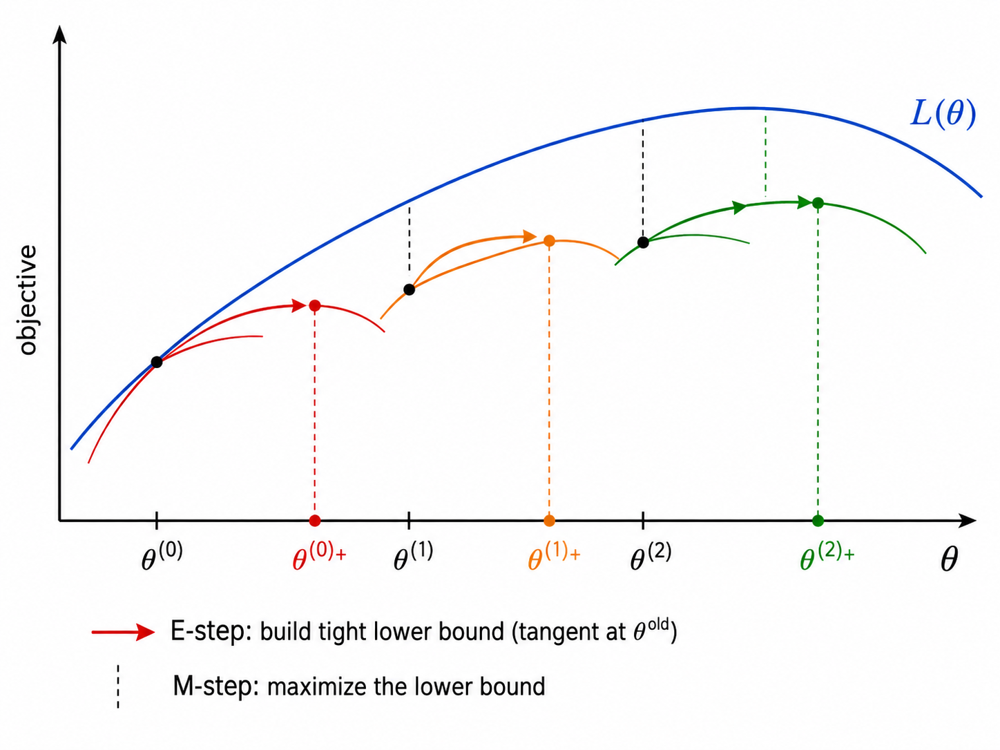
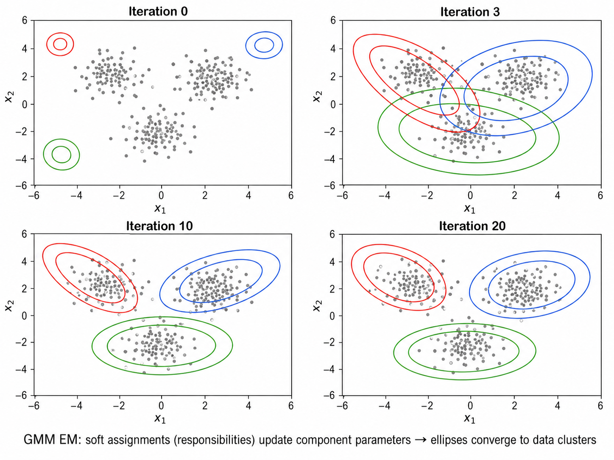
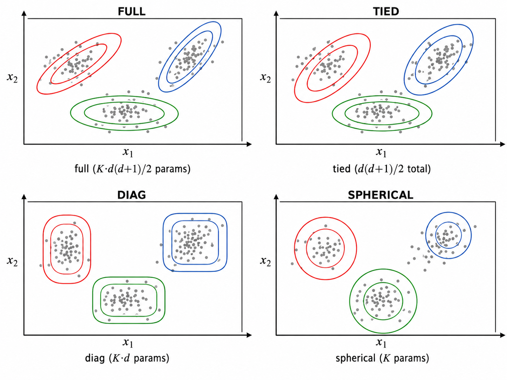

# ml12 EM算法与高斯混合模型

> [!WARNING]
> 🧪 Beta公测版本提示：教程主体已完成，正在优化细节，欢迎大家提Issue反馈问题或建议。


> 当数据中有"看不见的变量"，如何估计模型参数？EM 算法给出了一个优雅的迭代答案——而 GMM 就是 EM 最经典的应用。

---

## 一、EM 算法：从"鸡生蛋蛋生鸡"到迭代求解

### 1.1 问题设定

假设我们有观测数据 $\mathbf{X} = \{x_1, \dots, x_N\}$ 和隐变量（latent variables）$\mathbf{Z} = \{z_1, \dots, z_N\}$。我们的目标是最大化**不完全数据的对数似然**：

$$
\mathcal{L}(\theta) = \log P(\mathbf{X} \mid \theta) = \log \sum_{\mathbf{Z}} P(\mathbf{X}, \mathbf{Z} \mid \theta)
$$

这个求和（或积分）在 $\log$ 内部，使得直接最大化非常困难——$\log$ 和 $\sum$ 不交换。

### 1.2 EM 的核心思想

EM 算法通过引入辅助函数（变分下界）来解耦 $\log$ 和 $\sum$。它包含两步的交替迭代：

**E 步（Expectation）**：用当前参数 $\theta^{\text{old}}$ 计算隐变量的后验分布 $P(\mathbf{Z} \mid \mathbf{X}, \theta^{\text{old}})$，然后构造期望完全数据对数似然（也称 Q 函数）：

$$
Q(\theta \mid \theta^{\text{old}}) = \mathbb{E}_{\mathbf{Z} \sim P(\cdot \mid \mathbf{X}, \theta^{\text{old}})} \left[ \log P(\mathbf{X}, \mathbf{Z} \mid \theta) \right]
$$

**M 步（Maximization）**：最大化 Q 函数得到新参数：

$$
\theta^{\text{new}} = \arg\max_\theta Q(\theta \mid \theta^{\text{old}})
$$

> **直觉**：如果隐变量已知，参数估计很简单（直接最大似然）。但隐变量未知。EM 的策略是——用当前参数"猜测"隐变量的分布（E 步），然后在这个猜测下更新参数（M 步），反复迭代直到收敛。这正是"先有鸡还是先有蛋"的迭代解法。

### 1.3 Jensen 不等式与 ELBO

EM 算法的单调性可以通过 Jensen 不等式来证明。对于任意分布 $q(\mathbf{Z})$：

$$
\log P(\mathbf{X} \mid \theta) = \log \sum_{\mathbf{Z}} q(\mathbf{Z}) \frac{P(\mathbf{X}, \mathbf{Z} \mid \theta)}{q(\mathbf{Z})}
\ge \sum_{\mathbf{Z}} q(\mathbf{Z}) \log \frac{P(\mathbf{X}, \mathbf{Z} \mid \theta)}{q(\mathbf{Z})}
$$

右边称为 **ELBO（Evidence Lower BOund）**。当 $q(\mathbf{Z}) = P(\mathbf{Z} \mid \mathbf{X}, \theta)$ 时，不等式取等号。

E 步：令 $q(\mathbf{Z}) = P(\mathbf{Z} \mid \mathbf{X}, \theta^{\text{old}})$——此时 ELBO 与对数似然在 $\theta^{\text{old}}$ 处相切（相等）。
M 步：在固定 $q$ 下最大化 ELBO——这必然使得对数似然不降（因为 ELBO 是下界，下界提升了，真值至少提升那么多）。

EM 算法保证 $\mathcal{L}(\theta^{(t+1)}) \ge \mathcal{L}(\theta^{(t)})$，即对数似然单调递增。



---

## 二、高斯混合模型（GMM）

### 2.1 模型定义

GMM 假设数据由 $K$ 个高斯分布的混合生成：

$$
P(x \mid \theta) = \sum_{k=1}^{K} \pi_k \cdot \mathcal{N}(x \mid \mu_k, \Sigma_k)
$$

其中：
- $\pi_k$：**混合系数（mixing coefficient）**，$\sum_{k=1}^{K} \pi_k = 1$，$\pi_k \ge 0$
- $\mu_k$：第 $k$ 个高斯成分的均值向量
- $\Sigma_k$：第 $k$ 个高斯成分的协方差矩阵

隐变量 $z \in \{1, \dots, K\}$ 指示样本来自哪个成分：$P(z = k) = \pi_k$，$P(x \mid z = k) = \mathcal{N}(x \mid \mu_k, \Sigma_k)$。

### 2.2 GMM 的 EM 推导

**E 步：计算责任（responsibilities）**

$$
\gamma_{ik} = P(z_i = k \mid x_i, \theta^{\text{old}})
= \frac{\pi_k \cdot \mathcal{N}(x_i \mid \mu_k, \Sigma_k)}{\sum_{j=1}^{K} \pi_j \cdot \mathcal{N}(x_i \mid \mu_j, \Sigma_j)}
$$

$\gamma_{ik}$ 称为**责任（responsibility）**——成分 $k$ 对解释样本 $i$ 承担了多大"责任"。注意 $\sum_k \gamma_{ik} = 1$。

**M 步：更新参数**

$$
\pi_k^{\text{new}} = \frac{1}{N} \sum_{i=1}^{N} \gamma_{ik} \quad \text{（有效样本数 / N）}
$$

$$
\mu_k^{\text{new}} = \frac{\sum_{i=1}^{N} \gamma_{ik} x_i}{\sum_{i=1}^{N} \gamma_{ik}} \quad \text{（加权均值）}
$$

$$
\Sigma_k^{\text{new}} = \frac{\sum_{i=1}^{N} \gamma_{ik} (x_i - \mu_k^{\text{new}})(x_i - \mu_k^{\text{new}})^T}{\sum_{i=1}^{N} \gamma_{ik}} \quad \text{（加权协方差）}
$$

> **直觉：软计数 vs 硬计数**。传统的最大似然估计中，如果知道每个样本属于哪个成分，参数就是简单的样本均值和协方差。GMM 的 M 步用"软分配"（责任 $\gamma_{ik}$ 而非 0/1 分配）来替代——每个样本"部分地"属于每个成分，贡献按其责任加权。



### 2.3 K-Means 作为 GMM 的硬分配极限

K-Means 可以看作 GMM 的一个特殊情况：
- 所有协方差 $\Sigma_k = \sigma^2 \mathbf{I}$（球形且各向同性）
- $\sigma^2 \to 0$（方差趋于零）
- 责任 $\gamma_{ik} \to \{0, 1\}$（软分配退化为硬分配）

在这个极限下，GMM 的 EM 算法退化为 K-Means 的 Lloyd 算法——分配步（E 步）变为找最近质心，更新步（M 步）变为求簇内均值。

---

## 三、协方差类型的选择

GMM 允许对协方差矩阵施加不同约束，以控制模型复杂度和计算开销：

| 协方差类型 | 约束 | 参数数（d 维） | 几何形状 |
|-----------|------|-------------|---------|
| full | 无约束 | $d(d+1)/2$ per component | 任意方向的椭圆 |
| tied | 所有成分共享 $\Sigma$ | $d(d+1)/2$ total | 同形状、同方向的椭圆 |
| diag | 对角矩阵 | $d$ per component | 轴对齐的椭圆 |
| spherical | $\sigma^2 \mathbf{I}$ | $1$ per component | 正圆 |

> **选择建议**：数据量大、维度高时，先用 spherical 或 diag 减少参数；数据较少、需要精细建模时用 full。tied 在数据各成分形状相似时有效。



---

## 四、模型选择：AIC 与 BIC

在 GMM 中，成分数 $K$ 是超参数。信息准则提供了不依赖交叉验证的模型选择方法：

### 4.1 AIC（赤池信息准则）

$$
\text{AIC} = -2 \log L + 2p
$$

其中 $L$ 是最大化似然值，$p$ 是模型参数个数。AIC 倾向于选择预测性能好的模型（最小化 KL 散度）。

### 4.2 BIC（贝叶斯信息准则）

$$
\text{BIC} = -2 \log L + p \cdot \log N
$$

BIC 对参数数量的惩罚比 AIC 更重（$\log N$ 通常 $> 2$）。当 $N \to \infty$ 时，BIC 一致地选择真实模型（AIC 可能过拟合）。

### 4.3 使用指导

```
AIC 选 K 通常偏大（倾向复杂模型）→ 适合预测任务
BIC 选 K 通常适中 → 适合模型解释和结构发现
两者不一致时 → 取两者的"共识区间"内的 K
```

---

## 五、GMM 的实用考量

### 5.1 初始化

EM 对初始化敏感，可能收敛到局部最优：
- **K-Means 初始化**：用 K-Means 的聚类结果初始化 $\mu_k$ 和 $\gamma_{ik}$
- **多次随机初始化**：运行多次，选择似然最高的结果
- 实践中**结合两者**：K-Means 提供一个好起点，多次运行增加找到更优解的概率

### 5.2 协方差矩阵的奇异性

当某个成分的样本过少或数据在某个方向上完全共线时，协方差矩阵可能奇异（不可逆）。解决方法：
- 使用 **regularization**（协方差正则化）：$\Sigma_k \leftarrow \Sigma_k + \epsilon \mathbf{I}$
- 限制协方差类型（如 diag 或 spherical）可天然避免奇异
- 增加最小样本数要求

### 5.3 收敛判断

EM 通常在以下条件之一满足时停止：
- 对数似然的相对变化 $< \text{tol}$（如 $10^{-3}$）
- 达到最大迭代次数

注意 EM 的收敛可能是缓慢的（尤其在参数空间的平坦区域），有时需要数百次迭代。

---

## 六、GMM vs 其他聚类方法

| 特性 | K-Means | GMM | DBSCAN |
|------|---------|-----|--------|
| 软分配 | 否（硬） | 是（概率） | 否（硬） |
| 簇形状 | 球形 | 椭圆 | 任意 |
| 概率输出 | 否 | 是（每个样本属于每簇的概率） | 否 |
| 对异常值 | 敏感 | 中等 | 鲁棒 |
| 参数 | K | K + 协方差类型 | eps, minPts |
| 模型复杂度 | 低 | 中-高 | 低-中 |

---

## 本章总结

| 概念 | 一句话 |
|------|--------|
| EM 算法 | E 步计算期望（Q 函数），M 步最大化参数，交替迭代保证似然单调递增 |
| Jensen's Inequality | 凸函数下 $\mathbb{E}[f(X)] \ge f(\mathbb{E}[X])$，引出 ELBO |
| ELBO | 对数似然的下界，EM 等价于交替最大化 ELBO |
| GMM | $K$ 个高斯的加权混合，通过 EM 估计参数 |
| 责任 $\gamma_{ik}$ | 样本 $i$ 来自成分 $k$ 的后验概率（软分配） |
| M 步公式 | 加权均值/协方差/混合系数更新 |
| K-Means vs GMM | GMM 当 $\Sigma \to 0$ 时退化为 K-Means |
| AIC / BIC | 似然 + 参数惩罚，用于选择 K |
| 协方差类型 | full / tied / diag / spherical 四种约束 |
| 初始化 | K-Means 初始 + 多次随机运行，避免局部最优 |

## 📥 Code

| File | View | Download |
|------|------|----------|
| demo.py | [Open](./code-demo) | <a href="/notebook/code/ml/advanced/em-gmm/demo.py" target="_blank" download>Download</a> |
| exercise.py | [Open](./code-exercise) | <a href="/notebook/code/ml/advanced/em-gmm/exercise.py" target="_blank" download>Download</a> |

## 参考

1. Dempster, A. P., Laird, N. M., & Rubin, D. B. (1977). Maximum Likelihood from Incomplete Data via the EM Algorithm. *JRSS-B*, 39(1), 1-38. [[doi:10.1111/j.2517-6161.1977.tb01600.x](https://doi.org/10.1111/j.2517-6161.1977.tb01600.x)]
2. Bishop, C. M. (2006). Pattern Recognition and Machine Learning. *Springer*. Chapter 9: Mixture Models and EM. [[web](https://www.microsoft.com/en-us/research/uploads/prod/2006/01/Bishop-Pattern-Recognition-and-Machine-Learning-2006.pdf)]
3. Akaike, H. (1974). A New Look at the Statistical Model Identification. *IEEE TAC*, 19(6), 716-723. [[doi:10.1109/TAC.1974.1100705](https://doi.org/10.1109/TAC.1974.1100705)]
4. Schwarz, G. (1978). Estimating the Dimension of a Model. *The Annals of Statistics*, 6(2), 461-464. [[doi:10.1214/aos/1176344136](https://doi.org/10.1214/aos/1176344136)]
5. McLachlan, G. J. & Peel, D. (2000). Finite Mixture Models. *Wiley*. [[doi:10.1002/0471721182](https://doi.org/10.1002/0471721182)]
