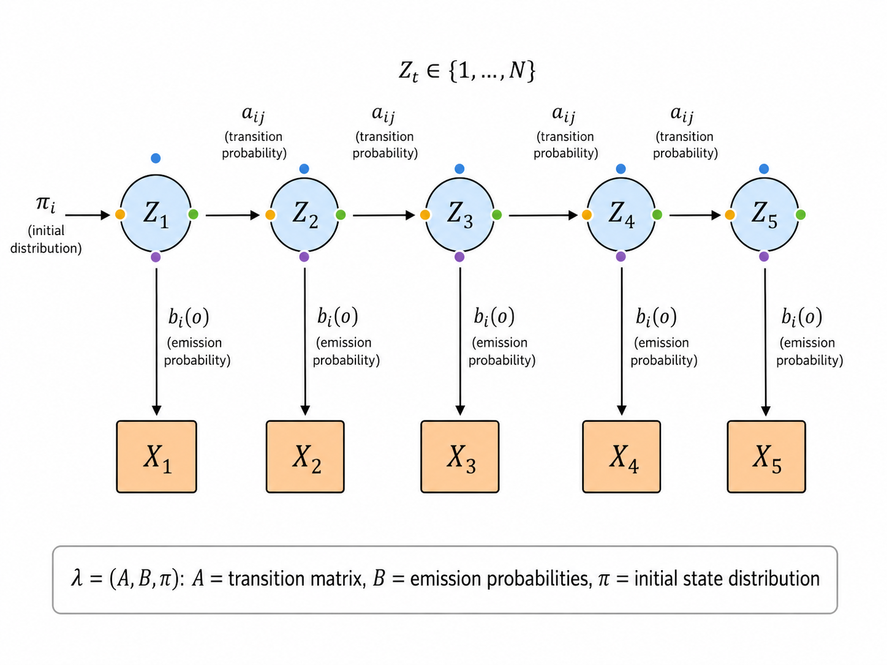
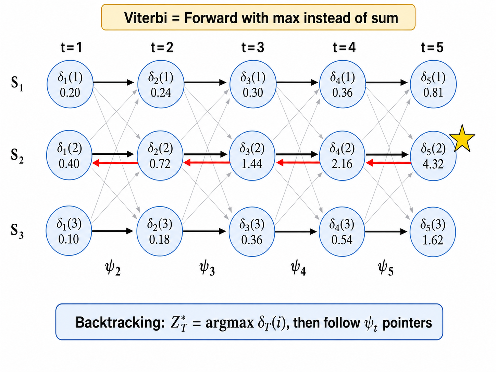

# ml11 隐马尔可夫模型 (HMM)

> [!WARNING]
> 🧪 Beta公测版本提示：教程主体已完成，正在优化细节，欢迎大家提Issue反馈问题或建议。


> 当观测背后隐藏着不可见的状态序列，如何从可见的"果"推断出隐藏的"因"？HMM 是时序概率建模的经典框架，三大问题贯穿始终：评估、解码、学习。

---

## 一、马尔可夫链基础

### 1.1 马尔可夫性质

一个随机过程 $\{S_t\}_{t=1}^T$ 满足**马尔可夫性质**（一阶），如果：

$$
P(S_{t+1} | S_t, S_{t-1}, \dots, S_1) = P(S_{t+1} | S_t)
$$

即：**给定现在，未来与过去条件独立**。当前状态 $S_t$ 已经包含了预测未来的全部信息。

> **直觉**：棋类游戏是马尔可夫性的完美体现——你只需要知道当前棋盘的状态，不需要记住之前 50 步的走法历史，就能决定下一步最优策略。

### 1.2 转移矩阵与平稳分布

马尔可夫链由**状态空间** $\{1, 2, \dots, N\}$ 和**转移矩阵** $\mathbf{A}$ 定义：

$$
\mathbf{A}_{ij} = P(S_{t+1} = j | S_t = i)
$$

转移矩阵满足行和为 1（每一行是一个概率分布）：$\sum_j \mathbf{A}_{ij} = 1$。

**平稳分布（Stationary Distribution）** $\boldsymbol{\pi}$ 满足：

$$
\boldsymbol{\pi} = \boldsymbol{\pi} \mathbf{A}, \quad \sum_i \pi_i = 1, \quad \pi_i \ge 0
$$

直观理解：如果当前状态服从 $\boldsymbol{\pi}$，那么无论经过多少步转移，状态分布仍然是 $\boldsymbol{\pi}$——就像一个"平衡点"。

### 1.3 细致平衡（Detailed Balance）

一个更强的条件是**细致平衡**：

$$
\pi_i \mathbf{A}_{ij} = \pi_j \mathbf{A}_{ji} \quad \forall i, j
$$

细致平衡意味着：从状态 $i$ 到 $j$ 的质量流等于从 $j$ 到 $i$ 的质量流。细致平衡是平稳分布存在的充分条件（MCMC 的设计正是利用了这一点）。

---

## 二、隐马尔可夫模型结构

### 2.1 模型定义

HMM 是一个**双重随机过程**：

- **隐藏层**：一个不可观测的一阶马尔可夫链 $\{Z_t\}$（状态序列），$Z_t \in \{1, \dots, N\}$
- **观测层**：在每个时刻 $t$，隐藏状态 $Z_t$ 生成一个观测 $X_t$

HMM 由三个参数完全确定：

| 参数 | 符号 | 含义 |
|------|------|------|
| 初始状态分布 | $\boldsymbol{\pi} = (\pi_i)$ | $\pi_i = P(Z_1 = i)$，链的起始状态分布 |
| 状态转移矩阵 | $\mathbf{A} = (a_{ij})$ | $a_{ij} = P(Z_{t+1}=j \mid Z_t=i)$ |
| 发射概率 | $\mathbf{B} = (b_i(o))$ | $b_i(o) = P(X_t = o \mid Z_t = i)$ |

记完整的 HMM 为 $\lambda = (\mathbf{A}, \mathbf{B}, \boldsymbol{\pi})$。



### 2.2 HMM 的三个基本问题

HMM 理论框架的三个核心问题（Rabiner, 1989）：

| 问题 | 输入 | 输出 | 算法 |
|------|------|------|------|
| **评估（Evaluation）** | 观测序列 $X$ + 模型 $\lambda$ | $P(X \mid \lambda)$ | 前向算法（Forward Algorithm） |
| **解码（Decoding）** | 观测序列 $X$ + 模型 $\lambda$ | 最可能的状态序列 $Z^*$ | 维特比算法（Viterbi Algorithm） |
| **学习（Learning）** | 观测序列 $X$（+ 初始模型） | 最优参数 $\lambda^*$ | Baum-Welch 算法（EM for HMM） |

---

## 三、前向算法（Forward Algorithm）——评估问题

### 3.1 问题

给定观测序列 $X = (x_1, \dots, x_T)$ 和模型 $\lambda$，计算 $P(X \mid \lambda)$。

### 3.2 朴素方法的指数爆炸

朴素计算需要枚举所有可能的状态序列：

$$
P(X \mid \lambda) = \sum_{Z} P(X, Z \mid \lambda) = \sum_{z_1, \dots, z_T} \pi_{z_1} b_{z_1}(x_1) \prod_{t=2}^{T} a_{z_{t-1} z_t} b_{z_t}(x_t)
$$

状态序列有 $N^T$ 种可能——$N=5, T=100$ 时就是 $5^{100} \approx 7.9 \times 10^{69}$，完全不可行。

### 3.3 前向算法的动态规划

前向算法利用 HMM 的马尔可夫结构，通过动态规划将复杂度降为 $O(N^2 T)$。

定义**前向概率** $\alpha_t(i)$：

$$
\alpha_t(i) = P(x_1, x_2, \dots, x_t, Z_t = i \mid \lambda)
$$

即在时刻 $t$ 处于状态 $i$ 且观测到序列 $x_{1:t}$ 的联合概率。

**递推公式**：

初始化（$t=1$）：

$$
\alpha_1(i) = \pi_i \cdot b_i(x_1)
$$

递推（$t = 2, \dots, T$）：

$$
\alpha_t(j) = \left[ \sum_{i=1}^{N} \alpha_{t-1}(i) \cdot a_{ij} \right] \cdot b_j(x_t)
$$

终止：

$$
P(X \mid \lambda) = \sum_{i=1}^{N} \alpha_T(i)
$$

![前向算法递推图示：格子图（trellis）显示 t-1 时刻所有状态 i 以权重 α_{t-1}(i) 指向 t 时刻状态 j，每条边标注转移概率 a_{ij}，t 时刻节点 j 标注 α_t(j) = [Σ_i α_{t-1}(i)·a_{ij}] · b_j(x_t)](./images/ml11-02-forward-algorithm.png)

### 3.4 前向-后向算法

后向概率 $\beta_t(i)$ 对称地定义：

$$
\beta_t(i) = P(x_{t+1}, \dots, x_T \mid Z_t = i, \lambda)
$$

即在时刻 $t$ 处于状态 $i$ 的条件下，观测到未来序列 $x_{t+1:T}$ 的概率。

递推（从后往前，$t = T-1, \dots, 1$）：

$$
\beta_t(i) = \sum_{j=1}^{N} a_{ij} \cdot b_j(x_{t+1}) \cdot \beta_{t+1}(j)
$$

初始：$\beta_T(i) = 1$（没有未来观测时概率为 1）

前向-后向算法联合使用时可以计算"在时刻 $t$ 处于状态 $i$"的后验概率（这是 Baum-Welch 学习算法的基础）：

$$
\gamma_t(i) = P(Z_t = i \mid X, \lambda) = \frac{\alpha_t(i) \beta_t(i)}{\sum_{j=1}^{N} \alpha_t(j) \beta_t(j)}
$$

---

## 四、维特比算法（Viterbi Algorithm）——解码问题

### 4.1 问题

找到最有可能生成观测序列 $X$ 的隐藏状态序列：

$$
Z^* = \arg\max_Z P(Z \mid X, \lambda) = \arg\max_Z P(X, Z \mid \lambda)
$$

### 4.2 Viterbi 算法

与前向算法结构相似，但用**最大化**替换了**求和**。

定义 $\delta_t(i)$ 为"到时刻 $t$ 为止，以状态 $i$ 结尾的最优路径的概率"：

$$
\delta_t(i) = \max_{z_1, \dots, z_{t-1}} P(x_1, \dots, x_t, z_1, \dots, z_{t-1}, Z_t = i \mid \lambda)
$$

**递推**：

初始化：
$$
\delta_1(i) = \pi_i \cdot b_i(x_1)
$$

递推（$t = 2, \dots, T$）：
$$
\delta_t(j) = \max_{i=1}^{N} \left[ \delta_{t-1}(i) \cdot a_{ij} \right] \cdot b_j(x_t)
$$

同时记录"回溯指针"（backpointer）：
$$
\psi_t(j) = \arg\max_{i} \left[ \delta_{t-1}(i) \cdot a_{ij} \right]
$$

终止：最优路径概率为 $\max_i \delta_T(i)$，从对应状态出发通过 $\psi_t$ **回溯**得到完整最优路径。

> **前向 vs Viterbi 对比**：前向算法用 **sum**（$\sum_i$，边际化所有可能的过去路径），Viterbi 用 **max**（$\max_i$，只保留一条最优路径）。两者的递推结构完全相同，只是操作符从 sum 变为 max。



---

## 五、Baum-Welch 算法——学习问题

### 5.1 EM 框架

Baum-Welch 算法是 EM 算法在 HMM 中的特例。隐变量是状态序列 $Z$，观测是 $X$。

### 5.2 E 步：计算期望充分统计量

用当前参数 $\lambda^{\text{old}}$ 计算两个关键量：

**状态占用概率** $\gamma_t(i)$（前向-后向联合）：
$$
\gamma_t(i) = \frac{\alpha_t(i) \beta_t(i)}{\sum_j \alpha_t(j) \beta_t(j)}
$$

**状态转移概率** $\xi_t(i, j)$：
$$
\xi_t(i, j) = P(Z_t = i, Z_{t+1} = j \mid X, \lambda)
= \frac{\alpha_t(i) \cdot a_{ij} \cdot b_j(x_{t+1}) \cdot \beta_{t+1}(j)}{\sum_{p,q} \alpha_t(p) \cdot a_{pq} \cdot b_q(x_{t+1}) \cdot \beta_{t+1}(q)}
$$

### 5.3 M 步：更新参数

$$
\pi_i^{\text{new}} = \gamma_1(i)
$$

$$
a_{ij}^{\text{new}} = \frac{\sum_{t=1}^{T-1} \xi_t(i, j)}{\sum_{t=1}^{T-1} \gamma_t(i)}
$$

对于离散观测：
$$
b_i(v_k)^{\text{new}} = \frac{\sum_{t=1}^{T} \gamma_t(i) \cdot \mathbb{I}[x_t = v_k]}{\sum_{t=1}^{T} \gamma_t(i)}
$$

直觉：$\gamma_t(i)$ 是"软计数"——不是简单地统计"状态 $i$ 出现了几次"，而是每个时刻以一定概率 $\gamma_t(i)$ 算作"部分出现"。这比硬分配更加精细。

---

## 六、HMM 在词性标注（POS Tagging）中的应用

### 6.1 POS Tagging 作为 HMM

词性标注（Part-of-Speech Tagging）是 HMM 的经典应用：
- **隐藏状态**：词性标签（名词、动词、形容词...）
- **观测**：具体的词汇
- **转移概率** $a_{ij}$：一个词性后面跟另一个词性的概率（如 "形容词 → 名词" 比 "形容词 → 形容词" 更常见）
- **发射概率** $b_i(w)$：给定词性 $i$，产生词 $w$ 的概率（如 "run" 作为动词比作为名词更常见）

### 6.2 Viterbi 解码 POS

给定一个句子（观测序列），Viterbi 算法可以找到最可能的词性标注：

```
Obs:    The    cat    sat    on    the    mat
        ↓      ↓      ↓      ↓      ↓      ↓
State:  DET   NOUN   VERB   PREP  DET    NOUN
```

模型参数 $\mathbf{A}$ 和 $\mathbf{B}$ 可以通过标注语料库学习（Baum-Welch），也可以直接从标注数据中估计（最大似然）。

---

## 七、HMM 的实用考量

### 7.1 数值下溢

前向/后向算法中涉及大量概率连乘（每个 $0<a<1$），当 $T$ 很大时概率值会下溢到 0。解决方案：**使用 log 空间**或**缩放（scaling）**。

缩放版本的前向算法：

$$
\tilde{\alpha}_t(j) = \frac{\alpha_t(j)}{\sum_i \alpha_t(i)} = \frac{\left(\sum_i \tilde{\alpha}_{t-1}(i) \cdot a_{ij}\right) \cdot b_j(x_t)}{c_t}
$$

其中 $c_t = \sum_i \alpha_t(i)$ 是归一化常数。最终 $\log P(X \mid \lambda) = \sum_{t=1}^{T} \log c_t$。

### 7.2 状态数量选择

HMM 的状态数 $N$ 是超参数，通常通过以下方式选择：
- **领域知识**：如 POS tagging 中词性标签的数量是已知的
- **交叉验证**：在留出集上评估困惑度（perplexity）
- **信息准则**：如 BIC（贝叶斯信息准则）

### 7.3 HMM 的局限性

| 局限 | 说明 |
|------|------|
| 一阶马尔可夫假设 | 当前状态只依赖前一个状态，可能不足以捕捉长期依赖 |
| 观测条件独立 | $X_t$ 只依赖 $Z_t$，与 $X_{t-1}$ 独立（在 NLP 中句子上下文很重要） |
| 离散状态 | 标准 HMM 的状态是离散的，连续状态需用卡尔曼滤波 |
| 指数长度分布 | HMM 隐含的状态持续时间的分布是几何分布，可能不符合实际 |

---

## 本章总结

| 概念 | 一句话 |
|------|--------|
| 马尔可夫性质 | $P(S_{t+1} \| S_t, \dots) = P(S_{t+1} \| S_t)$——未来仅依赖现在 |
| HMM 三元组 | $(\mathbf{A}, \mathbf{B}, \boldsymbol{\pi})$：转移 + 发射 + 初始分布 |
| 前向算法 | $\alpha_t(j) = [\sum_i \alpha_{t-1}(i) a_{ij}] b_j(x_t)$，动态规划 $O(N^2 T)$ |
| 后向算法 | $\beta_t(i) = \sum_j a_{ij} b_j(x_{t+1}) \beta_{t+1}(j)$ |
| Viterbi 算法 | 用 max 替换 sum 的前向算法 + 回溯指针 |
| Baum-Welch | EM for HMM：E 步计算 $\gamma_t(i)$ 和 $\xi_t(i,j)$，M 步更新参数 |
| 数值下溢 | 用缩放或 log 空间防止概率连乘的下溢 |
| POS Tagging | HMM 经典应用：隐藏状态 = 词性，观测 = 词汇 |
| 格子图（Trellis） | HMM 的"展开图"，展示所有可能状态路径的时间网格 |

## 📥 Code

| File | View | Download |
|------|------|----------|
| demo.py | [Open](./code-demo) | <a href="/notebook/code/ml/advanced/hmm/demo.py" target="_blank" download>Download</a> |
| exercise.py | [Open](./code-exercise) | <a href="/notebook/code/ml/advanced/hmm/exercise.py" target="_blank" download>Download</a> |

## 参考

1. Rabiner, L. R. (1989). A Tutorial on Hidden Markov Models and Selected Applications in Speech Recognition. *Proceedings of the IEEE*, 77(2), 257-286. [[doi:10.1109/5.18626](https://doi.org/10.1109/5.18626)]
2. Baum, L. E., Petrie, T., Soules, G., & Weiss, N. (1970). A Maximization Technique Occurring in the Statistical Analysis of Probabilistic Functions of Markov Chains. *The Annals of Mathematical Statistics*, 41(1), 164-171. [[doi:10.1214/aoms/1177697196](https://doi.org/10.1214/aoms/1177697196)]
3. Viterbi, A. J. (1967). Error Bounds for Convolutional Codes and an Asymptotically Optimum Decoding Algorithm. *IEEE Transactions on Information Theory*, 13(2), 260-269. [[doi:10.1109/TIT.1967.1054010](https://doi.org/10.1109/TIT.1967.1054010)]
4. Jurafsky, D. & Martin, J. H. (2024). Speech and Language Processing (3rd ed.). Chapter 8: Sequence Labeling for Parts of Speech and Named Entities. [[web](https://web.stanford.edu/~jurafsky/slp3/8.pdf)]
5. Dempster, A. P., Laird, N. M., & Rubin, D. B. (1977). Maximum Likelihood from Incomplete Data via the EM Algorithm. *Journal of the Royal Statistical Society: Series B*, 39(1), 1-38. [[doi:10.1111/j.2517-6161.1977.tb01600.x](https://doi.org/10.1111/j.2517-6161.1977.tb01600.x)]
