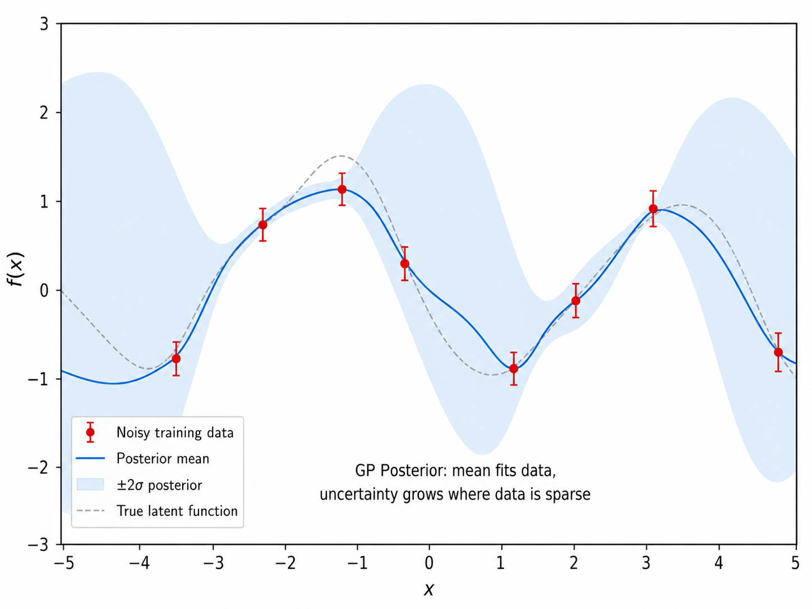
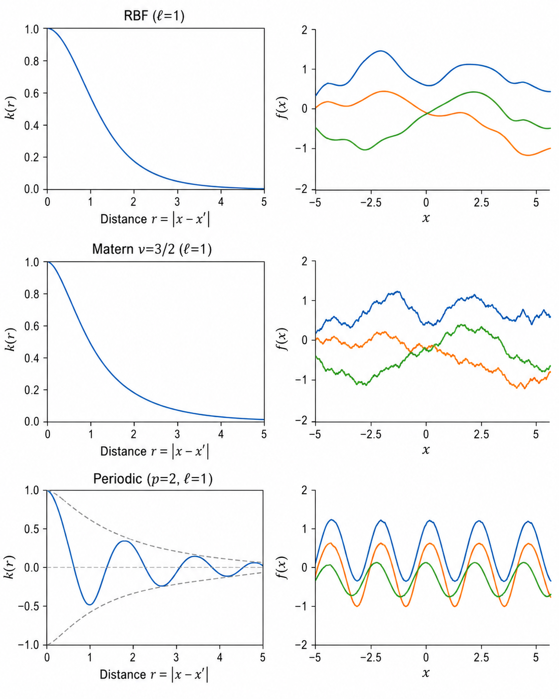

# ml14 核方法与高斯过程

> [!WARNING]
> 🧪 Beta公测版本提示：教程主体已完成，正在优化细节，欢迎大家提Issue反馈问题或建议。

> 从核技巧到高斯过程——当线性模型穿上"核"的外衣，它们获得了拟合非线性函数的能力。而高斯过程则更进一步，直接在函数空间上定义概率分布，给出预测的同时也给出了**不确定性**。

---

## 一、核方法回顾：从线性到非线性

### 1.1 核技巧（Kernel Trick）

核方法的核心思想：**将数据映射到高维（甚至无限维）特征空间，然后在这个空间中做线性模型，但通过核函数避免显式计算高维特征**。

给定特征映射 $\phi: \mathbb{R}^d \to \mathbb{R}^D$（$D$ 可能极大甚至无限），核函数定义为：

$$
k(x, x') = \langle \phi(x), \phi(x') \rangle
$$

**核技巧**的关键洞察：许多线性算法只需要计算样本间的内积 $\langle x, x' \rangle$，而非 $x$ 本身。用核函数替代所有内积后，我们隐式地在高维特征空间中运算，而计算复杂度仍在原始维度。

> **直觉**：核函数就像"相似度评分"——不需要知道数据在高维空间中的精确坐标，只需要知道"这两个点在高维空间中多相似"就够了。

### 1.2 Mercer 定理

不是任意函数都可以作为核函数。**Mercer 定理**给出了充要条件：

一个对称函数 $k(x, x')$ 是有效核（即存在特征映射 $\phi$ 使 $k(x,x') = \langle \phi(x), \phi(x') \rangle$），当且仅当对任意有限样本集 $\{x_1, \dots, x_N\}$，其 Gram 矩阵 $\mathbf{K}_{ij} = k(x_i, x_j)$ 是**半正定**的。

这个条件虽在实际中不常直接验证，但它保证了核函数背后确实存在一个内积空间。

### 1.3 表示定理（Representer Theorem）

表示定理是核方法的一个深刻结论：很多核化的正则化风险最小化问题的解可以表示为训练数据的核函数线性组合：

$$
f(x) = \sum_{i=1}^{N} \alpha_i k(x, x_i)
$$

这意味着：无论特征空间多大（甚至无限维），最优解始终落在由训练数据张成的有限维子空间内。这是核方法之所以**实用**的理论基础——我们不需要在无限维空间中搜索，只需优化 $N$ 个系数 $\alpha_i$。

### 1.4 核岭回归（Kernel Ridge Regression）

岭回归的线性版本：

$$
\min_{\mathbf{w}} \| \mathbf{y} - \mathbf{X}\mathbf{w} \|^2 + \lambda \|\mathbf{w}\|^2
$$

闭式解为 $\mathbf{w}^* = (\mathbf{X}^T \mathbf{X} + \lambda \mathbf{I})^{-1} \mathbf{X}^T \mathbf{y}$。

核化后的解（利用表示定理）：

$$
f(x^*) = \mathbf{k}_*^T (\mathbf{K} + \lambda \mathbf{I})^{-1} \mathbf{y}
$$

其中：
- $\mathbf{K}_{ij} = k(x_i, x_j)$：训练数据的核矩阵（$N \times N$）
- $\mathbf{k}_* = [k(x^*, x_1), \dots, k(x^*, x_N)]^T$：测试点与所有训练点的核函数值

核岭回归的计算复杂度为 $O(N^3)$（矩阵求逆），空间复杂度为 $O(N^2)$（存储核矩阵）。

---

## 二、高斯过程：从权重视角到函数视角

### 2.1 权重视角（Weight-Space View）

回顾贝叶斯线性回归：

$$
f(x) = \mathbf{w}^T \phi(x), \quad \mathbf{w} \sim \mathcal{N}(0, \Sigma_p)
$$

由于 $\mathbf{w}$ 的高斯先验诱导了函数值的高斯先验：对于任意有限的输入集 $\{x_1, \dots, x_N\}$，函数值向量 $\mathbf{f} = [f(x_1), \dots, f(x_N)]^T$ 服从联合正态分布。其协方差由核函数决定：

$$
\text{Cov}(f(x_i), f(x_j)) = \phi(x_i)^T \Sigma_p \phi(x_j) = k(x_i, x_j)
$$

### 2.2 函数空间视角（Function-Space View）

高斯过程（Gaussian Process, GP）绕过权重，**直接在函数空间上定义先验**：

一个高斯过程由均值函数 $m(x)$ 和协方差函数（核）$k(x, x')$ 完整定义：

$$
f(x) \sim \mathcal{GP}(m(x), k(x, x'))
$$

对任意有限点集 $\mathbf{X} = \{x_1, \dots, x_N\}$：

$$
\mathbf{f} \sim \mathcal{N}(\mathbf{m}, \mathbf{K}), \quad \mathbf{m}_i = m(x_i), \quad \mathbf{K}_{ij} = k(x_i, x_j)
$$

> **函数视角的优雅之处**：我们不定义 $\mathbf{w}$ 的先验然后推导 $f$ 的分布；我们直接定义 $f$ 本身是一个随机函数——它的任何有限维投影都是多元正态分布。GP 是"函数的分布"。

![GP 先验示意图：x 轴范围 [-5, 5]，y 轴无数据。灰色阴影表示 ±2σ 置信带（恒定宽度），三条彩色曲线是从 GP 先验中采样的随机函数（RBF 核，lengthscale=1.0）。标注："GP Prior ~ N(0, K)，均值=0，不确定性恒为 σ²"](./images/ml14-01-gp-prior.png)

### 2.3 高斯过程回归（GP Regression）

给定训练数据 $\mathcal{D} = \{(\mathbf{x}_i, y_i)\}_{i=1}^{N}$，$y_i = f(x_i) + \epsilon_i$，$\epsilon_i \sim \mathcal{N}(0, \sigma_n^2)$。

**先验**：

$$
\mathbf{f} \sim \mathcal{N}(0, \mathbf{K})
$$

**似然**（高斯噪声）：

$$
\mathbf{y} \mid \mathbf{f} \sim \mathcal{N}(\mathbf{f}, \sigma_n^2 \mathbf{I})
$$

**后验预测**（对新点 $\mathbf{x}^*$）：

$$
f^* \mid \mathbf{X}, \mathbf{y}, \mathbf{x}^* \sim \mathcal{N}(\bar{f}^*, \text{Var}(f^*))
$$

其中：

$$
\bar{f}^* = \mathbf{k}_*^T (\mathbf{K} + \sigma_n^2 \mathbf{I})^{-1} \mathbf{y}
$$

$$
\text{Var}(f^*) = k(\mathbf{x}^*, \mathbf{x}^*) - \mathbf{k}_*^T (\mathbf{K} + \sigma_n^2 \mathbf{I})^{-1} \mathbf{k}_*
$$

**关键观察**：
- 预测均值和核岭回归的闭式解完全一致——GP 回归从概率视角给出了同一公式的推导
- 预测方差有两项：先验方差 $k(\mathbf{x}^*, \mathbf{x}^*)$ 减去训练数据带来的不确定性缩减
- 不确定性在数据密集区域小、稀疏区域大——这正是 GP 最吸引人的特性

---

## 三、核函数的选择

核函数是 GP 的核心——它编码了我们对函数平滑性、周期性等性质的先验假设。

### 3.1 RBF（径向基 / 高斯核 / squared exponential）

$$
k_{\text{RBF}}(x, x') = \sigma_f^2 \exp\left(-\frac{\|x - x'\|^2}{2\ell^2}\right)
$$

- **$\ell$（lengthscale）**：控制函数的"摆动"频率。$\ell$ 小 → 函数快速变化；$\ell$ 大 → 函数平滑
- **$\sigma_f^2$（signal variance）**：控制函数的整体振幅
- **特性**：无限阶可导（函数极其平滑），是 GP 的默认核

### 3.2 Matern 核

$$
k_{\text{Matern}}(x, x') = \sigma_f^2 \frac{2^{1-\nu}}{\Gamma(\nu)} \left(\frac{\sqrt{2\nu}r}{\ell}\right)^\nu K_\nu\left(\frac{\sqrt{2\nu}r}{\ell}\right)
$$

其中 $r = \|x - x'\|$，$\nu$ 控制平滑度。

- **$\nu = 1/2$**：等价于指数核（Ornstein-Uhlenbeck 过程），函数连续但不可导
- **$\nu = 3/2$**：一阶可导
- **$\nu = 5/2$**：二阶可导（实践中常用，比 RBF 略微粗糙但更稳健）
- **$\nu \to \infty$**：等价于 RBF

Matern 核对 RBF 的改进：RBF 假设函数无限光滑，这在很多真实场景中过于理想化。Matern 核通过 $\nu$ 控制光滑度，更能适应中等粗糙的函数。

### 3.3 周期核（Periodic Kernel）

$$
k_{\text{periodic}}(x, x') = \sigma_f^2 \exp\left(-\frac{2 \sin^2(\pi |x - x'| / p)}{\ell^2}\right)
$$

用于建模具有周期性的函数（如季节性时间序列）。

### 3.4 核的组合

核函数可以像积木一样组合：
- **加法** $k_1 + k_2$：函数是 $f_1 + f_2$（长期趋势 + 短期波动）
- **乘法** $k_1 \times k_2$：函数是 $f_1 \times f_2$（调制）
- 这些组合允许 GP 建模复杂结构（如 $k_{\text{RBF}} + k_{\text{periodic}}$ 用于"带趋势的季节性"）

---

## 四、GP 的模型选择

### 4.1 超参数学习

GP 的超参数（如 RBF 的 $\ell$、$\sigma_f^2$ 和噪声方差 $\sigma_n^2$）可以通过最大化**边际似然（marginal likelihood）**来学习：

$$
\log p(\mathbf{y} \mid \mathbf{X}, \theta) = -\frac{1}{2} \mathbf{y}^T (\mathbf{K}_\theta + \sigma_n^2 \mathbf{I})^{-1} \mathbf{y} - \frac{1}{2} \log |\mathbf{K}_\theta + \sigma_n^2 \mathbf{I}| - \frac{N}{2} \log 2\pi
$$

三项的直觉：
- **数据拟合项**：$-\frac{1}{2} \mathbf{y}^T \mathbf{K}_y^{-1} \mathbf{y}$ —— 衡量模型对数据的拟合程度
- **复杂度惩罚项**：$-\frac{1}{2} \log |\mathbf{K}_y|$ —— 自动惩罚过于复杂的核（过拟合的多余复杂度）
- **归一化常数**：$-\frac{N}{2} \log 2\pi$

> **GP 的优雅之处**：GP 不需要交叉验证来选择超参数——边际似然自然地平衡了拟合度和模型复杂度。这一性质源自贝叶斯框架的"奥卡姆剃刀"。

### 4.2 GP 的计算局限

GP 的标准实现需要 $O(N^3)$ 时间和 $O(N^2)$ 内存，限制了其在大型数据集上的应用。扩展方法包括：
- **稀疏 GP（Sparse GP）**：用 $M$ 个诱导点（inducing points）近似，复杂度 $O(NM^2)$
- **随机傅里叶特征（RFF）**：用有限维特征近似核函数
- **分治策略**：将数据分区，在各区独立做 GP 后再融合

---

## 五、GP 与其他方法的联系

| 方法 | 联系 |
|------|------|
| 核岭回归 | GP 回归的预测均值 = 核岭回归解（点估计） |
| 贝叶斯线性回归 | $d$ 维线性特征 + GP 先验 → GP with $k(x,x') = x^T x'$ |
| 神经网络 | 无限宽神经网络的输出收敛到 GP（NNGP） |
| Kriging | 地统计学中 GP 回归的别名（同名不同领域） |
| Smoothing Splines | 一维 GP with 特定核的特殊情况 |

---

## 本章总结

| 概念 | 一句话 |
|------|--------|
| 核技巧 | $k(x,x') = \langle \phi(x), \phi(x') \rangle$，隐式高维特征映射 |
| Mercer 定理 | Gram 矩阵半正定 $\iff$ 有效核 |
| 表示定理 | 最优解 = 训练数据的核函数线性组合 $\sum \alpha_i k(x, x_i)$ |
| 核岭回归 | $\mathbf{w}^* = (\mathbf{K} + \lambda \mathbf{I})^{-1} \mathbf{y}$，$O(N^3)$ |
| 高斯过程 | 函数上的概率分布：$f \sim \mathcal{GP}(m, k)$ |
| GP 先验 | 没有数据时对函数的先验信念（平滑性、周期性等） |
| GP 后验 | 结合数据后对函数的更新信念（均值 + 置信带） |
| 预测不确定性 | 数据点附近窄（高置信），远离数据时宽（低置信） |
| RBF 核 | $k = \exp(-\|x-x'\|^2 / 2\ell^2)$，无限光滑 |
| Matern 核 | 通过 $\nu$ 控制光滑度，比 RBF 更灵活 |
| 边际似然 | $\log p(\mathbf{y}|\mathbf{X})$，自动平衡拟合和复杂度 |

## 📥 Code

| File | View | Download |
|------|------|----------|
| demo.py | [Open](./code-demo) | <a href="/notebook/code/ml/advanced/kernel-gp/demo.py" target="_blank" download>Download</a> |
| exercise.py | [Open](./code-exercise) | <a href="/notebook/code/ml/advanced/kernel-gp/exercise.py" target="_blank" download>Download</a> |

## 参考

1. Rasmussen, C. E. & Williams, C. K. I. (2006). Gaussian Processes for Machine Learning. *MIT Press*. [[web](http://www.gaussianprocess.org/gpml/)]
2. Scholkopf, B. & Smola, A. J. (2002). Learning with Kernels. *MIT Press*. [[ISBN:978-0262194754](https://mitpress.mit.edu/books/learning-kernels)]
3. Mercer, J. (1909). Functions of Positive and Negative Type, and their Connection with the Theory of Integral Equations. *Phil. Trans. Royal Society A*, 209, 415-446. [[doi:10.1098/rsta.1909.0016](https://doi.org/10.1098/rsta.1909.0016)]
4. Kimeldorf, G. S. & Wahba, G. (1970). A Correspondence Between Bayesian Estimation on Stochastic Processes and Smoothing by Splines. *The Annals of Mathematical Statistics*, 41(2), 495-502. [[doi:10.1214/aoms/1177697089](https://doi.org/10.1214/aoms/1177697089)]
5. Neal, R. M. (1996). Bayesian Learning for Neural Networks. *Springer*. (NNGP 源头) [[doi:10.1007/978-1-4612-0745-0](https://doi.org/10.1007/978-1-4612-0745-0)]
