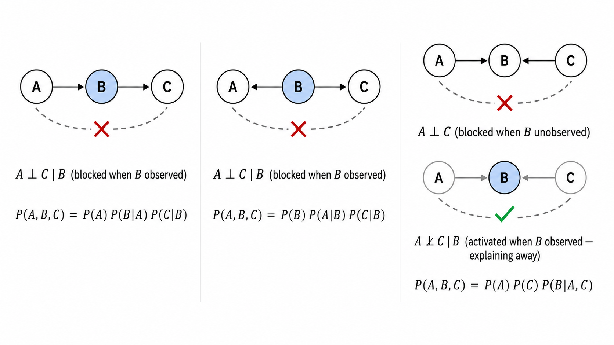
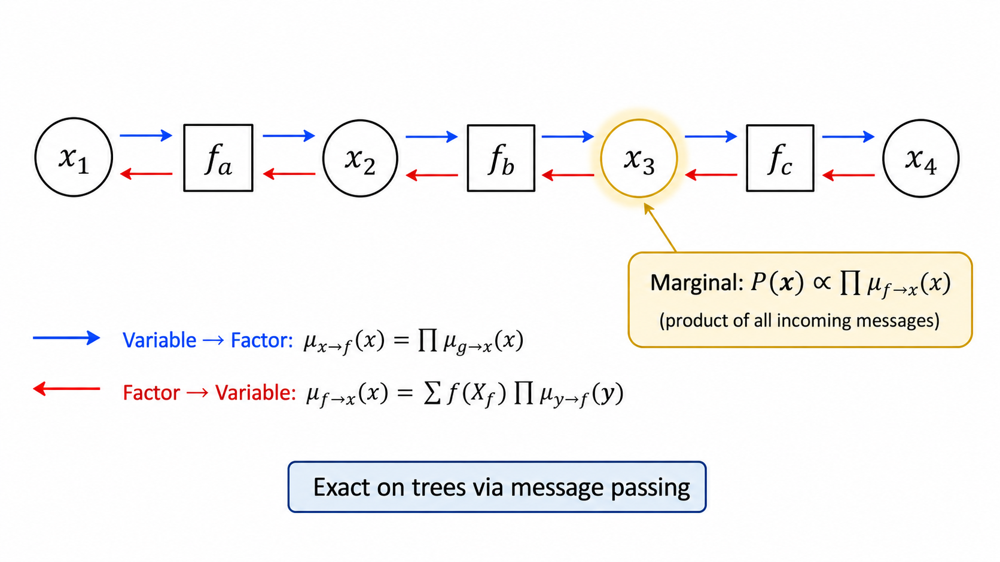

# ml13 概率图模型基础

> [!WARNING]
> 🧪 Beta公测版本提示：教程主体已完成，正在优化细节，欢迎大家提Issue反馈问题或建议。

> 用图的语言描述概率——贝叶斯网络的因果关系、马尔可夫随机场的无向依赖、信念传播的精妙消息传递。概率图模型是 AI 推理的统一框架。

---

## 一、什么是概率图模型？

**概率图模型（Probabilistic Graphical Model, PGM）** 是用图结构来表示随机变量之间条件依赖关系的框架。图的节点代表随机变量，边代表变量间的概率依赖。

形式化地，一个 PGM 由两部分组成：
- **图结构** $\mathcal{G} = (\mathcal{V}, \mathcal{E})$：编码变量间的条件独立关系
- **概率分布族**：一族满足图结构编码的独立性的概率分布

PGM 的两大优势：
1. **可视化**：直接用图展示变量间的依赖/独立关系，直观易懂
2. **推理效率**：通过利用图中的条件独立结构，将指数级的联合概率计算分解为局部计算的组合

> **直觉**：如果说联合概率表是一本巨大的字典（列出所有可能的变量取值组合的概率），那概率图模型就是字典的"索引"——告诉我们哪些条目可以分解为更小部分的乘积，从而大幅简化计算。

---

## 二、有向图模型：贝叶斯网络

### 2.1 定义

**贝叶斯网络（Bayesian Network）** 是一个有向无环图（DAG），其中：
- 节点 $X_i$ 表示随机变量
- 从 $X_j$ 到 $X_i$ 的有向边表示 $X_j$ 是 $X_i$ 的"父节点"（$X_j$ 直接因果影响 $X_i$）
- 每个节点 $X_i$ 附带其**条件概率表（CPT）**：$P(X_i \mid \text{Pa}(X_i))$

联合分布**因子分解**为：

$$
P(X_1, \dots, X_n) = \prod_{i=1}^{n} P(X_i \mid \text{Pa}(X_i))
$$

这个分解是贝叶斯网络的核心：原本需要 $O(2^n)$ 个参数的联合分布，现在仅需 $\sum_i O(2^{|\text{Pa}(X_i)|})$ 个参数——只要每个节点的父节点数量不多。

### 2.2 条件独立与 d-分离

贝叶斯网络的图结构直接编码了一组**条件独立关系**。判断变量集 $\mathbf{X}$ 和 $\mathbf{Y}$ 是否在给定 $\mathbf{Z}$ 下条件独立，可以通过 **d-分离（d-separation）** 准则：

检查每一条连接 $\mathbf{X}$ 和 $\mathbf{Y}$ 的无向路径是否被 $\mathbf{Z}$ **阻塞**（blocked）。一条路径被阻塞当且仅当路径上存在一个满足以下条件之一的节点：

| 连接类型 | 阻塞条件 |
|---------|---------|
| 链式 $A \to B \to C$ | $B$ 被观测（在 $\mathbf{Z}$ 中） |
| 分叉 $A \leftarrow B \to C$ | $B$ 被观测 |
| 汇合 $A \to B \leftarrow C$ | $B$ **不被**观测，且 $B$ 的所有后代也**不被**观测 |

注意汇合结构（collider, v-structure）的特殊性：**观测 collider 反而会使原本独立的两条路径变得相关**。例如（$雨 \to 地湿 \leftarrow 洒水器$）：如果知道"地是湿的"，那么"下雨"和"洒水器开了"从独立变为负相关（explaining away 效应）。

### 2.3 贝叶斯网络的推理

给定贝叶斯网络的结构和 CPT，可以进行多种推理：

- **边缘概率查询**：$P(X_i)$ —— 变量 $X_i$ 的边缘分布
- **条件概率查询**：$P(X_i \mid \mathbf{E} = \mathbf{e})$ —— 给定证据后的后验
- **最大后验（MAP）**：$\arg\max P(\mathbf{X} \mid \mathbf{E})$

推理方法包括：
- **枚举法**：遍历所有可能的变量取值组合（复杂度随变量数指数增长）
- **变量消除（Variable Elimination）**：利用分解结构，按序消除变量（动态规划思想）
- **信念传播（Belief Propagation）**：在树上精确、高效的消息传递算法

---

## 三、无向图模型：马尔可夫随机场

### 3.1 定义

**马尔可夫随机场（Markov Random Field, MRF）** 是无向概率图模型，通过**势函数（potential function）**定义概率：

$$
P(\mathbf{X}) = \frac{1}{Z} \prod_{C \in \mathcal{C}} \psi_C(\mathbf{X}_C)
$$

其中：
- $\mathcal{C}$ 是图中的所有**最大团（maximal clique）**的集合
- $\psi_C(\mathbf{X}_C) \ge 0$ 是团 $C$ 上的势函数（非归一化的兼容度）
- $Z = \sum_{\mathbf{X}} \prod_C \psi_C(\mathbf{X}_C)$ 是**配分函数（partition function）**，确保概率和为 1

与贝叶斯网络不同，MRF 的势函数**不必是概率分布**（不需要归一化），它们只定义了一个相对"兼容度"。联合归一化常数 $Z$ 的计算是 MRF 推理中的主要计算挑战。

### 3.2 条件独立：马尔可夫毯

在 MRF 中，变量的条件独立性由图的分离性直接定义——**两个变量集在给定第三个变量集下条件独立当且仅当第三个变量集在图中分离了前两者**。

一个节点 $X$ 的**马尔可夫毯（Markov Blanket）** 是其邻居节点集。给定马尔可夫毯后，$X$ 与图中所有其他节点条件独立。

### 3.3 有向 vs 无向模型

| 特性 | 贝叶斯网络（有向） | MRF（无向） |
|------|------------------|------------|
| 边方向 | 有向（因果/依赖方向） | 无向（对称关系） |
| 概率定义 | 连乘条件概率（天然归一化） | 连乘势函数（需配分函数） |
| 独立性编码 | d-分离 | 图分离 |
| 表达能力 | 无法表达循环对称关系 | 可以表达对称/循环关系 |
| 典型应用 | 因果推理、诊断 | 图像分割、空间统计 |

---

## 四、因子图与和积算法

### 4.1 因子图

**因子图（Factor Graph）** 是一种更通用的表示，显式地将联合分布分解为因子的乘积：

$$
P(\mathbf{X}) = \frac{1}{Z} \prod_{a} f_a(\mathbf{X}_a)
$$

因子图是**二部图**（bipartite graph）：圆形节点代表变量，方形节点代表因子。边连接变量和包含它的因子。

因子图的有用之处在于：任何有向或无向模型都可以转化为因子图，然后统一使用**和积算法（Sum-Product Algorithm）**。

### 4.2 和积算法（Belief Propagation）

**信念传播（Belief Propagation, BP）** 是一种在因子图上通过消息传递进行精确推理的算法。在树结构（无环图）上，BP 是精确的且高效的。

两种消息交替传递：

**变量 → 因子**：

$$
\mu_{x \to f}(x) = \prod_{g \in \mathcal{N}(x) \setminus \{f\}} \mu_{g \to x}(x)
$$

（变量告诉因子："所有其他因子对 $x$ 的'投票'汇总起来是..."）

**因子 → 变量**：

$$
\mu_{f \to x}(x) = \sum_{\mathbf{X}_f \setminus \{x\}} f(\mathbf{X}_f) \prod_{y \in \mathcal{N}(f) \setminus \{x\}} \mu_{y \to f}(y)
$$

（因子告诉变量："考虑到我的约束和其他变量的信息，我对你的'判断'是..."）

**边缘概率**通过收集所有流入消息得到：

$$
P(x) \propto \prod_{f \in \mathcal{N}(x)} \mu_{f \to x}(x)
$$

> **直觉**：信念传播就像是"传言游戏"——每个节点只从其邻居获取信息，综合后传递给其他邻居。在树上，这种局部信息交换足以精确计算全局边缘概率。在有环图中（Loopy BP），消息继续传递但不保证收敛或精确。

---

## 五、HMM 作为动态贝叶斯网络

HMM 是概率图模型的一个特例——它是一种**动态贝叶斯网络（Dynamic Bayesian Network, DBN）**。从图模型的角度看：

- 每个时刻的 $Z_t$ 是一个变量节点
- 转移边 $Z_t \to Z_{t+1}$ 编码时序依赖
- 发射边 $Z_t \to X_t$ 编码观测模型

HMM 的前向-后向算法本质上就是信念传播在链状图上的特例——$\alpha_t(i)$ 是"从前向左→右"传递的消息，$\beta_t(i)$ 是"从右→左"传递的消息。

这种视角统一了多个经典算法：
- **前向算法** = 从左到右的消息传递
- **后向算法** = 从右到左的消息传递
- **前向-后向** = 双向消息传递后的边缘概率计算
- **Baum-Welch** = 在因子图上的 EM 算法

---

## 六、概率图模型的实用考量

### 6.1 精确推理的局限性

对于一般的图结构，精确推理（包括变量消除、信念传播）是 NP-hard 的——计算复杂度由图的**树宽（treewidth）**决定。树宽衡量了图"离一棵树有多远"。

### 6.2 近似推理方法

当精确推理不可行时：
- **Loopy Belief Propagation**：在有环图上直接跑 BP（虽不保证收敛，实践中常有效）
- **变分推断（Variational Inference）**：用简单分布近似复杂后验
- **MCMC**：用采样方法近似后验分布

### 6.3 与现代深度学习的关系

概率图模型的很多思想已渗透进深度学习：
- VAE（变分自编码器）：PGM + 神经网络参数化
- 注意力机制：可以理解为在完全图上学习"软边权重"
- 图神经网络（GNN）：直接在图上做消息传递——与信念传播的数学形式惊人相似

---

## 本章总结

| 概念 | 一句话 |
|------|--------|
| 概率图模型 | 图编码条件独立，分解联合概率 |
| 贝叶斯网络 | 有向无环图 + 条件概率表，$P = \prod P(X_i \mid \text{Pa})$ |
| d-分离 | 图论条件独立的判定准则（链/分叉/汇合） |
| Explaining Away | 汇合结构中，观测结果反而激活了原因间的竞争 |
| MRF | 无向图 + 势函数，$P \propto \prod \psi_C$ + 配分函数 |
| 因子图 | 二部图表示，变量+因子，统一表示框架 |
| 信念传播 | 变量→因子和因子→变量的消息交替传递 |
| 和积算法 | BP 的数学名称，对树结构精确 |
| 树宽 | 衡量图的精确推理难度 |
| HMM as PGM | 链状动态贝叶斯网络，前向-后向 = BP 的特例 |

## 📥 Code

| File | View | Download |
|------|------|----------|
| demo.py | [Open](./code-demo) | <a href="/notebook/code/ml/advanced/probabilistic-graphical-models/demo.py" target="_blank" download>Download</a> |
| exercise.py | [Open](./code-exercise) | <a href="/notebook/code/ml/advanced/probabilistic-graphical-models/exercise.py" target="_blank" download>Download</a> |

## 参考

1. Pearl, J. (1988). Probabilistic Reasoning in Intelligent Systems: Networks of Plausible Inference. *Morgan Kaufmann*. [[ISBN:978-1558604797](https://dl.acm.org/doi/book/10.5555/534975)]
2. Koller, D. & Friedman, N. (2009). Probabilistic Graphical Models: Principles and Techniques. *MIT Press*. [[ISBN:978-0262013192](https://mitpress.mit.edu/books/probabilistic-graphical-models)]
3. Bishop, C. M. (2006). Pattern Recognition and Machine Learning. *Springer*. Chapter 8: Graphical Models. [[web](https://www.microsoft.com/en-us/research/uploads/prod/2006/01/Bishop-Pattern-Recognition-and-Machine-Learning-2006.pdf)]
4. Kschischang, F. R., Frey, B. J., & Loeliger, H. A. (2001). Factor Graphs and the Sum-Product Algorithm. *IEEE Trans. Info. Theory*, 47(2), 498-519. [[doi:10.1109/18.910572](https://doi.org/10.1109/18.910572)]
5. Murphy, K. P. (2012). Machine Learning: A Probabilistic Perspective. *MIT Press*. [[ISBN:978-0262018029](https://mitpress.mit.edu/books/machine-learning-1)]
