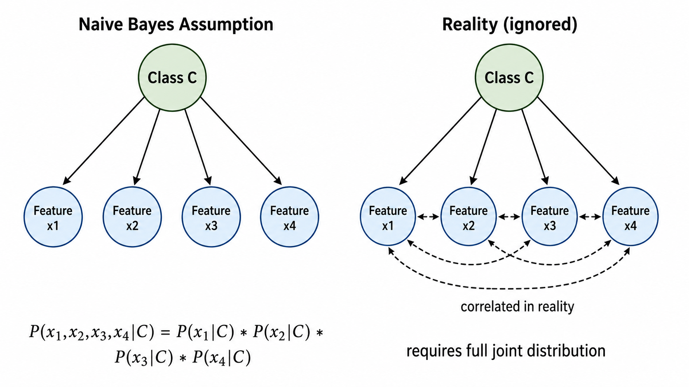
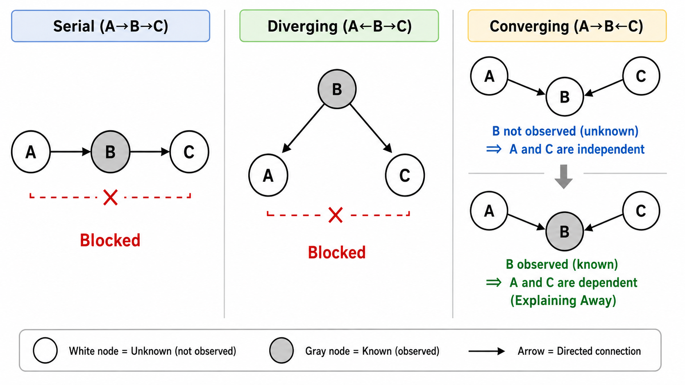
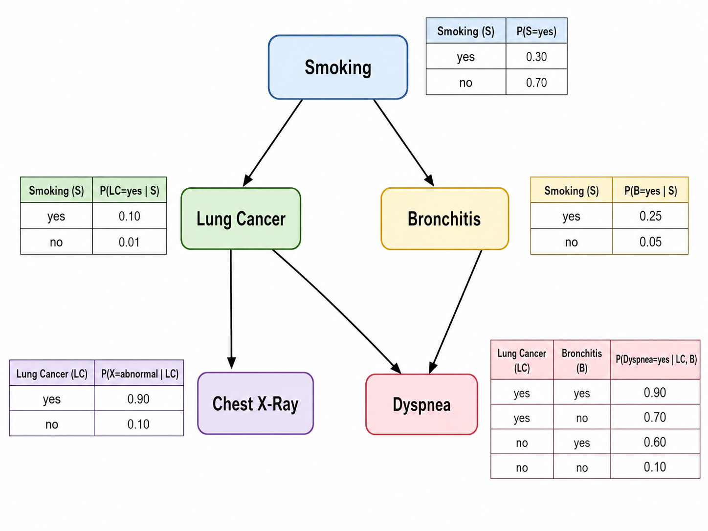

# 朴素贝叶斯与贝叶斯网络

> [!WARNING]
> 🧪 Beta公测版本提示：教程主体已完成，正在优化细节，欢迎大家提Issue反馈问题或建议。


## 1. 条件独立假设：为什么叫"朴素"

### 1.1 从高斯贝叶斯到朴素贝叶斯

在 ml02 中，我们实现了高斯贝叶斯分类器，它使用多元高斯分布来建模 $P(\mathbf{x} | \omega)$。但多元高斯分布需要估计协方差矩阵 $\Sigma$（$d(d+1)/2$ 个参数），当维度 $d$ 很高时，这很快变得不可行。

**朴素贝叶斯**（Naive Bayes）做了一个"天真"但极其有效的简化：假设在给定类别的条件下，**所有特征之间相互独立**。

$$
P(\mathbf{x} | \omega_j) = P(x_1, x_2, \dots, x_d | \omega_j) = \prod_{i=1}^{d} P(x_i | \omega_j)
$$

这个假设"朴素"在：现实世界中特征之间几乎总是相关的。例如，"身高"和"体重"在给定性别（类别）的条件下仍然相关——高的人更可能重。但朴素贝叶斯忽略这些相关性，假设身高和体重在"给定性别"后独立。

然而，尽管这个假设在现实中通常不成立，朴素贝叶斯在实际应用中表现**出奇地好**——原因不仅是它计算简单，更重要的是：即使概率估计不准确，只要各类别的**概率相对顺序**正确，分类决策就是对的。



### 1.2 为什么"朴素"反而有效？

三点原因解释了朴素贝叶斯的意外成功：

1. **分类只需要 argmax**：即使 $P(\mathbf{x}|\omega_j)$ 的绝对值不准，只要各类别间的相对顺序正确，决策就不受影响。朴素贝叶斯虽然高估或低估了概率，但**高估的方向往往对各类别一致**。

2. **相关特征互相加强而非混淆**：假设两个高度相关的特征（如"免费"和"中奖"在垃圾邮件中），它们在独立性假设下会被相乘：$P(\text{免费}|\text{spam}) \times P(\text{中奖}|\text{spam})$。即使忽略了它们"同时出现时概率应该更高"的修正，它们各自的高概率也足以让垃圾邮件的联合似然很高。

3. **零参数 vs 指数参数**：朴素贝叶斯只需要 $O(d \cdot C)$ 个参数（每个特征-类别对只需 2 个参数），而完整的多变量分布需要 $O(k^d)$ 个参数（$k$ 是离散化级别）。这大幅降低了方差。

### 1.3 朴素贝叶斯的分类决策

根据贝叶斯定理和条件独立假设：

$$
P(\omega_j | \mathbf{x}) \propto P(\omega_j) \prod_{i=1}^{d} P(x_i | \omega_j)
$$

取对数得到判别函数：

$$
g_j(\mathbf{x}) = \ln P(\omega_j) + \sum_{i=1}^{d} \ln P(x_i | \omega_j)
$$

决策规则：$\hat{y} = \arg\max_j \, g_j(\mathbf{x})$

---

## 2. 三种朴素贝叶斯变体

根据特征的类型，$P(x_i | \omega_j)$ 有三种不同的建模方式。

### 2.1 高斯朴素贝叶斯（GaussianNB）

适用于**连续特征**。假设每个特征在每个类别下服从一维高斯分布：

$$
P(x_i | \omega_j) = \frac{1}{\sqrt{2\pi\sigma_{ji}^2}} \exp\left( -\frac{(x_i - \mu_{ji})^2}{2\sigma_{ji}^2} \right)
$$

需要估计：各类别各特征的均值 $\mu_{ji}$ 和方差 $\sigma_{ji}^2$。

**与完整高斯贝叶斯的区别**：GaussianNB 假设各类别各特征之间独立，即协方差矩阵是对角的（$\Sigma_j = \text{diag}(\sigma_{j1}^2, \dots, \sigma_{jd}^2)$）。而 ml02 中的完整高斯贝叶斯允许非对角的 $\Sigma_j$。

### 2.2 多项朴素贝叶斯（MultinomialNB）

适用于**离散计数特征**（尤其是文本的词频/词袋表示）。假设特征服从多项分布：

$$
P(x_i | \omega_j) = \frac{N_{ji} + \alpha}{N_j + \alpha \cdot d}
$$

其中：
- $N_{ji}$：类别 $\omega_j$ 中特征 $i$ 的总出现次数
- $N_j = \sum_i N_{ji}$：类别 $\omega_j$ 中所有特征的总出现次数
- $\alpha$：平滑参数（见 2.4 节）

MultinomialNB 是文本分类（垃圾邮件检测、新闻分类、情感分析）的经典基准模型。在著名的 20 Newsgroups 数据集上，一个简单的 MultinomialNB 能达到 80%+ 的准确率。

### 2.3 伯努利朴素贝叶斯（BernoulliNB）

适用于**二值特征**（特征取值仅为 0 或 1）。假设特征服从伯努利分布：

$$
P(x_i | \omega_j) = p_{ji}^{x_i} (1 - p_{ji})^{1 - x_i}
$$

模型直接建模 $P(\text{特征出现} | \text{类别})$，而不关心特征出现的次数。

BernoulliNB 也常用于文本分类——它判断"词语是否出现"而不关心出现的次数。对于短文本（如推文），BernoulliNB 可能比 MultinomialNB 效果更好。

**变体** | **特征类型** | **似然函数** | **典型应用**
--- | --- | --- | ---
GaussianNB | 连续值 | $\mathcal{N}(\mu_{ji}, \sigma_{ji}^2)$ | 一般分类任务
MultinomialNB | 非负计数 | $\frac{N_{ji} + \alpha}{N_j + \alpha d}$ | 文本分类、词频向量
BernoulliNB | 二值 (0/1) | $p_{ji}^{x_i}(1-p_{ji})^{1-x_i}$ | 短文本、特征存在/缺失

### 2.4 拉普拉斯平滑（Laplace Smoothing）

朴素贝叶斯有一个致命弱点：如果某个特征在某类别中**从未在训练集中出现**，那么 $P(x_i | \omega_j) = 0$。由于乘法链的存在，一个 0 会导致整个后验概率变为 0——无论其他特征多么支持这个类别。

**拉普拉斯平滑**（也称为加一平滑）解决了这个问题：

$$
P(x_i | \omega_j) = \frac{N_{ji} + \alpha}{N_j + \alpha \cdot d}
$$

其中 $\alpha$ 是平滑参数：
- $\alpha = 1$：拉普拉斯平滑（Laplace Smoothing）
- $\alpha < 1$：Lidstone Smoothing
- $\alpha = 0$：无平滑（MLE）

平滑就像是给每种可能性赋予了一个"虚拟的"先验计数 $\alpha$，确保没有任何概率为零。

在 GaussianNB 中，方差估计也需要类似处理：`var_smoothing` 参数在计算方差时加上一个小的常数，防止方差为零（当某特征在某类别中所有样本取值完全相同时会发生）。

---

## 3. 贝叶斯网络简介

### 3.1 从朴素贝叶斯到贝叶斯网络

朴素贝叶斯假设所有特征在给定类别后完全独立——这是一个全连接但被类别节点"阻断"的结构。贝叶斯网络（Bayesian Network）放松了这个假设，允许我们**显式地建模特征之间的依赖关系**。

一个贝叶斯网络由两部分组成：

1. **有向无环图（DAG）** $\mathcal{G} = (V, E)$：节点代表随机变量，有向边 $X \to Y$ 表示 $X$ 对 $Y$ 有**直接因果影响**
2. **条件概率表（CPT）**：每个节点的概率分布，条件于其父节点

联合概率分布分解为：

$$
P(X_1, X_2, \dots, X_n) = \prod_{i=1}^{n} P(X_i | \text{Pa}(X_i))
$$

其中 $\text{Pa}(X_i)$ 是 $X_i$ 在图中的父节点集合。

### 3.2 d-分离与条件独立

贝叶斯网络中最核心的推理工具是 **d-分离**（d-separation）。它用图结构来判断任意两组变量是否在给定第三组变量后条件独立。

三种基本连接模式：

- **串行连接** $A \to B \to C$：若已知 $B$，则 $A$ 和 $C$ 条件独立（信息被 $B$ 阻断）
- **发散连接** $A \leftarrow B \rightarrow C$：若已知 $B$，则 $A$ 和 $C$ 条件独立（共同原因 $B$ 解释了 $A$ 和 $C$ 的关联）
- **汇聚连接** $A \rightarrow B \leftarrow C$：若**已知 $B$**（或 $B$ 的任何后代），则 $A$ 和 $C$ **不再是条件独立的**（explaining away——解释消除现象）

汇聚连接（v-structure）是反直觉的：两个无关的原因，在知道了结果后反而"变得相关"。例如：草坪湿了（$B$），可能是因为下雨（$A$）或洒水器（$C$）。知道了草坪是湿的之后，如果发现没下雨（$A$ 为假），就更确信洒水器一定开了（$C$ 为真的概率上升）。



### 3.3 CPT 与推理

条件概率表（CPT）存储每个节点的条件概率分布。对于离散变量，一个节点 $X$ 的 CPT 大小为：

$$
|\text{Val}(X)| \times \prod_{Y \in \text{Pa}(X)} |\text{Val}(Y)|
$$

其中 $|\text{Val}(X)|$ 是 $X$ 的取值个数。如果每个节点有 $k$ 个取值、最多 $m$ 个父节点，CPT 的大小为 $O(k^{m+1})$——图结构越稀疏（父节点越少），存储和推理越高效。

贝叶斯网络支持多种推理：
- **诊断推理**：从结果推断原因（$P(\text{疾病} | \text{症状})$）
- **预测推理**：从原因推断结果（$P(\text{症状} | \text{疾病})$）
- ** intercausal 推理**：多个原因之间的推理（explaining away）



---

## 4. 从零实现朴素贝叶斯

### 4.1 GaussianNB 的核心实现

```python
class GaussianNB:
    def fit(self, X, y):
        for each class j:
            for each feature i:
                mu[j, i] = mean of feature i in class j
                sigma2[j, i] = var of feature i in class j + epsilon (smoothing)
    
    def predict(self, X):
        for each sample:
            for each class j:
                log_prob[j] = log P(omega_j) + sum_i log N(x_i | mu[j,i], sigma2[j,i])
            return argmax(log_prob)
```

与完整高斯贝叶斯的关键区别：**不需要协方差矩阵**。每个特征独立建模，参数复杂度从 $O(C \cdot d^2)$ 降到 $O(C \cdot d)$。

### 4.2 MultinomialNB 的特征计数

```python
# 对每个类别，统计每个特征的出现次数
feature_count[j, i] = sum of feature i across samples in class j
# 加上平滑
P(x_i | class j) = (feature_count[j, i] + alpha) / (sum(feature_count[j]) + alpha * d)
```

对于文本分类，特征向量 $\mathbf{x}$ 通常是词频向量（如 TF 或 TF-IDF），其中 $x_i$ 是第 $i$ 个词在文档中出现的次数。

---

## 本章总结

| 概念 | 公式/描述 | 关键点 |
|------|-----------|--------|
| 条件独立假设 | $P(\mathbf{x}\|\omega) = \prod_i P(x_i\|\omega)$ | "朴素"的来源，大幅减少参数 |
| GaussianNB | $P(x_i\|\omega) \sim \mathcal{N}(\mu_{ji}, \sigma_{ji}^2)$ | 连续特征，对角协方差 |
| MultinomialNB | $P(x_i\|\omega) = (N_{ji}+\alpha)/(N_j+\alpha d)$ | 计数特征，文本分类 |
| BernoulliNB | $P(x_i\|\omega) = p_{ji}^{x_i}(1-p_{ji})^{1-x_i}$ | 二值特征 |
| 拉普拉斯平滑 | $\alpha = 1$ | 防止零概率问题 |
| 贝叶斯网络 | $P(X_1,\dots,X_n) = \prod_i P(X_i\|\text{Pa}(X_i))$ | DAG + CPT，建模特征依赖 |
| d-分离 | 图结构推断条件独立 | 串行/发散/汇聚三种模式 |
| Explaining Away | $A \to B \leftarrow C$，已知 $B$ 则 $A$ 和 $C$ 相关 | 反直觉的推理模式 |

---

## 参考

1. Maron, M. E. (1961). Automatic indexing: An experimental inquiry. *Journal of the ACM*, 8(3), 404-417. （朴素贝叶斯在文本分类的最早应用之一）
2. Friedman, N., Geiger, D., & Goldszmidt, M. (1997). Bayesian network classifiers. *Machine Learning*, 29(2-3), 131-163. DOI: [10.1023/A:1007465528199](https://doi.org/10.1023/A:1007465528199)
3. Domingos, P., & Pazzani, M. (1997). On the optimality of the simple Bayesian classifier under zero-one loss. *Machine Learning*, 29(2-3), 103-130. DOI: [10.1023/A:1007413511361](https://doi.org/10.1023/A:1007413511361) （为什么"朴素"反而有效）
4. Pearl, J. (1988). *Probabilistic Reasoning in Intelligent Systems: Networks of Plausible Inference*. Morgan Kaufmann. （贝叶斯网络的奠基之作）
5. Zhang, H. (2004). The optimality of naive Bayes. *AAAI*, 17(1), 562-567.
6. Koller, D., & Friedman, N. (2009). *Probabilistic Graphical Models: Principles and Techniques*. MIT Press. ISBN: 9780262013192
7. Manning, C. D., Raghavan, P., & Schuetze, H. (2008). *Introduction to Information Retrieval*. Cambridge University Press. DOI: [10.1017/CBO9780511809071](https://doi.org/10.1017/CBO9780511809071) 第 13 章（文本分类与朴素贝叶斯）
8. Bishop, C. M. (2006). *Pattern Recognition and Machine Learning*. Springer. DOI: [10.1007/978-0-387-45528-0](https://doi.org/10.1007/978-0-387-45528-0) 第 8 章（概率图模型）

---

## 📥 Code

- [demo.py 下载](https://github.com/DeconBear/notebook/blob/master/docs/ml/classic/naive-bayes/code/demo.py)
- [exercise.py 下载](https://github.com/DeconBear/notebook/blob/master/docs/ml/classic/naive-bayes/code/exercise.py)
- [代码详解（保姆级教学）](./code-demo)
- [练习指南](./code-exercise)

### 上一章： [ml02 贝叶斯决策理论](/ml/classic/bayesian-decision/)
### 下一章： [ml04 支持向量机](/ml/classic/svm/)
