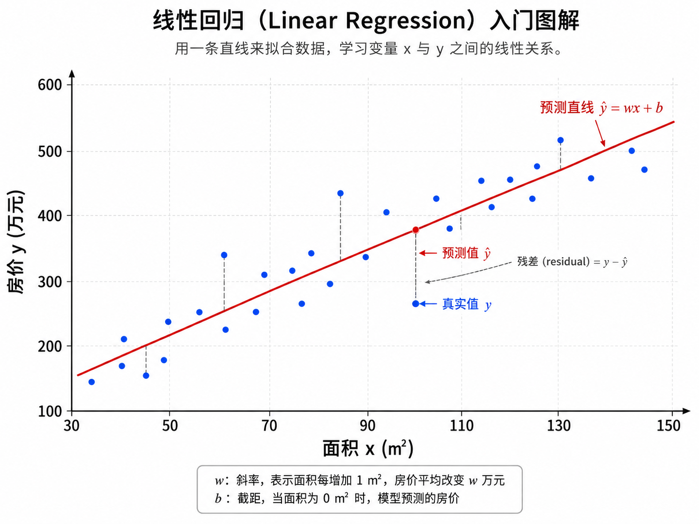
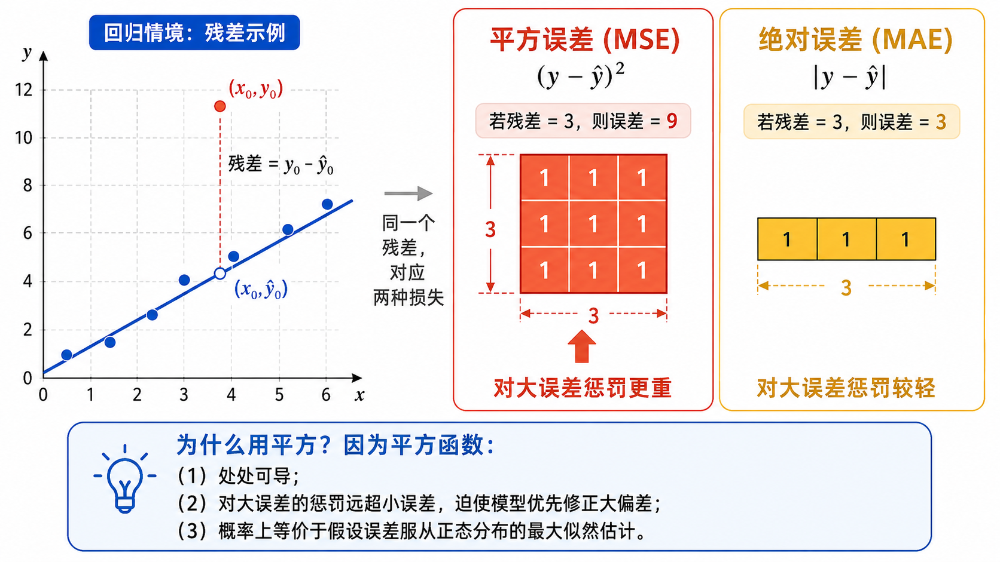
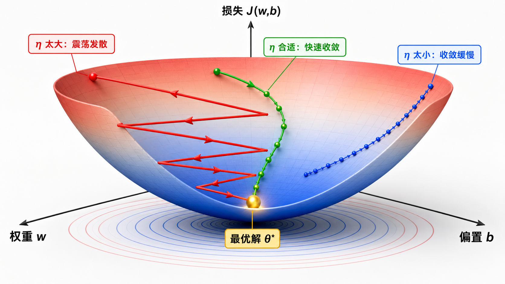
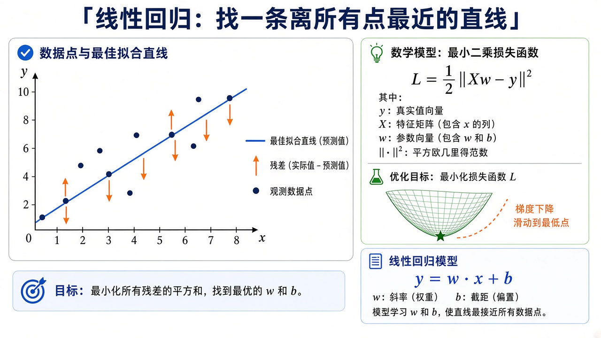
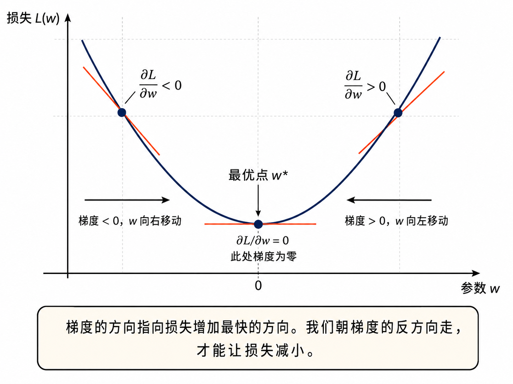

# 从线性回归理解「学习」

> [!WARNING]
> 🧪 Beta公测版本提示：教程主体已完成，正在优化细节，欢迎大家提Issue反馈问题或建议。

> 本章只做一件事：给直线 $\hat y=wx+b$ 找最好的 $w,b$。正文永远先给**结论公式**；点开灰色「逐步推导」才看代数。数字例与 `demo.py` 一致：$y=2x+5+\varepsilon$，$n=100$，$\varepsilon\sim\mathcal N(0,3^2)$，$\eta=0.01$。微积分与梯度见 [优化](/math/optimization/)；下一步把直线换成概率见 [逻辑回归](/ml/foundations/logistic-regression/)。

---

## 1. 什么是回归？

**回归（Regression）**是监督学习中预测**连续数值**的任务。与分类（预测离散类别）不同，回归的输出是一个实数。

以一个日常例子来理解：你想预测北京的房价。你有以下特征（features）：
- $x_1$：房屋面积（平方米）
- $x_2$：卧室数量
- $x_3$：距离地铁站的距离（米）

你的目标是预测一个连续值 $y$（房价，单位：万元）。这个任务就是回归。

回归问题的数学描述：

$$
\text{给定训练集 } \{(x^{(i)}, y^{(i)})\}_{i=1}^{n}, x^{(i)} \in \mathbb{R}^d, y^{(i)} \in \mathbb{R}
$$

$$
\text{学习一个函数 } f: \mathbb{R}^d \to \mathbb{R} \text{ 使得 } f(x^{(i)}) \approx y^{(i)}
$$

回归是机器学习中最基础也是最重要的任务之一。理解了线性回归，你就能理解「学习」的本质——**模型如何在数据驱动下自动调整参数，以最小化预测误差**。

---

## 2. 线性模型：最朴实但最有力的假设

### 2.1 标量形式

最简单的线性模型假设输出 $y$ 是输入特征的线性组合：

$$
\hat{y} = wx + b
$$

其中：
- $\hat{y}$（读作 y-hat）是模型的预测值
- $x$ 是输入特征
- $w$ 是**权重（weight）**，决定了 $x$ 每变化 1 个单位时，$\hat{y}$ 变化多少
- $b$ 是**偏置（bias）**，当 $x=0$ 时的预测值

**保姆级数字例（先不算梯度）。** 取 demo 的真值 $w^\star=2$、$b^\star=5$。若某点 $x=3$，无噪声时 $y=11$。当前猜 $w=1$、$b=0$，则 $\hat y=3$，残差 $\hat y-y=-8$。要把预测抬上去，必须**增大** $w$ 或 $b$——后面梯度会精确告诉你各拧多少。

### 2.2 多特征推广

当有 $d$ 个特征时，我们使用线性组合：

$$
\hat{y} = w_1 x_1 + w_2 x_2 + \cdots + w_d x_d + b
$$

### 2.3 矩阵形式（向量化）

将所有参数和特征写成向量，可以得到简洁的矩阵形式：

$$
\hat{y} = \mathbf{w}^T \mathbf{x} + b
$$

对于整个数据集（$n$ 个样本，$d$ 个特征），可以写成矩阵形式：

$$
\hat{\mathbf{y}} = \mathbf{X} \mathbf{w} + b \cdot \mathbf{1}
$$

其中 $\mathbf{X} \in \mathbb{R}^{n \times d}$ 是特征矩阵，$\mathbf{w} \in \mathbb{R}^{d}$ 是权重向量，$\mathbf{1} \in \mathbb{R}^{n}$ 是全 1 向量。

为了进一步简化，我们可以把偏置 $b$ 吸收进权重向量中，在 $\mathbf{X}$ 中添加一列全 1：

$$
\tilde{\mathbf{y}} = \tilde{\mathbf{X}} \tilde{\mathbf{w}}, \quad
\tilde{\mathbf{X}} = [\mathbf{X} \;\; \mathbf{1}] \in \mathbb{R}^{n \times (d+1)}, \quad
\tilde{\mathbf{w}} = \begin{bmatrix} \mathbf{w} \\ b \end{bmatrix} \in \mathbb{R}^{d+1}
$$

这种紧凑形式在大规模计算（如深度学习框架中）非常有用。

> **图解说明**：红线是 $\hat y=wx+b$；竖虚线是残差。学习 = 拧 $w,b$，让这些竖线的平方和变小。

---

## 3. 损失函数：如何衡量「好」与「坏」

有了模型，我们需要一种方式来量化模型的预测到底有多「好」或有多「差」。这就是**损失函数（Loss Function）**的作用。

### 3.1 均方误差（MSE）

在线性回归中，最常用的是**均方误差（Mean Squared Error, MSE）**：

$$
J(w, b) = \frac{1}{n} \sum_{i=1}^{n} \left( \hat{y}^{(i)} - y^{(i)} \right)^2
      = \frac{1}{n} \sum_{i=1}^{n} \left( w x^{(i)} + b - y^{(i)} \right)^2
$$

用矩阵形式表示：

$$
J(\mathbf{w}) = \frac{1}{n} \|\mathbf{X}\mathbf{w} - \mathbf{y}\|^2_2
$$

### 3.2 为什么用平方误差而不是绝对值？

这是一个值得深入思考的问题。让我们比较两种候选：

- **绝对值误差（MAE）**：$|\hat{y} - y|$ —— 对所有误差一视同仁
- **平方误差（MSE）**：$(\hat{y} - y)^2$ —— 对大误差给予更大的惩罚

选择平方误差的关键原因：

1. **可微性**：绝对值函数在 $x=0$ 处不可导，而平方函数处处光滑可导。这使得我们可以使用梯度下降法来优化。

2. **对大误差更敏感**：平方函数放大了大误差的惩罚。一个误差为 10 的样本，在 MSE 中的惩罚是 100，在 MAE 中仅为 10。对于回归任务，大偏差通常意味着模型质量明显下降，应受到更强的纠正。

3. **概率解释**：如果假设误差服从正态分布 $\epsilon \sim \mathcal{N}(0, \sigma^2)$，那么最小化 MSE 等价于最大似然估计（MLE）。

4. **凸性**：MSE 是关于参数 $(w, b)$ 的凸函数，意味着只有一个全局最小值，不会被卡在局部最小值中。

### 3.3 MSE 的几何意义

在几何上，线性回归是在寻找一个超平面，使得所有数据点到该超平面的竖直距离（残差）的平方和最小。这被称为**最小二乘法（Ordinary Least Squares, OLS）**。

对于二维情况（$d=1$），我们寻找的是一条直线，使得所有数据点到直线的竖直距离平方和最小。注意是**竖直**距离（沿 $y$ 轴），不是点到直线的垂直距离——后者叫正交回归，公式不同。

**卡点。** 残差是 $\hat y-y$，不是 $y-\hat y$。两者只差一个符号，但梯度公式里必须和代码一致：`demo.py` 写 $\partial J/\partial w=(2/n)\sum(\hat y-y)x$，预测偏高时这项为正，于是 $w\leftarrow w-\eta\cdot(\text{正数})$，把 $w$ 往下调。

---

## 4. 梯度下降：「走下坡路」的智慧

### 4.1 直觉

想象你蒙着眼睛站在一座山上，目标是走到山谷的最低点。你唯一的信息是脚下的坡度（斜率）。一个自然的策略是：每次都朝最陡的下坡方向走一小步，重复直到你感觉地面变平了。这就是梯度下降的核心思想。

### 4.2 数学表述

梯度下降的更新规则：

$$
\theta_{t+1} = \theta_t - \eta \cdot \nabla_\theta J(\theta_t)
$$

其中 $\eta$（eta）是**学习率**，控制每一步的大小。$\nabla_\theta J(\theta_t)$ 是损失函数在 $\theta_t$ 处的梯度。

> **图解说明**：竖线是残差 $\hat y-y$。MSE 把这些竖线平方后平均；梯度下降沿碗底把直线「拧」到残差最小。

::: details 逐步推导：一元 MSE 对 $w,b$ 的偏导（点击展开）

对于 $\hat{y}=wx+b$，

$$
J(w, b) = \frac{1}{n} \sum_{i=1}^{n} (w x^{(i)} + b - y^{(i)})^2.
$$

对 $w$（链式法则：外层平方、内层 $wx$）：

$$
\frac{\partial J}{\partial w}
= \frac{2}{n} \sum_{i=1}^{n} (\hat{y}^{(i)} - y^{(i)}) \cdot x^{(i)}.
$$

对 $b$（内层对 $b$ 的导数是 $1$）：

$$
\frac{\partial J}{\partial b}
= \frac{2}{n} \sum_{i=1}^{n} (\hat{y}^{(i)} - y^{(i)}).
$$

矩阵形式 $J=\tfrac1n\|X\theta-y\|^2$ 时，梯度是 $\tfrac2n X^\top(X\theta-y)$，与 [优化](/math/optimization/) 那一章只差一个 $\tfrac12$ 约定。更新：

$$
w \leftarrow w - \eta \frac{\partial J}{\partial w},\qquad
b \leftarrow b - \eta \frac{\partial J}{\partial b}.
$$

:::

梯度下降更新（结论，可直接写进代码）：

$$
w \leftarrow w - \eta \cdot \frac{\partial J}{\partial w}
,\qquad
b \leftarrow b - \eta \cdot \frac{\partial J}{\partial b}.
$$

---

## 5. 正规方程：封闭解

对于线性回归，我们不仅可以梯度下降，还可以直接求出解析解。

### 5.1 结论：正规方程

把偏置吸进 $\mathbf{X}$ 的全 1 列后，令梯度为零，得到闭式解：

$$
\mathbf{w}^* = (\mathbf{X}^T \mathbf{X})^{-1} \mathbf{X}^T \mathbf{y}.
$$

`demo.py` 里用 `np.linalg.pinv`（伪逆）而不是 `inv`，以免 $\mathbf{X}^T\mathbf{X}$ 奇异时炸掉。一元时这就是「过原点直线」的最小二乘斜率；有截距时把 $x$ 扩成 $[x,1]$。

::: details 逐步推导：从 $J$ 到正规方程（点击展开）

$$
J(\mathbf{w})=\frac1n(\mathbf{X}\mathbf{w}-\mathbf{y})^\top(\mathbf{X}\mathbf{w}-\mathbf{y}).
$$

对 $\mathbf{w}$ 微分：残差 $r=Xw-y$，$\mathrm{d}J=\frac2n r^\top X\,\mathrm{d}w$，故

$$
\nabla_{\mathbf{w}} J = \frac{2}{n} \mathbf{X}^T (\mathbf{X}\mathbf{w} - \mathbf{y}).
$$

令梯度为 $0$：$X^\top Xw=X^\top y$。左边可逆则

$$
\mathbf{w}^* = (X^\top X)^{-1}X^\top y.
$$

几何：在 $\mathrm{col}(X)$ 里找离 $y$ 最近的点，误差 $y-Xw$ 必须与列空间正交，即 $X^\top(y-Xw)=0$，同一方程。

**数字例。** 三点 $(0,1),(1,3),(2,3)$，设计矩阵含截距：

$$
X=\begin{pmatrix}0&1\\1&1\\2&1\end{pmatrix},\quad
y=\begin{pmatrix}1\\3\\3\end{pmatrix}.
$$

$X^\top X=\begin{pmatrix}5&3\\3&3\end{pmatrix}$，逆是 $\tfrac13\begin{pmatrix}3&-3\\-3&5\end{pmatrix}$，$X^\top y=(9,7)^\top$，于是 $w^*=(1,5/3)^\top$。直线 $\hat y=x+5/3$。三点残差 $2/3,-2/3,0$，平方和 $8/9$，任何别的斜率都会更大。

:::

### 5.2 梯度下降 vs. 正规方程

| 方法 | 优点 | 缺点 |
|------|------|------|
| **梯度下降** | 适用于大规模数据（$n$ 很大时仍可行）；可处理在线学习（新数据逐步加入）；容易扩展到非线性模型 | 需要选择学习率；需要多次迭代；可能收敛到局部最优点（对非凸函数） |
| **正规方程** | 不需要选择学习率；不需要迭代；一次性得到精确解 | 计算 $(\mathbf{X}^T \mathbf{X})^{-1}$ 的时间复杂度为 $O(d^3)$，$d$ 大时不可行；需要 $\mathbf{X}^T \mathbf{X}$ 可逆 |

在实际工程中，当 $n > 10^6$ 或 $d > 10^4$ 时，梯度下降通常是更好的选择。此外，梯度下降可以自然地扩展到深度学习中的非线性模型（神经网络）。

---

## 6. 从梯度下降到随机梯度下降

### 6.1 批量梯度下降（Batch GD）

每次更新使用**全部** $n$ 个样本计算梯度：

$$
\nabla J = \frac{1}{n} \sum_{i=1}^{n} \nabla \mathcal{L}^{(i)}
$$

优点：梯度计算精确，收敛稳定。
缺点：每步都要处理全部数据，当 $n$ 很大时速度慢。

### 6.2 随机梯度下降（Stochastic GD, SGD）

每次更新使用**1 个**随机样本的梯度：

$$
\nabla J \approx \nabla \mathcal{L}^{(i)}, \quad i \sim \text{Uniform}(1, n)
$$

优点：每次更新极快，可以跳出局部最优点（噪声有正则化作用）。
缺点：梯度估计有噪声，收敛路径不稳定。

### 6.3 小批量梯度下降（Mini-batch GD）

每次更新使用**一小批（batch）**样本（如 32、64、128 个）：

$$
\nabla J \approx \frac{1}{|B|} \sum_{i \in B} \nabla \mathcal{L}^{(i)}
$$

取两者之长：比 SGD 稳定，比 Batch GD 快。这是深度学习中最常用的形式。

---

## 7. 学习率的选择

学习率 $\eta$ 是最重要的超参数之一，也是最需要调参的。如图 02-02 所示：

- $\eta$ **太大**：参数更新幅度过大，可能在损失函数曲面上来回震荡，甚至发散（损失越来越大）。
- $\eta$ **太小**：收敛速度极慢，可能需要数万个 epoch 才能到达最优解附近。
- $\eta$ **适中**：在合理的时间内收敛到最小值。

实际中的学习率选择策略：
- **学习率衰减**：随着训练进行逐步减小学习率
- **学习率预热**：开始用很小学习率，逐步增大到目标值
- **自适应学习率**：每个参数有不同的学习率（Adam、RMSprop 等）

`demo.py` 的 `compare_learning_rates` 用同一份 $y=2x+5$ 数据对比几档 $\eta$。$\eta$ 过大时损失曲线会抖甚至 `nan`；过小则 200 个 epoch 还在半山腰。一元特征、$x\in[0,10]$ 时 $\eta=0.01$ 通常稳；若你先把 $x$ 标准化到均值 0 方差 1，学习率可以放大一个数量级。

### 卡点清单

| 坑 | 症状 | 处理 |
|----|------|------|
| $x$ 未标准化、$\eta$ 仍用 $0.01$ | 损失爆炸或振荡 | 先减均值除标准差，或把 $\eta$ 降到 $10^{-4}$ |
| 忘了偏置列 | 直线被强行过原点 | `X` 加全 1 列，或单独更新 $b$ |
| `inv` 遇到共线特征 | `LinAlgError` | 用 `pinv`，或加岭回归 $\lambda I$（下一章） |
| 把 MAE 的次梯度当成 MSE 梯度 | 大残差点几乎不改参数 | MSE 梯度含残差本身，大错先修 |

对照 `demo.py`：梯度下降与正规方程、sklearn 应得到几乎同一条 $w\approx 2$、$b\approx 5$ 的直线；差几个百分点是噪声和早停，不是公式错了。

---

## 本章总结

线性回归是机器学习中最简单但最重要的模型。它教会我们：

1. **模型 = 假设空间**：线性模型假设输出是输入的线性组合
2. **损失 = 优化目标**：MSE 衡量预测与真实的差距，且具有优美的数学性质
3. **梯度下降 = 优化方法**：沿着损失函数的梯度方向，一步步走向最优解
4. **正规方程 = 解析解**：对于线性模型，我们甚至可以直接写出最优参数的公式

这些概念构成了所有机器学习模型（包括最深的神经网络）的基础框架。第 3 章我们将看到，只需要在输出端加一个 sigmoid 函数，线性回归就能摇身一变成为分类利器——逻辑回归。

---

## 📥 Code

| File | View | Download |
|------|------|----------|
| demo.py | [Open](./code-demo) | <a href="/notebook/code/ml/foundations/linear-regression/demo.py" target="_blank" download>Download</a> |
| exercise.py | [Open](./code-exercise) | <a href="/notebook/code/ml/foundations/linear-regression/exercise.py" target="_blank" download>Download</a> |

## 参考

1. Hastie, T., Tibshirani, R., & Friedman, J. (2009). The Elements of Statistical Learning. Springer.
2. Goodfellow, I., Bengio, Y., & Courville, A. (2016). Deep Learning. MIT Press.
3. Bishop, C. M. (2006). Pattern Recognition and Machine Learning. Springer.
