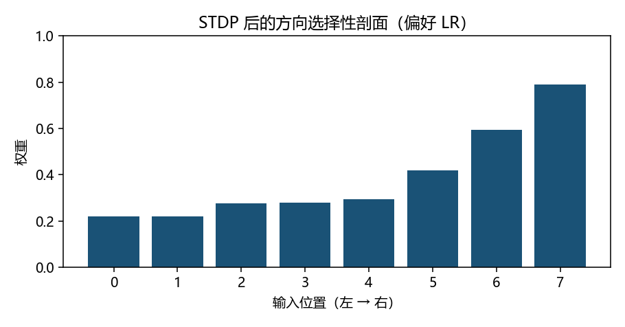
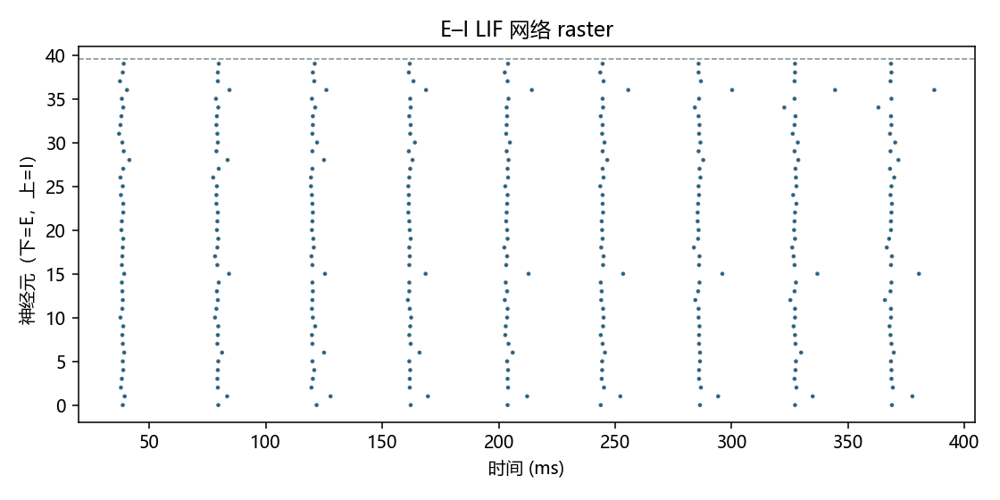

# 回路：方向选择性与 E–I 平衡

> [!WARNING]
> 🧪 Beta公测版本提示：教程主体已完成，正在优化细节，欢迎大家提Issue反馈问题或建议。

> 单细胞会放电、突触会因时序改权重之后，下一问是：**许多细胞连成网，整体出现什么活动模式？** 两个最小故事：STDP 长出方向选择性；兴奋–抑制网络的 raster 制度。

---

## 一、STDP 如何「长出」方向选择性

视觉里有一类细胞：物体朝某个方向扫过时反应更强。经典计算故事（Song & Abbott 风格的直觉）：

> 输入按空间位置依次被扫过 → 因果时序反复出现 → STDP 把「较早被激活的输入」权重打高。

本仓库玩具：8 个前馈突触，偏好 LR 扫过时在序列末尾给一个教师 post 尖峰。训练后权重剖面应与位置正相关（`selectivity_score`）。

> 运行 `code/demo.py`。LR 探针驱动应大于 RL——不是完整视觉皮层，但是机制可讲清的最小故事。

---

## 二、E–I 平衡不是一句口号

皮层回路里兴奋（E）与抑制（I）纠缠。改变外驱动与连接，网络可落入不同制度：

| 制度 | 看起来像什么 | 为什么重要 |
|------|--------------|------------|
| 异步不规则 | 尖峰散乱 | 接近皮层自发活动的一种描述 |
| 同步 | 齐射 | 与通信、病理节律相关 |
| 振荡 | 带状周期 | γ / θ 等节律的入门现象 |

最小电流型 E–I LIF 网（稀疏随机连接 + 弱噪声）输出 raster。先学会「看图辨制度」，再谈平均场。

> 横轴时间、纵轴神经元编号；前若干行为 E，其余为 I。本 demo 参数偏向异步不规则，平均发放率打印在终端。

---

## 三、平均场预习

把 E、I 两群的发放率 $(r_E, r_I)$ 写成 Wilson–Cowan 一类 ODE，是「回路」通向系统神经科学的标准下一步。示意形式是

$$
\tau_E \dot r_E = -r_E + f(w_{EE} r_E - w_{EI} r_I + I_E),\qquad
\tau_I \dot r_I = -r_I + f(w_{IE} r_E - w_{II} r_I + I_I)
$$

$f$ 是饱和的发放率函数。本教程不积分这套方程，但 raster 已经在问同一件事：抑制够不够、驱动会不会把网推进同步。

> 下一章：[连接组学](/neuro/connectomics/)——结构图如何变成可仿真的边列表。

## 四、三条主线检查单

| 主线 | 过关表现 |
|------|----------|
| 生物 | 能讲清「扫过 → 因果时序 → 权重剖面」 |
| AI | 能把方向选择性当成可学的特征检测，而不是硬编码卷积核 |
| 模拟 | 能读 raster：异步不规则 vs 齐射 |

## 📥 Code

| File | View | Download |
|------|------|----------|
| demo.py | [Open](./code-demo) | <a href="/notebook/code/neuro/circuits/demo.py" target="_blank" download>Download</a> |
| exercise.py | [Open](./code-exercise) | <a href="/notebook/code/neuro/circuits/exercise.py" target="_blank" download>Download</a> |

## 参考

1. Song & Abbott (2001). Cortical development and remapping through STDP.
2. Brunel, N. (2000). Dynamics of sparsely connected networks of excitatory and inhibitory spiking neurons.
3. Wilson & Cowan (1972). Excitatory and inhibitory interactions in localized populations.
