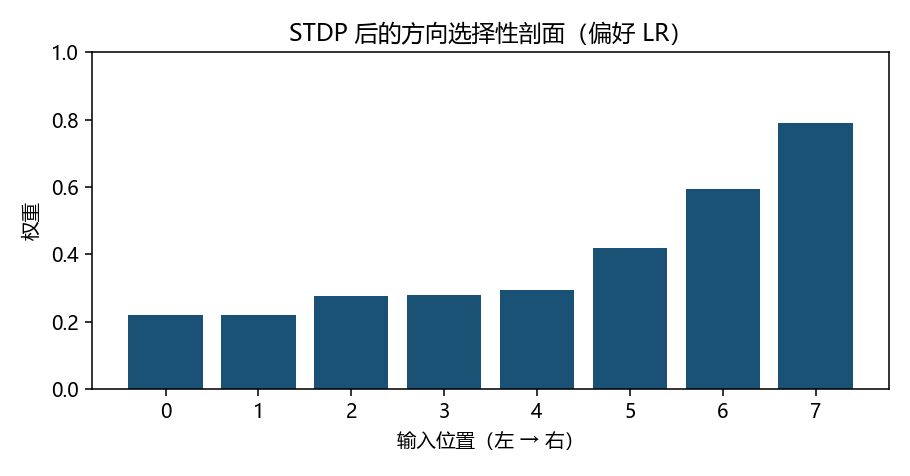
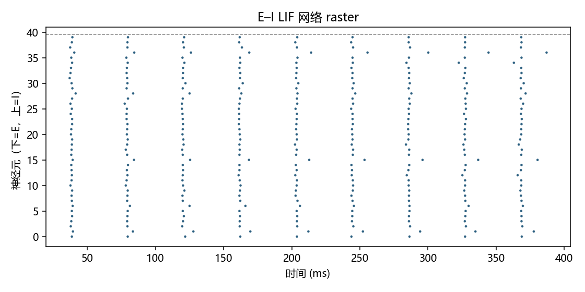

# 回路：方向选择性与 E–I 平衡

> [!WARNING]
> 🧪 Beta公测版本提示：教程主体已完成，正在优化细节，欢迎大家提Issue反馈问题或建议。

> 单细胞会放电、突触会因时序改权重之后，下一问是：**许多细胞连成网，整体出现什么活动模式？** 两个最小故事：STDP 长出方向选择性；兴奋–抑制网络的 raster 制度。

正文先看权重剖面和 raster；需要把「扫过 → 因果窗」或平均场 ODE 展开时，点开「逐步推导」。

---

## 一、STDP 如何「长出」方向选择性

视觉里有一类细胞：物体朝某个方向扫过时反应更强。经典计算故事（Song & Abbott 风格的直觉）：

> 输入按空间位置依次被扫过 → 因果时序反复出现 → STDP 把「较早被激活的输入」权重打高。

**保姆级：不必先有「方向检测器」。** 你不需要在电路里焊死一个「只认从左到右」的逻辑门。只要：(1) 输入在空间上排成一排；(2) 物体扫过时它们按顺序响；(3) 突触后细胞在序列末尾附近也响一次；(4) STDP 是因果窗（先 pre 后 post 加强）。反复扫同一方向，权重剖面就会倾斜——倾斜本身就是方向选择性。

本仓库玩具：8 个前馈突触，偏好 LR 扫过时在序列末尾给一个教师 post 尖峰。STDP 参数与 [STDP 章](/neuro/stdp/) 同族：$A_+=0.02$、$A_-=0.022$、$\tau_+=\tau_-=20\,\mathrm{ms}$。初始权重 $0.2$ 加一点高斯抖动；扫过间隔 $10\,\mathrm{ms}$，相邻扫之间再空 $100\,\mathrm{ms}$，共 $30$ 次；教师 post 落在最后一个 pre 之后 $2\,\mathrm{ms}$。训练后权重剖面应与位置正相关（`selectivity_score`）。种子 `0`。

> 运行 `code/demo.py`。LR 探针驱动应大于 RL——不是完整视觉皮层，但是机制可讲清的最小故事。终端打印 `selectivity` 与 `probe LR/RL`。

::: details 逐步推导：扫过时序如何让 STDP 打出单调权重剖面（点击展开）

记号：输入 $i=0,\ldots,7$ 从左到右排。LR 扫过时，pre 时刻 $t_i=t_{\mathrm{base}}+i\cdot 10\,\mathrm{ms}$，post 在 $t_7+2\,\mathrm{ms}$。

对输入 $i$，时差 $\Delta t_i=t_{\mathrm{post}}-t_i=(7-i)\cdot 10+2$ 毫秒，全是正的（因果：先 pre 后 post）。指数窗 $A_+e^{-\Delta t/\tau_+}$ 在 $\Delta t$ 小时更大，所以**越靠右的输入越接近 post，LTP 越强**。左端输入离 post 有 $70\,\mathrm{ms}$ 量级，相对 $\tau_+=20\,\mathrm{ms}$ 已经衰减到 $e^{-3.5}\approx 0.03$，几乎不加。

痕迹实现（demo 里的 `pre_tr` / `post_tr`）与成对窗是同一件事：pre 到达把 pre 痕迹 $+1$，之后指数衰减；post 到达时 $\Delta w=+A_+\times$（当时的 pre 痕迹）。序列末尾的突触痕迹还很新，所以涨得最多。

反向 RL 扫会把「早」变成右端，剖面会翻过来；demo 的 `selectivity_score` 在 RL 训练时对相关系数取负，好让「偏好方向与位置相关」都报成正分。探针 `probe` 用「按该方向顺序的位置加权和」模拟「这个方向扫过来时总驱动有多大」：LR 训练后应 `probe(LR)>probe(RL)`。

$A_-$ 略大于 $A_+$（$0.022>0.02$）是常见稳定化：无结构的偶然配对趋向于 LTD，免得所有权重饱和到 $1$。权重夹在 $[0,1]$。

:::

---

## 二、E–I 平衡不是一句口号

皮层回路里兴奋（E）与抑制（I）纠缠。改变外驱动与连接，网络可落入不同制度：

| 制度 | 看起来像什么 | 为什么重要 |
|------|--------------|------------|
| 异步不规则 | 尖峰散乱 | 接近皮层自发活动的一种描述 |
| 同步 | 齐射 | 与通信、病理节律相关 |
| 振荡 | 带状周期 | γ / θ 等节律的入门现象 |

最小电流型 E–I LIF 网（稀疏随机连接 + 弱噪声）输出 raster。先学会「看图辨制度」，再谈平均场。

**本 demo 参数：** $N_E=40$、$N_I=10$，模拟 $400\,\mathrm{ms}$，步长 $0.2\,\mathrm{ms}$。连接概率一律 $0.12$；兴奋→兴奋权重 $0.8$，兴奋→抑制 $1.2$，抑制→兴奋 $-0.5$，抑制→抑制 $-0.6$。LIF：$\tau=20\,\mathrm{ms}$、$R=20$、$V_{\mathrm{rest}}=V_{\mathrm{reset}}=-70\,\mathrm{mV}$、$V_{\mathrm{th}}=-50\,\mathrm{mV}$、绝对不应期 $2\,\mathrm{ms}$。外驱动电流 E 为 $1.15$、I 为 $0.75$，再加标准差 $0.15$ 的白噪声。种子 `0`。平均发放率丢掉前 $100\,\mathrm{ms}$ 后打印在终端。

> 横轴时间、纵轴神经元编号；前若干行为 E，其余为 I。本 demo 参数偏向异步不规则，平均发放率打印在终端。虚线分开 E / I。

**保姆级：怎么读 raster。** 横轴是时间，每个点是一次尖峰。若点在竖直方向排成一条「墙」，那是齐射（同步）；若像散乱的星空，是异步。本参数故意把抑制接上、外驱动不太强，好让你看到星空而不是墙。把抑制权重改小或外驱动加大，墙会现出来——exercise 的方向。

---

## 三、平均场预习

把 E、I 两群的发放率 $(r_E, r_I)$ 写成 Wilson–Cowan 一类 ODE，是「回路」通向系统神经科学的标准下一步。示意形式是

$$
\tau_E \dot r_E = -r_E + f(w_{EE} r_E - w_{EI} r_I + I_E),\qquad
\tau_I \dot r_I = -r_I + f(w_{IE} r_E - w_{II} r_I + I_I)
$$

$f$ 是饱和的发放率函数。本教程不积分这套方程，但 raster 已经在问同一件事：抑制够不够、驱动会不会把网推进同步。

::: details 逐步推导：从「点过程的群体平均」到 Wilson–Cowan（点击展开）

单个 LIF 的电压是随机的，尖峰是点过程。若一群 $N$ 个统计同类的细胞，定义群体发放率

$$
r(t)=\frac{1}{N}\sum_{i=1}^N\sum_k \delta(t-t_i^k)
$$

（再做毫秒级平滑）。在连接稀疏、同步不强时，每个细胞看见的输入接近「平均场」：兴奋输入 $\approx w_{EE} r_E$，抑制 $\approx w_{EI} r_I$，再加上外电流 $I_E$。再假定细胞的 I–f 关系可以收成一个静态非线性 $f$（电流进、速率出），并给 $r$ 一个滞后 $\tau$（膜时间常数的粗粒化），就得到

$$
\tau\dot r=-r+f(w r_{\mathrm{syn}}+I).
$$

两群就写成上面那对 ODE。平衡点满足 $r=f(\cdots)$：兴奋被抑制按住时，可以有一个中等发放的稳定点（异步不规则的平均场影子）；抑制太弱或 $w_{EE}$ 太大，平衡点失稳，出现振荡或爆发——对应 raster 上的墙和条纹。

平均场**抹掉**了有限 $N$ 的涨落和精确的尖峰时刻，所以它解释不了 STDP 那种吃 $\Delta t$ 的学习，但解释得了「为什么加一点抑制，网就不齐射了」。demo 的 $N=50$ 已经能看出制度，还远没到平均场定理要求的无限群体——把它当预习，不要当证明。

:::

> 下一章：[连接组学](/neuro/connectomics/)——结构图如何变成可仿真的边列表。

## 四、三条主线检查单

| 主线 | 过关表现 |
|------|----------|
| 生物 | 能讲清「扫过 → 因果时序 → 权重剖面」 |
| AI | 能把方向选择性当成可学的特征检测，而不是硬编码卷积核 |
| 模拟 | 能读 raster：异步不规则 vs 齐射 |

## 📥 Code

| File | View | Download |
|------|------|----------|
| demo.py | [Open](./code-demo) | <a href="/notebook/code/neuro/circuits/demo.py" target="_blank" download>Download</a> |
| exercise.py | [Open](./code-exercise) | <a href="/notebook/code/neuro/circuits/exercise.py" target="_blank" download>Download</a> |

## 参考

1. Song & Abbott (2001). Cortical development and remapping through STDP.
2. Brunel, N. (2000). Dynamics of sparsely connected networks of excitatory and inhibitory spiking neurons.
3. Wilson & Cowan (1972). Excitatory and inhibitory interactions in localized populations.
