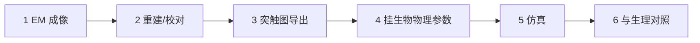
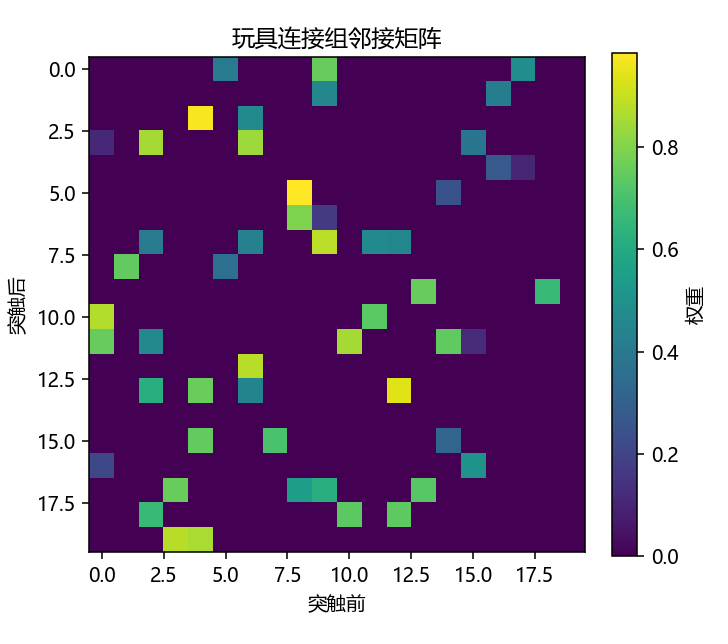

# 连接组学：如何把「果蝇大脑」装进电脑？

> [!WARNING]
> 🧪 Beta公测版本提示：教程主体已完成，正在优化细节，欢迎大家提Issue反馈问题或建议。

> FlyWire / Blue Brain / EBRAINS 是地图与工地。本讲讲清**数据流**，避免一上来幻想「我要仿真整个大脑」。过关标准：能画出流水线并指出每一步的输入输出——不是复现超算规模。

---

## 一、真正的问题不是「算力够不够」

全脑模拟拆开是六步。缺任何一步，都只是漂亮渲染或无法复现的故事。

| 步骤 | 产物 | 常见坑 |
|------|------|--------|
| 1 EM | 超大三维像素体积 | 存储与对齐 |
| 2 重建 | 神经元骨架与身份 | 人工校对成本 |
| 3 导出 | 节点–边图（SONATA / NeuroML） | 格式与元数据混乱 |
| 4 参数 | 可动力学的细胞模型 | 参数不可辨识 |
| 5 仿真 | 电压 / 尖峰 | 数值稳定与种子 |
| 6 对照 | 可证伪的预测 | 只仿真不验证 |

---

## 二、连接组是什么（以及不是什么）

连接组 ≈「谁连谁、以什么突触」。它是**结构约束**，不是自动等于功能。城市道路地图 ≠ 交通流量；电路原理图 ≠ 正在播放的视频。FlyWire 提供高完整度的果蝇全脑图，但解释行为仍需动力学、调制与学习规则。

---

## 三、SONATA-lite：给仿真器看的中立图纸

最小心智模型：

- **Nodes**：神经元 id、细胞类型
- **Edges**：source → target、权重、延迟、突触类型
- **Simulator**：读图 → 积分 → 输出尖峰

本章用玩具 JSON（不是完整 SONATA 规范）生成随机有向图并画出邻接矩阵。边列表应能唯一决定矩阵。

> 运行 `code/demo.py`。行 = 突触后，列 = 突触前。密度随 `p_connect` 变。

---

## 四、项目地图

| 项目 | 你该学的方法论 | 不必一上来做的事 |
|------|----------------|------------------|
| FlyWire | 大规模校对、细胞类型、图分析 | 自己重跑全部 EM |
| Blue Brain | 微电路组装、形态+电生理拟合 | 复制超算作业 |
| EBRAINS | 平台化模型库 | 把平台当黑盒玩具 |

和 AI 的交叉：连接组是有向图先验。可以问能否注入 GNN / 结构化 SNN；何时全脑图必要、何时平均场就够。[科学计算里的 GNN](/science/gnn/) 处理的是另一类图（分子、网格），问题同构处是「局部边 → 动力学」，对象不同。

> 下一章：[NeuroAI](/neuro/neuroai/)。

## 五、三条主线检查单

| 主线 | 过关 |
|------|------|
| 生物 | 能区分结构连接与功能活动 |
| AI | 能说清图先验何时有用、何时平均场就够 |
| 模拟 | 能从边列表重建邻接并解释密度 |

## 📥 Code

| File | View | Download |
|------|------|----------|
| demo.py | [Open](./code-demo) | <a href="/notebook/code/neuro/connectomics/demo.py" target="_blank" download>Download</a> |
| exercise.py | [Open](./code-exercise) | <a href="/notebook/code/neuro/connectomics/exercise.py" target="_blank" download>Download</a> |

## 参考

1. Dorkenwald et al. FlyWire 相关论文与文档。
2. Markram et al. Blue Brain 方法综述。
3. SONATA / NeuroML 规范（作地图图例）。
