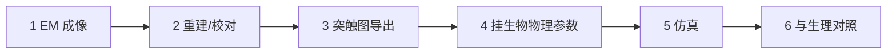
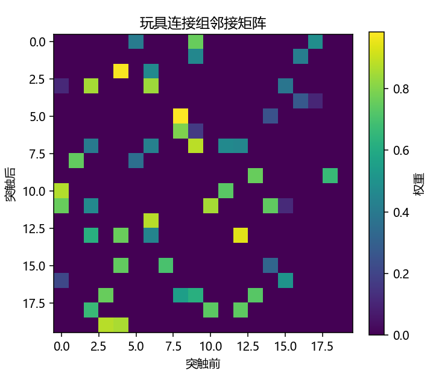

# 连接组学：如何把「果蝇大脑」装进电脑？

> [!WARNING]
> 🧪 Beta公测版本提示：教程主体已完成，正在优化细节，欢迎大家提Issue反馈问题或建议。

> FlyWire / Blue Brain / EBRAINS 是地图与工地。本讲讲清**数据流**，避免一上来幻想「我要仿真整个大脑」。过关标准：能画出流水线并指出每一步的输入输出——不是复现超算规模。

正文是六步流水线和一张玩具邻接矩阵；需要从边列表推回密度时，点开「逐步推导」。

---

## 一、真正的问题不是「算力够不够」

全脑模拟拆开是六步。缺任何一步，都只是漂亮渲染或无法复现的故事。

```mermaid
flowchart LR
    A["1 EM 成像"] --> B["2 重建/校对"]
    B --> C["3 突触图导出"]
    C --> D["4 挂生物物理参数"]
    D --> E["5 仿真"]
    E --> F["6 与生理对照"]
```

| 步骤 | 产物 | 常见坑 |
|------|------|--------|
| 1 EM | 超大三维像素体积 | 存储与对齐 |
| 2 重建 | 神经元骨架与身份 | 人工校对成本 |
| 3 导出 | 节点–边图（SONATA / NeuroML） | 格式与元数据混乱 |
| 4 参数 | 可动力学的细胞模型 | 参数不可辨识 |
| 5 仿真 | 电压 / 尖峰 | 数值稳定与种子 |
| 6 对照 | 可证伪的预测 | 只仿真不验证 |

**保姆级：算力是第五步的事。** 没有校对过的身份（谁是哪一种细胞）、没有突触类型和延迟、没有能对照的生理，把 GPU 堆上去只是把不确定的图积分得更快。导论里说的「方程是假说」在这里变成「图加参数都是假说」：改一条边的符号，raster 可以从异步变成病理齐射。

---

## 二、连接组是什么（以及不是什么）

连接组 ≈「谁连谁、以什么突触」。它是**结构约束**，不是自动等于功能。城市道路地图 ≠ 交通流量；电路原理图 ≠ 正在播放的视频。FlyWire 提供高完整度的果蝇全脑图，但解释行为仍需动力学、调制与学习规则。

同一张邻接矩阵，挂 LIF 还是 HH、有没有多巴胺调制、权重会不会 STDP，仿真出来的尖峰可以完全不同。所以「我们仿真了连接组」这句话，后面必须跟着：用的哪套点神经元、哪些突触动力学、和哪项生理对照。

---

## 三、SONATA-lite：给仿真器看的中立图纸

最小心智模型：

- **Nodes**：神经元 id、细胞类型
- **Edges**：source → target、权重、延迟、突触类型
- **Simulator**：读图 → 积分 → 输出尖峰

本章用玩具 JSON（不是完整 SONATA 规范）生成随机有向图并画出邻接矩阵。边列表应能唯一决定矩阵。

**本 demo 数字：** $n=20$ 个节点，Erdős–Rényi 式有向边（无自环），连接概率 $p=0.15$，种子 `0`。权重均匀抽自 $[0.1,1.0]$，延迟在 $\{1,2,5\}\,\mathrm{ms}$ 里选。期望边数 $n(n-1)p=20\times 19\times 0.15=57$。邻接约定：**行 = 突触后，列 = 突触前**，与「电流从 pre 流向 post」一致。

> 运行 `code/demo.py`。行 = 突触后，列 = 突触前。密度随 `p_connect` 变。终端打印边数与密度。

::: details 逐步推导：边列表怎样唯一决定邻接矩阵，以及密度的期望（点击展开）

图的稀疏表示是边列表：每条边一个记录 `(source_node_id, target_node_id, syn_weight, delay_ms)`。稠密表示是矩阵 $W\in\mathbb{R}^{n\times n}$。本课约定

$$
W_{\mathrm{post},\mathrm{pre}} = \text{该突触权重（无边则为 }0\text{）}.
$$

于是仿真一步里，突触后电流可以写成 $I_{\mathrm{syn}}=W s$，其中 $s$ 是「本步谁开火」的 $0/1$ 向量——和 [回路](/neuro/circuits/) 里 `syn += W[:, fired].sum` 是同一套乘法。

给定边列表，填 $W$ 的算法是确定的：先清零，再对每条边写一个元素。反过来，从 $W$ 读出所有非零项（记下 $\mathrm{pre},\mathrm{post}$、权重），得到的边多重集合与原列表在「谁连谁、多重多少」上一致（若不允许平行边，则完全一致）。这就是「边列表应能唯一决定矩阵」。

无自环有向 ER：每对有序点 $(i,j)$、$i\neq j$ 独立以概率 $p$ 连边。可能的有序对数 $n(n-1)$，期望边数 $n(n-1)p$，密度定义为

$$
\rho=\frac{\#\{W_{ij}\neq 0\}}{n(n-1)}.
$$

$\mathbb{E}[\rho]=p$。一次随机实现会抖；demo 打印的密度应落在 $0.15$ 附近。把 $p$ 改成 $0.5$，矩阵会从稀疏黄点变成一片亮——那已经不像皮层的稀疏连接，倒像全连接 ANN。

真实连接组不是 ER：有细胞类型块、有距离依赖、有互惠边过多等结构。玩具图只训练你「仿真器吃的是边列表，不是渲染图」。

:::

---

## 四、项目地图

| 项目 | 你该学的方法论 | 不必一上来做的事 |
|------|----------------|------------------|
| FlyWire | 大规模校对、细胞类型、图分析 | 自己重跑全部 EM |
| Blue Brain | 微电路组装、形态+电生理拟合 | 复制超算作业 |
| EBRAINS | 平台化模型库 | 把平台当黑盒玩具 |

和 AI 的交叉：连接组是有向图先验。可以问能否注入 GNN / 结构化 SNN；何时全脑图必要、何时平均场就够。[科学计算里的 GNN](/science/gnn/) 处理的是另一类图（分子、网格），问题同构处是「局部边 → 动力学」，对象不同。

> 下一章：[NeuroAI](/neuro/neuroai/)。

## 五、三条主线检查单

| 主线 | 过关 |
|------|------|
| 生物 | 能区分结构连接与功能活动 |
| AI | 能说清图先验何时有用、何时平均场就够 |
| 模拟 | 能从边列表重建邻接并解释密度 |

## 📥 Code

| File | View | Download |
|------|------|----------|
| demo.py | [Open](./code-demo) | <a href="/notebook/code/neuro/connectomics/demo.py" target="_blank" download>Download</a> |
| exercise.py | [Open](./code-exercise) | <a href="/notebook/code/neuro/connectomics/exercise.py" target="_blank" download>Download</a> |

## 参考

1. Dorkenwald et al. FlyWire 相关论文与文档。
2. Markram et al. Blue Brain 方法综述。
3. SONATA / NeuroML 规范（作地图图例）。
