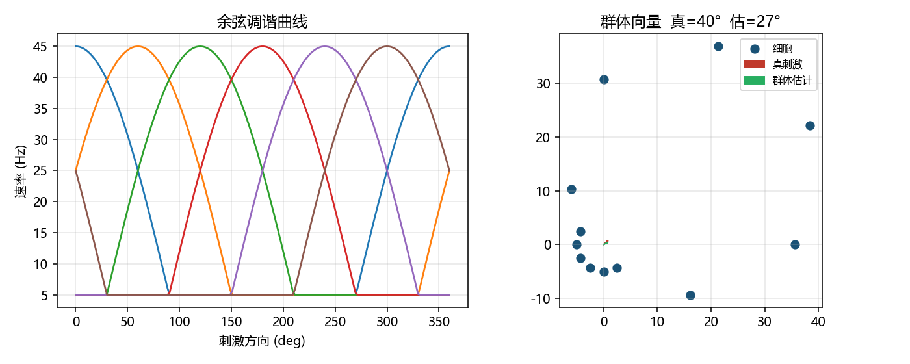
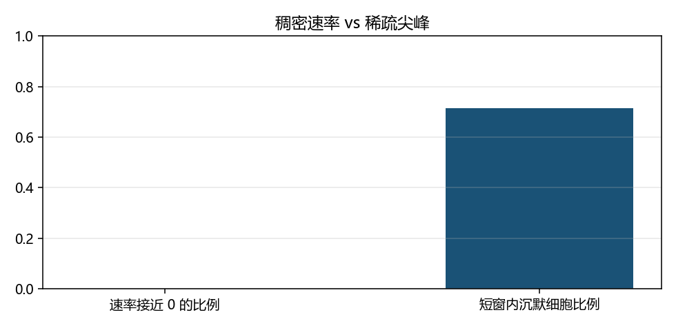

# 神经编码：速率、时间与群体

> [!WARNING]
> 🧪 Beta公测版本提示：教程主体已完成，正在优化细节，欢迎大家提Issue反馈问题或建议。

> [I–f 曲线](/neuro/hh-lif/) 告诉我们「电流变大 → 每秒更多尖峰」。编码再问一步：**刺激如何写进尖峰串，下游又如何读出来？** 这是细胞方程和突触学习之间缺的那一层。

---

## 一、同一串尖峰，三种读法

| 编码 | 下游看什么 | 擅长 |
|------|------------|------|
| **速率** | 窗口内平均 Hz | 慢变化的强度、对比度 |
| **时间 / 时序** | 精确时刻、相对顺序、延迟 | 快速分辨、STDP 的「老师」 |
| **群体** | 许多细胞的活动模式 | 方向、位置、连续变量 |

没有一种「真正的脑编码」。视觉、听觉、空间导航用的混合策略不同；模型的任务是把假说写成可抽样的随机过程。

最常用的生成模型：给定瞬时速率 $r(t)$，尖峰是强度为 $r$ 的 **非齐次泊松过程**。小区间 $\Delta t$ 内

$$
P(\text{spike in }\Delta t) \approx r(t)\,\Delta t
\qquad (r\Delta t \ll 1).
$$

速率码把 $r(t)$ 当成刺激的充分统计量；时间码则强调具体实现（哪一毫秒响了）。实验里常用 **PSTH**（ Peri-Stimulus Time Histogram）估计 $r(t)$，用 **ISI**（峰峰间隔）看节律与不规则性——同一平均 Hz 可以来自规则时钟，也可以来自很不规则的泊松。

---

## 二、调谐曲线与群体向量

许多皮层细胞对某个刺激变量 $s$（方向、朝向、位置）有钟形或余弦**调谐曲线** $r(s)$。一群偏好不同的细胞同时发放时，可以用加权的群体向量估计 $s$——这是感觉运动变换的经典计算故事，也是「分布式表征」和 ANN 隐层的可对照点。

本章 demo：余弦调谐的泊松神经元，用群体向量解码方向；并对比「稠密速率向量」和「稀疏尖峰指示」的静默比例。

> 运行 `code/demo.py` 生成。左：若干偏好方向的调谐曲线；右：一次刺激下的群体向量估计。

> 同一套底层速率：连续 $r$ 很少严格为 0；伯努利尖峰在短窗口里大部分细胞沉默。

---

## 三、和后面章节怎么接

- STDP 吃的是**时间码**里的 $\Delta t = t_{\mathrm{post}}-t_{\mathrm{pre}}$。
- E–I 网络的 raster 是看**群体**处于异步还是同步制度。
- NeuroAI 的「对齐」常常拿模型层活动去对神经群体的速率或 PSTH。

> 下一章：[Hebb 与 STDP](/neuro/stdp/)。

## 四、三条主线检查单

| 主线 | 过关表现 |
|------|----------|
| 生物 | 能区分速率、时序、群体三种读法 |
| AI | 能把群体向量和「分布式隐层」对照，而不等同 |
| 模拟 | 能从尖峰指示估计 Hz；能读懂调谐曲线图 |

## 📥 Code

| File | View | Download |
|------|------|----------|
| demo.py | [Open](./code-demo) | <a href="/notebook/code/neuro/encoding/demo.py" target="_blank" download>Download</a> |
| exercise.py | [Open](./code-exercise) | <a href="/notebook/code/neuro/encoding/exercise.py" target="_blank" download>Download</a> |

## 参考

1. Dayan & Abbott, *Theoretical Neuroscience*，第 1–3 章。
2. Georgopoulos et al. (1986). Neuronal population coding of movement direction.
3. Rieke et al. *Spikes: Exploring the Neural Code*.
