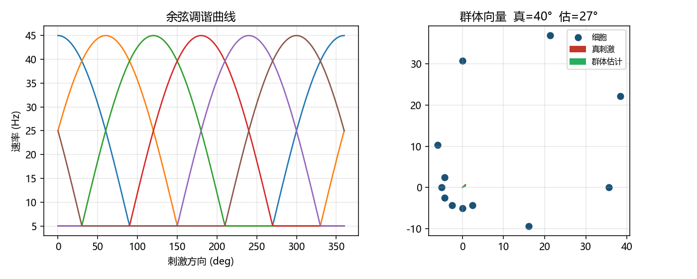
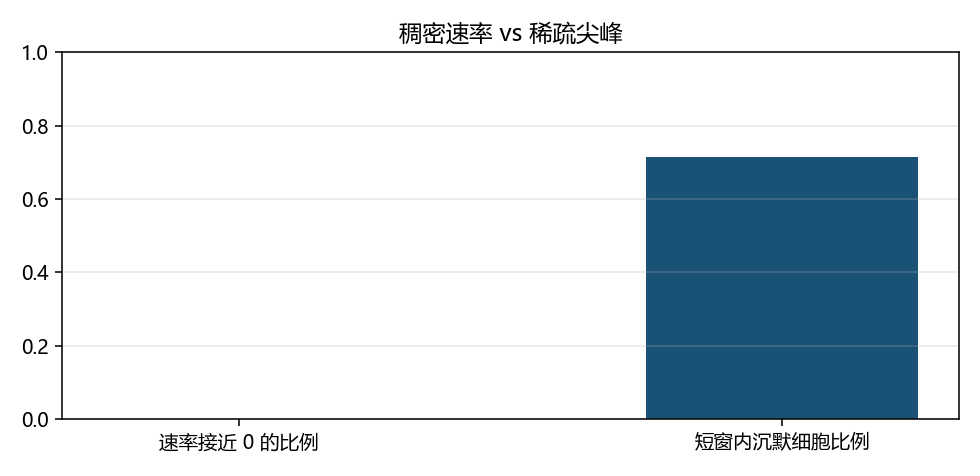

# 神经编码：速率、时间与群体

> [!WARNING]
> 🧪 Beta公测版本提示：教程主体已完成，正在优化细节，欢迎大家提Issue反馈问题或建议。

> [I–f 曲线](/neuro/hh-lif/) 告诉我们「电流变大 → 每秒更多尖峰」。编码再问一步：**刺激如何写进尖峰串，下游又如何读出来？** 这是细胞方程和突触学习之间缺的那一层。

正文先分清三种读法；需要从泊松过程或余弦调谐推到群体向量时，点开「逐步推导」。

---

## 一、同一串尖峰，三种读法

| 编码 | 下游看什么 | 擅长 |
|------|------------|------|
| **速率** | 窗口内平均 Hz | 慢变化的强度、对比度 |
| **时间 / 时序** | 精确时刻、相对顺序、延迟 | 快速分辨、STDP 的「老师」 |
| **群体** | 许多细胞的活动模式 | 方向、位置、连续变量 |

没有一种「真正的脑编码」。视觉、听觉、空间导航用的混合策略不同；模型的任务是把假说写成可抽样的随机过程。

**保姆级：编码是「写」还是「读」。** 上游细胞按某种规则把刺激变成尖峰（编码）；下游细胞只看见尖峰，必须用某种统计量把刺激估回来（解码）。同一串尖峰，你规定下游看 Hz，它就是速率码；规定看谁先响，它就是时间码。争论「脑到底用哪种」之前，先把生成模型写出来，才能被实验打假。

最常用的生成模型：给定瞬时速率 $r(t)$，尖峰是强度为 $r$ 的 **非齐次泊松过程**。小区间 $\Delta t$ 内

$$
P(\text{spike in }\Delta t) \approx r(t)\,\Delta t
\qquad (r\Delta t \ll 1).
$$

速率码把 $r(t)$ 当成刺激的充分统计量；时间码则强调具体实现（哪一毫秒响了）。实验里常用 **PSTH**（ Peri-Stimulus Time Histogram）估计 $r(t)$，用 **ISI**（峰峰间隔）看节律与不规则性——同一平均 Hz 可以来自规则时钟，也可以来自很不规则的泊松。

::: details 逐步推导：为什么小区间里 $P(\text{spike})\approx r\Delta t$，以及泊松怎样连接 I–f 与尖峰串（点击展开）

齐次泊松：在长度为 $T$ 的窗口里，尖峰个数 $N\sim\mathrm{Poisson}(\lambda)$，$\lambda=rT$ 是期望个数。于是

$$
P(N=k)=e^{-rT}\frac{(rT)^k}{k!}.
$$

取 $T=\Delta t$ 很小，且 $r\Delta t\ll 1$，则 $P(N\ge 2)$ 是 $(\Delta t)^2$ 量级，可忽略；$P(N=1)\approx r\Delta t$。这就是「每个小格独立掷一次硬币，正面概率 $r\Delta t$」的伯努利近似，也是仿真里按时间步进抽样尖峰的办法。

非齐次：把 $r$ 换成 $r(t)$，窗口期望变成 $\int r(t)\,\mathrm{d}t$。PSTH 就是对很多次试验、把尖峰扫进时间箱再平均，用来估 $r(t)$。

[HH / LIF](/neuro/hh-lif/) 的 I–f 曲线给出的是**平均** $r(I)$。编码章在它上面再叠一层随机性：同样的 $r$，每次试验的尖峰时刻不同。规则时钟（ISI 几乎相等）和泊松（ISI 指数分布、CV $\approx 1$）可以有相同的平均 Hz，STDP 和下游符合检测会觉得它们完全不一样——所以「只报平均发放率」会丢掉时间码。

demo 里群体解码用的是 $100\,\mathrm{ms}$ 窗口：期望个数 $=r\times 0.1$，再 `poisson` 抽样。$r=40\,\mathrm{Hz}$ 时期望 $4$ 个尖峰，波动是 $\sqrt{4}=2$ 量级，所以单次试验的群体向量会抖，但 $12$ 个偏好不同的细胞平均下来仍能指对方向。

:::

---

## 二、调谐曲线与群体向量

许多皮层细胞对某个刺激变量 $s$（方向、朝向、位置）有钟形或余弦**调谐曲线** $r(s)$。一群偏好不同的细胞同时发放时，可以用加权的群体向量估计 $s$——这是感觉运动变换的经典计算故事，也是「分布式表征」和 ANN 隐层的可对照点。

本章 demo：余弦调谐的泊松神经元，用群体向量解码方向；并对比「稠密速率向量」和「稀疏尖峰指示」的静默比例。

**具体数字（与 `demo.py` 一致）。** $12$ 个细胞，偏好方向均匀铺在圆周上。调谐

$$
r(\theta)=5+40\cdot\max\bigl(0,\ \cos(\theta-\theta_{\mathrm{pref}})\bigr)\quad(\mathrm{Hz}).
$$

刺激 $\theta=40^\circ$。每个细胞在 $100\,\mathrm{ms}$ 窗口内抽 $\mathrm{Poisson}(r\times 0.1)$ 个尖峰。群体向量是尖峰数加权的单位方向和，估计角用 $\operatorname{atan2}$。稀疏对比：再另抽 $200$ 个细胞的速率（Gamma 形状 $2$、尺度 $8$，再截断到非负），$20\,\mathrm{ms}$ 窗口内至少发放一次的概率为 $1-e^{-r\times0.02}$。这里只记录是否发放，不记录多次尖峰；$r\Delta t$ 仅在很小的窗口中是近似概率。

> 运行 `code/demo.py` 生成。左：若干偏好方向的调谐曲线；右：一次刺激下的群体向量估计。种子 `42`，终端打印估计误差（度）。

> 同一套底层速率：连续 $r$ 很少严格为 0；伯努利尖峰在短窗口里大部分细胞沉默。

::: details 逐步推导：余弦调谐怎样合成群体向量（点击展开）

把第 $i$ 个细胞的偏好写成平面上的单位向量 $\mathbf{e}_i=(\cos\theta_i,\sin\theta_i)$。一次试验里它发放 $n_i$ 次（demo 用泊松个数）。群体向量

$$
\mathbf{v}=\sum_{i=1}^{12} n_i\,\mathbf{e}_i,\qquad
\hat\theta=\operatorname{atan2}(v_y,v_x).
$$

若用速率 $r_i$ 代替 $n_i$（无限长窗口的极限），余弦调谐 $r_i=r_0+r_{\max}[\cos(\theta-\theta_i)]_+$ 在偏好均匀、且刺激落在「多数细胞未截断」的区域时，$\mathbf{v}$ 的方向对齐真刺激 $\theta$。截断 $[\cdot]_+$ 会让背面细胞沉默，相当于只让「对准刺激」的半圆投票，仍然指向 $\theta$。

为什么 ANN 隐层「有点像」：每个单元也对输入有调谐（ReLU 超平面的一侧），群体活动是分布式的。不像的地方：生物侧 $n_i$ 是稀疏整数、有泊松噪声、下一章 STDP 吃的是时刻而不是 $r_i$。把群体向量说成「就是注意力池化」可以当比喻，不能当证明。

demo 右图箭头：红是真 $40^\circ$，绿是一次泊松实现的估计（长度缩到 $0.8$ 以免挡住）。误差随窗口加长、细胞变多而减小，这是大数定律，不是魔法。

:::

---

## 三、和后面章节怎么接

- STDP 吃的是**时间码**里的 $\Delta t = t_{\mathrm{post}}-t_{\mathrm{pre}}$。
- E–I 网络的 raster 是看**群体**处于异步还是同步制度。
- NeuroAI 的「对齐」常常拿模型层活动去对神经群体的速率或 PSTH。

> 下一章：[Hebb 与 STDP](/neuro/stdp/)。

## 四、三条主线检查单

| 主线 | 过关表现 |
|------|----------|
| 生物 | 能区分速率、时序、群体三种读法 |
| AI | 能把群体向量和「分布式隐层」对照，而不等同 |
| 模拟 | 能从尖峰指示估计 Hz；能读懂调谐曲线图 |

## 📥 Code

| File | View | Download |
|------|------|----------|
| demo.py | [Open](./code-demo) | <a href="/notebook/code/neuro/encoding/demo.py" target="_blank" download>Download</a> |
| exercise.py | [Open](./code-exercise) | <a href="/notebook/code/neuro/encoding/exercise.py" target="_blank" download>Download</a> |

## 参考

1. Dayan & Abbott, *Theoretical Neuroscience*，第 1–3 章。
2. Georgopoulos et al. (1986). Neuronal population coding of movement direction.
3. Rieke et al. *Spikes: Exploring the Neural Code*.
