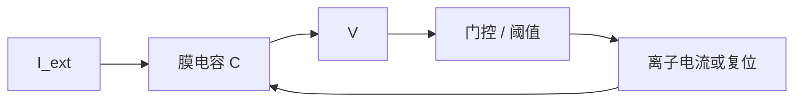
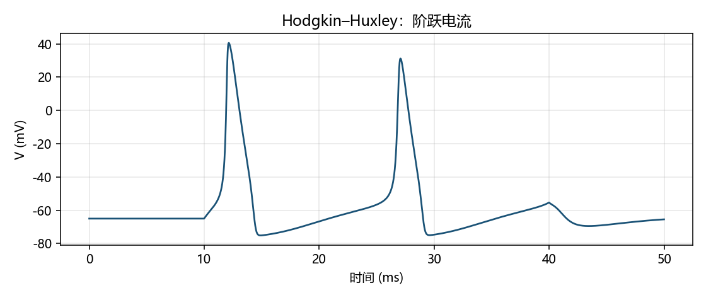
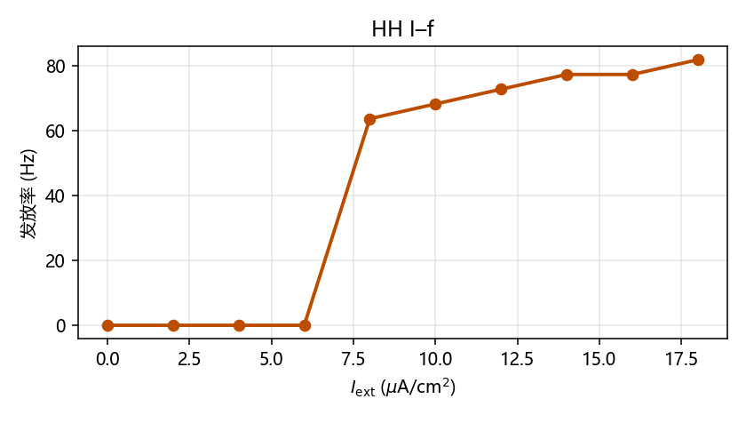
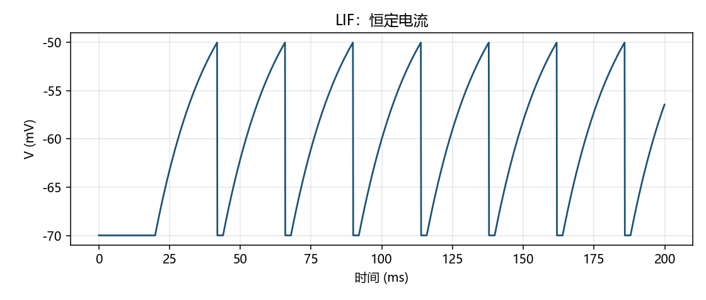
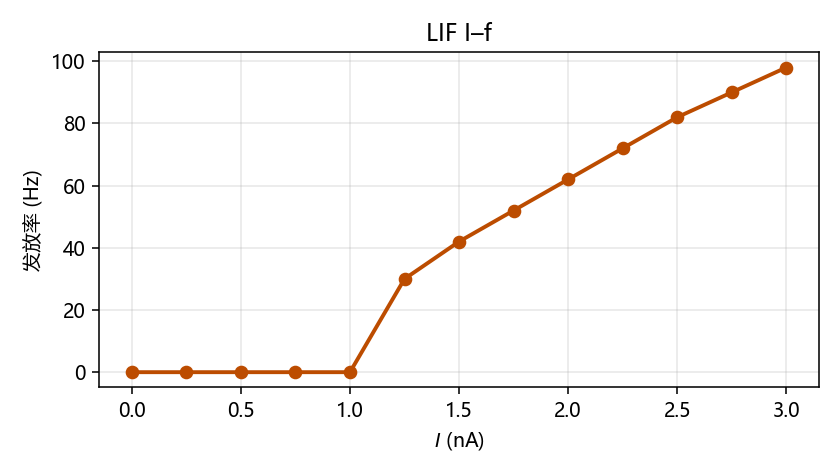

# HH 与 LIF：把神经元翻译成方程

> [!WARNING]
> 🧪 Beta公测版本提示：教程主体已完成，正在优化细节，欢迎大家提Issue反馈问题或建议。

> [上一章](/neuro/neuron/) 说「膜像电容、通道像可变电阻」。这一章把这句话写成可积分的动力学，并弄清两把螺丝刀怎么选。

---

## 一、两把螺丝刀

| 模型 | 保留什么 | 典型用途 |
|------|----------|----------|
| **Hodgkin–Huxley (HH, 1952)** | 动作电位形状、钠/钾离子机制 | 通道药物、尖峰波形、教学「机制」 |
| **Leaky Integrate-and-Fire (LIF)** | 积分到阈值就开火 | 网络发放率、同步、学习规则在回路中的作用 |

问「尖峰长什么样、哪种通道被挡住」→ HH / 多室模型。  
问「一万个细胞连起来会不会齐射」→ 先 LIF，必要时再升级。

---

## 二、动作电位的相位

一条典型尖峰可以拆成：静息 → 去极化上升（钠正反馈）→ 超射峰值 → 复极化（钾赶上、钠失活）→ 后超极化（贡献不应期）。

HH 的贡献，是把「钠/钾通道如何随电压开关」写成门控变量 $m,n,h \in [0,1]$。

---

## 三、HH：等效电路

把膜看成电容并联三条电池–电导支路：

$$
C_m \dot V
=
I_{\mathrm{ext}}
-
\bar g_{\mathrm{Na}} m^3 h (V-E_{\mathrm{Na}})
-
\bar g_{\mathrm{K}} n^4 (V-E_{\mathrm{K}})
-
g_L (V-E_L)
$$

每个门控服从一阶方程 $\dot x = \alpha_x(V)(1-x)-\beta_x(V)x$。不必一次背完所有 $\alpha,\beta$。先记住反馈环：

> 电压变 → 门控变 → 电导变 → 电流变 → 电压再变。尖峰是环路被推过阈值后的一次爆发。

本仓库用枪乌贼轴突经典参数、前向欧拉积分（$\Delta t = 0.01\,\mathrm{ms}$）。

> $t=10$–$40\,\mathrm{ms}$ 注入 $10\,\mu\mathrm{A/cm}^2$，应看到清晰超射。

> **I–f（电流–发放率）**连接单细胞机制和下一章的速率编码。

---

## 四、LIF：把尖峰形状折叠成阈值事件

电流型 LIF：

$$
\tau_m \dot V = -(V - V_{\mathrm{rest}}) + R I
$$

规则：$V$ 到 $V_{\mathrm{th}}$ → 记一次尖峰并复位到 $V_{\mathrm{reset}}$；可选绝对不应期 $t_{\mathrm{ref}}$。忽略不应期时，流变阈值

$$
I_{\mathrm{rheobase}} = \frac{V_{\mathrm{th}}-V_{\mathrm{rest}}}{R}.
$$

低于它永远到不了阈值；高于它周期放电。

和 ANN 的类比要小心：积分像累加状态，阈值像硬非线性，但 ANN 通常没有真实时间上的不应期、脉冲与突触延迟。类比只能入门，不能证明「RNN = 脑」。

---

## 五、编码预习

同一串尖峰至少有两种读法：**速率编码**（窗口内平均 Hz，I–f 直接服务它）和**时间编码**（精确时刻，STDP 吃这一套）。下一章把编码展开成独立主题。

> 下一章：[神经编码](/neuro/encoding/)。

## 六、三条主线检查单

| 主线 | 你现在应能做到 |
|------|----------------|
| 生物 | 指着动作电位说出钠 / 钾各自的角色 |
| AI | 说明 LIF 与 ANN 单元的相似与危险类比 |
| 模拟 | 改 `I_ext` / `tau_m`，解释轨迹和 I–f 的变化 |

## 📥 Code

| File | View | Download |
|------|------|----------|
| demo.py | [Open](./code-demo) | <a href="/notebook/code/neuro/hh-lif/demo.py" target="_blank" download>Download</a> |
| exercise.py | [Open](./code-exercise) | <a href="/notebook/code/neuro/hh-lif/exercise.py" target="_blank" download>Download</a> |

## 参考

1. Hodgkin, A. L., & Huxley, A. F. (1952). A quantitative description of membrane current. *J Physiol*.
2. Dayan & Abbott, *Theoretical Neuroscience*，第 5 章。
3. Gerstner et al., *Neuronal Dynamics*，点神经元章节。
