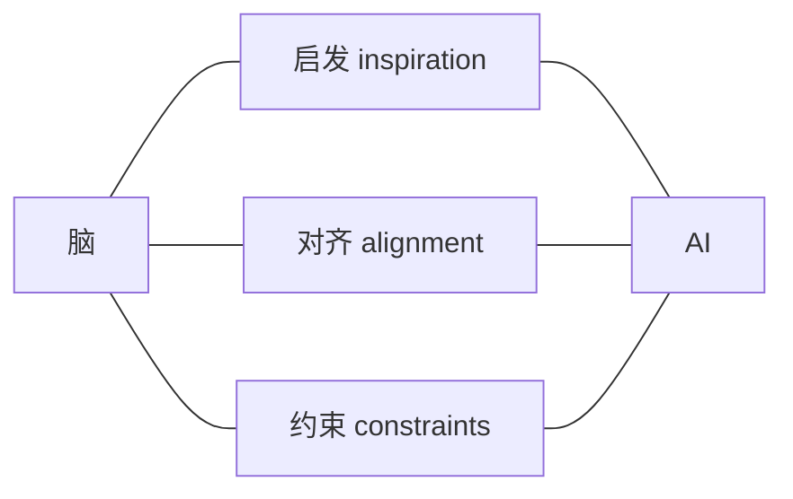
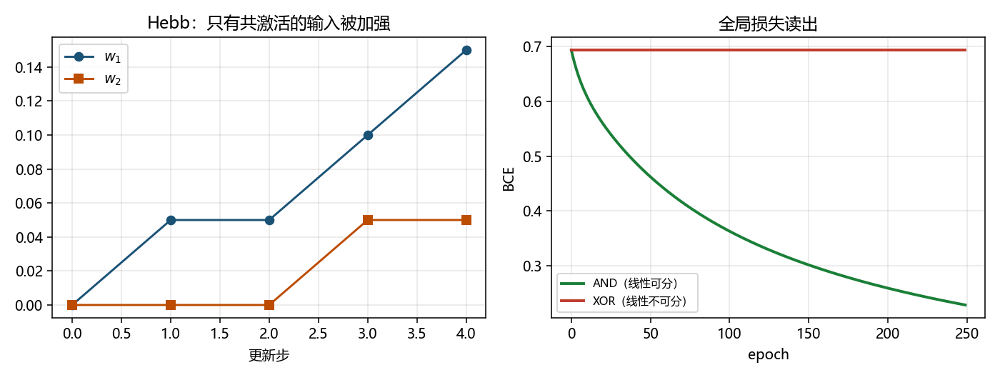

# NeuroAI：脑启发、对齐，还是互相约束？

> [!WARNING]
> 🧪 Beta公测版本提示：教程主体已完成，正在优化细节，欢迎大家提Issue反馈问题或建议。

> 前面六章给出了细胞、编码、学习、回路与结构。这一章把「AI × 脑」拆成**可检验的三类问题**，避免把「结构有点像」说成「已经理解认知」。

---

## 一、先分清三种研究姿态

| 姿态 | 问法 | 成功长什么样 |
|------|------|----------------|
| **启发** | 生物机制能否启发新算法？ | 新模型在任务上更好 / 更省 / 更稳健 |
| **对齐** | 模型内部表征是否像脑区？ | 可量化相似（RSA、编码模型） |
| **约束** | 加上生物可行约束会怎样？ | 性能–能耗–局部性的权衡曲线 |

每次表态都落到三者之一。[世界模型](/world-models/intro/) 里「脑的内部模拟」叙事，也要用这把尺子量：那是启发、对齐，还是只是比喻？

---

## 二、编码对照：稠密速率 vs 稀疏尖峰

生物侧常见稀疏事件；ANN 侧常见稠密激活向量。稀疏不只是好看，它改变通信、学习与能量账本。本章 demo 复用 [编码](/neuro/encoding/) 的对比，并加上一个最小信用分配实验。

---

## 三、信用分配：局部规则 vs 全局反传

| | 局部（Hebb / STDP / 三因素） | 全局（反传） |
|--|------------------------------|--------------|
| 需要什么信息 | 前/后突触（+ 调质） | 全局损失与计算图 |
| 生物可行性争论 | 更「像」局部电路 | 脑如何实现仍开放 |
| 工程实力 | 任务覆盖仍有限 | 当今深度学习主力 |

小实验：

- `hebbian_update`：$\Delta w \propto \mathrm{post}\cdot\mathrm{pre}$，无全局损失
- 线性读出 + BCE：可分的 AND 会降损失；**XOR 对线性读出不够**——提醒你「脑的非线性回路」不能用一个感知机打发

> 运行 `code/demo.py`。左：Hebb 只在 pre/post 同时高时加强；右：AND 可分、XOR 线性读出失败。

---

## 四、脑区–模型对照表（假说生成器，不是结论）

| 生物主题 | 常被对照的模型族 | 有用问法 |
|----------|------------------|----------|
| 腹侧视觉流 | CNN / 层级特征 | 表征是否分层对齐？ |
| 基底节–多巴胺 | RL / actor-critic | 奖励预测误差是否同构？ |
| 工作记忆回路 | 吸引子 / RNN | 维持与干扰如何权衡？ |
| 脉冲与能耗 | SNN | 精度–能耗 Pareto 如何？ |

最小项目（任选其一做到可复现）：对齐向 RSA；约束向 ANN vs 稀疏尖峰；机制向把 STDP 接到预测任务并写清失败模式。交付只要：固定种子的脚本 + 半页笔记写清属于启发 / 对齐 / 约束哪一类、结论边界在哪。

本教程从膜电位走到这里，三条主线应收束为：**能把现象写成可检验假说、能指出和 ANN 的关键差异、每个主张都有可跑的图。**

雷达（不考核）：NeurIPS / ICLR 的 Brain & AI、CCN 教程；*Nature Machine Intelligence* 相关综述。量子机器学习 × SNN 只作雷达，不进主线。

## 📥 Code

| File | View | Download |
|------|------|----------|
| demo.py | [Open](./code-demo) | <a href="/notebook/code/neuro/neuroai/demo.py" target="_blank" download>Download</a> |
| exercise.py | [Open](./code-exercise) | <a href="/notebook/code/neuro/neuroai/exercise.py" target="_blank" download>Download</a> |

## 参考

1. Richards et al. (2019). A deep learning framework for neuroscience.
2. Saxe, McClelland, Ganguli 等表征对齐 / RSA 文献。
3. 本领域前面各章；Russell & Norvig, *AIMA* 中 NN/RL 章节作雷达。
