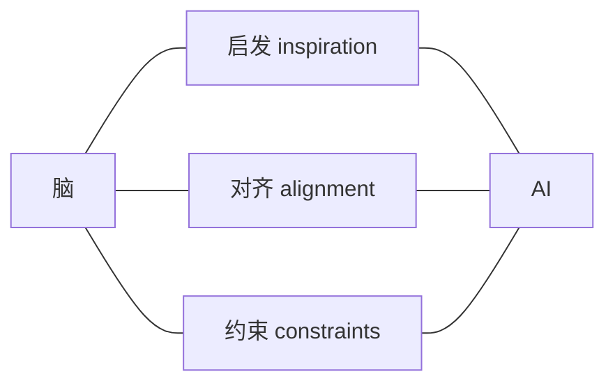
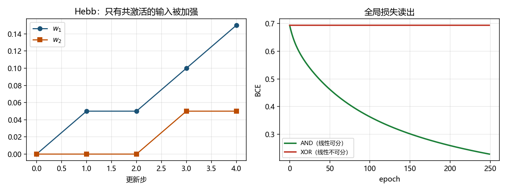

# NeuroAI：脑启发、对齐，还是互相约束？

> [!WARNING]
> 🧪 Beta公测版本提示：教程主体已完成，正在优化细节，欢迎大家提Issue反馈问题或建议。

> 前面六章给出了细胞、编码、学习、回路与结构。这一章把「AI × 脑」拆成**可检验的三类问题**，避免把「结构有点像」说成「已经理解认知」。

正文先立尺子，再跑一个最小信用分配实验；需要从 Hebb 更新或 XOR 的线性不可分推一遍时，点开「逐步推导」。

---

## 一、先分清三种研究姿态

```mermaid
flowchart LR
    B["脑"] --- I["启发 inspiration"]
    I --- A["AI"]
    B --- L["对齐 alignment"]
    L --- A
    B --- C["约束 constraints"]
    C --- A
```

| 姿态 | 问法 | 成功长什么样 |
|------|------|----------------|
| **启发** | 生物机制能否启发新算法？ | 新模型在任务上更好 / 更省 / 更稳健 |
| **对齐** | 模型内部表征是否像脑区？ | 可量化相似（RSA、编码模型） |
| **约束** | 加上生物可行约束会怎样？ | 性能–能耗–局部性的权衡曲线 |

每次表态都落到三者之一。[世界模型](/world-models/intro/) 里「脑的内部模拟」叙事，也要用这把尺子量：那是启发、对齐，还是只是比喻？

**保姆级：三种姿态不能混着报功。** 「我们的网络有残差连接，皮层也有跳跃通路」——这最多是启发的动机，不是对齐的证据（对齐要 RSA / 编码模型的数）。「SNN 更生物」——这是约束（脉冲、局部），不自动保证 ImageNet 更高。把论文摘要里的词对号入座，能少读很多空话。

---

## 二、编码对照：稠密速率 vs 稀疏尖峰

生物侧常见稀疏事件；ANN 侧常见稠密激活向量。稀疏不只是好看，它改变通信、学习与能量账本。本章 demo 复用 [编码](/neuro/encoding/) 的对比，并加上一个最小信用分配实验。

---

## 三、信用分配：局部规则 vs 全局反传

| | 局部（Hebb / STDP / 三因素） | 全局（反传） |
|--|------------------------------|--------------|
| 需要什么信息 | 前/后突触（+ 调质） | 全局损失与计算图 |
| 生物可行性争论 | 更「像」局部电路 | 脑如何实现仍开放 |
| 工程实力 | 任务覆盖仍有限 | 当今深度学习主力 |

小实验（种子 `0`）：

- `hebbian_update`：$\Delta w \propto \mathrm{post}\cdot\mathrm{pre}$，学习率 $0.05$，无全局损失。四步输入：`([1,0], post=1)`、`([0,1], post=0)`、`([1,1], post=1)`、`([1,0], post=1)`。只有与 post 共激活的分量被加强，$w_1$ 应明显大于 $w_2$。
- 线性读出 + BCE：四种二进制输入，AND 标签 `[0,0,0,1]`，XOR 标签 `[0,1,1,0]`。sigmoid 线性层，学习率 $0.2$，$250$ 个 epoch。可分的 AND 会降损失；**XOR 对线性读出不够**——提醒你「脑的非线性回路」不能用一个感知机打发。

> 运行 `code/demo.py`。左：Hebb 只在 pre/post 同时高时加强；右：AND 可分、XOR 线性读出失败。终端打印 AND / XOR 终损。

::: details 逐步推导：Hebb $\Delta w\propto\mathrm{post}\cdot\mathrm{pre}$ 在四步里怎样走，以及为什么没有全局损失（点击展开）

向量 $w=(w_1,w_2)$，初值 $0$。更新 $w\leftarrow w+\eta\cdot\mathrm{post}\cdot\mathrm{pre}$，$\eta=0.05$。

1. $\mathrm{pre}=(1,0)$，$\mathrm{post}=1$ → $\Delta w=(0.05,0)$，$w=(0.05,0)$。
2. $\mathrm{pre}=(0,1)$，$\mathrm{post}=0$ → $\Delta w=0$（post 静默，什么都不加），$w$ 不变。
3. $\mathrm{pre}=(1,1)$，$\mathrm{post}=1$ → $\Delta w=(0.05,0.05)$，$w=(0.10,0.05)$。
4. $\mathrm{pre}=(1,0)$，$\mathrm{post}=1$ → $w=(0.15,0.05)$。

左图两条轨迹应对应这里的 $w_1$ 台阶上涨、$w_2$ 只在第 3 步动一下。规则**不看**标签是不是「任务正确」：只要前后一起响就加强。它能长出相关滤波器，但不能保证 AND / XOR 的分类损失下降——那是另一套目标。

STDP 是 Hebb 的时间精细版：把标量 $\mathrm{post}\cdot\mathrm{pre}$ 换成因果窗上的 $\Delta t$。三因素规则再乘一个调质（多巴胺），好让「相关」只在奖励预测误差出现时生效。局部电路容易实现这三种；全局反传需要把损失对每一层的导数送回来，生物上有没有等价物仍是开放问题——这正是「约束」姿态要画的权衡，不是已经结案的生理学。

:::

::: details 逐步推导：线性读出 + BCE 为什么 AND 能降、XOR 降不动（点击展开）

模型 $p=\sigma(w^\top x+b)$，二元交叉熵

$$
\mathcal{L}=-\mathbb{E}\bigl[y\log p+(1-y)\log(1-p)\bigr].
$$

对 $w$ 的梯度是 $\mathbb{E}[x(p-y)]$（demo 用全数据均值，lr $=0.2$）。AND 的正类只有 $(1,1)$，负类是其余三点：存在一条直线把 $(1,1)$ 和原点附近的三点分开（例如 $x_1+x_2=1.5$）。梯度会把 $w$ 推向第一象限，$b$ 推向负值，$\mathcal{L}$ 能掉下去。

XOR：$(0,1)$ 与 $(1,0)$ 是正类，$(0,0)$ 与 $(1,1)$ 是负类。任何直线切开平面，都无法让这两对分别落在两侧——这是感知机时代的经典反例。线性读出的假设类不够，BCE 再训 250 epoch 也只在高损失附近晃。终端里 AND 终损应明显小于 XOR 终损。

教训不是「脑不会做 XOR」。皮层有多层非线性、有抑制性中间神经元、有树突局部非线性。教训是：把「神经元」写成一个加权求和加 sigmoid，你已经把回路的计算能力砍掉了。NeuroAI 的约束实验应当问：加上脉冲、局部学习、能量预算之后，还剩多少任务覆盖——而不是默认一层感知机代表脑。

:::

---

## 四、脑区–模型对照表（假说生成器，不是结论）

| 生物主题 | 常被对照的模型族 | 有用问法 |
|----------|------------------|----------|
| 腹侧视觉流 | CNN / 层级特征 | 表征是否分层对齐？ |
| 基底节–多巴胺 | RL / actor-critic | 奖励预测误差是否同构？ |
| 工作记忆回路 | 吸引子 / RNN | 维持与干扰如何权衡？ |
| 脉冲与能耗 | SNN | 精度–能耗 Pareto 如何？ |

最小项目（任选其一做到可复现）：对齐向 RSA；约束向 ANN vs 稀疏尖峰；机制向把 STDP 接到预测任务并写清失败模式。交付只要：固定种子的脚本 + 半页笔记写清属于启发 / 对齐 / 约束哪一类、结论边界在哪。

本教程从膜电位走到这里，三条主线应收束为：**能把现象写成可检验假说、能指出和 ANN 的关键差异、每个主张都有可跑的图。**

雷达（不考核）：NeurIPS / ICLR 的 Brain & AI、CCN 教程；*Nature Machine Intelligence* 相关综述。量子机器学习 × SNN 只作雷达，不进主线。

## 📥 Code

| File | View | Download |
|------|------|----------|
| demo.py | [Open](./code-demo) | <a href="/notebook/code/neuro/neuroai/demo.py" target="_blank" download>Download</a> |
| exercise.py | [Open](./code-exercise) | <a href="/notebook/code/neuro/neuroai/exercise.py" target="_blank" download>Download</a> |

## 参考

1. Richards et al. (2019). A deep learning framework for neuroscience.
2. Saxe, McClelland, Ganguli 等表征对齐 / RSA 文献。
3. 本领域前面各章；Russell & Norvig, *AIMA* 中 NN/RL 章节作雷达。
