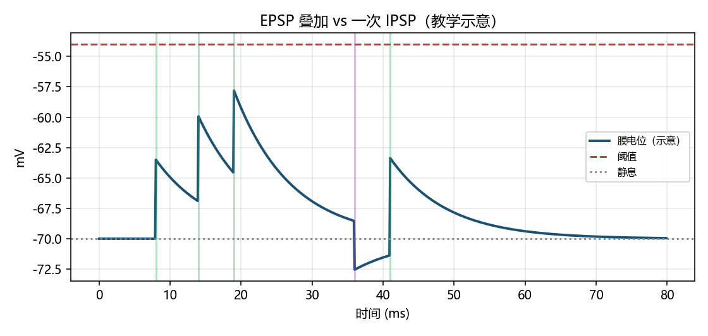

# 神经元与突触：共同语言

> [!WARNING]
> 🧪 Beta公测版本提示：教程主体已完成，正在优化细节，欢迎大家提Issue反馈问题或建议。

> 计算神经科学的第一关不是记住海马有几层，而是建立一套**共同语言**：信息以什么形式存在、细胞之间如何交接、这和 ANN 的「激活值」哪里像、哪里完全不像。

---

## 一、把神经元看成单向装配线

上游输入在**树突**汇入，**胞体**做整合，**轴丘**判读是否过阈值，**轴突**把全或无的动作电位送到远方，**突触**是接口。

后面所有模型（LIF、HH、STDP、全脑模拟）都只是在给这张图的某一步「装方程」。

本章 demo 画一张示意：局部电压起伏如何叠成一次发放。

> 运行 `code/demo.py` 生成。多条 EPSP 在阈值下叠加；够了就记一次「尖峰事件」（教学示意，不是 HH）。

---

## 二、膜电位：细胞里为什么有电压

细胞膜隔开内外液体。离子浓度不同 → 电位差，安静时大约 −70 mV，叫**静息电位**。

三个直觉就够用：

| 直觉 | 含义 |
|------|------|
| 电池 | 浓度差是化学势能，电荷分离是电势能 |
| 电容 | 膜很薄，能存电荷；充放电需要时间 |
| 电阻 / 电导 | 离子通道打开 = 这条路电阻变小 |

**钠钾泵**耗能维持浓度差，所以静息是动态平衡，不是死寂。下一章 HH 的 $C_m \dot V = \ldots$ 就是在写这张电容图。

---

## 三、动作电位：全或无的数字脉冲

膜电位被推到阈值附近 → 电压门控钠通道雪崩打开 → 去极化尖峰 → 钾通道帮助复极化。关键性质（先记现象，方程下一章再写）：

- **全或无**：要么一个标准尖峰，要么几乎没有
- **不应期**：刚放完电短期内很难再放
- **主动再生**：沿轴突一边走一边自我放大，所以能传很远

生物系统偏爱「事件」而不是「连续电平」：尖峰稀疏、长距离可靠，也便于把学习定义在**时刻**上（STDP）。

---

## 四、突触：化学路口 vs 电线路口

| | 化学突触 | 电突触 |
|--|----------|--------|
| 介质 | 神经递质 | 离子经缝隙连接 |
| 速度 | 有突触延迟 | 很快 |
| 方向 | 常单向 | 常可双向 |
| 可塑性 | 极丰富（学习主战场） | 也可调，故事不同 |
| 计算角色 | 可编程的加权接口 | 快速同步 / 偶联 |

兴奋性输入把膜电位往阈值推（**EPSP**）；抑制性输入往回拉（**IPSP**）。Hebb / STDP 改的就是化学突触的「权重」。

---

## 五、和 AI 对照：别把激活值当成尖峰

| 维度 | 生物神经元 | 典型 ANN 单元 |
|------|------------|----------------|
| 信号形态 | 稀疏时间事件（尖峰） | 稠密连续激活 |
| 通信 | 事件驱动 | 每层整矩阵乘法 |
| 学习 | 常局部、在线、带调制 | 常全局损失 + 反传 |
| 能量 | 尖峰代价高，必须稀疏 | 训练算力代价在别处 |

NeuroAI 有意思的地方，不是硬说「Transformer = 皮层」，而是问：哪些生物约束（稀疏、局部、在线、能量）值得变成算法归纳偏置？

---

## 六、术语速查

| 中文 | English | 一句话 |
|------|---------|--------|
| 膜电位 | membrane potential | 膜内外电位差（mV） |
| 静息电位 | resting potential | 安静时的平衡附近电压 |
| 轴丘 | axon hillock | 常被视为发放起始区 |
| 流变阈值 | rheobase | 恒流下刚能发放的最小电流 |

> 下一章：[HH 与 LIF](/neuro/hh-lif/)：把电容和通道写成可积分的 ODE。

## 七、三条主线检查单

| 主线 | 过关表现 |
|------|----------|
| 生物 | 能自己画出树突→轴丘→突触的信号流 |
| AI | 能对照尖峰事件与 ANN 激活值，不把二者等同 |
| 模拟 | 能解释 EPSP 叠加如何越过阈值（本章 demo） |

## 📥 Code

| File | View | Download |
|------|------|----------|
| demo.py | [Open](./code-demo) | <a href="/notebook/code/neuro/neuron/demo.py" target="_blank" download>Download</a> |
| exercise.py | [Open](./code-exercise) | <a href="/notebook/code/neuro/neuron/exercise.py" target="_blank" download>Download</a> |

## 参考

1. Kandel et al. *Principles of Neural Science*，第 1–8、16 章（术语词典）。
2. Dayan & Abbott, *Theoretical Neuroscience*，第 1 章。
