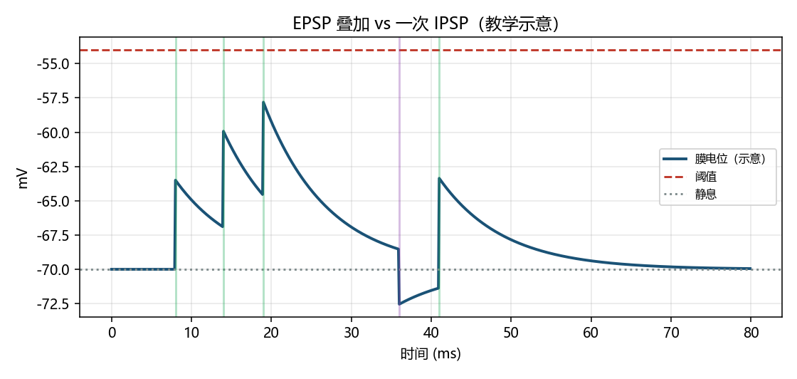

# 神经元与突触：共同语言

> [!WARNING]
> 🧪 Beta公测版本提示：教程主体已完成，正在优化细节，欢迎大家提Issue反馈问题或建议。

> 计算神经科学的第一关不是记住海马有几层，而是建立一套**共同语言**：信息以什么形式存在、细胞之间如何交接、这和 ANN 的「激活值」哪里像、哪里完全不像。

正文把细胞当成一条单向装配线；需要把「分级电位怎样加减」或「静息电压从哪来」讲清楚时，点开「逐步推导」。

---

## 一、把神经元看成单向装配线

上游输入在**树突**汇入，**胞体**做整合，**轴丘**判读是否过阈值，**轴突**把全或无的动作电位送到远方，**突触**是接口。

```mermaid
flowchart LR
    D["树突<br/>分级电位 / EPSP·IPSP"] --> S["胞体整合"]
    S --> H["轴丘阈值"]
    H -->|开火| A["轴突<br/>动作电位"]
    A --> Y["突触交接"]
    Y --> N["下一细胞"]
```

后面所有模型（LIF、HH、STDP、全脑模拟）都只是在给这张图的某一步「装方程」。

**保姆级：为什么说「单向」。** 化学突触上，囊泡在突触前释放、受体在突触后接收，信息默认从前到后。树突上的局部电位（EPSP / IPSP）是**分级**的：幅度随输入变，可以叠加、可以抵消。轴丘一旦判「够了」，发出的动作电位却是**全或无**：标准尖峰，不按输入大小再加高一截。于是细胞内部同时有「模拟加法器」和「数字脉冲发送器」——这是后面速率码与时间码能共存的硬件原因。

本章 demo 画一张示意：局部电压起伏如何叠成一次发放。静息 $V_{\mathrm{rest}}=-70\,\mathrm{mV}$，示意阈值 $V_{\mathrm{th}}=-54\,\mathrm{mV}$，突触后电位用时间常数 $\tau=8\,\mathrm{ms}$ 的指数衰减。五次到达时刻（ms）与幅度（mV）为

$$
(8,\ 6.5),\ (14,\ 7.0),\ (19,\ 6.8),\ (36,\ -4.0),\ (41,\ 8.0).
$$

前三次是 EPSP（绿竖线），第四次是 IPSP（紫竖线），第五次再兴奋。时间步 $\Delta t=0.1\,\mathrm{ms}$，种子 `42`。

> 运行 `code/demo.py` 生成。多条 EPSP 在阈值下叠加；够了就记一次「尖峰事件」（教学示意，不是 HH）。本默认参数下峰值约 $-58\,\mathrm{mV}$，贴近但未必越过 $-54\,\mathrm{mV}$——终端 `是否越过阈值` 以运行为准。

::: details 逐步推导：EPSP 指数叠加怎样改写膜电位（点击展开）

把每一次突触事件写成「到达之后按膜时间常数漏掉」的分级电位。到达时刻 $t_0$、幅度 $A$：

$$
\mathrm{PSP}(t;t_0,A)=
\begin{cases}
A\,e^{-(t-t_0)/\tau}, & t\ge t_0,\\
0, & t<t_0.
\end{cases}
$$

$\tau=8\,\mathrm{ms}$ 的意思是：大约 $8\,\mathrm{ms}$ 后幅度剩 $1/e\approx 37\%$。胞体电压在本示意里是线性叠加（忽略真正的主动通道）：

$$
V(t)=V_{\mathrm{rest}}+\sum_k \mathrm{PSP}(t;t_k,A_k).
$$

前三次兴奋隔 $6\,\mathrm{ms}$、$5\,\mathrm{ms}$ 到来，短于 $\tau$，所以前一次还没漏完后一次又加上去——这就是「时间上的积分」。第四次 $A=-4\,\mathrm{mV}$ 是抑制：同一套加法，符号相反，把膜往阈值反方向拉。第五次再推一把。

阈值判据 $V\ge V_{\mathrm{th}}$ 只是轴丘的卡通版。真细胞还有钠通道正反馈（下一章 HH）和不应期；这里故意不用 HH，好让你先看见**分级电位可加可减**。若把三次 EPSP 再加大、或把 $\tau$ 加长（漏得更慢），`spiked` 会变成 `True`——exercise 就是让你改这些数。

线性叠加在小信号时够用；EPSP 很大时，驱动电压 $(V-E_{\mathrm{syn}})$ 自己在变，真实 PSP 会饱和。那是下一章电导型突触的故事。本章只要建立：树突侧是模拟、轴突侧是事件。

:::

---

## 二、膜电位：细胞里为什么有电压

细胞膜隔开内外液体。离子浓度不同 → 电位差，安静时大约 −70 mV，叫**静息电位**。

三个直觉就够用：

| 直觉 | 含义 |
|------|------|
| 电池 | 浓度差是化学势能，电荷分离是电势能 |
| 电容 | 膜很薄，能存电荷；充放电需要时间 |
| 电阻 / 电导 | 离子通道打开 = 这条路电阻变小 |

**钠钾泵**耗能维持浓度差，所以静息是动态平衡，不是死寂。下一章 HH 的 $C_m \dot V = \ldots$ 就是在写这张电容图。

::: details 逐步推导：Nernst 电位与「电容 + 漏电」为什么会停在静息附近（点击展开）

一种离子如果膜只对它通，平衡时电扩散与浓度扩散抵消，电压停在 Nernst 电位

$$
E_{\mathrm{ion}}=\frac{RT}{zF}\ln\frac{[\mathrm{ion}]_{\mathrm{out}}}{[\mathrm{ion}]_{\mathrm{in}}}.
$$

室温下对一价离子，常写成 $E\approx 58\,\mathrm{mV}\cdot\log_{10}(c_{\mathrm{out}}/c_{\mathrm{in}})$。钾内高外低，$E_{\mathrm{K}}$ 大约 $-90\,\mathrm{mV}$ 量级；钠相反，$E_{\mathrm{Na}}$ 大约 $+60\,\mathrm{mV}$。静息时钾电导最大，所以 $V_{\mathrm{rest}}$ 靠近 $E_{\mathrm{K}}$ 但被少量钠漏往上拽，落在 $-70\,\mathrm{mV}$ 附近——这是加权平均（Goldman），不是「只有钾」。

膜是电容：要改变 $V$，必须有净电流给它充电，$C\dot V=I_{\mathrm{net}}$。通道是电阻：打开得越多，离子越容易按 $(V-E_{\mathrm{ion}})$ 流动。静息就是 $I_{\mathrm{net}}\approx 0$ 的工作点。demo 里的指数 $\tau$ 正是 $RC$：电容越大、漏电越弱，PSP 拖得越长，越容易被下一次输入赶上。

钠钾泵不直接「制造 −70 mV」，它维持浓度差，让 Nernst 电池一直有电。关掉泵，浓度慢慢混匀，静息才会塌。

:::

---

## 三、动作电位：全或无的数字脉冲

膜电位被推到阈值附近 → 电压门控钠通道雪崩打开 → 去极化尖峰 → 钾通道帮助复极化。关键性质（先记现象，方程下一章再写）：

- **全或无**：要么一个标准尖峰，要么几乎没有
- **不应期**：刚放完电短期内很难再放
- **主动再生**：沿轴突一边走一边自我放大，所以能传很远

生物系统偏爱「事件」而不是「连续电平」：尖峰稀疏、长距离可靠，也便于把学习定义在**时刻**上（STDP）。

---

## 四、突触：化学路口 vs 电线路口

| | 化学突触 | 电突触 |
|--|----------|--------|
| 介质 | 神经递质 | 离子经缝隙连接 |
| 速度 | 有突触延迟 | 很快 |
| 方向 | 常单向 | 常可双向 |
| 可塑性 | 极丰富（学习主战场） | 也可调，故事不同 |
| 计算角色 | 可编程的加权接口 | 快速同步 / 偶联 |

兴奋性输入把膜电位往阈值推（**EPSP**）；抑制性输入往回拉（**IPSP**）。Hebb / STDP 改的就是化学突触的「权重」。

**保姆级：延迟为什么重要。** 化学突触从钙内流到囊泡释放再到受体，常常有 $1\,\mathrm{ms}$ 量级的延迟。STDP 看的是「谁先谁后」，延迟会把因果窗平移。电突触几乎没有这层延迟，适合把一群细胞锁成同步振荡，而不是慢慢改权重。本课 demo 把延迟收成到达时刻 $t_0$，没有显式囊泡动力学——够用。

---

## 五、和 AI 对照：别把激活值当成尖峰

| 维度 | 生物神经元 | 典型 ANN 单元 |
|------|------------|----------------|
| 信号形态 | 稀疏时间事件（尖峰） | 稠密连续激活 |
| 通信 | 事件驱动 | 每层整矩阵乘法 |
| 学习 | 常局部、在线、带调制 | 常全局损失 + 反传 |
| 能量 | 尖峰代价高，必须稀疏 | 训练算力代价在别处 |

NeuroAI 有意思的地方，不是硬说「Transformer = 皮层」，而是问：哪些生物约束（稀疏、局部、在线、能量）值得变成算法归纳偏置？

---

## 六、术语速查

| 中文 | English | 一句话 |
|------|---------|--------|
| 膜电位 | membrane potential | 膜内外电位差（mV） |
| 静息电位 | resting potential | 安静时的平衡附近电压 |
| 轴丘 | axon hillock | 常被视为发放起始区 |
| 流变阈值 | rheobase | 恒流下刚能发放的最小电流 |
| EPSP / IPSP | 兴奋 / 抑制性突触后电位 | 把 $V$ 推向 / 拉离阈值的分级电位 |

> 下一章：[HH 与 LIF](/neuro/hh-lif/)：把电容和通道写成可积分的 ODE。

## 七、三条主线检查单

| 主线 | 过关表现 |
|------|----------|
| 生物 | 能自己画出树突→轴丘→突触的信号流 |
| AI | 能对照尖峰事件与 ANN 激活值，不把二者等同 |
| 模拟 | 能解释 EPSP 叠加如何越过阈值（本章 demo） |

## 📥 Code

| File | View | Download |
|------|------|----------|
| demo.py | [Open](./code-demo) | <a href="/notebook/code/neuro/neuron/demo.py" target="_blank" download>Download</a> |
| exercise.py | [Open](./code-exercise) | <a href="/notebook/code/neuro/neuron/exercise.py" target="_blank" download>Download</a> |

## 参考

1. Kandel et al. *Principles of Neural Science*，第 1–8、16 章（术语词典）。
2. Dayan & Abbott, *Theoretical Neuroscience*，第 1 章。
