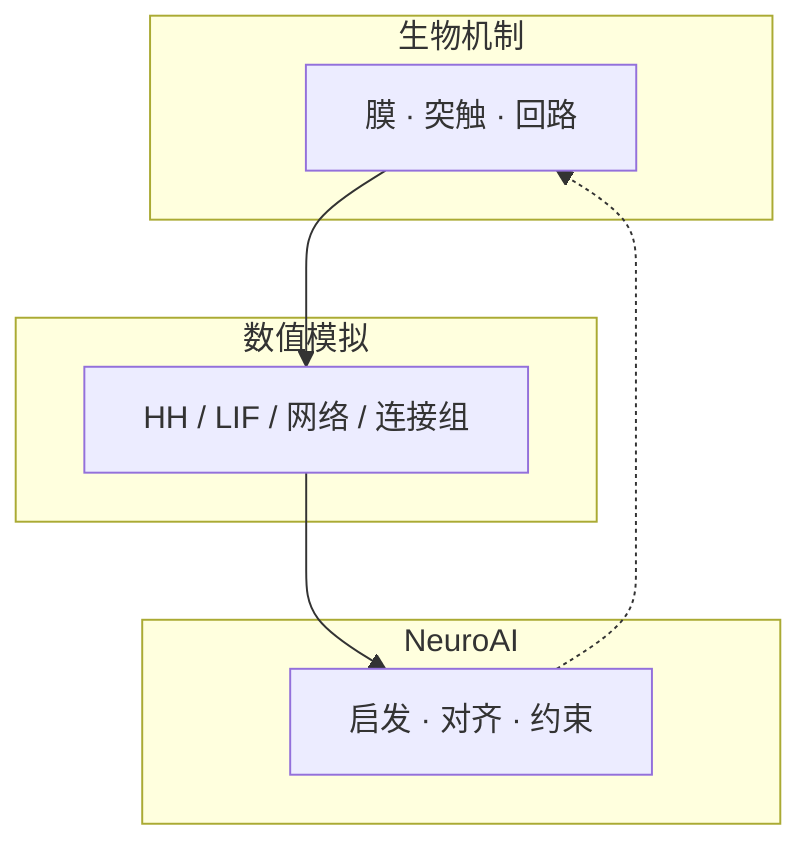
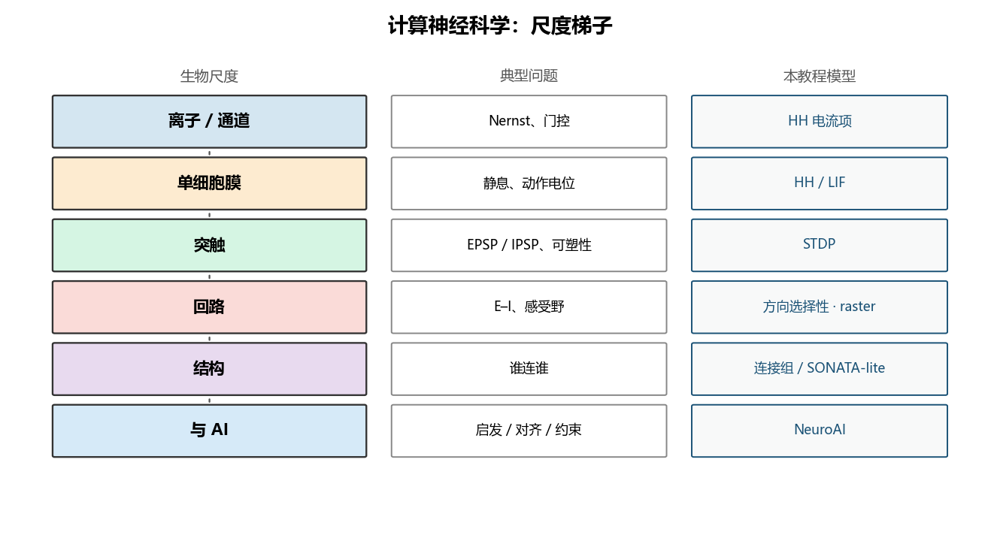

# 导论：从膜电位到 NeuroAI

> [!WARNING]
> 🧪 Beta公测版本提示：教程主体已完成，正在优化细节，欢迎大家提Issue反馈问题或建议。

> **计算神经科学**不是「用电脑背解剖名词」，而是把神经系统写成**可积分、可证伪、可和人工智能对照**的模型。本领域迁自一套五阶段教程（生物机制 · 数值模拟 · NeuroAI），并补上神经编码、回路制度等中间层，形成一条能读完、能跑通的主线。

---

## 一、它回答什么问题

神经系统同时是三样东西：物理系统（离子与膜）、计算系统（编码与学习）、生物系统（演化出来的约束）。计算神经科学站在交界处，典型问题长这样：

| 尺度 | 典型问题 | 常用模型 |
|------|----------|----------|
| 膜 / 通道 | 动作电位如何形成？ | Hodgkin–Huxley |
| 单细胞 | 电流如何变成发放率？ | LIF、I–f 曲线 |
| 突触 | 时序如何改权重？ | STDP、三因素规则 |
| 回路 | 兴奋–抑制如何维持稳定活动？ | E–I 网络、平均场 |
| 结构 | 「谁连谁」如何约束动力学？ | 连接组、SONATA |
| 与 AI | 脑启发、对齐还是互相约束？ | NeuroAI |

和 [科学计算 / AI4S](/science/overview/) 的差别：那里常常是已知 PDE、用网络去逼近解；这里常常是**方程本身就是假说**，要用生理数据来证伪。和 [神经网络与决策](/nn-decision/dl/forward-graph/) 的差别：ANN 单元是可微的连续激活；生物神经元偏**稀疏时间事件**。

三条主线贯穿后续每一章：**能指着图讲机制、能改参数看仿真、能说出和 ANN 差在哪**。

---

## 二、建议阅读顺序

| 章 | 你将搞懂 |
|----|----------|
| [神经元与突触](/neuro/neuron/) | 信号流、化学/电突触、尖峰 vs 激活值 |
| [HH 与 LIF](/neuro/hh-lif/) | 动作电位方程；工程上何时用简化点神经元 |
| [神经编码](/neuro/encoding/) | 速率、时间、群体；I–f 如何接到编码 |
| [Hebb 与 STDP](/neuro/stdp/) | 局部时序学习 vs 全局反传 |
| [回路](/neuro/circuits/) | 方向选择性；E–I 平衡与 raster |
| [连接组学](/neuro/connectomics/) | 结构图 → 仿真的六步流水线 |
| [NeuroAI](/neuro/neuroai/) | 启发 / 对齐 / 约束三种研究姿态 |

不必先读完 Kandel 或 Dayan & Abbott。那些书当词典：卡术语再翻。

---

## 三、方法学地图（补全「只仿真细胞」的盲区）

计算神经科学的数据从哪里来？导论里先认亲戚，后面章节会各自落到一种：

| 方法 | 看到什么 | 看不到什么 |
|------|----------|------------|
| 膜片钳 / 胞内记录 | 单细胞膜电位、通道电流 | 全脑结构 |
| 胞外电极 / Neuropixels | 多细胞尖峰、LFP | 精细形态 |
| 钙成像 / fMRI | 慢、群体活动 | 毫秒级尖峰 |
| EM 连接组 | 突触级「谁连谁」 | 当场的发放与调制 |
| 行为 + 计算模型 | 可检验的机制假说 | 模型外的机制 |

完整主题意味着：**细胞方程、编码、学习规则、回路、结构、与 AI 的接口**六块都要有，而不是停在 HH 仿真截图。

本章 `demo.py` 画一张「尺度梯子」：从离子通道到行为，每一级对应后面哪一章的模型。

> 运行 `code/demo.py` 生成。左边是生物尺度，右边是本教程的模型入口。

---

## 四、小结

| 概念 | 一句话 |
|------|--------|
| 计算神经科学 | 用可计算模型解释神经现象，并与 AI 对照 |
| 三条主线 | 机制、仿真、NeuroAI |
| 点神经元 | 忽略形态，把细胞收成一个电压变量（LIF） |
| 连接组 | 结构约束，不等于功能 |

> 下一章：[神经元与突触](/neuro/neuron/)。

## 五、三条主线检查单

| 主线 | 读完导论应能做到 |
|------|------------------|
| 生物 | 指出膜 / 突触 / 回路 / 连接组各自回答什么 |
| AI | 说出本领域与 ANN、与 AI4S 的差别 |
| 模拟 | 知道后面每一章对应哪一级模型 |

## 📥 Code

| File | View | Download |
|------|------|----------|
| demo.py | [Open](./code-demo) | <a href="/notebook/code/neuro/overview/demo.py" target="_blank" download>Download</a> |
| exercise.py | [Open](./code-exercise) | <a href="/notebook/code/neuro/overview/exercise.py" target="_blank" download>Download</a> |

## 参考

1. Dayan, P., & Abbott, L. F. (2001). *Theoretical Neuroscience*. MIT Press.
2. Gerstner, W., et al. (2014). *Neuronal Dynamics*. Cambridge University Press.
3. Kandel, E. R., et al. *Principles of Neural Science*.
4. 迁入来源：独立仓库 *computational-neuroscience* 的五阶段教程（生物机制 · 数值模拟 · NeuroAI）。
