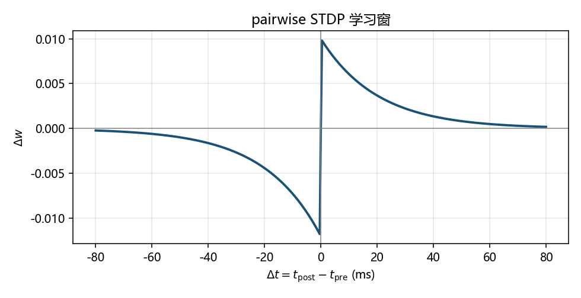
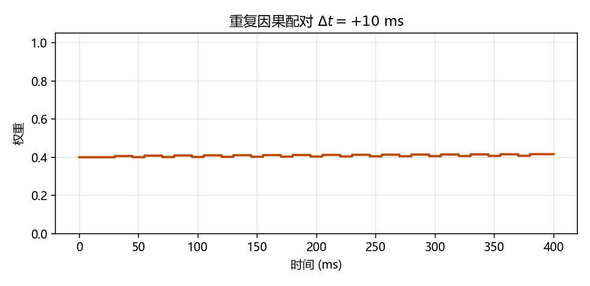

# Hebb 与 STDP：权重如何因时序而变

> [!WARNING]
> 🧪 Beta公测版本提示：教程主体已完成，正在优化细节，欢迎大家提Issue反馈问题或建议。

> [编码](/neuro/encoding/) 把刺激写成尖峰时刻。学习规则问：这些时刻如何改突触？只背「一起放电就连在一起」会错过**时序、稳态、调质**。

---

## 一、学习规则家族

| 规则 | 一句话 | 典型用途 |
|------|--------|----------|
| Hebb | 相关活动 → 加强 | 联想记忆直觉 |
| **STDP** | **谁先谁后**决定 LTP/LTD | 时序预测、感受野 |
| BCM | 滑动阈值，防权重爆炸 | 稳态 + 选择性 |
| 三因素 | 前/后突触 + 调质（如多巴胺） | 把奖励接到局部更新 |

本讲垂直深挖 **pairwise STDP**。下一章用它「长出」方向选择性。

---

## 二、时间差就是老师

令 $\Delta t = t_{\mathrm{post}} - t_{\mathrm{pre}}$：

- $\Delta t>0$（先 pre 后 post）→ **LTP**（变强）
- $\Delta t<0$（先 post 后 pre）→ **LTD**（变弱）

指数窗：

$$
\Delta w(\Delta t)
=
\begin{cases}
A_+ e^{-\Delta t/\tau_+} & \Delta t>0\\
-A_- e^{\Delta t/\tau_-} & \Delta t<0
\end{cases}
$$

邻近时刻才有效（$\tau_\pm$ 常在 10–20 ms）；$A_-$ 常常略大于 $A_+$，有助于稳定。在线实现用 pre/post **痕迹**（eligibility trace）：pre 尖峰时用 post 痕迹做 LTD，post 尖峰时用 pre 痕迹做 LTP。

> 运行 `code/demo.py` 生成。因果一侧为正、反因果为负。

> 固定 $\Delta t=+10\,\mathrm{ms}$ 的配对会把权重推向上界附近。

---

## 三、和反传的关键差别

反传需要全局损失沿计算图回传；STDP 通常只看**局部尖峰时序**（最多再加多巴胺一类调质）。这不是说 STDP 更高级，而是信用分配的假设完全不同——[NeuroAI](/neuro/neuroai/) 会专门对照。

> 下一章：[回路](/neuro/circuits/)：STDP 长出方向选择性；E–I 网的 raster。

## 四、三条主线检查单

| 主线 | 过关表现 |
|------|----------|
| 生物 | 能解释 STDP 窗为何非对称、为何 $\Delta t=0$ 通常不更新 |
| AI | 能对比局部时序学习与全局反传 |
| 模拟 | 能指出因果配对如何把权重推向上界 |

## 📥 Code

| File | View | Download |
|------|------|----------|
| demo.py | [Open](./code-demo) | <a href="/notebook/code/neuro/stdp/demo.py" target="_blank" download>Download</a> |
| exercise.py | [Open](./code-exercise) | <a href="/notebook/code/neuro/stdp/exercise.py" target="_blank" download>Download</a> |

## 参考

1. Bi, G. Q., & Poo, M. M. (1998). Synaptic modifications in cultured hippocampal neurons.
2. Song, S., Miller, K. D., & Abbott, L. F. (2000). Competitive Hebbian learning through STDP.
3. Gerstner et al., *Neuronal Dynamics*，可塑性章节。
