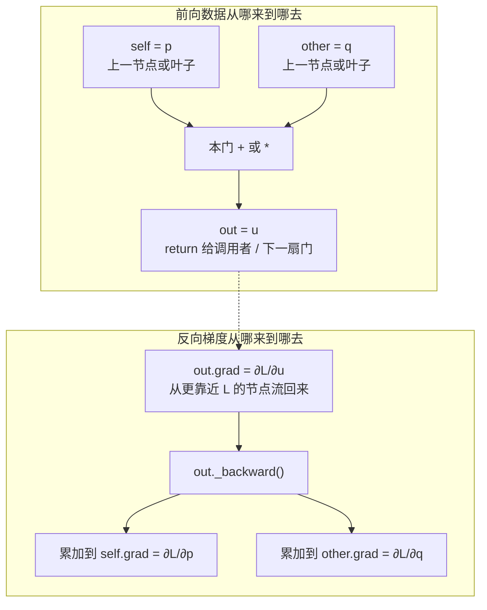
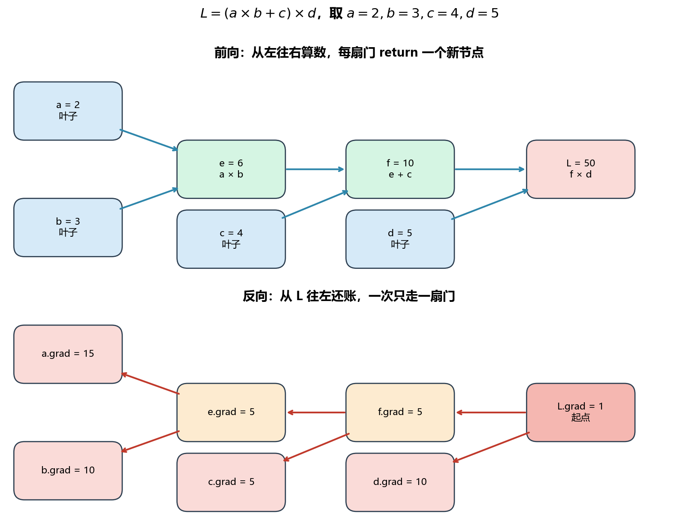
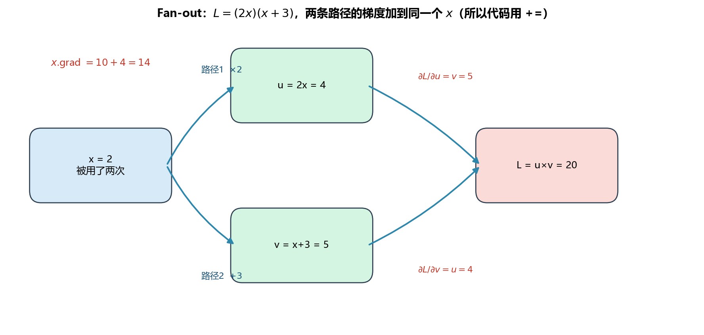

> [!WARNING]
> 🧪 Beta公测版本提示：教程主体已完成，正在优化细节，欢迎大家提Issue反馈问题或建议。

# s06 反向传播与链式法则 — demo.py 代码详解

<a href="/notebook/code/nn-decision/dl/backprop/demo.py" target="_blank" download>Download demo.py</a>
　
<a href="/notebook/code/nn-decision/dl/backprop/plot_demo.py" target="_blank" download>Download plot_demo.py</a>

## 运行方式

```bash
cd docs/nn-decision/dl/backprop/code
python demo.py          # mini autograd 主线（不画图）
python plot_demo.py     # MSE / 演示1 计算图 / Fan-out
```

## 代码逐段详解

### 第1步：导入库 — 每个库是做什么的

```python
import os
import math
from typing import Set, List, Tuple
```

- **`os`**：操作系统接口库。此处用于创建 `images/` 输出目录，确保图片保存路径存在。
- **`math`**：数学函数库。提供 `math.exp()`（指数函数）、`math.tanh()`（双曲正切）等底层数学运算，用于实现 Sigmoid、Tanh 等激活函数。
- **`typing.Set, List, Tuple`**：类型注解。`Set` 用于记录计算图中已访问的节点，`List` 用于拓扑排序结果列表，`Tuple` 用于节点的前驱元组。

> **为什么不用 NumPy？** 因为这个 demo 的目标是展示自动微分的**底层原理**——每个数值都是标量 `Value`，而非 NumPy 数组。下一节 s07 才扩展到矩阵/向量级别的反向传播，届时才需要 NumPy。

---

### 第2步：Value 类 — 自动微分的核心节点

整个 demo 的基石是 `Value` 类。每个 `Value` 对象就是计算图中的一个节点，它存储四样东西：

| 属性 | 含义 | 用途 |
|------|------|------|
| `data` | 该节点的数值（标量） | 前向传播的结果值 |
| `grad` | 累积的梯度 $\frac{\partial L}{\partial \text{node}}$ | 反向传播时累加 |
| `_backward` | 局部反向传播函数（闭包） | 定义该操作对输入的梯度如何分配 |
| `_prev` | 前驱节点集合 | 用于拓扑排序，确定反向传播顺序 |

```python
class Value:
    def __init__(self, data: float, _children: Tuple = (), _op: str = ""):
        self.data = data                # 存储数值
        self.grad = 0.0                 # 梯度初始化为 0
        self._backward = lambda: None   # 默认无操作（叶子节点）
        self._prev = set(_children)     # 前驱节点集合
        self._op = _op                  # 操作名称（如 "+", "*", "ReLU"）
```

**设计要点**：
- `grad` 初始为 0，反传时通过 `+=` 累加而非 `=` 赋值——这是因为一个变量可能被多条路径使用（fan-out），梯度需要求和。
- `_backward` 是一个闭包（closure），它捕获了当前操作的局部上下文（如两个输入的 data 值），从而在反向时无需重新计算。
- `_children` / `_prev` 装的是**这扇门的输入**（谁喂进来），这个 `Value` 自己是**输出**（`return` 给调用者）。叶子（手写的 `Value(2.0)`）没有输入，`_backward` 为空。

---

### 第3步：基本算术运算 — 局部梯度规则

每个运算 `__add__`、`__mul__` 都做两件事：**前向算出一个新节点 `out`**，以及**给 `out` 挂上局部 `_backward`**。先把名字和数据流钉死，再看公式。

#### 注释里的 $p$、$q$ 不是激活，也不是偏置

正文神经元公式里：$a=\phi(z)$ 的 $a$ 是**激活**，$b$ 是**偏置**。门的注释若写成 $\partial(a+b)/\partial a$，这两个字母只是「两个加数」的习惯写法，**和激活、偏置无关**。下面一律用正文同一套字母：$p$、$q$ 是这扇门的两个输入，$u$ 是这扇门的输出。

写 `u = p + q` 时，Python 调用的是 `p.__add__(q)`，对应关系是：

| 角色 | 数学 | 代码 | 从哪来 | 给到谁 |
|------|------|------|--------|--------|
| 左输入 | $p$ | `self` | 已经存在的 `Value`：叶子（权重 / 输入 / 偏置），或**上一扇门** return 出来的 `out` | 本门 |
| 右输入 | $q$ | `other` | 同上；若是普通 `float`，会先包成 `Value` | 本门 |
| 输出 | $u=p+q$ 或 $p\cdot q$ | `out` | 本门用 `.data` 当场算出来 | **`return out` 交给调用者**，成为下一扇门的输入，直到变成损失 $L$ |

门不认识「这是权重还是激活」。谁出现在 `+` / `*` 两边，谁就是这扇门的输入。

**前向**：两个输入的数值流进门，门新建 `out`，把 `_prev = {self, other}` 记下来（反向时好找到「梯度该还给谁」），把 `_backward` 挂在 `out` 上，把 `out` 交出去。

**反向**：更靠近 $L$ 的节点先算完，把 $\partial L/\partial u$ 写进 `out.grad`。这扇门的 `_backward` 被调用时，只负责把这份「下游的不满」分回 `self.grad` 和 `other.grad`。它既不创造梯度，也不直接改权重——只是把账分给两个输入。



嵌进神经元 $z = w x + b$ 时，两扇门是这样接上的：

```python
weight = Value(2.0)   # 叶子：权重 w
x = Value(3.0)        # 叶子：输入 x
bias = Value(1.0)     # 叶子：偏置 b（注意：这是偏置，不是门的 q 的专用名）

wx = weight * x       # 乘法门：self=weight, other=x,  out=wx 交给下一行
z = wx + bias         # 加法门：self=wx,     other=bias, out=z 交给激活或损失
```

| 代码 | 这扇门 | `self`（$p$）从哪来 | `other`（$q$）从哪来 | `out` 给到谁 |
|------|--------|---------------------|----------------------|--------------|
| `wx = weight * x` | 乘法 | 叶子 $w$ | 叶子 $x$ | 下一行加法门的左输入 |
| `z = wx + bias` | 加法 | 上一扇乘法门的输出 | 叶子 $b$ | 激活，或直接进损失 |

所以：**输入不是凭空出现的**——来自叶子或上一扇门；**输出也不是写进某个全局变量**——`return` 给写这行表达式的人，由他接到下一扇门或接到 $L$。

#### 加法门 `__add__`

```python
def __add__(self, other):
    other = other if isinstance(other, Value) else Value(other)
    out = Value(self.data + other.data, (self, other), '+')

    def _backward():
        self.grad += 1.0 * out.grad    # 把 ∂L/∂u 原样还给左输入 p
        other.grad += 1.0 * out.grad   # 把 ∂L/∂u 原样还给右输入 q

    out._backward = _backward
    return out
```

- `self` / `other`：这扇加法门的两个加数 $p$、$q$（上一例里就是 `wx` 和 `bias`）。
- `out`：和 $u = p+q$，前向交给调用者；反向时 `out.grad` 已经是 $\partial L/\partial u$，从下游来。
- 局部导数 $\partial u/\partial p = 1$、$\partial u/\partial q = 1$，所以加法门是**梯度分发器**：下游来多少，两边各原样累加多少。

$$
\frac{\partial L}{\partial p} = \frac{\partial L}{\partial u}\cdot 1 = \texttt{out.grad}
$$

#### 乘法门 `__mul__`

```python
def __mul__(self, other):
    other = other if isinstance(other, Value) else Value(other)
    out = Value(self.data * other.data, (self, other), '*')

    def _backward():
        self.grad += other.data * out.grad   # 还给 p 时乘上 q 的前向值
        other.grad += self.data * out.grad   # 还给 q 时乘上 p 的前向值

    out._backward = _backward
    return out
```

- `self` / `other`：两个乘数 $p$、$q$（上一例里就是 `weight` 和 `x`）。
- `out`：积 $u = p\cdot q$，同样 `return` 给调用者。
- 局部导数 $\partial u/\partial p = q$、$\partial u/\partial q = p$，所以梯度**交换**：还给左边时乘的是右边的前向值。上一例 $w\cdot x$ 里，$w$ 收到的是 $x\cdot\partial L/\partial(wx)$，$x$ 收到的是 $w\cdot\partial L/\partial(wx)$。

$$
\frac{\partial L}{\partial p} = \frac{\partial L}{\partial u}\cdot q = \texttt{out.grad} \times \texttt{other.data}
$$

闭包里用的是前向时的 `other.data` / `self.data`，不是反向时的值。前向存中间值、反向再用，这是自动微分的标准做法。

#### 幂运算 `__pow__`

```python
def __pow__(self, other):
    assert isinstance(other, (int, float)), "仅支持数值指数"
    out = Value(self.data ** other, (self,), f'**{other}')

    def _backward():
        self.grad += (other * self.data ** (other - 1)) * out.grad

    out._backward = _backward
    return out
```

这里底数 $p$ 是 `self`（从上一节点来），指数 $n$ 是普通数字 `other`（不当成图上的节点，所以 `_children` 只有 `self`）。输出 $u=p^n$ 仍 `return` 给调用者。反向只把梯度还给底数：

$$
\frac{\partial (p^n)}{\partial p} = n \cdot p^{n-1}
$$

例如 $p^2$ 的导数是 $2p$。指数没有 `.grad` 可写。

#### 除法 `__truediv__`：巧妙的复用法

```python
def __truediv__(self, other):
    return self * other ** -1
```

没有单独写除法的 `_backward`，而是拆成已有的门：$p / q = p \times q^{-1}$。

- 先幂运算：输入 `other`（$q$），输出 $q^{-1}$，交给乘法门。
- 再乘法：左输入 `self`（$p$），右输入 $q^{-1}$，输出 $p/q$，交给调用者。

两条已有 `_backward` 串起来，链式法则自动得到：

$$
\frac{\partial (p / q)}{\partial p} = \frac{1}{q}, \quad \frac{\partial (p / q)}{\partial q} = -\frac{p}{q^2}
$$

---

### 第4步：激活函数 — 非线性变换的反向传播

激活函数是**一元门**：只有一个输入 `self`（通常是上一扇加法门送来的 $z$），一个输出 `out`（激活值，交给下一层或损失）。没有 `other`。反向时 `out.grad` 仍从更靠近 $L$ 的节点回来，门把它乘上激活导数后还给 `self`。

#### ReLU：梯度门控

```python
def relu(self):
    out = Value(max(0.0, self.data), (self,), 'ReLU')

    def _backward():
        self.grad += (out.data > 0) * out.grad

    out._backward = _backward
    return out
```

数学定义与导数：

$$
\text{ReLU}(x) = \max(0, x)
$$

$$
\text{ReLU}'(x) = \begin{cases} 1 & \text{if } x > 0 \\ 0 & \text{if } x \leq 0 \end{cases}
$$

**为什么此处用它？** ReLU 是隐藏层最常用的激活函数。它的导数非0即1，没有饱和区（不像 Sigmoid/Tanh 在两端导数趋近0），因此能有效缓解梯度消失问题。

**代码细节**：`(out.data > 0)` 在 Python 中产生布尔值 True/False，但在算术运算中 True=1、False=0。因此整个表达式相当于"如果前向值 > 0，梯度通过；否则截断为0"。这是一个优雅的**梯度门控**（gating）实现。

#### Sigmoid：数值稳定技巧

```python
def sigmoid(self):
    x = self.data
    if x >= 0:
        s = 1.0 / (1.0 + math.exp(-x))      # 标准公式
    else:
        exp_x = math.exp(x)
        s = exp_x / (1.0 + exp_x)            # 数值稳定版本

    out = Value(s, (self,), 'Sigmoid')

    def _backward():
        self.grad += out.data * (1 - out.data) * out.grad

    out._backward = _backward
    return out
```

数学定义与导数：

$$
\sigma(x) = \frac{1}{1 + e^{-x}}
$$

$$
\sigma'(x) = \sigma(x)(1 - \sigma(x))
$$

Sigmoid 导数的优美性质是**可以用前向输出直接计算导数**，无需知道原始输入 $x$。这在工程上很方便——反向传播时直接用 `out.data` 即可。

**数值稳定技巧**：当 $x$ 是非常大的负数时，$e^{-x}$ 可能溢出（如 $x=-500$，$e^{500}$ 超出浮点数上限）。因此当 $x < 0$ 时，改用等效公式 $\sigma(x) = \frac{e^x}{1 + e^x}$，避免了 $e^{-x}$ 的计算。

#### Tanh：零中心输出

```python
def tanh(self):
    t = math.tanh(self.data)
    out = Value(t, (self,), 'Tanh')

    def _backward():
        self.grad += (1 - out.data ** 2) * out.grad

    out._backward = _backward
    return out
```

数学定义与导数：

$$
\tanh(x) = \frac{e^x - e^{-x}}{e^x + e^{-x}}
$$

$$
\tanh'(x) = 1 - \tanh^2(x)
$$

与 Sigmoid 类似，Tanh 的导数也可以用前向输出直接计算。Tanh 的输出范围是 $(-1, 1)$，以零为中心（不像 Sigmoid 输出全正），因此在隐藏层有时优于 Sigmoid。

#### Exp：导数等于自身

```python
def exp(self):
    out = Value(math.exp(self.data), (self,), 'exp')

    def _backward():
        self.grad += out.data * out.grad

    out._backward = _backward
    return out
```

数学公式：$\frac{d}{dx}e^x = e^x$。Exp 函数的导数就是它自己的值——这是指数函数最独特的性质，也是 softmax 中常用的基本操作。

---

### 第5步：backward() — 拓扑排序 + 逆序执行

这是整个自动微分引擎的核心。`backward()` 方法的职责是：从当前节点（通常是损失 $L$）出发，按正确的顺序调用计算图中每个节点的 `_backward()`。

```python
def backward(self):
    # ---- 步骤 1: 拓扑排序（DFS 实现） ----
    topo = []
    visited = set()

    def build_topo(v: Value):
        if v not in visited:
            visited.add(v)
            for child in v._prev:       # 递归访问所有前驱
                build_topo(child)
            topo.append(v)              # 后序遍历：子节点在前

    build_topo(self)

    # ---- 步骤 2: 初始化梯度 ----
    self.grad = 1.0   # ∂L/∂L = 1

    # ---- 步骤 3: 按拓扑逆序调用 backward ----
    for node in reversed(topo):
        node._backward()
```

**为什么需要拓扑排序？**

反向传播要求**按计算图的逆序**执行：先计算离输出近的节点的梯度，再计算离输入近的。拓扑排序确保了：当调用节点 $v$ 的 `_backward()` 时，它的所有后继（路径上更靠近输出的节点）的梯度已经计算完毕。

具体来说，`build_topo` 使用 **DFS 后序遍历**：
1. 从根节点（损失 $L$）出发，沿 `_prev`（前驱关系）反向遍历
2. 后序遍历确保：子节点（离输入近的）先被 `topo.append()`，父节点后
3. 最终 `reversed(topo)` 得到的顺序就是：从 $L$ 出发，逐层向输入传播

**初始梯度为什么是 1.0？**

$$
\frac{\partial L}{\partial L} = 1
$$

我们求的是「损失 $L$ 对图上每一个节点」的梯度。$L$ 对自身当然是 $1$——这是整条反向链唯一需要手写的起点。其余节点（包括每个权重）的梯度，都由链式法则从这一点往回乘。把 `self.grad = 1.0` 理解成：从这个标量（训练时就是 MSE）出发，开始给每个参数算「你要负多大的责」。演示 1–3 里这个标量可以是任意表达式；演示 4 起它才是真正的损失。

---

### 第6步：演示1 — 基本表达式的反向传播

这段**还没有神经网络**。四个数字、三扇第 3 步里的门，用来把「前向算出一个标量 → `backward()` 给每个叶子填上梯度」走通。看懂它，后面训练循环里的 `total_loss.backward()` 就是同一件事，只是图更大。

表达式（字母只是变量名，不是激活 / 偏置）：

$$
L = (a \times b + c) \times d
$$

代入 $a=2,\ b=3,\ c=4,\ d=5$。我们问的是：每个叶子微微动一下，$L$ 会变多少？也就是 $\partial L/\partial a,\ \partial L/\partial b,\ \partial L/\partial c,\ \partial L/\partial d$。

```python
a = Value(2.0)   # 叶子：没有输入，_backward 为空
b = Value(3.0)
c = Value(4.0)
d = Value(5.0)

e = a * b        # 第 1 扇：乘法，self=a, other=b,  return 的 out 叫 e
f = e + c        # 第 2 扇：加法，self=e, other=c,  return 的 out 叫 f
L = f * d        # 第 3 扇：乘法，self=f, other=d,  return 的 out 叫 L
L.backward()     # 从 L 往回走，给上面所有节点填 .grad
```

#### 前向：从左往右算数

每一行都是「两个已有节点喂进一扇门，门 `return` 一个新节点」：

| 代码 | 哪扇门 | `self`（左） | `other`（右） | `out.data` | 这个 `out` 接下来给谁 |
|------|--------|--------------|---------------|------------|----------------------|
| `e = a * b` | 乘法 | $a=2$ | $b=3$ | $e=6$ | 下一行加法的左输入 |
| `f = e + c` | 加法 | $e=6$ | $c=4$ | $f=10$ | 下一行乘法的左输入 |
| `L = f * d` | 乘法 | $f=10$ | $d=5$ | $L=50$ | `backward()` 的起点 |

验算：$(2\times 3 + 4)\times 5 = 10\times 5 = 50$。到这里，每个节点的 `.grad` 仍是 $0$。

#### 反向：从最右边往左，一次只看一扇门

`L.backward()` 先做一件事：`L.grad = 1`。因为我们求的是「$L$ 对图上每个节点」的导数，$L$ 对自己当然是 $1$。然后按**建造顺序的反方向**调用各扇门的 `_backward`：先最右的乘法，再中间的加法，最后最左的乘法。必须这样——左边那扇门要用到右边已经算好的 `out.grad`。



**第 ① 扇（最右）：** $L = f \times d$，乘法门。

- `self = f = 10`，`other = d = 5`，`out = L`，`out.grad = 1`（刚写上的）
- 乘法规则：还给左边时乘**右边的前向值**

$$
f.\mathrm{grad}\ \mathrel{+}=\ d\cdot 1 = 5,\qquad
d.\mathrm{grad}\ \mathrel{+}=\ f\cdot 1 = 10
$$

人话：$L = f\times 5$，所以 $f$ 加 $1$，$L$ 就加 $5$ → $\partial L/\partial f=5$。同理 $L=10\times d$，$d$ 加 $1$，$L$ 加 $10$。

**第 ② 扇（中间）：** $f = e + c$，加法门。

- `self = e = 6`，`other = c = 4`，`out = f`，`out.grad` **已经是上一步写下的 $5$**
- 加法规则：下游来多少，两边各原样累加多少

$$
e.\mathrm{grad}\ \mathrel{+}=\ 1\cdot 5 = 5,\qquad
c.\mathrm{grad}\ \mathrel{+}=\ 1\cdot 5 = 5
$$

人话：$e$ 或 $c$ 加 $1$，$f$ 加 $1$；而 $f$ 加 $1$ 会让 $L$ 加 $5$。所以两边对 $L$ 的责任都是 $5$。

**第 ③ 扇（最左）：** $e = a \times b$，乘法门。

- `self = a = 2`，`other = b = 3`，`out = e`，`out.grad` **已经是上一步写下的 $5$**

$$
a.\mathrm{grad}\ \mathrel{+}=\ b\cdot 5 = 15,\qquad
b.\mathrm{grad}\ \mathrel{+}=\ a\cdot 5 = 10
$$

人话：$a$ 加 $1$，$e$ 加 $b=3$；再乘上 $\partial L/\partial e=5$，所以 $L$ 大约加 $15$。

#### 这些 `.grad` 是什么意思？

$\partial L/\partial a = 15$ 读成：在当前这组数字上，$a$ 从 $2$ 变成 $2.001$，则 $L$ 大约从 $50$ 变成 $50.015$。其它叶子同理。

| 节点 | `.grad` | 一句话 |
|------|---------|--------|
| $L$ | $1$ | 起点，手写的 |
| $f$ | $5$ | $L=f\times 5$，$f$ 动一点 $L$ 动五倍 |
| $d$ | $10$ | $L=10\times d$ |
| $e$、$c$ | $5$ | 加法两边平分 $f$ 的责任 |
| $a$ | $15$ | 再乘上 $b=3$：$5\times 3$ |
| $b$ | $10$ | 再乘上 $a=2$：$5\times 2$ |

#### 用展开式核对（这不是算法，只是验算）

把括号打开：$L = abd + cd$。普通求导：

$$
\frac{\partial L}{\partial a}=bd=3\times 5=15,\quad
\frac{\partial L}{\partial b}=ad=2\times 5=10,\quad
\frac{\partial L}{\partial c}=d=5,\quad
\frac{\partial L}{\partial d}=ab+c=10
$$

和 `backward()` 填进去的 `.grad` 一致。反向传播没有用到这组展开式——它只是一扇门一扇门地用第 3 步那两条局部规则。图一大，展开式写不出来，门规则照样能走。

---

### 第7步：演示2 — 激活函数的反向传播验证

这段把第 4 步的一元门接到 `backward()` 上核对导数。这里**没有 MSE**：直接对激活的输出调用 `.backward()`，等于把激活值本身当成 $L$，所以 `out.grad = 1`，算出来的 `x.grad` 就是 $\mathrm{d}\,\phi/\mathrm{d}x$。

共用同一个叶子 $x=1.5$。每测完一种激活必须 `x.zero_grad()`——同一个 `x` 会先后接到不同的门上，若不清零，后面的梯度会叠在前面的上面。

#### ReLU（$x=1.5>0$）

```python
x = Value(1.5)
a_relu = x.relu()      # 一元门：self=x, out=a_relu=1.5
a_relu.backward()      # 把 a_relu 当 L，所以 a_relu.grad=1
```

- 前向：$\mathrm{ReLU}(1.5)=\max(0,1.5)=1.5$
- 反向：正区局部导数是 $1$，所以 $x.\mathrm{grad}\ \mathrel{+}=\ 1\cdot 1=1$

人话：在正区 ReLU 是恒等，输入加 $1$ 输出就加 $1$。

负输入对照：$x=-1.5$，$\mathrm{ReLU}=0$，局部导数是 $0$，梯度被门控截断，$x.\mathrm{grad}=0$。负区再怎么动输入，输出都是 $0$，对 $L$ 没有责任。

#### Sigmoid（同一点 $x=1.5$）

先 `x.zero_grad()`，再：

```python
a_sig = x.sigmoid()
a_sig.backward()
```

$$
\sigma(1.5)\approx 0.817574,\qquad
\sigma'(1.5)=\sigma(1-\sigma)\approx 0.149146
$$

反向仍是一元门：`self=x`，`out=a_sig`，`out.grad=1`，于是 $x.\mathrm{grad}=0.149146$。和手算公式一致。注意这里用的是前向输出 `out.data` 来算导数，不必再记一份 $x$。

#### Tanh（同一点）

同样清零后：

$$
\tanh(1.5)\approx 0.905148,\qquad
\tanh'(x)=1-\tanh^2(x)\approx 0.180707
$$

`x.grad` 填成 $0.180707$。三种激活都是「一扇一元门 + `out.grad=1`」，和第 6 步三扇二元门是同一套机制，只是没有 `other`。

---

### 第8步：演示3 — Fan-out 梯度累积

第 6 步里每个叶子只进一扇门。现在让**同一个** $x$ 走两条路再汇合——这才是 `grad +=` 而不是 `grad =` 的理由。

$$
L = (2x)\times(x+3),\quad x=2
$$

```python
x = Value(2.0)
u = x * 2      # 路径1：乘法，self=x, other=2, out=u=4
v = x + 3      # 路径2：加法，self=x, other=3, out=v=5
L = u * v      # 汇合：乘法，self=u, other=v, out=L=20
L.backward()
```

$x$ 同时是第一扇乘法的左输入、和第二扇加法的左输入。两条路最后都流进 $L$。



#### 前向

| 代码 | 门 | `self` | `other` | `out.data` |
|------|----|--------|---------|------------|
| `u = x * 2` | 乘法 | $x=2$ | $2$ | $u=4$ |
| `v = x + 3` | 加法 | $x=2$ | $3$ | $v=5$ |
| `L = u * v` | 乘法 | $u=4$ | $v=5$ | $L=20$ |

#### 反向：仍从最右往左，但 $x$ 会被写两次

先 `L.grad = 1`。

**第 ① 扇** $L=u\times v$（乘法）：

$$
u.\mathrm{grad}\ \mathrel{+}=\ v\cdot 1 = 5,\qquad
v.\mathrm{grad}\ \mathrel{+}=\ u\cdot 1 = 4
$$

**第 ② 扇** $u=2x$（乘法）：还给 $x$ 时乘对方的前向值 $2$，上游是 $u.\mathrm{grad}=5$

$$
x.\mathrm{grad}\ \mathrel{+}=\ 2\cdot 5 = 10
$$

这是路径 1 的账：$x$ 加 $1$，$u$ 加 $2$，$L$ 再加 $5\times 2=10$。

**第 ③ 扇** $v=x+3$（加法）：上游是 $v.\mathrm{grad}=4$，加法原样传递

$$
x.\mathrm{grad}\ \mathrel{+}=\ 1\cdot 4 = 4
$$

这是路径 2 的账：$x$ 加 $1$，$v$ 加 $1$，$L$ 加 $4$。

两次 `+=` 之后 $x.\mathrm{grad}=10+4=14$。若写成 `=`，后执行的那条路径会把前一条覆盖掉，答案就错了。多元链式法则写的就是这件事：

$$
\frac{\partial L}{\partial x}
= \frac{\partial L}{\partial u}\cdot\frac{\partial u}{\partial x}
+ \frac{\partial L}{\partial v}\cdot\frac{\partial v}{\partial x}
= 5\cdot 2 + 4\cdot 1 = 14
$$

人话：$x$ 从 $2$ 变成 $2.001$，$L$ 大约从 $20$ 变成 $20.014$。

---

### 第9步：演示4 — 小神经网络完整训练

前面三步都在玩具表达式上。这一步把同一套门装进一个很小的 MLP，走通「前向 → MSE → backward → 改权重」。精度不是重点（四个点、一百轮，最后会塌成常数预测，下面会解释）。

#### 网络是怎么用门拼出来的

```python
model = MLP(2, [4, 1], ["relu", "linear"])
```

含义：输入 2 维 → 隐藏层 4 个 ReLU 神经元 → 输出层 1 个线性神经元。可训练参数 $4\times(2+1)+1\times(4+1)=17$ 个（每个神经元：若干权重 + 一个偏置）。

一个 `Neuron` 的前向就是第 3 步那些门：

```python
act = sum((wi * xi for wi, xi in zip(self.w, x)), self.b)  # 一串乘法 + 加法
out = act.relu()   # 或线性层：直接 return act
```

`Layer` 是并排多个 Neuron；`MLP` 把上一层的输出列表喂给下一层。输出层取 `x[0]`，因为这是标量回归。

#### 四个训练点

目标函数 $y=3x_1^2-2x_2+1$（只用来生成标签，网络并不知道这个公式）：

| 样本 | $(x_1,x_2)$ | $y$ |
|------|-------------|-----|
| 1 | $(1,2)$ | $0$ |
| 2 | $(2,1)$ | $11$ |
| 3 | $(0,3)$ | $-5$ |
| 4 | $(3,0)$ | $28$ |

四个标签的均值是 $8.5$。记住这个数，后面会撞上它。

#### 每一轮在干什么

`lr=0.01`，共 $100$ 轮。每一轮：

1. **前向**：`y_preds = [model(x) for x in xs]`，四个 $\hat{y}$。
2. **MSE**（demo 写法，省略 $\frac{1}{2}$ 和 $\frac{1}{N}$）：
   ```python
   losses = [(yp - Value(y_true)) ** 2 for yp, y_true in zip(y_preds, ys)]
   total_loss = sum(losses[1:], losses[0])
   ```
   每个样本是一扇减法再接幂运算 $p^2$，四个标量加起来得到 $L$。`backward()` 的起点就是这个 $L$。
3. **清零**：上一轮写在权重上的 `.grad` 必须抹掉，否则会和本轮加在一起（和第 7 步 `zero_grad`、第 8 步 `+=` 是同一件事）。
4. **反向**：`total_loss.backward()` 从 MSE 出发，沿计算图把 $\partial L/\partial w$、$\partial L/\partial b$ 填进全部 17 个参数。输入 $x$ 和标签 $y$ 不当成旋钮。
5. **更新**：`p.data -= lr * p.grad`，梯度上坡，减号走下坡。

`random.seed(42)` 后，打印出来的损失是：

| epoch | 损失 $L$ | 四个预测 |
|-------|----------|----------|
| 0 | $973.89$ | 大约都在 $0$ 附近（随机初始化） |
| 20 | $679.70$ | 四个都是 $5.39$ |
| 40 | $642.38$ | 四个都是 $7.91$ |
| 99 | $641.00$ | 四个都是 $8.50$ |

四个预测变成同一个数 $8.50$，而

$$
(0-8.5)^2+(11-8.5)^2+(-5-8.5)^2+(28-8.5)^2 = 641
$$

正好等于最终损失。也就是说网络学成了**常数函数** $\hat{y}=\bar{y}$——MSE 下若拟合不出弯曲，「全预测成均值」是一个合法的驻点。这个玩具宽度和步数不够拟合 $x_1^2$，演示目的只是把第 6 步的门接到真实的权重更新上。把曲面拟合做漂亮，是下一节矩阵反传的事。

---

### 第10步：演示5 — 梯度下降求函数最小值

没有数据集，目标函数就是 $f(x)=x^2+3x$。解析解 $f'(x)=2x+3=0\Rightarrow x=-1.5$，最小值 $-2.25$。用 Value 当参数，看自动微分能不能自己走到谷底。

```python
x = Value(5.0)
for step in range(20):
    loss = x * x + Value(3.0) * x   # 用门拼出 f(x)
    x.grad = 0.0                     # 每步清零，理由同第 7、9 步
    loss.backward()                  # x.grad 变成 2x+3
    x.data -= 0.1 * x.grad          # 沿下坡走一步
```

#### 这个表达式里的门

`x * x` 是第 8 步那种 fan-out：左右输入是**同一个**节点 $x$。乘法门会给 $x$ 写两次：

$$
x.\mathrm{grad}\ \mathrel{+}=\ x\cdot 1,\quad
x.\mathrm{grad}\ \mathrel{+}=\ x\cdot 1
$$

合起来就是 $2x$，正好是 $(x^2)'$。再加上 `3*x` 那一扇乘法贡献的 $3$，于是 $x.\mathrm{grad}=2x+3$，不必手写导数。

#### 第一拍（step 0）

$x=5$，$f=25+15=40$，梯度 $2\cdot 5+3=13$（上坡向右）。更新：

$$
x \leftarrow 5 - 0.1\times 13 = 3.7
$$

人话：现在站在抛物线右侧，梯度为正，减号让 $x$ 往左走，朝 $x=-1.5$ 那个谷底。

之后每 5 步（学习率 $0.1$，共 20 步）：

| 步骤 | $x$ | $f(x)$ | 梯度 $2x+3$ |
|------|-----|--------|-------------|
| 0 | $5.00$ | $40.00$ | $13.00$ |
| 5 | $0.63$ | $2.29$ | $4.26$ |
| 10 | $-0.80$ | $-1.76$ | $1.40$ |
| 15 | $-1.27$ | $-2.20$ | $0.46$ |
| 19 | $-1.41$ | $-2.24$ | $0.19$ |
| 结束 | $-1.43$ | $-2.24$ | — |

梯度越来越小，因为越走越平。20 步到 $x\approx-1.43$，已经贴着理论点 $-1.5$。和第 9 步同一套更新式，只是这里参数只有一个 $x$，图小到可以逐步对上解析导数。

---

### 辅助组件：计算图可视化

`print_computation_graph(L)` 在演示 1 末尾把图画成表。第 6 步那个 $L=(a\times b+c)\times d$ 打出来是：

| 深度 | 操作 | 数据值 | 梯度 | 含义 |
|------|------|--------|------|------|
| 0 | input | $2,3,4,5$ | $15,10,5,10$ | 四个叶子 $a,b,c,d$ |
| 1 | `*` | $6$ | $5$ | $e=a\times b$ |
| 2 | `+` | $10$ | $5$ | $f=e+c$ |
| 3 | `*` | $50$ | $1$ | $L=f\times d$，反向起点 |

深度 = 离叶子的最长路径。梯度列应和第 6 步手算一致。`id=...` 只是节点身份，用来看谁连着谁，不必记数字。

---

### 关键概念速查表

| 概念 | 数学公式 | 代码实现 |
|------|---------|---------|
| 链式法则 | $\frac{\partial L}{\partial w} = \frac{\partial L}{\partial a} \cdot \frac{\partial a}{\partial z} \cdot \frac{\partial z}{\partial w}$ | `self.grad += local_deriv * out.grad` |
| 加法门 | $\partial(p+q)/\partial p=1$；$p$=`self`，$q$=`other`，$u$=`out` | `self.grad += 1.0 * out.grad`（还给两个输入） |
| 乘法门 | $\partial(p\cdot q)/\partial p=q$；还给 $p$ 时乘 $q$ 的前向值 | `self.grad += other.data * out.grad` |
| 幂运算 | $\frac{\partial x^n}{\partial x} = n x^{n-1}$ | `self.grad += (other * self.data ** (other-1)) * out.grad` |
| ReLU | $\text{ReLU}'(x) = \mathbb{1}[x > 0]$ | `self.grad += (out.data > 0) * out.grad` |
| Sigmoid | $\sigma'(x) = \sigma(x)(1 - \sigma(x))$ | `self.grad += out.data * (1 - out.data) * out.grad` |
| Tanh | $\tanh'(x) = 1 - \tanh^2(x)$ | `self.grad += (1 - out.data**2) * out.grad` |
| 拓扑排序（DFS） | 后序遍历计算图 | `build_topo(v)` 递归 + `reversed(topo)` 逆序 |
| 梯度累积（Fan-out） | $\frac{\partial L}{\partial h} = \sum_i \frac{\partial L}{\partial u_i} \cdot \frac{\partial u_i}{\partial h}$ | `self.grad += ...`（用 `+=` 而非 `=`） |
| 梯度清零 | — | `zero_grad()` / `p.grad = 0.0` |
| MSE | $\ell=\frac{1}{2}(\hat{y}-y)^2$（demo 省略 $\frac{1}{2}$ 与 $\frac{1}{N}$） | `(yp - Value(y_true)) ** 2` 再求和 |
| $\partial L/\partial w$ | 只有权重能改；梯度上坡，更新下坡 | `p.data -= lr * p.grad` |
| 梯度下降 | $\theta_{t+1} = \theta_t - \alpha \cdot \nabla_\theta L$ | `p.data -= lr * p.grad` |

> 链式法则那一行的 $a$ 是神经元**激活**；加法/乘法门的 $p,q$ 才是那一扇门的两个输入（代码里的 `self` / `other`）。两套字母不要混。


## 源码位置

clone 后打开（相对仓库根目录）：

- `docs/nn-decision/dl/backprop/code/demo.py`（mini autograd 主线）
- `docs/nn-decision/dl/backprop/code/plot_demo.py`（MSE、演示1 计算图、Fan-out 示意）
