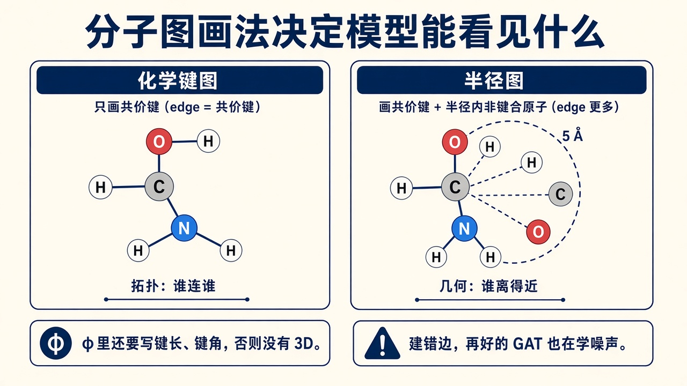
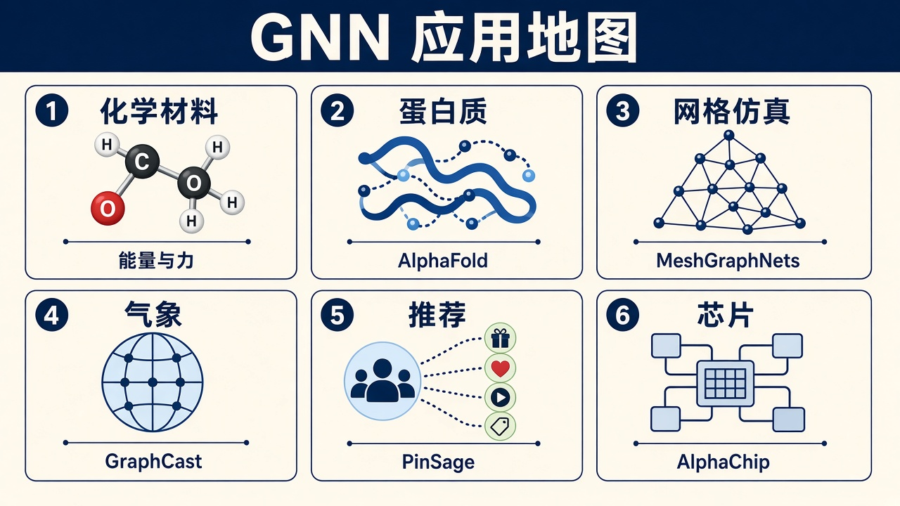
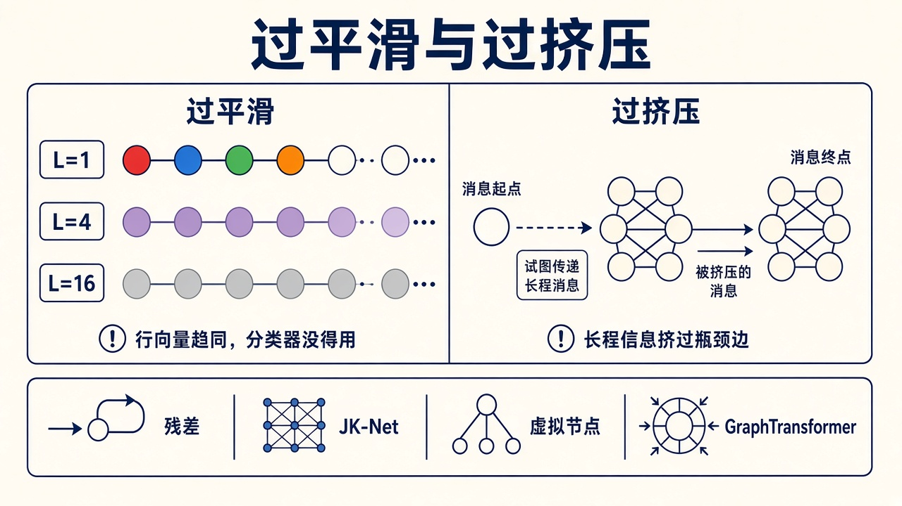

# GNN 应用与坑：建图、落地，以及过平滑

> [!WARNING]
> 🧪 Beta公测版本提示：教程主体已完成，正在优化细节，欢迎大家提Issue反馈问题或建议。

> 公式在 [变体](/nn-decision/dl/gnn/variants/)。本章只回答：**边代表什么物理 / 业务关系、模型输出接在哪、常见系统怎么用 GNN、哪些坑会让指标虚高。**

---

## 一、建图往往比选层更重要

GNN 不会「自动发现」什么该连边。你写进 \(E\) 的每一条边，都在说「这两个节点应该互相说话」。建错边，再好的 GAT 也在学噪声。

问三个问题再训练：

1. **节点是什么？** 原子、残基、网格顶点、用户、路口、netlist 里的宏模块——选定之后特征才能对齐。
2. **边表示什么相互作用？** 共价键、半径近邻、关注、道路、导线。有向还是无向、要不要自环，在这里定。
3. **标签在节点、边，还是整张图？** 决定要不要 readout，见 [消息传递 · 读出](/nn-decision/dl/gnn/message-passing/)。

> **图解说明**：只连化学键，模型看见拓扑、看不见「虽然没成键但只有 3Å」。半径图把几何近邻也连上，但阈值 5Å 还是 10Å 会彻底改图。键长、键角若要进 \(\phi\)，必须当边特征或球面谐波，不能指望 GCN 从 one-hot 原子序数里猜 3D。

网格同理：四邻接像五点和差分；单元面邻接更接近有限元。粒子系统的边每步都在变——半径图是**动态图**，不能把第一帧的 \(E\) 沿用到最后一帧。

---

## 二、一张应用地图

> **图解说明**：六块是同一种计算（消息沿边走），只是节点和边的含义换了。下面按块展开；科学侧可运行的网格 / 分子小实验仍在 [as05](/science/gnn/)。

---

## 三、化学与材料

**节点** = 原子（种类、电荷、可选坐标）。**边** = 化学键，或距离小于阈值的近邻。**输出** 常是整图：能量、带隙、毒性；或者节点：局部电荷；或者边：键级。

骨架多用 MPNN / GIN。要力和能量自洽时，力必须是能量对坐标的负梯度，不能另训一个无关的力头——否则会破坏守恒。SchNet、DimeNet、GemNet 把径向基、键角、球面谐波写进 \(\phi\)，这才叫**几何深度学习**，不是「把分子当成社交网」。

QM9、OC20 是常见基准。晶胞还要处理周期性边界：跨胞的近邻也是边。

变体怎么选：只要拓扑、要比指纹 → GIN。要 3D 构象和力 → 几何 MPNN，而不是纯 GCN。

---

## 四、蛋白质与 AlphaFold

残基（或原子对）构成图或三角。AlphaFold 的 Evoformer 里，三角更新可以看成**带几何约束的消息传递**：两条边决定第三条边该长什么样，信息在残基对之间走，而不是简单的「氨基酸节点 + 接触边」。

这不是「把 AlphaFold 叫一声 GNN 就懂了」。它用进化信息（MSA）、几何一致性、循环精修，GNN 只是其中一层语言。细节走 [as06](/science/alphafold/)。

若你自己做接触图预测：节点是残基，边是「序列上不相邻但空间可能靠近」，任务往往是边级。过挤压在长蛋白上很常见，GraphTransformer / 虚拟节点会经常出现。

---

## 五、网格 PDE 与 MeshGraphNets

规则网格上，mean 型消息传递很像离散扩散，as05 用热斑演示过平滑。真问题是**非结构网格会变形**：翅膀附近加密、碰撞后拓扑变。

MeshGraphNets（Pfaff et al., 2021）把网格顶点当节点，边特征带相对位移，学习「当前场 → 下一时间步」。比固定差分模板更能适应局部加密。训练常加噪声，避免 rollout 误差爆炸。

粒子流体：每一帧按半径重建边，GNN 学局部相互作用，再积分位置。边是动态的，采样邻居的思想和 SAGE 同源。

---

## 六、GraphCast：气象也是一张图

GraphCast（Lam et al., 2023）把地球做成**多分辨率网格图**：每个节点带气压、温度、风等变量，GNN 算子一次向前推约 6 小时，再自回归到 10 天。它是「GNN 当神经算子」的大规模实例：学的是状态到状态的映射，不是单点回归。

和 PINN 的差别：PINN 把 PDE 残差写进损失、输入是连续坐标；GraphCast 把物理场放在图节点上，用数据（再分析）拟合步进算子。两者可以杂交（PINO 那条线），但 GraphCast 本身是图上的算子学习。

科学概览里的位置见 [as01](/science/overview/)。

---

## 七、推荐与知识图谱

**用户–物品二部图**：左边用户、右边物品，边是点击 / 购买。节点分类少见，常见的是**链接预测**：这条虚线该不该出现。PinSage、LightGCN（把非线性剥掉、只留邻域平滑）都是这条路。

工业约束：

- 图极大 → 必须 SAGE 式采样，不能全图 GCN。
- 负采样决定指标：随机负样本太容易，硬负样本才像线上。
- 时间：用了「未来的边」训练，离线 AUC 会虚高。

**知识图谱** \((h,r,t)\)：R-GCN / CompGCN 编码实体，解码器打三元组分数。关系类型千万不要全部抹成一种边。

---

## 八、交通、芯片、连接组

**交通。** 路口或路段是节点，路网是边，节点特征是当前流量 / 速度，预测下一时段拥堵。时空 GNN 还要叠时间轴（有时是 GNN+GRU，有时是时空注意力）。

**芯片。** [AlphaChip](/science/alphachip/) 用 GNN 编码 netlist（模块 + 导线），强化学习选摆放。节点类型不同（宏模块、标准单元），往往是异构图，一种节点类型一套函数，思想接近 R-GCN。

**神经科学。** 连接组是有向脑区图或神经元图，和 [计算神经科学 · 连接组](/neuro/connectomics/) 交叉。边是突触或纤维束，不要当成无向社交网就套 GCN。

---

## 九、和 CNN / Transformer 的边界

- **CNN ≈ 固定邻域的 GNN。** 图像网格是一种非常规则的图；卷积核是「只连 \(k\times k\) 窗口」的消息传递，参数还按相对位置绑定（平移等变）。
- **Transformer 的自注意力 ≈ 全连接图上的 GAT。** 每个 token 都是邻居，没有「这条边不存在」。序列没有天然稀疏结构时，全连接是合理默认；分子和路网有天然稀疏结构时，显式边更省、也更符合物理。

不要为了「用上 GNN」把图像先建成像素图再跑 GCN——那通常比 CNN 又慢又差。GNN 的理由必须是：**邻居关系不规则，或边本身带有要保留的语义。**

---

## 十、过平滑、过挤压、泄露

> **图解说明**：左：层数加深，节点颜色（特征）变成同一团灰，线性分类器分不动。右：哑铃图中间只有一条瓶颈边，左边的消息挤不过去。

**过平滑（over-smoothing）。** 反复做邻域平均，\(H\) 的行向量趋同。对策：残差 / 恒等映射、JK-Net 拼接各层、LayerNorm、PairNorm、**不要无脑堆 20 层 GCN**。节点分类 2–4 层常常够。as05 的网格扩散是过平滑的可视化。

**过挤压（over-squashing）。** Alon & Yahav 指出：远处信息要经过少量瓶颈边才能到，深度增加也传不过去。对策：加边（rewiring）、虚拟节点、层次化图、GraphTransformer。

**泄露与协议。**

- 节点分类若把标签当特征、或用了测试期才出现的边，指标虚高。
- **转导**：测试节点在训练图里，只是没标签（Cora 经典设定）。
- **归纳**：新节点或全新的图（分子图分类几乎总是归纳：测试分子训练时没见过）。
- 两种数字不能横比。写报告时写清楚。

**度分布极端时** GCN 的归一化仍可能被超级节点支配；采样（SAGE）或注意力（GAT）会稳一些。

---

## 十一、本节小结

- 先定义节点、边、任务级别，再选 GCN / SAGE / GAT / GIN。
- 化学要几何就写进 \(\phi\)；气象 / 网格是图上的算子；推荐几乎必采样；知识图谱要分关系。
- 过平滑 = 平均太多次；过挤压 = 瓶颈边；泄露 = 用了不该用的边或标签。

> 网格和玩具分子的可运行代码：[as05](/science/gnn/)。GCN / GAT 对照：[变体 · demo](/nn-decision/dl/gnn/variants/)。注意力的序列版：[s16 Transformer](/applied/nlp/transformer/)。

## 参考

1. Bronstein, M. M., et al. (2021). Geometric Deep Learning. [[arXiv:2104.13478](https://arxiv.org/abs/2104.13478)]
2. Pfaff, T., et al. (2021). Learning Mesh-Based Simulation with Graph Networks. *ICLR*. [[arXiv:2010.03409](https://arxiv.org/abs/2010.03409)]
3. Lam, R., et al. (2023). GraphCast. *Science*. [[arXiv:2212.12794](https://arxiv.org/abs/2212.12794)]
4. Jumper, J., et al. (2021). Highly accurate protein structure prediction with AlphaFold. *Nature*.
5. Alon, U., & Yahav, E. (2021). On the Bottleneck of Graph Neural Networks and its Practical Implications. *ICLR*. [[arXiv:2006.05205](https://arxiv.org/abs/2006.05205)]
6. Ying, R., et al. (2018). Graph Convolutional Neural Networks for Web-Scale Recommender Systems. *KDD*. (PinSage)
