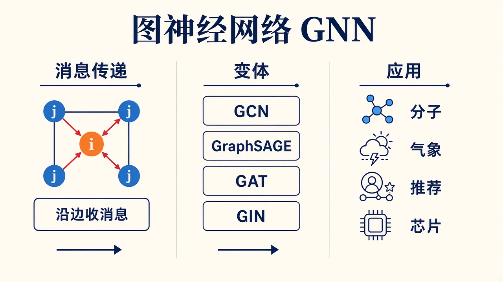

# 图神经网络：消息沿边走，变体差在怎么聚合

> [!WARNING]
> 🧪 Beta公测版本提示：教程主体已完成，正在优化细节，欢迎大家提Issue反馈问题或建议。

> 图像有网格，句子有顺序，**分子、路网、知识图谱、社交关系没有整齐的张量轴**。图神经网络（Graph Neural Network, GNN）把数据当成 \(\mathcal{G}=(V,E)\)：节点带特征，边表示关系，一层更新 = 向邻居收消息。

**数据是图**和 **计算图**不是一件事。前向那张 DAG 见 [s05](/nn-decision/dl/forward-graph/)。科学计算里的网格 / 分子 demo 见 [as05](/science/gnn/)。这里把 GNN 拆成三章讲透，不要指望在一节里同时吞掉公式、变体和产业案例。

> **图解说明**：先把「沿边收消息」讲清楚，再看 GCN / SAGE / GAT / GIN 各自改了三步里的哪一步，最后才落到分子、气象、推荐、芯片。demo 在变体那一章，CPU 上从零实现，不装 PyG。

| 章 | 在问什么 |
|----|----------|
| **[消息传递](/nn-decision/dl/gnn/message-passing/)** | 图的零件、三种任务、\(\phi\) / AGG / \(\psi\)、感受野、读出 |
| **[变体](/nn-decision/dl/gnn/variants/)** | GCN、GraphSAGE、GAT、GIN、R-GCN、GraphTransformer；怎么选 |
| **[应用与坑](/nn-decision/dl/gnn/applications/)** | 化学、AlphaFold、MeshGraphNets、GraphCast、推荐、芯片；过平滑 / 过挤压 |

建议顺序就是表里这一行。读 [RSSM](/world-models/abstract/rssm/) 或 [Transformer](/applied/nlp/transformer/) 之前，至少要能回答：**邻居是谁、消息怎么聚合、输出在节点上还是整张图上。**

## 📥 Code

GCN / GAT 对照演示放在变体章一起讲。所有节点标签都参与训练，图中准确率是同一批节点上的训练准确率，没有验证/测试划分，也不证明对未见节点或新图的泛化。源码仍在本组 `code/`：

| File | View | Download |
|------|------|----------|
| demo.py | [Open](./code-demo) | <a href="/notebook/code/nn-decision/dl/gnn/demo.py" target="_blank" download>Download</a> |
| exercise.py | [Open](./code-exercise) | <a href="/notebook/code/nn-decision/dl/gnn/exercise.py" target="_blank" download>Download</a> |
