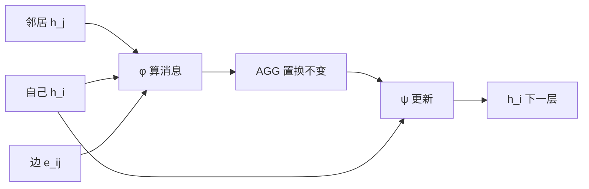

# 图神经网络：消息沿边走，变体差在怎么聚合

> [!WARNING]
> 🧪 Beta公测版本提示：教程主体已完成，正在优化细节，欢迎大家提Issue反馈问题或建议。

> 图像有网格，句子有顺序，**分子、路网、知识图谱、社交关系没有整齐的张量轴**。图神经网络（Graph Neural Network, GNN）把数据当成 \(\mathcal{G}=(V,E)\)：节点带特征，边表示关系，一层更新 = 向邻居收消息。科学计算里的网格/分子见 [as05](/science/gnn/)；这里把**统一公式、主流变体和跨领域应用**讲全。计算图（前向那张 DAG）见 [s05](/nn-decision/dl/forward-graph/)，和「数据是图」不是一件事。

> **图解说明**：左是两团节点、团内边密、团间边稀。中/右是训练后的二维嵌入：GCN 均匀混邻居，GAT 能把跨团的边权压小。demo 在 CPU 上从零实现，不装 PyG。

---

## 一、图上要预测什么

| 任务级别 | 输入 | 输出例子 |
|----------|------|----------|
| **节点** | 部分节点有标签 | 论文领域、用户类型、原子电荷 |
| **边 / 链接** | 节点对 | 会不会成为朋友、药物-靶点是否结合 |
| **整图** | 一张图一个标签 | 分子毒性、分子能量、图同构指纹 |

一层 GNN 只让每个节点看见 **1-hop** 邻居。堆 \(L\) 层 ≈ 感受野 \(L\) 跳——和 CNN 堆层扩大感受野是同一逻辑。

---

## 二、统一模板：消息传递（MPNN）

Gilmer et al. 2017 把几乎所有 GNN 写成三步：

$$
\begin{aligned}
m_{j\to i}^{(t)} &= \phi\!\left(h_i^{(t)}, h_j^{(t)}, e_{ij}\right)
&&\text{消息}\\
m_i^{(t)} &= \mathrm{AGG}_{j\in\mathcal{N}(i)}\, m_{j\to i}^{(t)}
&&\text{聚合（置换不变）}\\
h_i^{(t+1)} &= \psi\!\left(h_i^{(t)}, m_i^{(t)}\right)
&&\text{更新}
\end{aligned}
$$

\(\mathrm{AGG}\) 必须对邻居**排列不变**：sum / mean / max / 注意力加权和。变体的差别几乎全在 \(\phi,\mathrm{AGG},\psi\)。

---

## 三、变体：GCN / GraphSAGE / GAT / GIN

### 3.1 GCN（Kipf & Welling, 2017）

先给邻接矩阵加自环 \(\tilde A = A+I\)，再对称归一化：

$$
H^{(t+1)} = \sigma\!\left(\tilde D^{-1/2}\tilde A\tilde D^{-1/2} H^{(t)} W\right)
$$

直觉：每个邻居（含自己）贡献 \(1/\sqrt{d_i d_j}\) 的特征，度数大的节点不会把邻居「冲掉」。实现上就是「按边加权求和」，不必真的存稠密 \(A\)。

**何时用**：引用网络、同配社团（邻居标签往往相同）。便宜、好做基线。

### 3.2 GraphSAGE（Hamilton et al., 2017）

归纳式：对邻居**采样**再聚合（mean / LSTM / max pool），再用

$$
h_i' = \sigma\!\bigl(W\,[h_i \,\|\, \mathrm{AGG}(\{h_j\})]\bigr)
$$

新节点来了不必重训整图。大规模社交/推荐常用。

### 3.3 GAT（Veličković et al., 2018）

邻居不该平均：用注意力打分

$$
e_{ij} = \mathrm{LeakyReLU}\!\left(a^\top [W h_i \,\|\, W h_j]\right),\quad
\alpha_{ij} = \mathrm{softmax}_{j\in\mathcal{N}(i)}(e_{ij})
$$

$$
h_i' = \sigma\!\left(\sum_{j\in\mathcal{N}(i)}\alpha_{ij}\, W h_j\right)
$$

多头注意力并行几组 \(W,a\) 再拼接。跨团的边、异配图、知识图谱上往往比 GCN 准。代价：每条边一次打分。

### 3.4 GIN（Xu et al., 2019）

证明：mean/max 聚合的 GNN **弱于** Weisfeiler–Lehman 图同构测试。GIN 用求和 + MLP：

$$
h_i' = \mathrm{MLP}\!\left((1+\varepsilon)\,h_i + \sum_{j\in\mathcal{N}(i)} h_j\right)
$$

要区分「两个邻居都是碳」和「一个碳」这种计数差异时选 GIN。分子图指纹常用。

### 3.5 一张对照表

| 变体 | 聚合 | 归纳偏置 | 典型场景 |
|------|------|----------|----------|
| **GCN** | 对称归一化求和 | 平滑、同配 | 节点分类基线 |
| **GraphSAGE** | 采样 + mean/max | 归纳、能上大图 | 推荐、社交 |
| **GAT** | 注意力 \(\alpha_{ij}\) | 边重要性不同 | 异配、知识图谱 |
| **GIN** | 求和 + MLP | 接近 WL 判别力 | 分子、图分类 |
| **MPNN** | 任意 \(\phi\)，可含边特征 | 最通用 | 量子化学、力场 |
| **R-GCN** | 按关系类型不同 \(W_r\) | 多关系 | 知识图谱 |
| **GraphTransformer** | 全图或稀疏注意力 | 长程 | 蛋白质、大分子 |

旧式 **ChebNet / GGNN（GRU 沿边）** 是同一模板的早期实例；现在新工作多从 GCN/GAT/GIN 或 Transformer 起步。

---

## 四、读出：节点向量怎么变成「一张图一个数」

节点任务：最后一层 \(h_i\) 接线性头即可。

图任务需要 **readout**（对节点排列不变）：

- 求和 / 均值 / max pooling
- Set2Set、SortPool、层次化 pooling（DiffPool）

分子能量几乎总是原子贡献再求和——和物理上的广延量一致。

---

## 五、应用地图

### 5.1 化学与材料

原子=节点，键或半径近邻=边。MPNN / SchNet / DimeNet / GemNet 预测能量、力、带隙。键角、二面角要写进 \(\phi\)（边特征或球面谐波），否则只有「谁连谁」、没有几何。

### 5.2 结构生物：AlphaFold

残基（或原子对）构成图/三角，Evoformer 里的三角更新可以看成**带几何约束的消息传递**。细节在 [as06](/science/alphafold/)。

### 5.3 物理仿真与气象

- **MeshGraphNets**：非结构网格上学习 PDE 步进（比固定 stencil 更能适应变形网格）
- **GraphCast**：地球多分辨率网格，GNN 算子一次推 6 小时，自回归做中期预报
- 粒子流体：半径图每步重建，边是动态的

科学侧的网格/分子 demo 见 [as05](/science/gnn/)。

### 5.4 推荐与知识图谱

用户–物品二部图、多关系三元组 \((h,r,t)\)。PinSage（Pinterest）、R-GCN、CompGCN 都是「链接预测 = 读边」。工业上几乎必采样（GraphSAGE 那一招）。

### 5.5 交通、芯片、神经科学

路网节点=路口；[AlphaChip](/science/alphachip/) 用 GNN 编码 netlist；连接组是有向脑图，和 [计算神经科学](/neuro/connectomics/) 交叉。

### 5.6 和 CNN / Transformer 的边界

规则图像网格上的 CNN ≈ 固定邻域的 GNN。Transformer 的自注意力 ≈ **全连接图**上的 GAT（每个 token 都是邻居）。图很稀疏、关系有物理意义时，显式边比「先当序列再全连接注意力」更省、也更有归纳偏置。

---

## 六、坑：过平滑、过挤压、图怎么建

1. **过平滑**：层一深，\(H\) 的行向量趋同，分类器没得用。对策：残差、JK-Net 拼接各层、LayerNorm、不要无脑堆 20 层 GCN。
2. **过挤压（over-squashing）**：远处信息要挤过瓶颈边才能到，深层也传不过去。长程依赖考虑 GraphTransformer 或加虚拟节点。
3. **图的定义往往比层更重要**：分子用化学键还是 5Å 半径？网格用四邻接还是单元面邻接？建错边，再好的 GAT 也在学噪声。
4. **泄露**：节点分类若用了「未来边」或标签当特征，指标会虚高。转导（transductive，测试节点在训练图里）和归纳（新图）要分开报。

---

## 七、本节小结

| 概念 | 一句话 |
|------|--------|
| 消息传递 | 算消息 → 置换不变聚合 → 更新自己 |
| GCN | \(\tilde D^{-1/2}\tilde A\tilde D^{-1/2}HW\) |
| GAT | 邻居权重 \(\alpha_{ij}\) 学出来 |
| GIN | 求和 + MLP，图同构判别更强 |
| SAGE | 采样邻居，能上 inductive 大图 |
| 应用 | 分子、网格 PDE、气象、推荐、芯片、蛋白质 |

> 下一站科学计算：[as05 科学计算中的 GNN](/science/gnn/)（网格扩散 + 玩具分子）。注意力机制的序列版见 [s16 Transformer](/applied/nlp/transformer/)。

## 📥 Code

| File | View | Download |
|------|------|----------|
| demo.py | [Open](./code-demo) | <a href="/notebook/code/nn-decision/dl/gnn/demo.py" target="_blank" download>Download</a> |
| exercise.py | [Open](./code-exercise) | <a href="/notebook/code/nn-decision/dl/gnn/exercise.py" target="_blank" download>Download</a> |

## 参考

1. Kipf, T. N., & Welling, M. (2017). Semi-Supervised Classification with Graph Convolutional Networks. *ICLR*. [[arXiv:1609.02907](https://arxiv.org/abs/1609.02907)]
2. Hamilton, W., Ying, R., & Leskovec, J. (2017). Inductive Representation Learning on Large Graphs. *NeurIPS*. (GraphSAGE) [[arXiv:1706.02216](https://arxiv.org/abs/1706.02216)]
3. Veličković, P., et al. (2018). Graph Attention Networks. *ICLR*. [[arXiv:1710.10903](https://arxiv.org/abs/1710.10903)]
4. Xu, K., et al. (2019). How Powerful are Graph Neural Networks? *ICLR*. (GIN) [[arXiv:1810.00826](https://arxiv.org/abs/1810.00826)]
5. Gilmer, J., et al. (2017). Neural Message Passing for Quantum Chemistry. *ICML*. [[arXiv:1704.01212](https://arxiv.org/abs/1704.01212)]
6. Bronstein, M. M., et al. (2021). Geometric Deep Learning. [[arXiv:2104.13478](https://arxiv.org/abs/2104.13478)]
