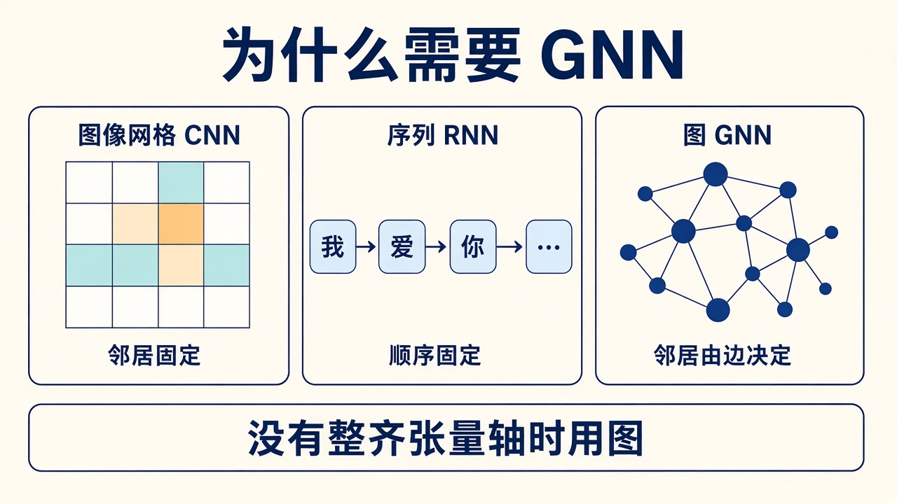
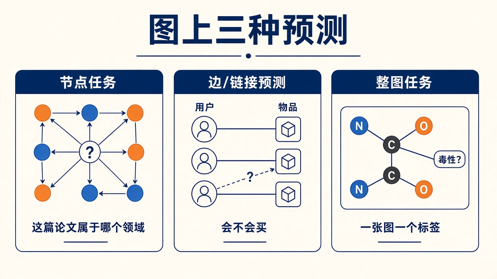
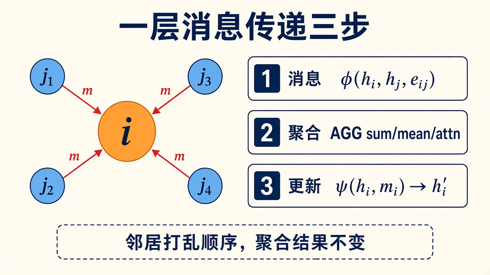
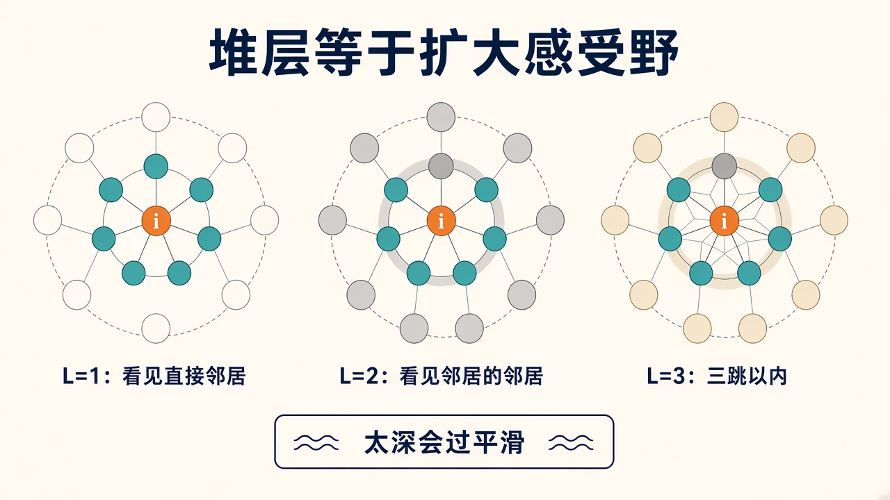
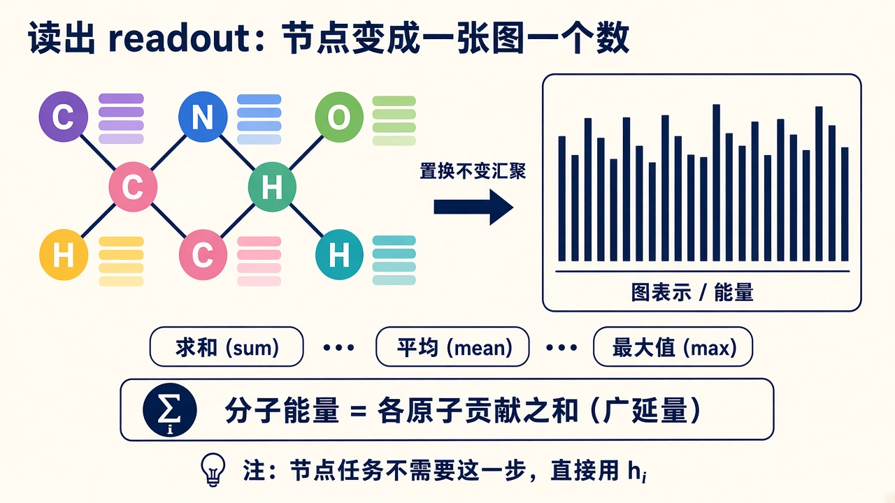

# 消息传递：图上的一层更新到底在算什么

> [!WARNING]
> 🧪 Beta公测版本提示：教程主体已完成，正在优化细节，欢迎大家提Issue反馈问题或建议。

> 变体公式见 [下一章](/nn-decision/dl/gnn/variants/)。本章只把一件事钉死：**一层 GNN = 每个节点向邻居收消息，再更新自己。**

---

## 一、为什么 MLP / CNN / RNN 都不够

MLP 假定输入是一根**固定长度**的特征向量：房价 8 个数、鸢尾花 4 个数。分子有 12 个原子或 80 个原子，路网有 200 个路口或 2 万个路口——你没法预先开一个「刚好这么宽」的全连接层。

CNN 假定邻居在**网格上的固定偏移**：上下左右、\(3\times 3\) 卷积核。句子假定邻居在**时间轴上的左右**：\(t-1\) 和 \(t+1\)。社交图、知识图谱、有限元网格没有这种整齐的轴：A 的邻居可能是 2 个，B 的邻居可能是 40 个，而且谁和谁相连是数据给的，不是你用下标推出来的。

> **图解说明**：CNN 的邻居是格子；RNN 的邻居是时间上的前一个 token；GNN 的邻居是**边上连着的那些节点**。没有边，就没有消息通道。

GNN 的归纳偏置可以写成一句话：

**交换两个不相邻节点的编号，只要边的集合不变，模型给出的预测应当不变**（图同构等变）。参数不绑在「第 3 号节点」上，而绑在「沿边怎么走」上。

---

## 二、图的零件：节点、边、邻域

一张图 \(\mathcal{G}=(V,E)\)：

| 符号 | 含义 | 例子 |
|------|------|------|
| \(V\) | 节点集合，\(\lvert V\rvert=N\) | 原子、用户、路口、网格顶点 |
| \(E\) | 边集合，无向时常写成对称的 \(A_{ij}=A_{ji}\) | 化学键、关注、道路、单元邻接 |
| \(h_i\in\mathbb{R}^{d}\) | 节点 \(i\) 的特征向量 | 原子序数 one-hot、用户画像、当前温度 |
| \(e_{ij}\) | 可选的边特征 | 键长、关系类型、路程 |
| \(\mathcal{N}(i)\) | \(i\) 的邻居 | \(\{j:(j,i)\in E\}\) |

实现上很少存稠密 \(N\times N\) 的 \(A\)。工业默认是 **边列表** `edge_index`，形状 \(2\times E\)：第 0 行是源节点，第 1 行是目标节点。PyG / DGL 都是这套；本章 demo 也是。

有向图、无向图、是否加自环，都要在**建图**时决定，不是训练时再猜。无向图通常把 \((i,j)\) 和 \((j,i)\) 各存一次，这样消息能双向走。

---

## 三、图上要预测什么：节点、边、整图

任务级别决定最后一层接到哪里，也决定要不要做 **readout**。

> **图解说明**：节点任务给每个点一个标签；链接预测问「这条虚线该不该存在」；整图任务把整张图压成一个数（毒性、能量）。

| 级别 | 监督信号在哪 | 典型问题 |
|------|----------------|----------|
| **节点** | 部分 \(v\in V\) 有标签 | 论文领域、用户类型、原子电荷、网格上的场 |
| **边 / 链接** | 节点对 \((i,j)\) | 会不会成为朋友、药物–靶点是否结合、知识图谱补全 |
| **整图** | 一张图一个标签 | 分子毒性、分子总能量、图同构指纹 |

同一套消息传递骨干可以接三种头：节点头读 \(h_i\)；边头读 \((h_i,h_j)\) 或再乘一个关系向量；图头先做 readout 再线性层。

---

## 四、统一模板：消息、聚合、更新

Gilmer et al. 2017 的 MPNN 把几乎所有 GNN 写成三步。对每个节点 \(i\)、第 \(t\) 层：

$$
\begin{aligned}
m_{j\to i}^{(t)} &= \phi\!\left(h_i^{(t)}, h_j^{(t)}, e_{ij}\right)
&&\text{消息：邻居 \(j\) 要告诉 \(i\) 什么}\\
m_i^{(t)} &= \mathrm{AGG}_{j\in\mathcal{N}(i)}\, m_{j\to i}^{(t)}
&&\text{聚合：把所有邻居的话合成一句}\\
h_i^{(t+1)} &= \psi\!\left(h_i^{(t)}, m_i^{(t)}\right)
&&\text{更新：结合「我原来是谁」写出新表示}
\end{aligned}
$$

> **图解说明**：橙色中心是 \(i\)。每条红箭头是一条消息 \(m_{j\to i}\)。AGG 必须对邻居的排列不敏感，否则「先写碳再写氧」和「先写氧再写碳」会变成两个不同的分子。

三步各自常见的选择：

| 步骤 | 常见实现 | 直觉 |
|------|----------|------|
| \(\phi\) | 拷贝 \(h_j\)；MLP\((h_i,h_j,e_{ij})\)；差向量 \(h_j-h_i\) | 要不要看边特征、要不要看自己 |
| AGG | sum / mean / max / 注意力加权和 | 计数 vs 平均 vs 只盯最显著的邻居 |
| \(\psi\) | 线性 + ReLU；GRU；残差 \(h_i+m_i\) | 新信息和旧身份怎么混合 |

**变体的差别几乎全在这三行。** [下一章](/nn-decision/dl/gnn/variants/) 不再另起炉灶，只是给 \(\phi\)、AGG、\(\psi\) 换成具体公式。

代码直觉（不必真的写成 Python 作业）：先对每条边算出消息，再用 `index_add_` 按目标节点求和——as05 和本组 demo 都是这条路，不依赖 PyG。

---

## 五、置换不变：邻居打乱，图还是同一张

聚合为什么不能是「按节点编号拼接再过 MLP」？因为编号是任意的。同一张苯环，你把碳原子从 1…6 改成 6…1，化学没有变。

- **sum / mean / max** 对集合置换不变。
- **注意力加权和** \(\sum_j\alpha_{ij}m_j\) 也不变，只要 \(\alpha_{ij}\) 只依赖特征、不依赖下标。
- **LSTM 按邻居顺序扫一遍**一般**不**置换不变，除非你先对邻居排序（SortPool）或对所有排列取平均。GraphSAGE 论文里的 LSTM aggregator 是有顺序的，实践中更常用 mean / max。

节点级输出应当对图的同构**等变**：节点换号，预测跟着换号。图级输出应当**不变**：整张图一个标签，换号也不该变。

---

## 六、一层只看 1 跳；堆层 = 感受野

一层 GNN，\(i\) 只能看见 \(\mathcal{N}(i)\)。两层之后，\(i\) 看见的是邻居的邻居。堆 \(L\) 层 ≈ 最短路 \(\le L\) 的节点都能影响到 \(i\)——和 CNN 堆卷积核扩大感受野是同一逻辑。

> **图解说明**：\(L=1\) 只涂直接邻居；\(L=2\) 涂上「邻居的邻居」。想用 GNN 做「三跳以内的引用网络分类」，至少要三层，或加一条能跳得更远的边（虚拟节点、层次化图）。

不是越深越好。层一深，节点表示会越来越像，这就是后面 [应用与坑](/nn-decision/dl/gnn/applications/) 要讲的**过平滑**。经验上节点分类常用 2–4 层 GCN/GAT；分子图偶尔更深，但会加残差或 Jumping Knowledge（把各层拼起来）。

---

## 七、读出：什么时候需要「一张图一个向量」

节点任务：最后一层的 \(h_i\) 接一个线性头即可，**没有** readout。

图任务必须把 \(\{h_i\}_{i\in V}\) 压成一个与节点排列无关的向量：

- 求和 / 均值 / max pooling（最常用）
- Set2Set、SortPool
- 层次化 pooling（DiffPool）：边 coarsen、图越来越小

> **图解说明**：分子总能量几乎总是「各原子贡献再求和」——物理上能量是广延量，原子数翻倍，能量也该大约翻倍。均值 pooling 会把「更大的分子」和「更小的分子」在尺度上抹平，回归能量时通常不如 sum。

链接预测常用 \(\mathrm{score}(i,j)=\sigma(h_i^\top h_j)\) 或一个双线性 \(h_i^\top W_r h_j\)（关系 \(r\) 不同则 \(W_r\) 不同）。

---

## 八、和「计算图」不是一件事

| | 数据图 \(\mathcal{G}=(V,E)\) | 计算图（autograd） |
|--|------------------------------|---------------------|
| 节点 | 原子、用户、路口 | 一次加法、一次 `matmul` |
| 边 | 化学键、关注关系 | 「这个张量是那个张量算出来的」 |
| 谁来建 | 你根据问题定义 | 框架根据代码自动建 |

[s05](/nn-decision/dl/forward-graph/) 的计算图解释梯度从哪条路回来。GNN **跑在**计算图上：消息传递的每一步仍然是 `Linear`、`index_add_`、`softmax`，反向传播照常。不要把「图神经网络」理解成「换了一种自动求导」。

---

## 九、本节小结

- 图 = 节点特征 + 边（谁和谁说话）。没有整齐网格时，用边定义邻居。
- 一层 = \(\phi\) 算消息 → AGG 置换不变聚合 → \(\psi\) 更新自己。
- \(L\) 层 ≈ \(L\) 跳感受野。任务级别决定读 \(h_i\)、读边，还是 readout 整张图。
- 下一章把 GCN / SAGE / GAT / GIN 逐个代进这三步。

> 下一站：[变体](/nn-decision/dl/gnn/variants/)。科学侧网格扩散见 [as05](/science/gnn/)。
