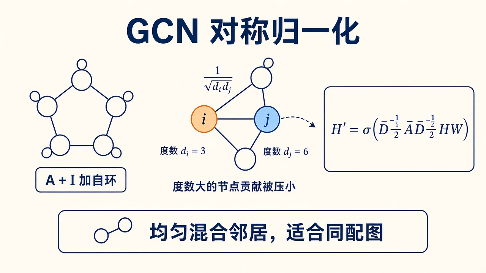
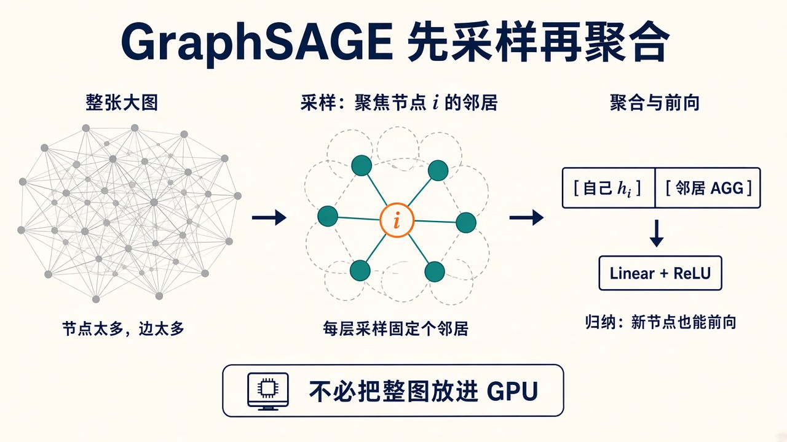
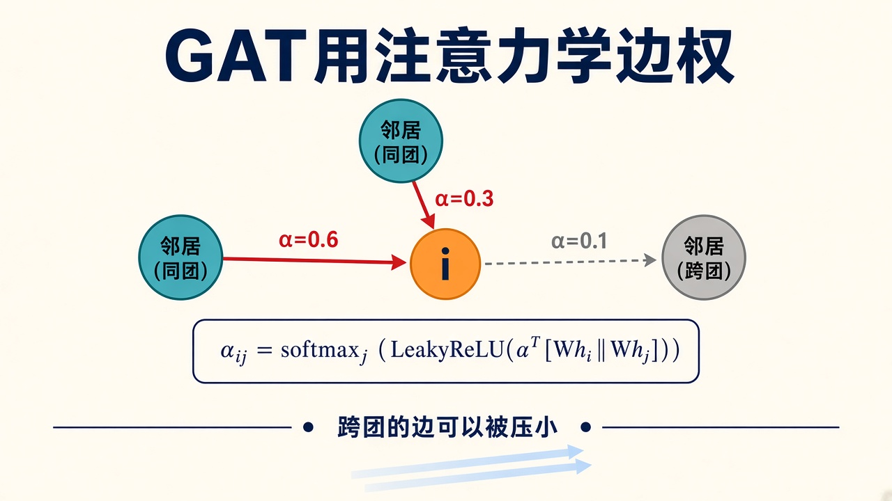
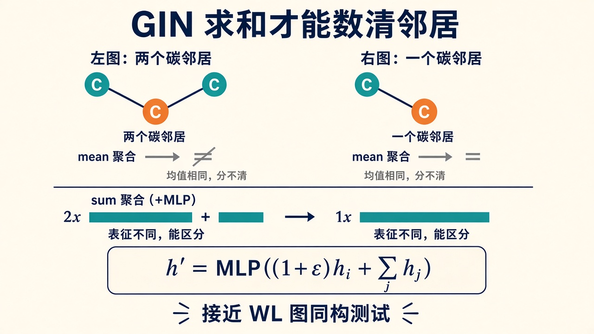
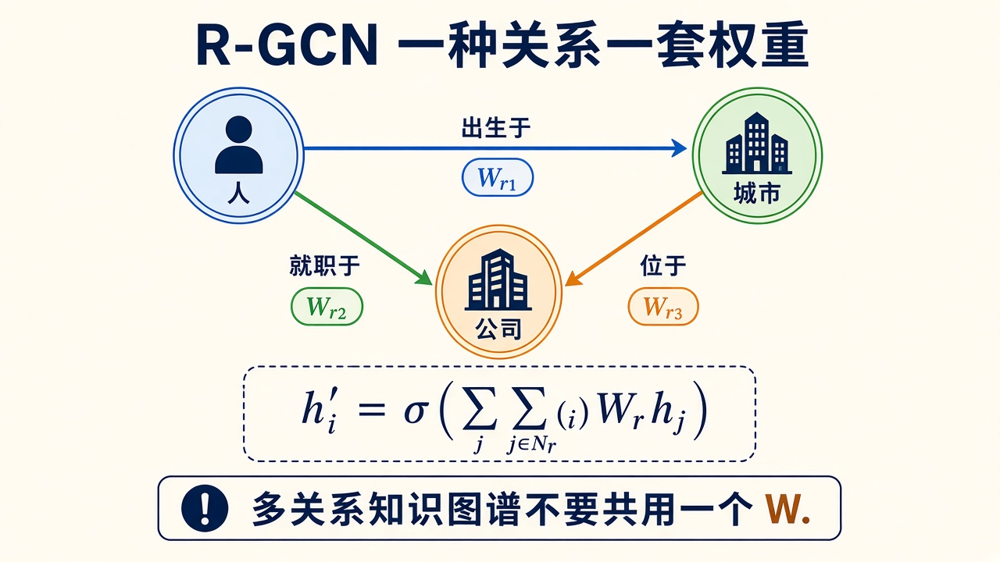
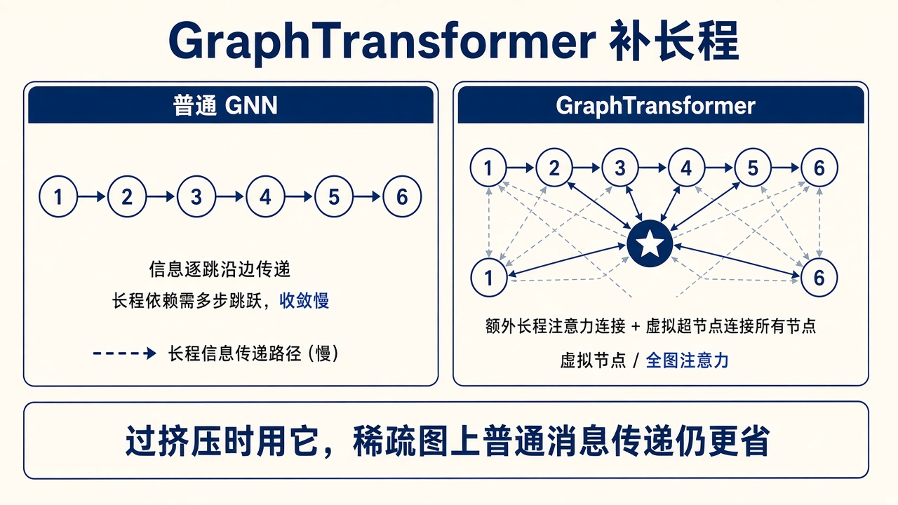
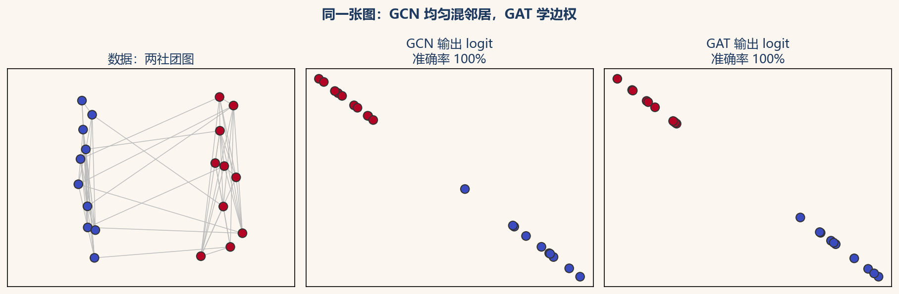

# GNN 变体：GCN、SAGE、GAT、GIN 各自改了哪一步

> [!WARNING]
> 🧪 Beta公测版本提示：教程主体已完成，正在优化细节，欢迎大家提Issue反馈问题或建议。

> 上一章的三步是 \(\phi\) → AGG → \(\psi\)。[消息传递](/nn-decision/dl/gnn/message-passing/) 不重复。这里每个变体单独成节。`demo.py` 从零实现 GCN vs GAT（不装 PyG）。对称归一化 $1/\sqrt{d_i d_j}$ 的来源在折叠里。

---

## 一、先看一张总表，再往下拆

| 变体 | 聚合 AGG | 关键改动 | 典型场景 |
|------|----------|----------|----------|
| **GCN** | 对称归一化求和 | \(\tilde D^{-1/2}\tilde A\tilde D^{-1/2}\) | 同配节点分类基线 |
| **GraphSAGE** | 采样 + mean/max | 归纳、固定邻居预算 | 大图推荐、社交 |
| **GAT** | 注意力 \(\alpha_{ij}\) | 边重要性不同 | 异配、知识图谱 |
| **GIN** | 求和 + MLP | 接近 WL 判别力 | 分子、图分类 |
| **MPNN** | 任意 \(\phi\)，可含 \(e_{ij}\) | 最通用模板 | 量子化学、力场 |
| **R-GCN** | 每种关系一套 \(W_r\) | 多关系 | 知识图谱 |
| **GraphTransformer** | 全图或稀疏注意力 | 长程 | 蛋白质、过挤压 |

旧式 **ChebNet**（切比雪夫多项式近似谱卷积）和 **GGNN**（用 GRU 当 \(\psi\)）是同一模板的早期实例。现在新工作多从 GCN / GAT / GIN 或 Transformer 起步。

---

## 二、GCN：先加自环，再按度数打折

Kipf & Welling, 2017。谱图卷积的一阶近似，最后写成非常好实现的矩阵式：

$$
H^{(t+1)} = \sigma\!\left(\tilde D^{-1/2}\tilde A\tilde D^{-1/2} H^{(t)} W\right)
$$

其中 \(\tilde A=A+I\)（每个节点也把自己当邻居），\(\tilde D_{ii}=\sum_j\tilde A_{ij}\)。落到边上：节点 \(j\) 对 \(i\) 的贡献权重是 \(1/\sqrt{\tilde d_i\tilde d_j}\)。



> **图解说明**：度数 6 的大 V 若和度数 2 的小节点均权相加，会把邻居「冲掉」。除以 \(\sqrt{d_i d_j}\) 是两边各打一次折。自环保证「更新时还记得自己是谁」——否则 \(\psi\) 里如果不显式拼 \(h_i\)，一层就会把自身特征冲光。

对应 MPNN：

- \(\phi\)：就是 \(W h_j\)（所有边共用一个 \(W\)）
- AGG：按 \(1/\sqrt{d_i d_j}\) 加权求和
- \(\psi\)：非线性 \(\sigma\)（通常 ReLU）

**何时用。** 引用网络、同配社团（邻居标签往往相同）：消息相当于在图上做一次平滑，同类会被拉近。便宜，是任何节点分类的第一基线。

**数字例。** 节点 $i$ 度数 1、邻居 $j$ 度数 3，自环后 $\tilde d_i=2$、$\tilde d_j=4$，边权 $1/\sqrt{8}\approx 0.35$。若改成均权 1，高度数节点会淹没别人。GAT 则学 $\alpha_{ij}\propto \exp(\mathrm{LeakyReLU}(a^\top[Wh_i\|Wh_j]))$，同一条边权重可随特征变。

::: details 逐步推导：GCN 对称归一化与 GAT 注意力（点击展开）

谱卷积一阶近似：$I+D^{-1/2}AD^{-1/2}$ 特征值可 $>2$，Kipf 改用 $\tilde D^{-1/2}\tilde A\tilde D^{-1/2}$ 把谱压到 $[0,2]$，再常乘 $\tilde A$ 重标。矩阵形式一次稀疏乘：`A_hat @ H @ W`。

GAT：对每个 $i$ 在邻居上做 softmax，AGG 是加权和。多头再拼接或平均。SAGE：先对邻居采样固定个 $k$，mean 后与 $h_i$ 拼接过线性——归纳，未见过的节点也能推。GIN：$h_i\leftarrow \mathrm{MLP}\bigl((1+\varepsilon)h_i+\sum_j h_j\bigr)$，sum 可区分度数，逼近 WL 测试。

:::

**何时不用。** 异配图（好友标签经常相反）、必须数清「有几个碳」的分子图（mean 型归一化会丢掉计数，见 GIN）、超大图不能把整图 \(A\) 放进显存（改 SAGE）。

实现上**不必**真的存稠密 \(A\)：对每条边累加 \(x_j/\sqrt{d_i d_j}\) 即可。demo 里图很小，才用矩阵乘图个明白。

---

## 三、GraphSAGE：采样，所以新节点也能跑

Hamilton et al., 2017。GCN 早期实验多是**转导（transductive）**：测试节点在训练时就已经出现在同一张图里，只是没标签。社交 / 推荐每天都有新用户、新物品——必须**归纳（inductive）**。

GraphSAGE 的办法：不要用全部邻居，每层每个节点**采样固定个**邻居（例如 25 个、10 个），再 mean / max / LSTM 聚合，最后把「自己」和「邻居摘要」拼起来：

$$
h_i' = \sigma\!\bigl(W\,\bigl[h_i \,\|\, \mathrm{AGG}(\{h_j:j\in\mathrm{Sample}(\mathcal{N}(i))\})\bigr]\bigr)
$$



> **图解说明**：左边是放不进 GPU 的整图。中间只留下预算内的邻居。右边 \([h_i\| \mathrm{AGG}]\) 明确保留自身，新节点只要带上特征和边，就可以前向，不必重训整张图。

对应 MPNN：\(\phi\) 常取恒等；AGG 是**采样后的** mean/max；\(\psi\) 是拼接再线性。

PinSage（Pinterest）把这一套做到十亿边：随机游走采样、重要邻居优先、硬负样本。工业推荐里「GNN」三个字母，背后经常是 SAGE 而不是教科书 GCN。

**和 GCN 的边界。** 小图、转导、要最强平滑基线 → GCN。大图、新节点、必须控制邻居爆炸 → SAGE。SAGE 也可以不加采样、用全邻居，那它就退化成「拼接自身的 mean-GCN」。

---

## 四、GAT：边权不是均分，是学出来的

Veličković et al., 2018。GCN 的 \(1/\sqrt{d_i d_j}\) 只看度数，不看「这个邻居和我像不像」。GAT 给每条边打分，再在**指向同一个 \(i\) 的那些边上**做 softmax：

$$
e_{ij} = \mathrm{LeakyReLU}\!\left(a^\top [W h_i \,\|\, W h_j]\right),\qquad
\alpha_{ij} = \mathrm{softmax}_{j\in\mathcal{N}(i)}(e_{ij})
$$

$$
h_i' = \sigma\!\left(\sum_{j\in\mathcal{N}(i)}\alpha_{ij}\, W h_j\right)
$$

注意 softmax 的范围是 \(\mathcal{N}(i)\)，不是全图。这和 Transformer 的全局注意力不同：图很稀疏时，GAT 仍然只在边上打分。



> **图解说明**：同社团的边 \(\alpha\) 大，跨团的边可以被压到接近 0。多头就是并行几组 \((W,a)\)，把几路加权和拼起来（或平均）——和 Transformer 多头是同一招，只是「谁算邻居」仍由边决定。

对应 MPNN：\(\phi\) 产出 \(W h_j\)；AGG 是 \(\sum\alpha_{ij}\,\cdot\)；\(\psi\) 是 \(\sigma\)。

**何时用。** 边的语义差很大（知识图谱、异配、分子里「这根键重要、那根是溶剂噪声」）。代价是每条边一次打分，比 GCN 贵。

**和 Transformer。** 把图补成全连接、每个 token 都是邻居，GAT 就变成（一种）Transformer。图本来就稀疏、边有物理意义时，**不要**先丢掉边再上全局注意力——既贵，又丢掉归纳偏置。长程再看下面第七节。

demo 里 `GATLayer` 用循环按 `dst==i` 做 softmax，图小才敢这样；大图要用分段 softmax 或 `scatter_softmax`。

---

## 五、GIN：mean 分不清「两个碳」和「一个碳」

Xu et al., 2019。Weisfeiler–Lehman（WL）图同构测试的直觉：给每个节点一个颜色，迭代「用邻居颜色的**多重集**更新自己的颜色」。如果两张图最终颜色计数不同，它们不同构。

GNN 若用 **mean** 或 **max** 聚合，多重集被压成「平均画像」或「最显眼的那个邻居」——**两个碳邻居**和**一个碳邻居**，均值可能一样。论文证明：这类 GNN **严格弱于** 1-WL。

GIN 用求和（保留计数）再过 MLP（近似单射）：

$$
h_i' = \mathrm{MLP}\!\left((1+\varepsilon)\,h_i + \sum_{j\in\mathcal{N}(i)} h_j\right)
$$

\(\varepsilon\) 可以是可学习标量。\((1+\varepsilon)h_i\) 把自身和邻居的和分开，避免「我和邻居加在一起刚好撞上另一种组合」。



> **图解说明**：左边两个碳、右边一个碳。mean 可能给出同一个向量；sum 的模长不同，MLP 就能分开。分子指纹、图分类优先考虑 GIN 或「sum 型 MPNN」，而不是 GCN 的对称均值。

**何时用。** 图分类、需要数原子环境、要逼近 WL。节点分类、同配引用网，GIN 不一定比 GCN 准——判别力强不等于平滑得好。

---

## 六、R-GCN：一种关系，一套权重

知识图谱的边带类型：\((h,\text{出生于},t)\) 和 \((h,\text{就职于},t)\) 不该共用一个 \(W\)。R-GCN（Schlichtkrull et al., 2018）：

$$
h_i' = \sigma\!\left(\sum_{r\in\mathcal{R}}\sum_{j\in\mathcal{N}_r(i)} \frac{1}{c_{i,r}} W_r h_j + W_0 h_i\right)
$$

每种关系 \(r\) 一个 \(W_r\)。关系特别多时用分块对角 / 基分解压缩参数，否则 \(W_r\) 会炸。



> **图解说明**：蓝边「出生于」、绿边「就职于」走不同的线性变换。链接预测时，再拿 \(h_s,r,h_o\) 打一个三元组分数（DistMult、ComplEx 等解码器）。

普通 GCN 等于「只有一种关系」。看到数据是多关系三元组，先问要不要 R-GCN / CompGCN，而不是硬把所有边涂成一种颜色。

---

## 七、GraphTransformer：补长程

消息沿边走 \(L\) 步，最远大约 \(L\) 跳。图有瓶颈边时，远处信息挤不过去（过挤压）。补丁：

- **虚拟节点**：加一个连到所有人的超级节点，两层就能全图通气
- **GraphTransformer**：在节点集合上做（稀疏）自注意力，边只作为偏置或门



> **图解说明**：左是逐步跳边；右是远处也可以直接注意，或经过虚拟节点中转。蛋白质、长程依赖、深层过挤压时考虑它。边非常稀疏、局部物理相互作用为主时，普通 MPNN 仍然更省、也更有归纳偏置。

---

## 八、怎么选：一条短决策链

1. **先问任务和建图**，再问变体。图建错，GAT 也在拟合噪声，见 [应用与坑](/nn-decision/dl/gnn/applications/)。
2. 小图节点分类、同配 → **GCN** 基线。
3. 大图、新节点、推荐 → **GraphSAGE**（采样）。
4. 边重要性差、异配 → **GAT**。
5. 图分类、数邻居、分子指纹 → **GIN** / sum-MPNN。
6. 边有类型 → **R-GCN**。
7. 要键角、坐标、力 → 几何 MPNN（SchNet / DimeNet），\(\phi\) 里必须进连续几何，见 as05。
8. 长程、瓶颈 → 虚拟节点或 **GraphTransformer**。

---

## 九、同一张玩具图：GCN 平滑，GAT 学边权

demo 造两社团随机图（团内边密、团间稀），节点特征是度数 + 带噪声的社团指示。两边都做节点分类。GCN 用对称归一化；GAT 按目标节点 softmax。



> **图解说明**：左是数据。中 / 右是训练后的二维 logit。图中准确率是同一批训练节点上的训练准确率；所有节点标签均参与损失，没有独立测试或泛化评估。看的是训练输出有没有按社团分开，不能作为模型优劣的实验结论。源码从零写，不装 PyG。逐步讲解见 [code-demo](/nn-decision/dl/gnn/code-demo)。

```bash
cd docs/nn-decision/dl/gnn/code
python demo.py
```

练习：`gcn_normalize`（对称归一化）和 `dst_softmax`（GAT 那一步），见 [code-exercise](/nn-decision/dl/gnn/code-exercise)。

---

## 十、本节小结

| 变体 | 一句话 |
|------|--------|
| GCN | 自环 + \(1/\sqrt{d_i d_j}\)，平滑、便宜 |
| SAGE | 采样邻居，归纳、能上大图 |
| GAT | \(\alpha_{ij}\) 学出来，边可以不均权 |
| GIN | 求和 + MLP，才能数清邻居 |
| R-GCN | 一种关系一套 \(W_r\) |
| GraphTransformer | 注意力补长程 |

> 下一站：[应用与坑](/nn-decision/dl/gnn/applications/)。科学网格 / 分子仍看 [as05](/science/gnn/)。

**对照 demo.py。** 同一张小图上的全监督训练拟合。节点特征含标签加噪声构造的社团指示，已经提供分类线索；图中只展示二维 logit，没有注意力热图，不能断言 GAT 把权重集中在少数边上。均匀注意力对应邻居均值，并不一般等于 GCN 的对称度归一化。卡点：没有自环时 GCN 公式里的 $\tilde A=A+I$ 被你忘了加，节点会丢掉自身特征；注意力温度太大则 $\alpha_{ij}$ 变均匀，学了等于没学。

---

## 参考

1. Kipf, T. N., & Welling, M. (2017). Semi-Supervised Classification with Graph Convolutional Networks. *ICLR*. [[arXiv:1609.02907](https://arxiv.org/abs/1609.02907)]
2. Hamilton, W., Ying, R., & Leskovec, J. (2017). Inductive Representation Learning on Large Graphs. *NeurIPS*. [[arXiv:1706.02216](https://arxiv.org/abs/1706.02216)]
3. Veličković, P., et al. (2018). Graph Attention Networks. *ICLR*. [[arXiv:1710.10903](https://arxiv.org/abs/1710.10903)]
4. Xu, K., et al. (2019). How Powerful are Graph Neural Networks? *ICLR*. [[arXiv:1810.00826](https://arxiv.org/abs/1810.00826)]
5. Schlichtkrull, M., et al. (2018). Modeling Relational Data with Graph Convolutional Networks. *ESWC*. [[arXiv:1703.06103](https://arxiv.org/abs/1703.06103)]
6. Gilmer, J., et al. (2017). Neural Message Passing for Quantum Chemistry. *ICML*. [[arXiv:1704.01212](https://arxiv.org/abs/1704.01212)]
