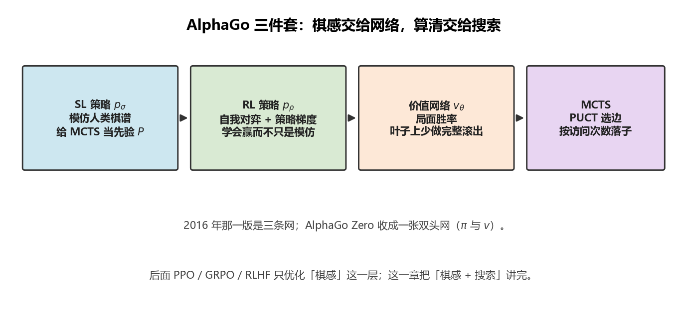
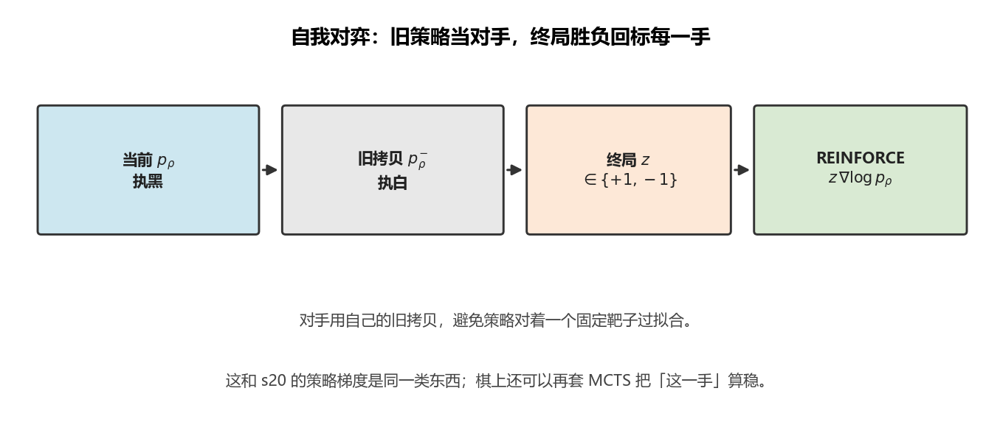
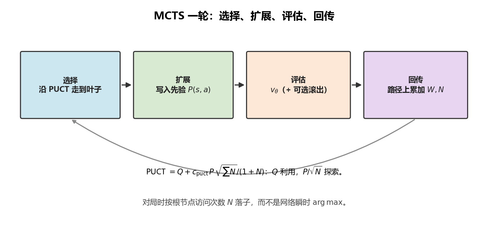
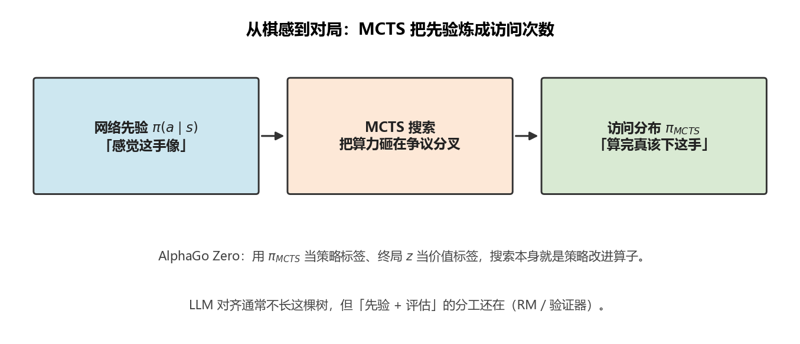

# AlphaGo：策略网络、价值网络与树搜索

> [!WARNING]
> 🧪 Beta公测版本提示：教程主体已完成，正在优化细节，欢迎大家提Issue反馈问题或建议。

> 上一章用神经网络逼近 $Q$ 或 $\pi$。围棋的动作空间约 $250$ 手、局面约 $10^{170}$，单靠一次前向传播选子仍然太莽。AlphaGo 的答案是：**网络负责「感觉」，蒙特卡洛树搜索（MCTS）负责「想清楚」。** 后面的 PPO / GRPO / RLHF 都在优化「感觉」；这一章先把「感觉 + 搜索」讲透。

前置：[深度强化学习](/nn-decision/rl/deep-rl/) 的策略梯度与 Actor-Critic。



> **图解说明**：三条网各管一件事——模仿、会赢、估胜率；对局时真正下棋的是右边的 MCTS。

---

## 一、为什么围棋不能只靠一张网

Atari 上 DQN 可以「看像素 → 选键」。围棋不行，原因很具体：

1. **分支因子大**：每步合法落子经常超过 $200$，穷举几步就爆炸。
2. **奖励极稀疏**：终局才知道输赢，$r \in \{+1,-1\}$，中间 $200$ 手几乎没有即时反馈。
3. **「看起来好」≠「算完真好」**：人类也是先凭棋感缩小候选，再在局部算清。

所以 AlphaGo 把问题拆成两层：

| 层 | 谁来做 | 输出 |
|----|--------|------|
| 棋感 | 深度网络 | 先验 $\pi(a\mid s)$、局面价值 $v(s)$ |
| 计算 | MCTS | 访问次数 $N(s,a)$，对局时按访问选子 |

网络提出候选并评估叶子；树在这张「缩小后的地图」上把计算预算砸在关键变化上。

---

## 二、2016 年那一版：三条网，再加搜索

Silver 等人发表在 *Nature* 的 AlphaGo（对阵李世石的那套）不是一张网打天下，而是**三条网 + 快速走子 + MCTS**：

### 2.1 监督学习策略 $p_\sigma$（SL policy）

用人类对局 $(s, a^\star)$ 做分类：

$$
\Delta\sigma \propto \nabla_\sigma \log p_\sigma(a^\star \mid s)
$$

它学的是「职业棋手会下哪」。这不是最优策略，但足够给 MCTS 一个靠谱的**先验**，让搜索别在明显的废棋上浪费模拟。

### 2.2 强化学习策略 $p_\rho$（RL policy）

从 $p_\sigma$ 出发，用**自我对弈**做策略梯度（和 [s20](/nn-decision/rl/deep-rl/) 的 REINFORCE 是同一类东西）：

$$
\nabla_\rho J \approx \mathbb{E}\big[\nabla_\rho \log p_\rho(a_t\mid s_t)\, G\big]
$$

$G$ 是终局胜负。对手是 $p_\rho$ 自己的旧拷贝，避免策略对着一个固定靶子过拟合。产出的 $p_\rho$ 比 $p_\sigma$ 更会赢，但仍是「一步棋的分布」，不是完整变化图。

### 2.3 价值网络 $v_\theta$

在自我对弈产生的局面上回归胜率：

$$
v_\theta(s) \approx \mathbb{E}[z \mid s]
$$

$z$ 是以该局面为起点、双方都用强策略下完的结果。价值网让 MCTS **不必每次都滚到终局**——叶子上一次前向，就能得到「这盘大概率谁赢」。

原始 AlphaGo 的叶子评估还混了一点**快速走子策略** $p_\pi$ 的随机滚出，和 $v_\theta$ 加权。直觉：网络看全局形势，滚出抓战术过招。



> **图解说明**：对手是自己的旧拷贝，终局 $z$ 沿整盘回传，和 s20 的 REINFORCE 同一类梯度。

---

## 三、MCTS：把计算预算花在刀刃上

对局时真正下棋的不是「网络 $\arg\max$」，而是一棵从当前局面长出来的搜索树。每条边存：

- $N(s,a)$：访问次数
- $W(s,a)$：累计价值
- $Q(s,a) = W/N$：平均价值
- $P(s,a)$：策略网给出的先验

一次模拟四步，循环几千次：

```
选择 Selection     从根沿树走，直到叶子
扩展 Expansion     用策略网展开合法手，写入 P
评估 Evaluation    价值网（+ 可选滚出）给叶子打分 v
回传 Backup        把 v 加到路径上每一条边的 W、N
```

### 3.1 怎么选边：PUCT

AlphaGo 用的选择规则是 PUCT（PUCB 的变体）：

$$
a_t = \arg\max_a \left(
  Q(s,a) + c_{\mathrm{puct}}\, P(s,a)\, \frac{\sqrt{\sum_b N(s,b)}}{1+N(s,a)}
\right)
$$

两项分工非常清楚：

- $Q$：**利用**——目前算下来赢面高的手。
- 后一项：**探索**——先验 $P$ 大、但还没被访问够的手，会被加成抬起来。

访问越多，$Q$ 越可信，探索项衰减。这就是「先听棋感，再把算力堆到真正有争议的分叉」。

### 3.2 对局时怎么落子

搜索结束后，根节点按访问次数采样（训练自我对弈时还加温度；正式比赛常取 $\arg\max N$）。**访问次数**比瞬时 $Q$ 更稳：被反复算过的变化，才值得真下。



> **图解说明**：四步循环几千次。对局按根上的 $N$ 落子，而不是网络瞬时 $\arg\max$。

---

## 四、AlphaGo Zero：烧掉人类棋谱

2017 年的 AlphaGo Zero 把三条网收成**一张双头网**：同一个塔，一头 $\pi$，一头 $v$。训练信号全部来自自我对弈：

- MCTS 改进后的落子分布 $\pi_{\mathrm{MCTS}}$ 当策略标签；
- 终局 $z$ 当价值标签。

损失函数可以写成：

$$
\ell = (z - v)^2 - \pi_{\mathrm{MCTS}}^\top \log \mathbf{p} + c\|\theta\|^2
$$

要点不是「更炫的架构」，而是：**搜索既是对局引擎，也是策略改进算子。** 网络提出先验 → MCTS 把它炼成更好的 $\pi_{\mathrm{MCTS}}$ → 网络再去拟合这个更好的分布。人类棋谱从必要变成可选。

后面 MuZero 又把「规则已知」放松成「隐式环境模型」，那是世界模型路径上的故事，见 [MuZero](/world-models/abstract/muzero/)。

---

## 五、和后面几章怎么接

把 AlphaGo 拆成三块积木，后面可以原样拎走：

| 积木 | AlphaGo 里 | 后面谁用 |
|------|------------|----------|
| 策略梯度 / 自我对弈 | 训 $p_\rho$ | [PPO](/nn-decision/rl/ppo/) 把「更新别迈太大」做稳 |
| 价值基线 | $v_\theta$ 降方差、给叶子打分 | PPO 的 Critic；[GRPO](/nn-decision/rl/grpo/) 则用组内相对分数**代替** Critic |
| 搜索 | MCTS | 对局可以搜；LLM 对齐通常**不搜整棵树**，但「先验 + 评估」的分工还在 |

> 下一节不要跳去 RLHF。先把 [PPO](/nn-decision/rl/ppo/) 的裁剪目标和 GAE 讲完，再看 DeepSeek 的 [GRPO](/nn-decision/rl/grpo/)，最后才把这些优化器接到大模型上。



> **图解说明**：Zero 用 $\pi_{\mathrm{MCTS}}$ 当训练标签——搜索既是引擎，也是策略改进算子。

---

## 六、本节小结

| 概念 | 一句话 |
|------|--------|
| 棋感 vs 计算 | 网络给先验和价值；MCTS 把有限模拟砸在关键变化上 |
| SL 策略 | 模仿人类落子，给搜索当靠谱的 $P(s,a)$ |
| RL 策略 | 自我对弈 + 策略梯度，学会赢而不是模仿 |
| 价值网络 | 叶子上估计胜率，少做完整滚出 |
| PUCT | $Q$ 负责利用，$P/\sqrt{N}$ 负责探索 |
| AlphaGo Zero | 一张双头网，用 MCTS 改进后的 $\pi$ 当训练目标 |

## 📥 Code

| File | View | Download |
|------|------|----------|
| demo.py | [Open](./code-demo) | <a href="/notebook/code/nn-decision/rl/alphago/demo.py" target="_blank" download>Download</a> |
| exercise.py | [Open](./code-exercise) | <a href="/notebook/code/nn-decision/rl/alphago/exercise.py" target="_blank" download>Download</a> |

## 参考

1. Silver, D., et al. (2016). Mastering the game of Go with deep neural networks and tree search. *Nature*. [[doi:10.1038/nature16961](https://doi.org/10.1038/nature16961)]
2. Silver, D., et al. (2017). Mastering the game of Go without human knowledge. *Nature*. (AlphaGo Zero) [[doi:10.1038/nature24270](https://doi.org/10.1038/nature24270)]
3. Kocsis, L. & Szepesvári, C. (2006). Bandit based Monte-Carlo Planning. *ECML*. (UCT)
4. Rosin, C. D. (2011). Multi-armed bandits with episode context. *Annals of Mathematics and Artificial Intelligence*. (PUCB / PUCT 先验)
