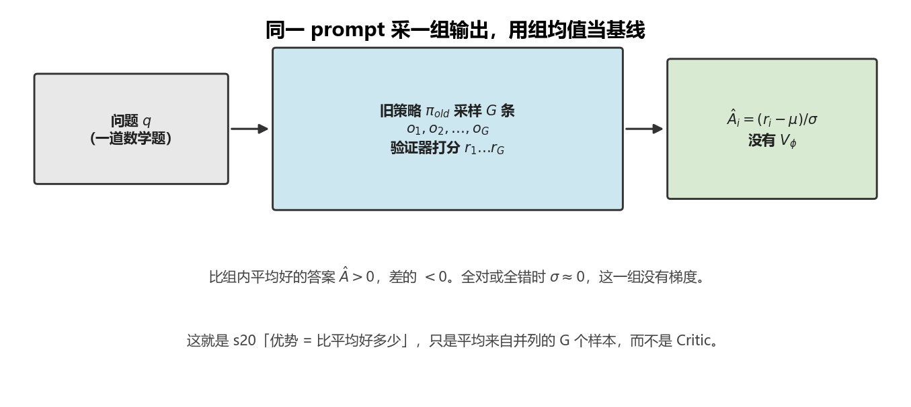
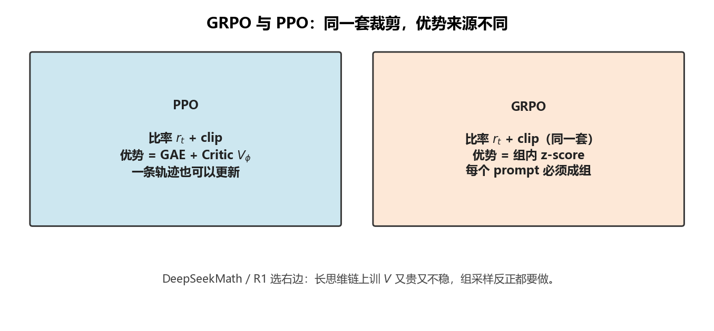
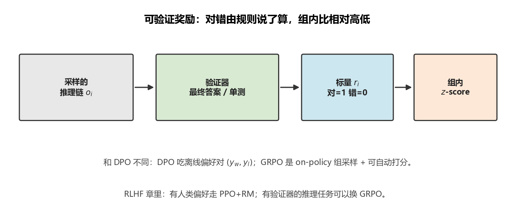
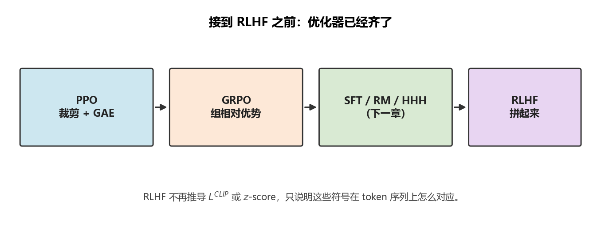

# GRPO：DeepSeek 用组内相对分数代替 Critic

> [!WARNING]
> 🧪 Beta公测版本提示：教程主体已完成，正在优化细节，欢迎大家提Issue反馈问题或建议。

> [PPO](/nn-decision/rl/ppo/) 要同时训 Actor 和 Critic。长思维链上价值网络又贵又不稳：一个答案可能上千 token，Critic 很难学会「想到一半值多少分」。DeepSeekMath（2024）提出 **GRPO（Group Relative Policy Optimization）**，DeepSeek-R1 用它做推理向的强化学习。核心就一句：**同一个问题采一组答案，用组内相对奖励当优势，不再单独学 $V(s)$。** [RLHF](/nn-decision/rl/rlhf/) 里如果你听到「R1 没用经典 PPO Critic」，指的就是这一章。

> **图解说明**：基线是这 $G$ 个数的均值，不是价值网络。全对或全错就没有梯度。

---

## 一、PPO 在长序列上的痛

PPO 的 $\hat{A}_t$ 依赖 $V_\phi(s_t)$。语言建模里 $s_t$ 是「prompt + 已写 token」，价值函数要在巨大的前缀空间里泛化。结果是：

- 多一个和 Actor 同量级的网络（内存、同步、调参）；
- 稀疏终局奖励（对/错、验证器分数）让 $V$ 的回归目标噪声极大；
- 同一道题的不同采样，绝对分数不可比，但**彼此相对**很稳。

GRPO 的赌注：既然 anyway 都要对一个 prompt 采多个输出（为了探索），那就让这组输出**互相当基线**。

---

## 二、组相对优势

对每个问题 $q$，从旧策略采 $G$ 条完整输出 $o_1,\ldots,o_G$，各得标量奖励 $r_i$（规则、验证器或奖励模型均可）。组内标准化：

$$
\hat{A}_i = \frac{r_i - \mathrm{mean}(\mathbf{r})}{\mathrm{std}(\mathbf{r})+\epsilon}
$$

同一条 $o_i$ 里的每个 token 共用这个 $\hat{A}_i$（DeepSeek 的默认；也可以再做 token 级塑造，但教学上先记住「**整段话一个相对分**」）。

没有单独的 $V_\phi$。基线就是 $\mathrm{mean}(\mathbf{r})$：比组内平均好的输出 $\hat{A}>0$，差的 $<0$。这正是 [s20](/nn-decision/rl/deep-rl/)「优势 = 比平均好多少」在**一组并列样本**上的实现，而不是在状态价值网上的实现。

若一组全对或全错，$\mathrm{std}\approx 0$，这一组没有学习信号——实践里会跳过或加噪声，避免除零。

---

## 三、目标函数：PPO 的壳，组相对的芯

比率仍是 PPO 的：

$$
r_{i,t}(\theta)=\frac{\pi_\theta(o_{i,t}\mid q,o_{i,<t})}{\pi_{\theta_{\mathrm{old}}}(o_{i,t}\mid q,o_{i,<t})}
$$

裁剪目标对组内每条输出、每个 token 求平均：

$$
\begin{aligned}
J_{\mathrm{GRPO}}(\theta)
=\mathbb{E}_{q,\{o_i\}}
\frac{1}{G}\sum_{i=1}^{G}
\frac{1}{|o_i|}\sum_{t=1}^{|o_i|}
\Big[
&\min\big(r_{i,t}\hat{A}_i,\;
\mathrm{clip}(r_{i,t},1-\varepsilon,1+\varepsilon)\hat{A}_i\big)\\
&-\beta\, D_{\mathrm{KL}}\big[\pi_\theta\|\pi_{\mathrm{ref}}\big]
\Big]
\end{aligned}
$$

和 PPO 对齐着读：

| 零件 | PPO | GRPO |
|------|-----|------|
| 概率比 + clip | 有 | **同一套** |
| 优势 $\hat{A}$ | GAE + Critic $V_\phi$ | **组内 $z$-score** |
| KL 到参考策略 | 常作为奖励塑形 | 显式加在目标里（系数 $\beta$） |
| 每个 prompt 的样本 | 一条轨迹也行 | **必须成组**（$G$ 常取 $8\sim 64$） |

KL 项把策略拴在参考模型（SFT / 旧 checkpoint）上，作用等价于 RLHF 里那根「橡皮筋」，只是 GRPO 论文把它写进损失而不是改写标量奖励。

> **图解说明**：左边 GAE+Critic，右边组内 z-score。$r_t$ 和 clip 是同一套壳。

---

## 四、为什么适合 DeepSeek 式的推理训练

R1 / Math 类任务有三个特点，和 GRPO 咬合：

1. **可自动打分**：数学、代码可以用最终答案或单测当 $r_i$，不必每一步都有人类。
2. **需要探索**：同一道题必须看到对的和错的推理链，组内对比才有梯度。
3. **序列很长**：省掉价值网，训练栈更简单。

它**不是**「比 PPO 更强的万能算法」。没有组内方差时（$G=1$，或 $G$ 条奖励全相同）GRPO 退化成几乎没信号。控制类密集奖励、单条长轨迹，PPO + GAE 往往更合适。

和 DPO 的差别也要分清：DPO 吃的是**离线偏好对** $(y_w,y_l)$；GRPO 是 **on-policy 组采样 + 可验证奖励**。RLHF 可以 PPO，也可以在有验证器的任务上换成 GRPO。

> **图解说明**：和 DPO 的差别——DPO 吃离线偏好对，GRPO 吃 on-policy 组采样。

---

## 五、接到 RLHF 之前你需要带走的

下一章 [RLHF](/nn-decision/rl/rlhf/) 会把 LLM 写成 MDP：状态是前缀，动作是 token。那里：

- 若走 InstructGPT 路线：奖励来自**奖励模型**，优化器是 [PPO](/nn-decision/rl/ppo/)（带 KL）；
- 若走 DeepSeek-R1 路线：奖励来自**规则 / 验证器**（外加少量偏好），优化器可以是 **GRPO**。

SFT、偏好数据、HHH 对齐，仍然是 RLHF 章的主题；**裁剪、比率、优势、KL** 已经在 PPO / 本章讲完，RLHF 只负责「这些符号在 token 序列上怎么对应」。

> 下一节 [s21 RLHF](/nn-decision/rl/rlhf/)：人类反馈、奖励模型和 DPO。PPO / GRPO 当工具用，不再展开推导。

> **图解说明**：下一章只负责 SFT / RM / HHH / DPO，以及这些符号在 token 上怎么对应。

---

## 六、本节小结

| 概念 | 一句话 |
|------|--------|
| 组 | 同一 prompt 下 $G$ 条完整输出 |
| 相对优势 | $(r_i-\mathrm{mean})/\mathrm{std}$，不再训 $V$ |
| 目标 | PPO-Clip 套在 token 条件概率上 |
| KL | 拉住参考模型，防奖励黑客 |
| 适用 | 可验证、需多样采样的推理任务 |
| 不适用 | $G=1$ 或组内奖励全相同 |

## 📥 Code

| File | View | Download |
|------|------|----------|
| demo.py | [Open](./code-demo) | <a href="/notebook/code/nn-decision/rl/grpo/demo.py" target="_blank" download>Download</a> |
| exercise.py | [Open](./code-exercise) | <a href="/notebook/code/nn-decision/rl/grpo/exercise.py" target="_blank" download>Download</a> |

## 参考

1. Shao, Z., et al. (2024). DeepSeekMath: Pushing the Limits of Mathematical Reasoning in Open Language Models. [[arXiv:2402.03300](https://arxiv.org/abs/2402.03300)]（提出 GRPO）
2. DeepSeek-AI (2025). DeepSeek-R1: Incentivizing Reasoning Capability in LLMs via Reinforcement Learning. [[arXiv:2501.12948](https://arxiv.org/abs/2501.12948)]
3. Schulman, J., et al. (2017). Proximal Policy Optimization Algorithms. [[arXiv:1707.06347](https://arxiv.org/abs/1707.06347)]
