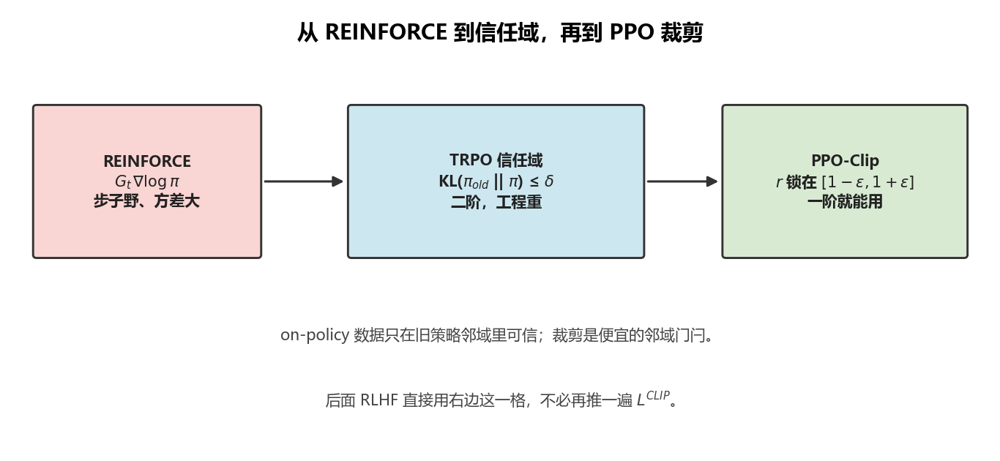
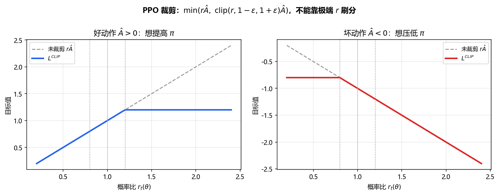
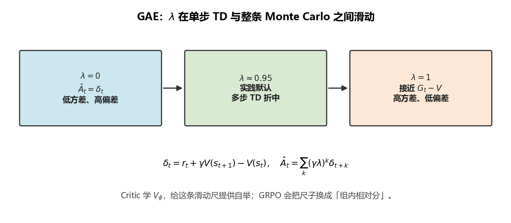
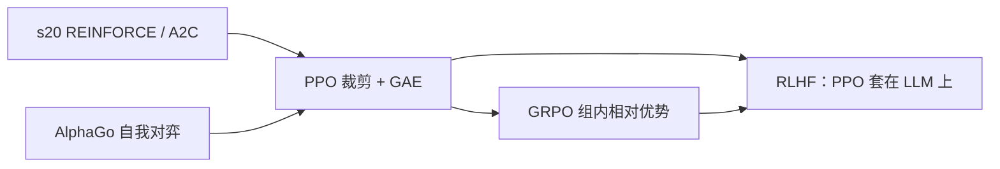
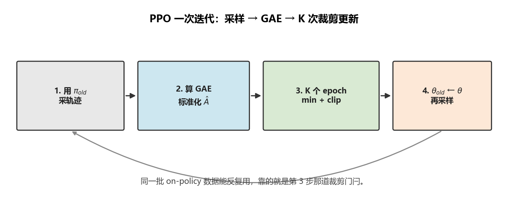

# PPO：别让一次更新把策略踢飞

> [!WARNING]
> 🧪 Beta公测版本提示：教程主体已完成，正在优化细节，欢迎大家提Issue反馈问题或建议。

> [s20](/nn-decision/rl/deep-rl/) 的 REINFORCE 用整条轨迹的回报 $G_t$ 去推 $\nabla\log\pi$，方差大、步子也野。[AlphaGo](/nn-decision/rl/alphago/) 的自我对弈已经是策略梯度，但棋上可以靠 MCTS 把「这一手」算稳。控制任务和大模型生成没有那棵树——**更新必须自己稳住。** PPO（Proximal Policy Optimization, Schulman et al., 2017）就是目前最常用的那根缰绳。学完这一章，[RLHF](/nn-decision/rl/rlhf/) 里出现的裁剪目标和 GAE 都不必再从头推。

> **图解说明**：TRPO 用 KL 球限制更新；PPO 用 $[1-\varepsilon,1+\varepsilon]$ 的盒子近似这颗球。

---

## 一、策略梯度为什么会一步跨崩

on-policy 梯度的期望是在**当前** $\pi_{\theta_{\mathrm{old}}}$ 下采的轨迹。参数一改，数据立刻过期。更糟的是：$\log\pi$ 的梯度在概率很小的动作上可以很大——一次坏更新能把好策略的概率质量抽走，再也采不回原来的好轨迹。

TRPO 的想法是：在一次更新里限制

$$
\mathbb{E}_s\big[D_{\mathrm{KL}}\big(\pi_{\theta_{\mathrm{old}}}(\cdot\mid s)\,\|\,\pi_\theta(\cdot\mid s)\big)\big] \le \delta
$$

这是**信任域（trust region）**：只在「旧策略还认得的邻域」里爬坡。TRPO 要用二阶近似和共轭梯度，工程重。PPO 用一阶优化，换两种便宜的近似：**裁剪**和（较少用的）KL 惩罚。

---

## 二、重要性采样：用旧数据评估新策略

同一条轨迹 $(s_t,a_t)$，新策略下的目标可以写成比率

$$
r_t(\theta) = \frac{\pi_\theta(a_t\mid s_t)}{\pi_{\theta_{\mathrm{old}}}(a_t\mid s_t)}
$$

未裁剪的替代目标是

$$
L^{\mathrm{CPI}}(\theta) = \mathbb{E}_t\big[r_t(\theta)\,\hat{A}_t\big]
$$

$\hat{A}_t>0$ 时加大 $r$ 会提高目标；$\hat{A}_t<0$ 时减小 $r$ 会提高目标。没有限制的话，优化器会把 $r$ 推到极端。

---

## 三、裁剪替代目标

PPO-Clip 的核心：

$$
L^{\mathrm{CLIP}}(\theta)
= \mathbb{E}_t\left[
  \min\Big(
    r_t(\theta)\,\hat{A}_t,\;
    \mathrm{clip}\big(r_t(\theta), 1-\varepsilon, 1+\varepsilon\big)\,\hat{A}_t
  \Big)
\right]
$$

通常 $\varepsilon=0.2$。$\min$ 保证：**你不能靠把 $r$ 推得更极端来刷分**，更新是保守的。

分两种情况看（这是后面所有实现都要记住的图）：

**好动作 $\hat{A}_t>0$**  
想提高 $\pi(a_t\mid s_t)$。若 $r$ 已经 $>1+\varepsilon$，裁剪后目标不再随 $r$ 上升——「已经够近了，别再猛加」。

**坏动作 $\hat{A}_t<0$**  
想压低该动作概率。若 $r$ 已经 $<1-\varepsilon$，同样封顶——「已经够远了，别再猛减」，以免把策略抽成确定性的灾难。

> **图解说明**：这是后面所有实现都要记住的图。$\min$ 保证你不能靠把 $r$ 推得更极端来刷分。

同一批轨迹通常会做 **$K$ 个 epoch** 的梯度步（数据复用），因为有裁剪兜底。这是 PPO 比纯 REINFORCE 样本效率高的原因之一。

---

## 四、GAE：优势函数怎么估

$\hat{A}_t$ 从哪来？[s20](/nn-decision/rl/deep-rl/) 用 TD 误差 $\delta_t=r_t+\gamma V(s_{t+1})-V(s_t)$ 当优势，偏差小方差仍可以再压。**广义优势估计（GAE）**把多步 TD 残差按 $\lambda$ 衰减求和：

$$
\delta_t = r_t + \gamma V_\phi(s_{t+1}) - V_\phi(s_t)
$$

$$
\hat{A}_t^{\mathrm{GAE}(\gamma,\lambda)}
= \sum_{\ell=0}^{T-t-1}(\gamma\lambda)^\ell \delta_{t+\ell}
$$

| $\lambda$ | 行为 |
|-----------|------|
| $0$ | 单步 TD，低方差、高偏差 |
| $1$ | 接近 Monte Carlo 回报，高方差、低偏差 |
| $0.9\sim 0.97$ | 实践默认，在偏差和方差之间折中 |

Critic 拟合 $V_\phi$，损失一般是 $\big(\hat{A}_t + V_{\mathrm{old}}(s_t) - V_\phi(s_t)\big)^2$（用 GAE 构造的回报当回归目标）。总损失还常加**熵奖励** $c_H\,\mathbb{H}[\pi]$，防止过早塌成确定性策略。

完整的 PPO 一步更新可以记成：

$$
L = L^{\mathrm{CLIP}} - c_V L_V + c_H \mathbb{H}[\pi]
$$

（符号随实现：有人把价值项写成 $+$ 再在 $L_V$ 前加负号。）

> **图解说明**：Critic 提供 $V_\phi$；$\lambda$ 决定用多少步 TD。GRPO 会把这根尺子换成组内相对分。

---

## 五、实现里真正要命的细节

论文公式之外，稳定 PPO 几乎总要：

1. **优势标准化**：一个 batch 里 $\hat{A}$ 减均值除标准差，梯度尺度不随奖励量纲乱跑。
2. **价值损失裁剪**（可选）：价值网络也限制相对旧 $V$ 的步长。
3. **ratio 爆掉就丢掉**：$r$ 超出 $[1-\varepsilon,1+\varepsilon]$ 太多说明 off-policy 已经离谱。
4. **与参考策略的 KL**（控制 / LLM 里更常见）：[RLHF](/nn-decision/rl/rlhf/) 会把 $\beta\,\mathrm{KL}(\pi\|\pi_{\mathrm{ref}})$ 加进奖励；那不是 PPO-Clip 的定义，是**任务侧**的安全带。下一节 [GRPO](/nn-decision/rl/grpo/) 则把它写进损失。

PPO 是 **on-policy**：数据来自 $\pi_{\mathrm{old}}$。它不是 DQN 那种回放缓冲区里随便抽旧转移。

---

## 六、和前后章的地图

- 没有 Critic、只在同一 prompt 的一组样本里比相对好坏 → [GRPO](/nn-decision/rl/grpo/)（DeepSeek）。
- 有人类偏好、奖励模型和 KL 到 SFT → [RLHF](/nn-decision/rl/rlhf/)，**优化器就是本章的 PPO**，不必再推一遍 $L^{\mathrm{CLIP}}$。

> 下一节 [GRPO](/nn-decision/rl/grpo/)：DeepSeek 把 Critic 拿掉，用组内均值当基线。读完再进 RLHF。

> **图解说明**：同一批 on-policy 数据能跑 $K$ 个 epoch，靠的就是 clip。

---

## 七、本节小结

| 概念 | 一句话 |
|------|--------|
| 信任域 | 新策略不能离采样策略太远，否则梯度失效 |
| $r_t(\theta)$ | 新/旧策略在同一动作上的概率比 |
| 裁剪 | $\varepsilon$ 盒子挡住「靠极端 $r$ 刷分」 |
| GAE | 用 $\lambda$ 混合多步 TD，得到 $\hat{A}_t$ |
| Critic | 学 $V_\phi$，给 GAE 提供自举 |
| 多 epoch | 同一批 on-policy 数据反复用，靠 clip 保命 |

## 📥 Code

| File | View | Download |
|------|------|----------|
| demo.py | [Open](./code-demo) | <a href="/notebook/code/nn-decision/rl/ppo/demo.py" target="_blank" download>Download</a> |
| exercise.py | [Open](./code-exercise) | <a href="/notebook/code/nn-decision/rl/ppo/exercise.py" target="_blank" download>Download</a> |

## 参考

1. Schulman, J., et al. (2015). Trust Region Policy Optimization. *ICML*. [[arXiv:1502.05477](https://arxiv.org/abs/1502.05477)]
2. Schulman, J., et al. (2016). High-Dimensional Continuous Control Using Generalized Advantage Estimation. *ICLR*. [[arXiv:1506.02438](https://arxiv.org/abs/1506.02438)]
3. Schulman, J., et al. (2017). Proximal Policy Optimization Algorithms. [[arXiv:1707.06347](https://arxiv.org/abs/1707.06347)]
