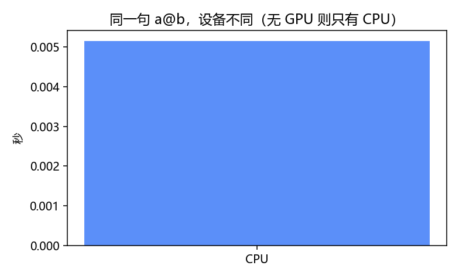

# CUDA 与设备：计算在哪块芯片上跑

> [!WARNING]
> 🧪 Beta公测版本提示：教程主体已完成，正在优化细节，欢迎大家提Issue反馈问题或建议。

> CUDA 是 NVIDIA 的 GPU 编程平台。对读本笔记而言：**先会把 Tensor 和 `nn.Module` 搬到 `device` 上**，比自己写 `.cu` 内核重要得多。张量见 [PyTorch](/programming/pytorch/)；层见 [nn](/programming/nn/)。没有 GPU 时，下面所有代码都应在 CPU 上照样跑通。

## 一、CPU 和 GPU 各适合什么

- **CPU**：核少、擅长复杂分支、延迟低。本仓库默认路径。
- **GPU**：几千个小核，擅长**同一指令打大批数据**（矩阵乘、卷积）。训练大网络才值得搬。

CUDA 不是 PyTorch 的一部分：显卡驱动 + NVIDIA 的 CUDA 运行时。你装的 **带 CUDA 的 PyTorch 轮子**已经把常用算子（GEMM、卷积、RNN）编译好了，`x @ w` 在 GPU 上会走这些内核，不必自己写 CUDA C++。

## 二、`device` 三行惯用法

```python
device = torch.device('cuda' if torch.cuda.is_available() else 'cpu')
model = model.to(device)
x = x.to(device)
```

- `torch.cuda.is_available()`：这套 PyTorch **能不能**看见 NVIDIA GPU。
- Apple 芯片：`torch.backends.mps.is_available()` 再用 `'mps'`（RSSM demo 写过类似检测）。
- `to(device)` 返回**新张量**（模块是原地改并返回 self）。之后运算双方必须在同一设备。

打印：`torch.cuda.get_device_name(0)`。命令行：`nvidia-smi` 看显存。



> **图解说明**：同一句 `a @ b`。没 GPU 时图上只有 CPU 柱，这是预期，不是失败。

## 三、数据搬家

| 方向 | 写法 | 贵不贵 |
|------|------|--------|
| CPU → GPU | `x.to('cuda')` / `x.cuda()` | 相对贵，别在小循环里搬来搬去 |
| GPU → CPU | `x.cpu()` | 同样贵 |
| 给 matplotlib / NumPy | `x.detach().cpu().numpy()` | 必须先回 CPU |

DataLoader 可 `pin_memory=True`，再 `batch.to(device, non_blocking=True)`，让主机页锁定内存，重叠搬运与计算。小 demo 不必纠结。

**经典坑**：NumPy 数组永远在主机内存。`torch.from_numpy(a)` 得到的是 CPU Tensor，还要 `.to(device)`。

## 四、内核是什么（概念，不必会写）

GPU 上真正跑的函数叫 **kernel**。CUDA C++ 里长这样（示意）：

```cuda
__global__ void add(float* a, float* b, float* c, int n) {
    int i = blockIdx.x * blockDim.x + threadIdx.x;
    if (i < n) c[i] = a[i] + b[i];
}
```

`<<<grid, block>>>` 启动成千上万个线程，每个线程算一个下标。PyTorch 的 `a + b` 在 CUDA 设备上就是在调类似的东西。自定义算子、融合 kernel、cuDNN 调优属于进阶，本笔记各章用现成算子即可。

自己写 `.cu` 需要 NVIDIA 的 `nvcc`，和「pip 安装的 torch」不是同一件事。

## 五、混合精度与显存

- `torch.cuda.amp.autocast()` + `GradScaler`：部分算子用 float16 加快、省显存。小模型收益不明显。
- 显存不够：减小 batch、`torch.cuda.empty_cache()` 只还碎片给缓存不一定够、梯度检查点、换更小模型。
- 多卡：`nn.DataParallel` 简单但过时；正经用 `DistributedDataParallel`。本仓库不覆盖。

## 六、没有 GPU 怎么写才不崩

```python
device = torch.device('cuda' if torch.cuda.is_available() else 'cpu')
# 后面只用 device，不要写死 .cuda()
```

RSSM 章为了保证笔记本能跑，直接 `DEVICE = cpu`。nanogpt 等章用 `--gpu` 才上卡。

下一站：回到 [RSSM](/world-models/abstract/rssm/) 或 [序列模型](/applied/nlp/sequence-models/)，现在应能看懂 `GRUCell` 那一行和 `h = gru(...)`。

## 📥 Code

| File | View | Download |
|------|------|----------|
| demo.py | [Open](./code-demo) | <a href="/notebook/code/programming/cuda/demo.py" target="_blank" download>Download</a> |
| exercise.py | [Open](./code-exercise) | <a href="/notebook/code/programming/cuda/exercise.py" target="_blank" download>Download</a> |
