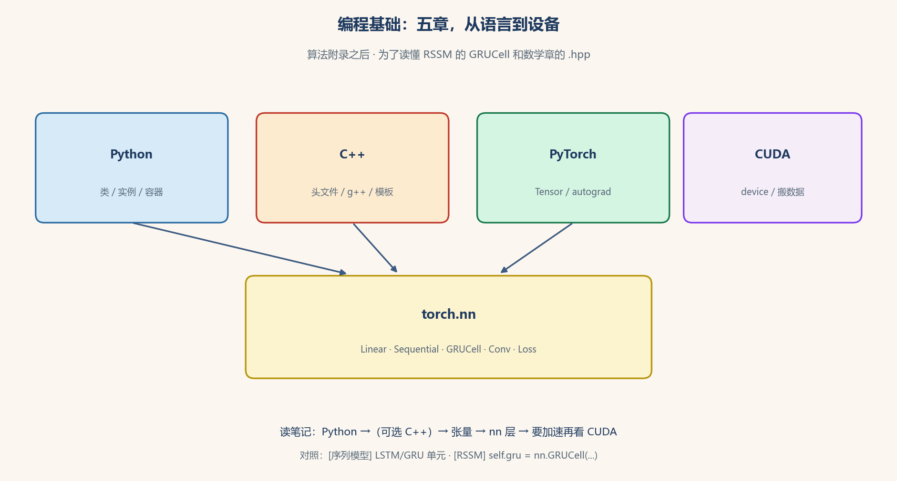

# 编程基础：读懂本仓库里的 Python、C++、PyTorch 和 CUDA

> [!WARNING]
> 🧪 Beta公测版本提示：教程主体已完成，正在优化细节，欢迎大家提Issue反馈问题或建议。

> 侧栏 **编程基础** 接在 [算法与数据结构](/algorithms/basics/complexity/) 后面，专门补「代码怎么读、模块怎么造、张量怎么上 GPU」。不是把语言手册抄一遍：只讲本笔记里会反复碰到的那几块——**类 vs 实例**、**`nn.Linear` / `nn.GRUCell` 那一行在干什么**、反向传播从哪来、数据什么时候搬到显存。点分组标题进本页。

> **图解说明**：先 Python（本仓库默认语言）和 C++（数学 / 李群的 header-only）；再 PyTorch 张量与自动求导；然后 `torch.nn` 把层叠成网络；最后 CUDA 决定这些计算跑在 CPU 还是 GPU。底栏接到 RSSM 的 `GRUCell` 和序列模型。

| 入口 | 在问什么 |
|------|----------|
| **[Python 基础](/programming/python/)** | 脚本、容器、函数；**类是图纸、实例才是那台机器** |
| **[C++ 基础](/programming/cpp/)** | `g++ -std=c++17`；头文件；读懂 `*.hpp` |
| **[PyTorch 张量与自动求导](/programming/pytorch/)** | `Tensor`、形状、`backward()`、训练一步 |
| **[torch.nn 模块怎么用](/programming/nn/)** | `nn.Module`、`Linear`、`Sequential`、卷积 / 循环 / 损失 |
| **[CUDA 与设备](/programming/cuda/)** | `device`、搬数据、有 GPU 和没 GPU 时怎么写 |

建议顺序：Python → C++（若要跑数学章的 `demo.cpp`）→ PyTorch → **nn（本领域最厚的一章）** → CUDA。读 [RSSM](/world-models/abstract/rssm/) 里 `self.gru = nn.GRUCell(...)` 之前，至少读完 Python 的「类与实例」和 nn 章的 Cell。

本仓库约定：正文中文；代码注释中文；Python 默认 CPU，GPU 是可选项。C++ 手写 header-only，不 vendoring Eigen。
