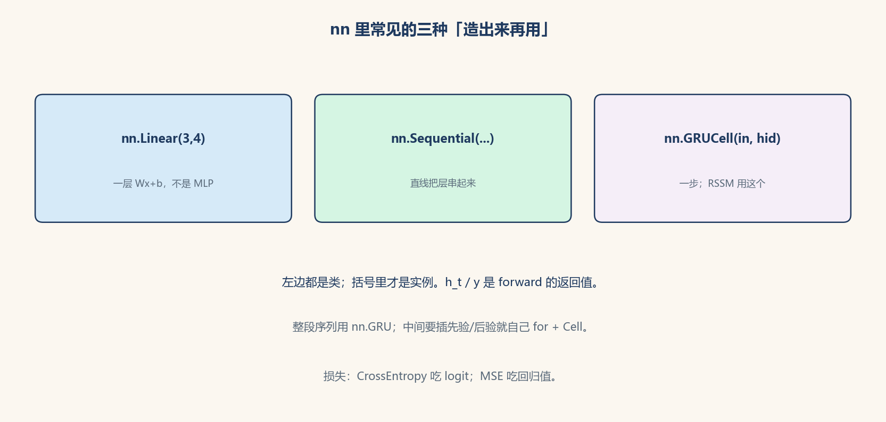

# torch.nn 模块怎么用：类、实例，然后 `forward`

> [!WARNING]
> 🧪 Beta公测版本提示：教程主体已完成，正在优化细节，欢迎大家提Issue反馈问题或建议。

> `nn.Linear`、`nn.GRUCell` **都是类**。`nn.Linear(3, 4)` 才造出带权重的**实例**。张量与 `backward` 见 [上一章](/programming/pytorch/)；[序列模型](/applied/nlp/sequence-models/) 讲 RNN/LSTM 公式；[RSSM](/world-models/abstract/rssm/) 里 `self.gru = nn.GRUCell(...)` 就是本节的 Cell。

`torch.nn` 是零件箱：仿射、卷积、归一化、损失。读文档时先分清「有参数的模块必须 `nn.` 并赋给 `self`」和「`F.relu` 只是函数」。下面用形状账把 Linear 和 GRUCell 写到能手算。



> **怎么读**：三块都是「先用类造实例」。Linear 一层仿射；Sequential 把层串成 MLP；GRUCell 只走一步，返回值才是 \(h_t\)。

## 一、`nn.Module`：所有层的父类

自己写的网络要继承它，并在 `__init__` 里把子模块赋给 `self`，在 `forward` 里写前向：

```python
class MLP(nn.Module):
    def __init__(self, d_in, d_hid, d_out):
        super().__init__()                    # 必须：否则子模块登记不上
        self.net = nn.Sequential(
            nn.Linear(d_in, d_hid),
            nn.ReLU(),
            nn.Linear(d_hid, d_out),
        )

    def forward(self, x):
        return self.net(x)
```

- `model(x)` 会走 `__call__`，内部调用 `forward`，同时处理 hook。**不要**在外面直接 `model.forward(x)` 当习惯（能跑，但绕过了 hook）。
- `model.parameters()`：所有可训练张量，交给 Adam。
- `model.named_modules()` / `named_parameters()`：打印「这一层叫什么、shape 多少」。
- `model.train()` / `model.eval()`：切换 Dropout、BN 的行为。评估时记得 `eval()`。
- `register_buffer('mean', t)`：存不算梯度、但要跟着 `state_dict` 保存的张量（BN 的 running mean）。

`nn.Parameter(torch.zeros(3))`：手动把一张量登记为参数。`nn.Linear` 内部的 `weight`、`bias` 就是 Parameter。

## 二、`nn.Linear`：一层仿射，不是整个 MLP

```python
lin = nn.Linear(in_features=3, out_features=4, bias=True)
y = lin(x)    # x: (batch, 3) → y: (batch, 4)
```

\[
y = x W^\top + b,\quad W\in\mathbb{R}^{4\times 3}
\]

PyTorch 存的是 \(W\) 的 **`(out, in)`**，所以公式带转置。它**没有**激活，只是 \(Wx+b\)。MLP 是 Linear 和激活叠起来（上面的 `Sequential`）。

RSSM 先验网：`Linear(deter, hidden) → ELU → Linear(hidden, 2*stoch)`，这才是小 MLP。

::: details 逐步推导：`nn.Linear(3,4)` 的形状，以及 Cell 一步在干什么（点击展开）

`lin.weight` 形状 `(4, 3)`，`bias` 形状 `(4,)`。输入 `x` 形状 `(N, 3)`：

$$
y = x W^\top + b \in \mathbb{R}^{N\times 4}.
$$

若写成 $xW$ 而不转置，就需要 $W$ 存成 `(in, out)`。PyTorch 选 `(out, in)` 是为了和 `F.linear`、初始化约定一致。打印 `tuple(lin.weight.shape)` 对不上时，先看 `in_features` 是否等于 `x.shape[-1]`。

`GRUCell(input_size, hidden_size)`：内部若干个 `(hidden, input)` 和 `(hidden, hidden)` 门矩阵。调用 `h1 = gru(x_t, h0)` 要求 `x_t` 最后一维 = `input_size`，`h0` 最后一维 = `hidden_size`。返回的 `h1` 与 `h0` 同形状。RSSM 里 `input_size = stoch_dim + act_dim`，因为把 $s$ 和 $a$ 在最后一维 `cat` 再送进去。

整段 `nn.GRU` 吃 `(N, T, input)` 一次吐 `(output, h_n)`，中间你插不进「采样 $s_t$、再算先验」。所以世界模型用 Cell + Python `for t`。慢在 Python 循环，换来的是每步可自定义计算图。

`nn.ModuleList` vs `list`：`self.blocks = [nn.Linear(4,4) for _ in range(3)]` 这三层**不会**出现在 `model.parameters()` 里，Adam 更新不到，看起来像「网络不学习」。改成 `ModuleList` 立刻好。

:::

相关：`nn.Identity()` 原样传过；`nn.Flatten()` 把后面几维摊平；`nn.Bilinear` 两个输入的双线性。

## 三、容器：`Sequential` / `ModuleList` / `ModuleDict`

| 容器 | 用法 | 什么时候选 |
|------|------|------------|
| `nn.Sequential(A, B, C)` | `seq(x)` 按顺序 | 直线流水线 |
| `nn.ModuleList([A, B])` | `self.blocks[i](x)` | 层数要循环、或残差里插入 |
| `nn.ModuleDict({'enc': A})` | 按名字取 | 多头、分路 |

普通 Python `list` 装着 `nn.Linear` **不会**登记进 `parameters()`，优化器更新不到。要用 `ModuleList`。

## 四、激活：`nn.*` 与 `F.*`

| 模块 | 公式直觉 | 常见位置 |
|------|----------|----------|
| `nn.ReLU()` | \(\max(0,x)\) | CNN、MLP |
| `nn.GELU()` | 平滑 ReLU | Transformer |
| `nn.SiLU()` / Swish | \(x\sigma(x)\) | 现代 CNN |
| `nn.Tanh()` | \((-1,1)\) | 经典 RNN 细胞 |
| `nn.Sigmoid()` | \((0,1)\) | 门、二分类概率 |
| `nn.Softmax(dim=-1)` | 归一化成概率 | 自己写注意力时 |
| `nn.LogSoftmax` | 配 `NLLLoss` | 少用，更常见 CrossEntropy |

`torch.nn.functional as F`：`F.relu(x)` 是**函数**，没有参数、不会登记子模块。`nn.ReLU()` 是**模块**（方便放进 Sequential）。有参数的层（Linear、Conv）必须用 `nn.`，不能只用 `F.linear` 却忘了保存权重。

## 五、正则与归一化

| 模块 | 干什么 | 调用形状 |
|------|--------|----------|
| `nn.Dropout(p=0.1)` | 训练时随机置零；`eval()` 关闭 | 任意 |
| `nn.LayerNorm(d)` | 对最后若干维做归一化 | 最后一维 = `d`（NLP 常用） |
| `nn.BatchNorm1d(c)` | 对 batch 维做归一化 | `(N, C)` 或 `(N, C, L)` |
| `nn.BatchNorm2d(c)` | 同上，图像 | `(N, C, H, W)` |
| `nn.GroupNorm` | 小 batch 时替代 BN | 与 BN 同布局 |

BatchNorm **依赖 batch 统计**，batch=1 时很吵；序列模型、Transformer 更常用 LayerNorm。

## 六、`nn.Embedding`：整数 ID → 向量

```python
emb = nn.Embedding(num_embeddings=1000, embedding_dim=32)
x = torch.tensor([3, 7, 3])     # token id
e = emb(x)                      # (3, 32)；id=3 的两行相同
```

查表，不是 \(Wx\) 那种 dense。语言模型、离散动作都用它。

## 七、卷积与池化

```python
conv = nn.Conv2d(in_channels=3, out_channels=16, kernel_size=3, stride=1, padding=1)
# 输入 (N, 3, H, W) → (N, 16, H, W)  （padding=1、k=3 时空间尺寸不变）
pool = nn.MaxPool2d(2)          # H、W 大约减半
gap = nn.AdaptiveAvgPool2d(1)   # 任意 H×W → 1×1
```

- `nn.Conv1d`：时间 / 波形，布局 `(N, C, L)`。
- `nn.ConvTranspose2d`：上采样（生成器）。
- 细节与感受野见 [CNN 章](/applied/cv/cnn/)。

## 八、循环：`nn.RNN` / `LSTM` / `GRU` 和 `*Cell`

这是 RSSM 那一行的直接答案。

| 类 | 接口 | 干什么 |
|----|------|--------|
| `nn.GRUCell(input_size, hidden_size)` | `(x_t, h_{t-1}) → h_t` | **一步** |
| `nn.LSTMCell(...)` | `(x_t, (h, c)) → (h_t, c_t)` | 一步，两本账 |
| `nn.RNNCell(...)` | `(x_t, h_{t-1}) → h_t` | 一步，无门 |
| `nn.GRU(input_size, hidden_size, batch_first=True)` | 整段 `(N, T, d)` | 内部自己 for 循环 |

```python
gru = nn.GRUCell(stoch_dim + act_dim, deter_dim)   # 造实例，不是 h_t
h = torch.zeros(batch, deter_dim)
for t in range(T):
    h = gru(torch.cat([s, a], dim=-1), h)          # 返回值才是 h_t
```

为什么 RSSM 用 **Cell** 不用 `nn.GRU`：每一步更新完 \(h_t\) 立刻要算先验 / 后验、采样 \(s_t\)，下一步还要用这个 \(s\)。整段 `nn.GRU` 一口吞进序列，中间插不进这些 MLP。

公式与门：[s15](/applied/nlp/sequence-models/#lstm-cell)。GRU 没有单独的 \(c_t\)，长期记忆就在 \(h\) 里。

`batch_first=True` 时整段模块吃 `(N, T, D)`；默认历史接口是 `(T, N, D)`，搞反 shape 会 silently 错。Cell 没有 T 维，只吃 `(N, D)`。

## 九、损失

调用约定：**`loss_fn(pred, target)`**，第一个是模型输出。

| 类 | 何时用 | 注意 |
|----|--------|------|
| `nn.MSELoss()` | 回归、重建坐标 | RSSM 重建 \(\hat o\) |
| `nn.L1Loss()` | 回归，对异常值更钝 | |
| `nn.CrossEntropyLoss()` | 多分类 | 吃**未归一化 logit**，内部 `LogSoftmax+NLL`；target 是类别下标 |
| `nn.BCEWithLogitsLoss()` | 多标签 / 二分类 | 吃 logit，**不要**先 Sigmoid |
| `nn.BCELoss()` | 已是概率 | 数值不如 WithLogits 稳 |
| `nn.KLDivLoss(reduction='batchmean')` | KL | 输入应是 log-prob；RSSM 手写了高斯 KL |

`reduction='none'` 时保留每个样本的损失，再自己 `.mean()` / 加权。

## 十、初始化

```python
nn.init.xavier_uniform_(layer.weight)
nn.init.zeros_(layer.bias)
nn.init.orthogonal_(gru.weight_hh)     # 循环权重常用正交
```

带 `_` 的是**原地**改。LSTM 遗忘门偏置常初始化成正数，训练初期倾向「多记住」（见 s15）。不写 init 时，Linear 默认 Kaiming/uniform 一类合理默认值，小模型够用。

## 十一、查文档与排错

```python
print(model)                       # 树状结构
for n, p in model.named_parameters():
    print(n, tuple(p.shape))
```

常见报错：

- `mat1 and mat2 shapes cannot be multiplied`：Linear 的 `in_features` 和最后一维对不上。打印 `x.shape`。
- `Expected all tensors to be on the same device`：有的在 CPU、有的在 CUDA，见 [CUDA 章](/programming/cuda/)。
- 损失不降：忘了 `zero_grad`、用了 `CrossEntropy` 却先 Softmax、`eval()` 开着 Dropout 该关没关。

官方模块列表：<https://pytorch.org/docs/stable/nn.html>（版本以你安装的 `torch.__version__` 为准）。

## 十二、本节对照表

| 你想做 | 用 |
|--------|----|
| \(y=Wx+b\) | `nn.Linear` |
| 直线叠层 | `nn.Sequential` |
| 循环里取第 i 层 | `nn.ModuleList` |
| token → 向量 | `nn.Embedding` |
| 图像局部特征 | `nn.Conv2d` |
| 一步记忆（RSSM） | `nn.GRUCell` / `LSTMCell` |
| 整段序列 | `nn.GRU` / `LSTM`（`batch_first=True`） |
| 多分类 | logit + `CrossEntropyLoss` |
| 回归 | `MSELoss` |
| 训练时随机扔神经元 | `Dropout`，评估 `model.eval()` |

## 📥 Code

| File | View | Download |
|------|------|----------|
| demo.py | [Open](./code-demo) | <a href="/notebook/code/programming/nn/demo.py" target="_blank" download>Download</a> |
| exercise.py | [Open](./code-exercise) | <a href="/notebook/code/programming/nn/exercise.py" target="_blank" download>Download</a> |
