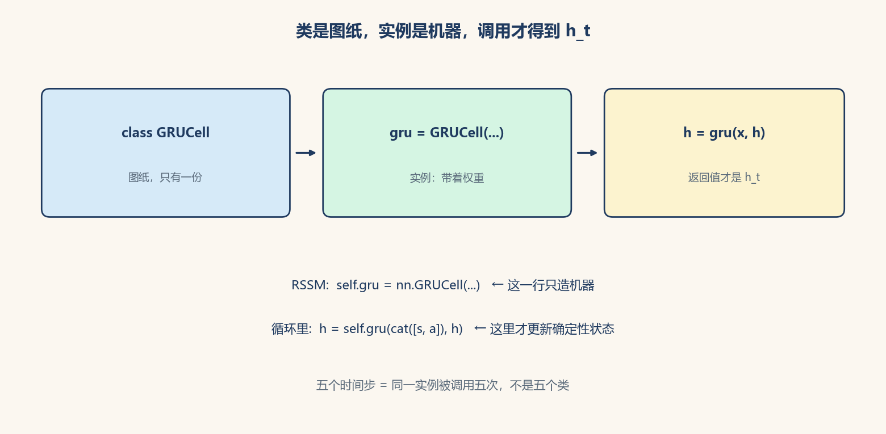

# Python 基础：脚本、容器，以及「类不是那台机器」

> [!WARNING]
> 🧪 Beta公测版本提示：教程主体已完成，正在优化细节，欢迎大家提Issue反馈问题或建议。

> 本笔记默认语言是 Python。读 [RSSM](/world-models/abstract/rssm/) 里 `self.gru = nn.GRUCell(...)` 之前，先分清：**左边是名字，等号右边是「用类造出来的对象」。** 下一章 [C++](/programming/cpp/) 给数学章的 `*.hpp`；张量见 [PyTorch](/programming/pytorch/)。

## 一、怎么跑起来

本仓库每个演示都是**脚本**：一个 `.py` 文件从上到下执行。在章节的 `code/` 里：

```bash
cd docs/programming/python/code
python demo.py
```

文件头几乎总是：

```python
# -*- coding: utf-8 -*-
"""这一段是模块说明书，给人看的。"""
```

- `# -*- coding: utf-8 -*-`：告诉解释器源码是 UTF-8（中文注释才不会乱）。
- `if __name__ == '__main__':`：只有**直接** `python demo.py` 才跑主程序；被别人 `import` 时不跑。demo 里画图、打印都放这里。

本仓库约定：图写到章节自己的 `images/`，路径用脚本所在目录拼，避免你在别的文件夹启动时图丢了。

## 二、名字、对象、类型

Python 里一切都是对象。`a = 3` 是「名字 `a` 钉在整数对象 `3` 上」。

| 写法 | 类型 | 笔记里常见用途 |
|------|------|----------------|
| `3` / `0.1` | `int` / `float` | 超参、学习率 |
| `'hello'` | `str` | 路径、打印 |
| `True` | `bool` | 开关 |
| `None` | 空 | 「还没有值」 |
| `[1, 2]` | `list` | 变长序列，可改 |
| `(1, 2)` | `tuple` | 不可改，函数多返回值 |
| `{'lr': 1e-3}` | `dict` | 超参表、配置 |
| `{1, 2}` | `set` | 去重 |

**切片** `a[1:4]`：从下标 1 到 **不含** 4。`a[-1]` 是最后一个。`x[:, t]` 这种两维切片在 RSSM 里表示「所有 batch、第 t 步」。

**列表推导**：`[f(x) for x in xs if cond]`，比手写 `for` + `append` 短，后面 demo 会用。

## 三、函数

```python
def add(x: float, y: float = 0.0) -> float:
    return x + y
```

- `def` 定义；`return` 交出结果。没有 `return` 时得到 `None`。
- `y: float = 0.0`：类型标注（给人看的）+ 默认参数。
- `*args` / `**kwargs`：可变位置参数 / 关键字参数。`nn.Sequential(*layers)` 就是把列表拆开传进去。

## 四、类是图纸，实例才是机器 {#class-vs-instance}

这是读 PyTorch 最关键的一句。

```python
class Greeter:
    def __init__(self, name):   # 造对象时自动调用
        self.name = name        # 每个实例自己的数据

    def hello(self):
        return f'你好, {self.name}'
```

- `class Greeter:`：在**定义类**（图纸）。
- `g = Greeter('世界')`：在**构造实例**（按图纸造一台机器）。
- `g.hello()`：调用这台机器上的方法。`self` 就是这台机器自己。

`nn.Linear`、`nn.GRUCell` 都是**别人已经写好的类**。

```python
self.gru = nn.GRUCell(stoch_dim + act_dim, deter_dim)
```

- `nn.GRUCell`：类（图纸），在 PyTorch 源码里。
- `nn.GRUCell(...)`：调用构造函数，**造一颗细胞对象**（分配门的权重）。
- `self.gru = ...`：把这颗对象存进 `RSSM` 这台更大的机器里。
- **`self.gru` 不是 \(h_t\)**。\(h_t\) 是你稍后 `self.gru(输入, h_prev)` **调用**时返回的张量。

一张图：左边图纸可以复印很多台；每台有自己的权重。五个时间步是**同一台** `self.gru` 被调用五次，不是五个类。



> **怎么读**：上：`class` 定义一次。中：`GRUCell(...)` 造出带权重的实例。下：`gru(x, h)` 才算出新的 \(h_t\)。

`self` 出现在方法第一个参数：谁调用，`self` 就是谁。`RSSM` 继承 `nn.Module` 之后，赋给 `self.xxx` 的模块会被自动登记进 `parameters()`，Adam 才能找到权重。

## 五、本仓库还会用到的几件事

- **缩进就是语法**：同一层必须对齐。没有 `{}`。
- **可变默认参数是坑**：不要写 `def f(xs=[])`，用 `None` 再在函数里 `xs = []`。
- **NumPy**：`import numpy as np`。`np.array`、`@` 矩阵乘、`axis`。数学章大量用。
- **中文图**：`matplotlib.rcParams['font.sans-serif'] = ['Microsoft YaHei', 'SimHei', 'DejaVu Sans']`，否则标签变方框。
- **随机种子**：`np.random.seed(42)` / `torch.manual_seed(42)`，改代码时图还对得上。

下一章若要编译数学章的 C++： [C++ 基础](/programming/cpp/)。只跑 Python / PyTorch 可直接去 [张量](/programming/pytorch/)。

## 📥 Code

| File | View | Download |
|------|------|----------|
| demo.py | [Open](./code-demo) | <a href="/notebook/code/programming/python/demo.py" target="_blank" download>Download</a> |
| exercise.py | [Open](./code-exercise) | <a href="/notebook/code/programming/python/exercise.py" target="_blank" download>Download</a> |
