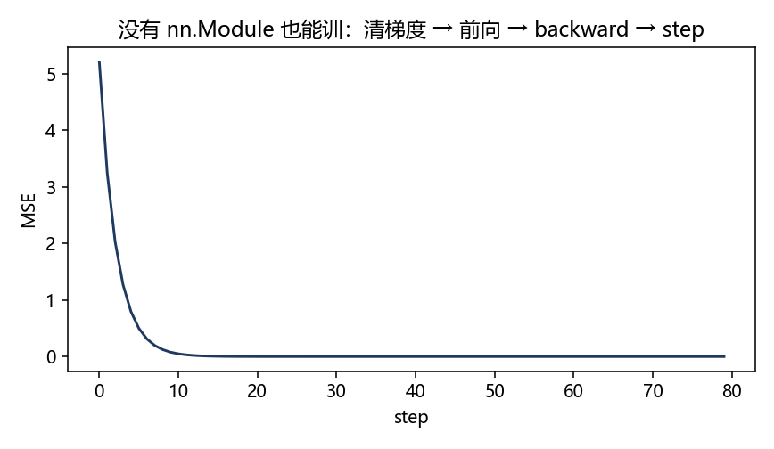

# PyTorch 张量与自动求导：先有数，再有层

> [!WARNING]
> 🧪 Beta公测版本提示：教程主体已完成，正在优化细节，欢迎大家提Issue反馈问题或建议。

> `torch.nn` 里每一层吃的都是 **Tensor**。层怎么叠见 [下一章](/programming/nn/)；数据放 GPU 见 [CUDA](/programming/cuda/)。自动求导的微积分背景：[导数](/math/derivative/)、[优化](/math/optimization/)、[反向传播](/nn-decision/dl/backprop/)。

张量先当 NumPy 用：形状、dtype、设备。自动求导再当「会记账的计算器」：前向每一步留下怎么反传，`backward()` 按链式法则把 $\partial L/\partial x$ 填进叶子的 `.grad`。本章用手算一个标量例子对上 `x.grad`。

## 一、Tensor 是带设备的多维数组

```python
import torch
x = torch.tensor([[1.0, 2.0], [3.0, 4.0]])   # shape (2, 2)，默认 CPU
```

| 属性 | 含义 |
|------|------|
| `x.shape` / `x.size()` | 各维长度，如 `(batch, T, dim)` |
| `x.dtype` | 元素类型，训练常用 `float32` |
| `x.device` | `'cpu'` 或 `'cuda:0'` |
| `x.requires_grad` | 要不要给它攒计算图 |

和 NumPy 很像：切片、广播、`@` 矩阵乘、`reshape` / `view`、`transpose`。差别是 Tensor 能跟踪运算、能搬到 GPU。

`torch.zeros(B, d)`、`torch.randn(...)`、`torch.cat([a, b], dim=-1)` 在 RSSM 里到处都是：最后一维拼接特征。

**不要**混用：`*` 是逐元素乘，`@` / `matmul` 才是矩阵乘。`dim=-1` 表示最后一维。

## 二、把计算图建起来：`requires_grad` 与 `backward`

$$
L = (x^2 + 3x)^2,\quad x=2 \implies L'(x)=2(x^2+3x)(2x+3)
$$

```python
x = torch.tensor(2.0, requires_grad=True)
y = x * x + 3 * x
L = y * y
L.backward()          # 从 L 往回走
print(x.grad)         # ∂L/∂x
```

- 只有 `requires_grad=True` 的叶子才会在 `backward` 后出现 `.grad`。
- 中间量默认不留 `.grad`（省内存）。要看中间梯度：`y.retain_grad()`。
- 第二次 `backward` 前通常 `x.grad.zero_()`，否则会**累加**。

`torch.no_grad()`：评估、做梦 rollout 时关掉图，省内存、加快。RSSM 的 `imagine()` 上有 `@torch.no_grad()`。

::: details 逐步推导：$L=(x^2+3x)^2$ 在 $x=2$ 的梯度和 autograd 对得上（点击展开）

令 $u=x^2+3x$，则 $L=u^2$。

$$
\frac{\mathrm{d}L}{\mathrm{d}x}=2u\cdot(2x+3).
$$

$x=2$ 时 $u=4+6=10$，$L'=2\cdot 10\cdot(4+3)=140$。

代码里 `y = x*x + 3*x` 就是 $u$；`L = y*y`。`L.backward()` 从 $L$ 往回：先 $\partial L/\partial y=2y=20$，再 $\partial y/\partial x=2x+3=7$，相乘 $140$，写入 `x.grad`。

链式法则和 [导数章](/math/derivative/) 的乘积/复合完全同一件事。PyTorch 只是把每条运算登记成节点：乘法节点知道「左边贡献右边那个因子」。叶子 `x` 因 `requires_grad=True` 被留下；中间 `y` 默认不存 `.grad`，除非 `retain_grad()`。

第二次 `backward` 前必须 `zero_()`：实现是**累加**梯度（为了梯度累积大 batch）。不清就变成 $280$、$420$……看起来像 bug。

`torch.no_grad()` 包住的前向不建图。想象轨迹滚 50 步若建图，中间激活全留着，显存爆炸；那 50 步也不需要对世界模型反传时，就该关掉。

:::

## 三、训练循环最小骨架

参数是 Tensor；优化器按 `.grad` 改它们。没有 `nn.Module` 也能训，只是自己管参数列表：

```python
w = torch.randn(2, 1, requires_grad=True)
opt = torch.optim.SGD([w], lr=0.1)
for _ in range(50):
    pred = X @ w
    loss = ((pred - y) ** 2).mean()
    opt.zero_grad()
    loss.backward()
    opt.step()
```

四步：**清梯度 → 前向 → backward → step**。`nn.Module` 只是把 `w` 收进 `model.parameters()`，骨架不变。



> **图解说明**：还没有 Linear，只有一个 `w` 张量。下降说明 autograd 在干活。

## 四、和 NumPy 互转

```python
a = x.detach().cpu().numpy()   # 进 matplotlib 之前
t = torch.from_numpy(arr)      # 共享内存；改一边另一边也会变
```

`detach()`：从计算图摘下来，否则 `numpy()` 会报错。先 `.cpu()` 再 `.numpy()`：GPU 张量不能直接转。

下一章把「一层 \(Wx+b\)」封装成 `nn.Linear`，把「一步 GRU」封装成 `nn.GRUCell`。

## 📥 Code

| File | View | Download |
|------|------|----------|
| demo.py | [Open](./code-demo) | <a href="/notebook/code/programming/pytorch/demo.py" target="_blank" download>Download</a> |
| exercise.py | [Open](./code-exercise) | <a href="/notebook/code/programming/pytorch/exercise.py" target="_blank" download>Download</a> |
