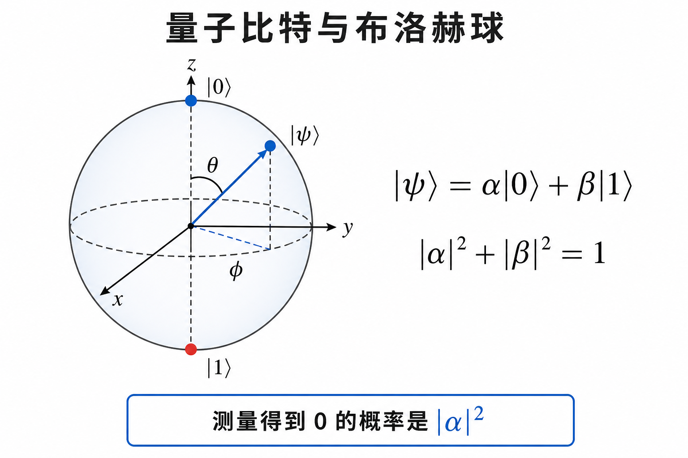
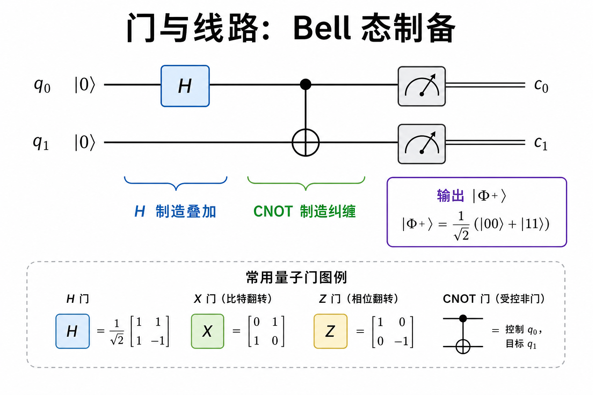
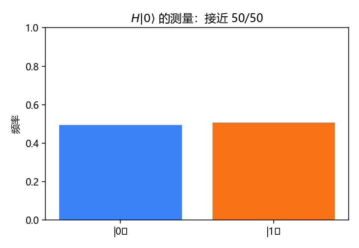
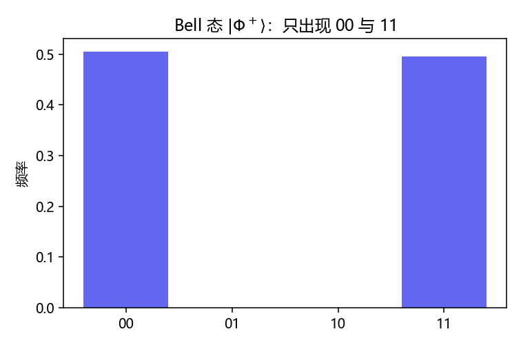
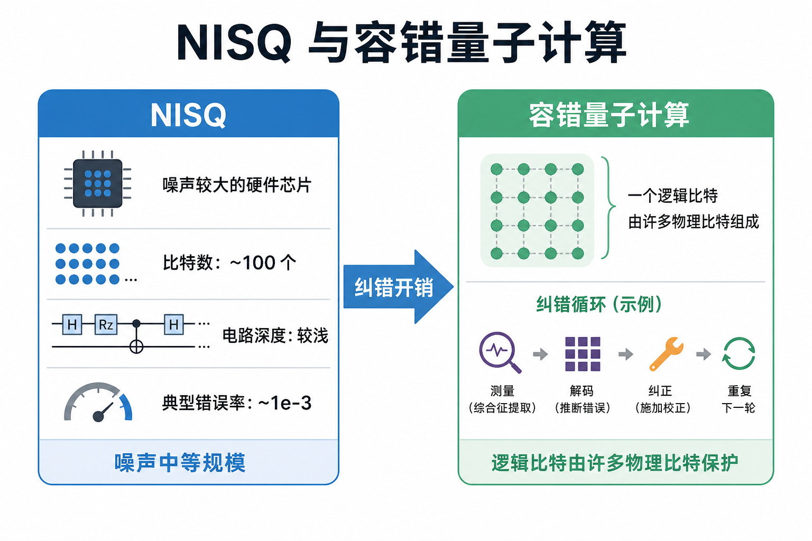

# 量子计算：态、门、线路与测量

> [!WARNING]
> 🧪 Beta公测版本提示：教程主体已完成，正在优化细节，欢迎大家提Issue反馈问题或建议。

> 量子计算的最小闭环：准备一个态 → 用酉门演化 → 测量得到经典比特。算法的「加速」来自振幅的干涉，而不是把 0/1 同时塞进同一个硅开关。

前置：[量子信息全景](/quantum/overview/)、[线性代数](/math/linear-algebra/)。

---

## 一、量子比特与布洛赫球

单比特纯态可以写成

$$
|\psi\rangle = \cos\frac{\theta}{2}|0\rangle + e^{i\phi}\sin\frac{\theta}{2}|1\rangle.
$$

$(\theta,\phi)$ 是球面上的一个点：北极 $|0\rangle$，南极 $|1\rangle$，赤道是像 $|+\rangle$、$|-\rangle$ 这样的等权叠加。整体相位 $e^{i\alpha}$ 测不到，所以球面（而不是三维实向量）刚好装得下物理上可区分的纯态。

> **图解说明**：箭头指向的是纯态；混合态会掉进球体内。测量 $Z$ 相当于问「更靠近北还是南」。

多比特：$|01\rangle = |0\rangle\otimes|1\rangle$。一般态是 $2^n$ 个振幅，**不一定**能写成各个比特的张量积——写不成的就叫**纠缠**。

---

## 二、门：可逆的线性变换

量子门是酉矩阵 $U^\dagger U = I$，保证概率守恒。常用单比特门：

$$
H = \frac{1}{\sqrt{2}}\begin{pmatrix}1&1\\1&-1\end{pmatrix},\quad
X=\begin{pmatrix}0&1\\1&0\end{pmatrix},\quad
Z=\begin{pmatrix}1&0\\0&-1\end{pmatrix}.
$$

$H|0\rangle = |+\rangle$。两比特最重要的是 CNOT：控制为 1 时翻转目标。它本身不创造叠加，但和 $H$ 组合就能把乘积态变成 Bell 态：

$$
\mathrm{CNOT}\,(H\otimes I)\,|00\rangle = \frac{|00\rangle+|11\rangle}{\sqrt{2}} = |\Phi^+\rangle.
$$

> **图解说明**：$H$ 负责叠加，CNOT 负责把「控制比特的 0/1」写进关联。测量后只该看到 `00` 与 `11`。

线路图从左到右读：每条横线一个量子比特，方块是门，仪表是测量。这就是量子计算的汇编。

---

## 三、测量与 Born 规则

计算基测量：得到比特串 $x$ 的概率是 $|\langle x|\psi\rangle|^2$。测量后态坍缩到对应子空间。因此：

- **中间测量会毁掉后面还想用的相干**；
- 算法设计往往把测量留到最后，让振幅先干涉。

`demo.py` 先画 $H|0\rangle$ 的 50/50 直方图，再画 Bell 态——后一张图几乎只有 `00` 和 `11`，这就是纠缠在数据里的样子。

---

## 四、算法直觉（不必一次学完 Shor）

教学上先抓住两类干涉：

1. **Deutsch 型**：问「函数是否平衡」这类全局性质。量子线路让两条路径的相位相长/相消，一次查询就能读出奇偶型信息。要点是**相位踢回**，不是「并行算出所有 $f(x)$ 再打印」。
2. **Grover 型**：无结构搜索。振幅在「标记项」上每次转一个小角度，约 $\sqrt{N}$ 次达到高概率——平方加速，不是指数。

Shor 的周期查找更长，核心仍是：把周期性藏进相位，再用 QFT 让峰值出现在测量里。本笔记本不在一章里展开数论，只要求你记住：**加速来自干涉与结构，不是万能并行**。

---

## 五、NISQ 与容错

今天的设备是 **NISQ**（噪声中等规模）：量子比特数有限、门错误率大约千分之一量级、相干时间限制线路深度。变分线路、量子模拟短演化，都是在这个盒子里找用途。

**容错**要把许多物理比特编成一个逻辑比特，用纠错循环把有效错误压下去。代价是巨大的空间与时间开销。两者不是互斥口号，而是工程阶段。

> **图解说明**：左边是「浅线路、能跑、会错」；右边是「逻辑比特由物理比特投票保护」。QML 章的 8 比特 HEA 明确属于左边。

---

## 六、小结

| 概念 | 一句话 |
|------|--------|
| 态矢量 | 归一化复向量；布洛赫球画纯态 |
| 酉门 | 可逆线性变换；$H$、CNOT 是积木 |
| Bell 态 | 局域看起来随机，合起来完全关联 |
| Born 规则 | 概率 = 振幅模方 |
| NISQ | 浅、噪、小；先找浅线路任务 |
| 容错 | 逻辑比特；开销大 |

> 下一章 [量子网络](/quantum/network/)：把纠缠当成可以分发、交换、用来传态的资源。

## 📥 Code

| File | View | Download |
|------|------|----------|
| demo.py | [Open](./code-demo) | <a href="/notebook/code/quantum/computing/demo.py" target="_blank" download>Download</a> |
| exercise.py | [Open](./code-exercise) | <a href="/notebook/code/quantum/computing/exercise.py" target="_blank" download>Download</a> |

## 参考

1. Nielsen & Chuang, *Quantum Computation and Quantum Information*, Ch. 1–4.
2. IBM Qiskit / Microsoft Q# 教材中的 Bell 与测量实验（任意一种线路图约定即可）。
3. Preskill, J. *Quantum Computing in the NISQ era and beyond* (2018).
