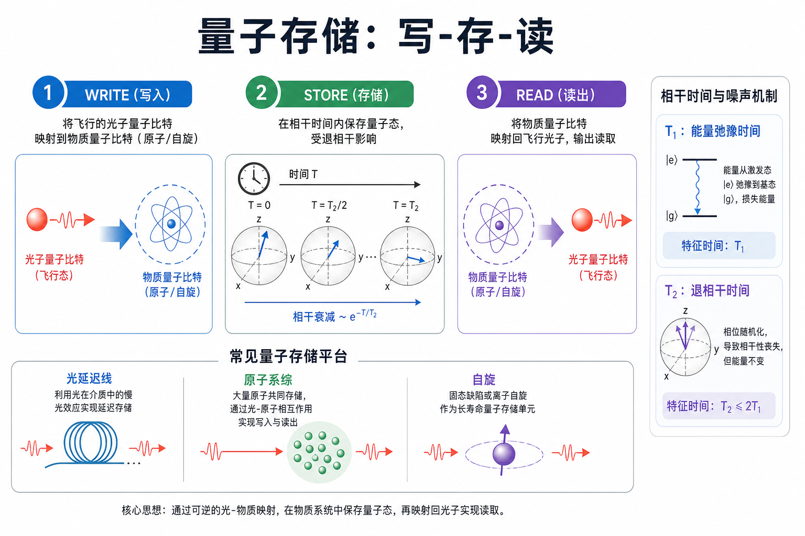
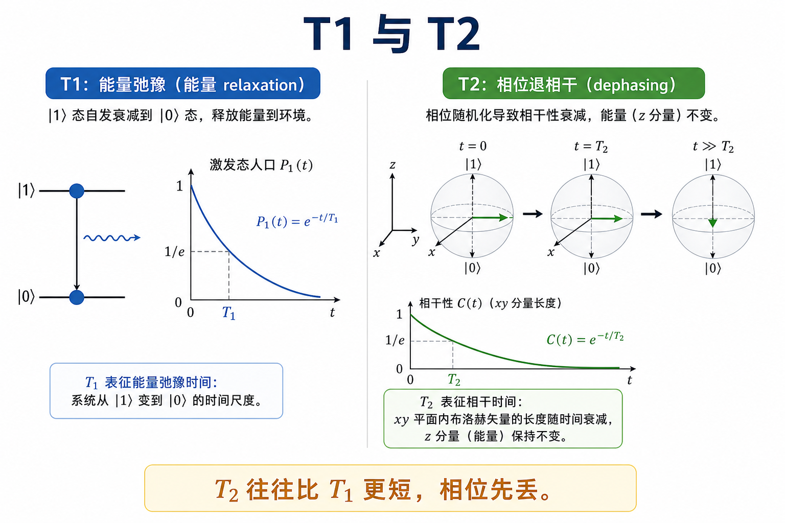
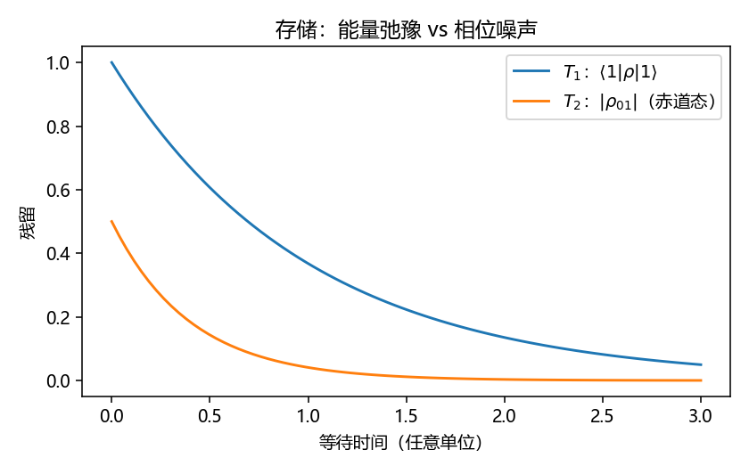
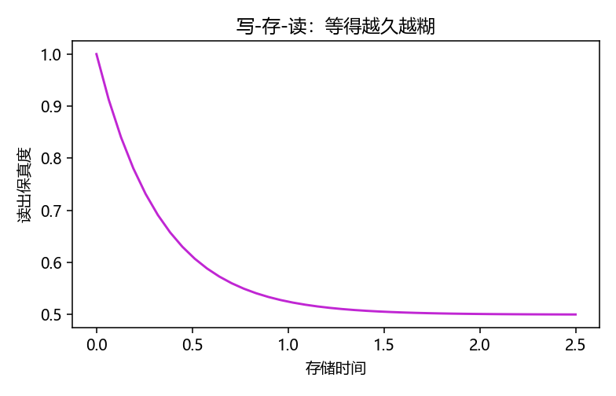

# 量子存储：写、存、读与相干时钟

> [!WARNING]
> 🧪 Beta公测版本提示：教程主体已完成，正在优化细节，欢迎大家提Issue反馈问题或建议。

> 光子跑得太快，物质比特又待不久。量子存储要做的事很土：把飞行中的量子态**写进**一个相对静止的自由度，**等一会儿**，再**读出来**——还不能违反不可克隆。

前置：[量子计算](/quantum/computing/) 的密度矩阵直觉；[量子网络](/quantum/network/) 的中继动机。

---

## 一、为什么必须有「内存」

三件互斥的事叠在一起：

1. **通信**：信息往往编码在光子上（光纤、自由空间）；
2. **处理**：逻辑门、纠缠交换发生在物质比特或非线性介质里；
3. **时间**：两路光子几乎不可能自己对准，中继要等另一半到达。

经典内存可以复制再存。量子内存必须是**可逆的写-读映射**（理想情况下是一个大的酉或等距嵌入），不能先测量再重建未知态。

---

## 二、写-存-读

理想循环：

$$
|\psi\rangle_{\mathrm{flying}}
\;\xrightarrow{\mathrm{write}}\;
|\psi\rangle_{\mathrm{matter}}
\;\xrightarrow{\mathrm{wait}}\;
|\psi(t)\rangle
\;\xrightarrow{\mathrm{read}}\;
|\psi\rangle_{\mathrm{flying}}'.
$$

等待时间 $t$ 里，环境会做两件主要的坏事（见全景章）：

- **$T_1$**：激发布居漏掉（振幅阻尼）；
- **$T_2$**：相对相位被冲刷（往往 $T_2 < 2T_1$）。

读出保真度随 $t$ 下降——demo 把这件事画成一条往下掉的曲线。

> **图解说明**：左图是工程循环；右图是两条钟。网络中继的「能等多久」直接由 $T_2$ 决定。

---

## 三、平台对照（只记用途，不背参数表）

| 类型 | 直觉 | 典型用途 |
|------|------|----------|
| 光纤延迟线 | 让光子在圈里多跑几圈 | 短时缓冲，不是长时内存 |
| 原子系综 | 一个光子写成集体自旋波 | 与通信波长衔接、多模 |
| 单原子 / 离子 / 缺陷自旋 | 单个物质比特 | 长相干、可做门，写读接口更挑 |
| 超导谐振腔 | 微波光子存在腔里 | 芯片上的「量子 RAM」雏形 |

没有一种平台同时做到：长 $T_2$、高写读效率、电信波段、易集成。这就是为什么量子网络论文充满「接口」和「转换」。

---

## 四、和计算、网络、模拟的接口

- **计算**：纠错码的稳定子测量之间，逻辑信息必须活过一个周期——还是存储。
- **网络**：纠缠纯化、交换都要求两路比特同时在场。
- **模拟**：模拟时间一长，错误就变成「假动力学」。存储/相干是模拟精度的墙。

demo 用单比特振幅阻尼 + 退相位的玩具信道，不声称对应某一实验室的 $T_1$ 毫秒数。

---

## 五、小结

| 概念 | 一句话 |
|------|--------|
| 写-存-读 | 飞行比特 ⇄ 物质比特的可逆接口 |
| $T_1$ | 能量弛豫，布居指数掉 |
| $T_2$ | 失相，赤道相干掉得更快 |
| 延迟线 | 短缓冲，不是通用内存 |
| 中继瓶颈 | 等光子 ≈ 消耗相干时间 |

> 下一章 [量子模拟](/quantum/simulation/)：在相干窗口里，让硬件的哈密顿量替你演化。

## 📥 Code

| File | View | Download |
|------|------|----------|
| demo.py | [Open](./code-demo) | <a href="/notebook/code/quantum/memory/demo.py" target="_blank" download>Download</a> |
| exercise.py | [Open](./code-exercise) | <a href="/notebook/code/quantum/memory/exercise.py" target="_blank" download>Download</a> |

## 参考

1. Lvovsky, Sanders, Tittel, *Optical quantum memory*. *Nature Photonics* (2009).
2. Hammerer, Sørensen, Polzik, *Quantum interface between light and atomic ensembles*. RMP (2010).
3. Nielsen & Chuang 中振幅阻尼 / 相位阻尼信道（玩具模型与本章 demo 同源）。
