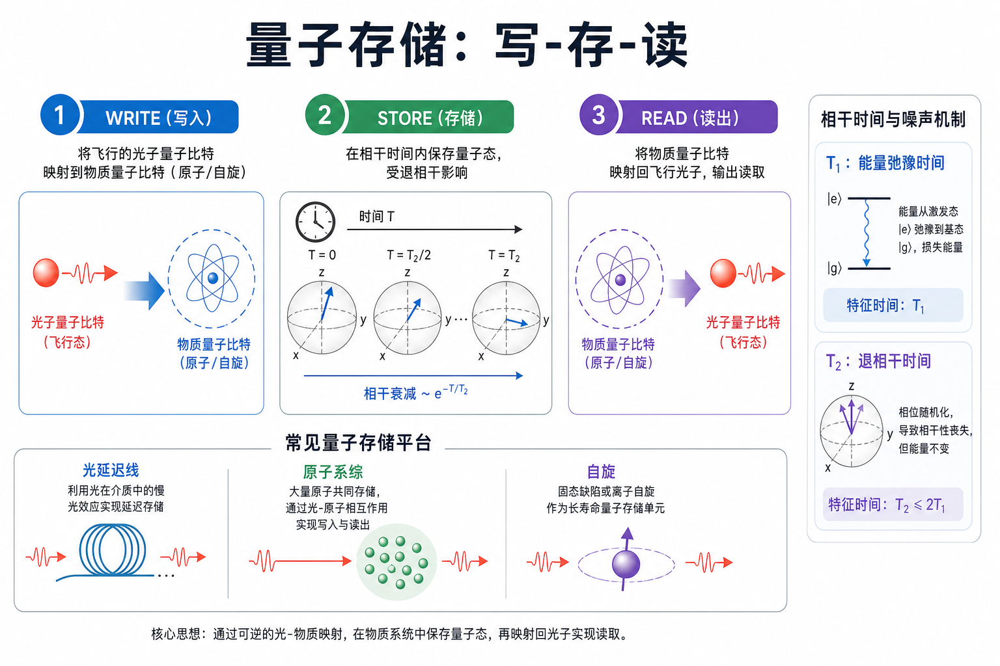
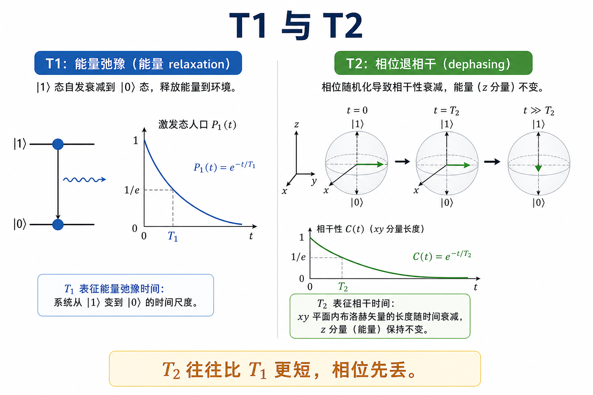
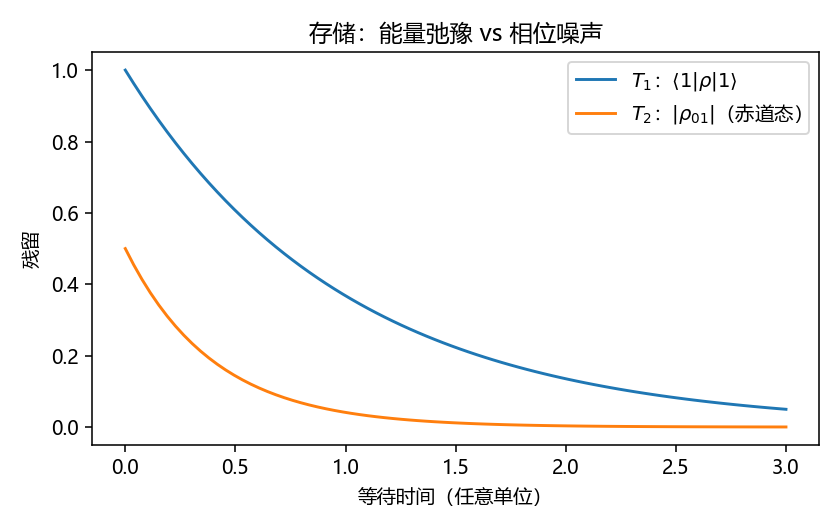
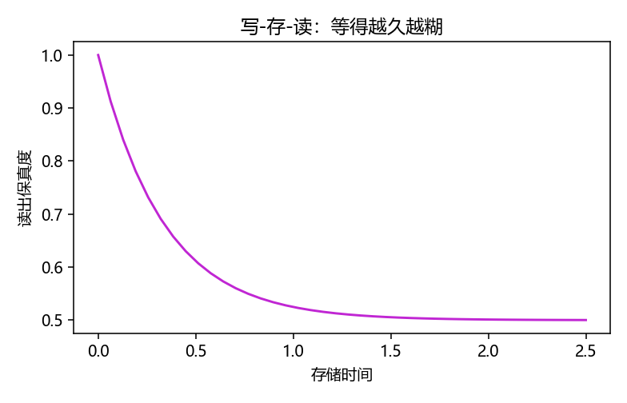

# 量子存储：写、存、读与相干时钟

> [!WARNING]
> 🧪 Beta公测版本提示：教程主体已完成，正在优化细节，欢迎大家提Issue反馈问题或建议。

> 光子跑得太快，物质比特又待不久。量子存储要做的事很土：把飞行中的量子态**写进**一个相对静止的自由度，**等一会儿**，再**读出来**——还不能违反不可克隆。

前置：[量子计算](/quantum/computing/) 的密度矩阵直觉；[量子网络](/quantum/network/) 的中继动机。需要从 Kraus 算子或 $T_2<2T_1$ 推一遍时，点开「逐步推导」。

---

## 一、为什么必须有「内存」

三件互斥的事叠在一起：

1. **通信**：信息往往编码在光子上（光纤、自由空间）；
2. **处理**：逻辑门、纠缠交换发生在物质比特或非线性介质里；
3. **时间**：两路光子几乎不可能自己对准，中继要等另一半到达。

经典内存可以复制再存。量子内存必须是**可逆的写-读映射**（理想情况下是一个大的酉或等距嵌入），不能先测量再重建未知态。

**保姆级：等，就是在消耗相干。** 中继说「我先把 Alice 的光子写进原子，等 Bob 那边的光子来」。等待时间 $t$ 里，$T_1$ 把激发漏掉，$T_2$ 把相位抹掉。能等的上限不是硬盘容量，是这两条钟。demo 把钟画成往下掉的曲线。

---

## 二、写-存-读

理想循环：

$$
|\psi\rangle_{\mathrm{flying}}
\;\xrightarrow{\mathrm{write}}\;
|\psi\rangle_{\mathrm{matter}}
\;\xrightarrow{\mathrm{wait}}\;
|\psi(t)\rangle
\;\xrightarrow{\mathrm{read}}\;
|\psi\rangle_{\mathrm{flying}}'.
$$

等待时间 $t$ 里，环境会做两件主要的坏事（见全景章）：

- **$T_1$**：激发布居漏掉（振幅阻尼）；
- **$T_2$**：相对相位被冲刷（往往 $T_2 < 2T_1$）。

读出保真度随 $t$ 下降——demo 把这件事画成一条往下掉的曲线。玩具参数（任意时间单位）：$T_1=1.0$、$T_2=0.4$，种子 `42`。$T_1$ 曲线看 $|1\rangle$ 的布居；$T_2$ 曲线看赤道态 $|+\rangle$ 的 $|\rho_{01}|$。写-存-读对 $|+\rangle$ 同时套振幅阻尼和退相位，时间从 $0$ 到 $2.5$。

> **图解说明**：左图是工程循环；右图是两条钟。网络中继的「能等多久」直接由 $T_2$ 决定。

::: details 逐步推导：振幅阻尼的 Kraus 算子，以及为什么常有 $T_2<2T_1$（点击展开）

振幅阻尼（激发 $|1\rangle$ 以概率 $p$ 掉到 $|0\rangle$）的一组 Kraus：

$$
E_0=\begin{pmatrix}1&0\\0&\sqrt{1-p}\end{pmatrix},\qquad
E_1=\begin{pmatrix}0&\sqrt{p}\\0&0\end{pmatrix},\qquad
p=1-e^{-t/T_1}.
$$

这与 demo `amp_damping` 一致。对 $\rho=|1\rangle\langle 1|$，$\langle 1|\rho(t)|1\rangle=e^{-t/T_1}$，即 $T_1$ 曲线。

纯退相位：非对角元乘 $e^{-t/T_2}$（demo `dephase`）。赤道态 $|+\rangle$ 的 $|\rho_{01}|$ 初值 $1/2$，按 $T_2$ 掉——demo 直接画 $|\rho_{01}|$。

为什么 $T_2\le 2T_1$：能量弛豫本身会破坏相干。Lindblad 里若只有振幅阻尼，横向弛豫时间满足 $T_2=2T_1$。额外的纯退相位（磁场涨落、碰撞）再贡献 $1/T_\varphi$，于是

$$
\frac{1}{T_2}=\frac{1}{2T_1}+\frac{1}{T_\varphi}\quad\Rightarrow\quad T_2<2T_1.
$$

demo 故意取 $T_2=0.4<2=2T_1$，让你看见相位先死、能量后死。写-存-读保真度 $F=\langle\psi|\rho(t)|\psi\rangle$ 对 $|+\rangle$ 会两条钟一起掉：等得越久越糊。数字是任意单位，不对应某实验室的毫秒数。

不可克隆再次出现：你不能把未知态复制一份「热备份」；只能可逆地嵌入物质自由度，然后跟环境赛跑。

:::

---

## 三、平台对照（只记用途，不背参数表）

| 类型 | 直觉 | 典型用途 |
|------|------|----------|
| 光纤延迟线 | 让光子在圈里多跑几圈 | 短时缓冲，不是长时内存 |
| 原子系综 | 一个光子写成集体自旋波 | 与通信波长衔接、多模 |
| 单原子 / 离子 / 缺陷自旋 | 单个物质比特 | 长相干、可做门，写读接口更挑 |
| 超导谐振腔 | 微波光子存在腔里 | 芯片上的「量子 RAM」雏形 |

没有一种平台同时做到：长 $T_2$、高写读效率、电信波段、易集成。这就是为什么量子网络论文充满「接口」和「转换」。

---

## 四、和计算、网络、模拟的接口

- **计算**：纠错码的稳定子测量之间，逻辑信息必须活过一个周期——还是存储。
- **网络**：纠缠纯化、交换都要求两路比特同时在场。
- **模拟**：模拟时间一长，错误就变成「假动力学」。存储/相干是模拟精度的墙。

demo 用单比特振幅阻尼 + 退相位的玩具信道，不声称对应某一实验室的 $T_1$ 毫秒数。

---

## 五、小结

| 概念 | 一句话 |
|------|--------|
| 写-存-读 | 飞行比特 ⇄ 物质比特的可逆接口 |
| $T_1$ | 能量弛豫，布居指数掉 |
| $T_2$ | 失相，赤道相干掉得更快 |
| 延迟线 | 短缓冲，不是通用内存 |
| 中继瓶颈 | 等光子 ≈ 消耗相干时间 |

> 下一章 [量子模拟](/quantum/simulation/)：在相干窗口里，让硬件的哈密顿量替你演化。

## 📥 Code

| File | View | Download |
|------|------|----------|
| demo.py | [Open](./code-demo) | <a href="/notebook/code/quantum/memory/demo.py" target="_blank" download>Download</a> |
| exercise.py | [Open](./code-exercise) | <a href="/notebook/code/quantum/memory/exercise.py" target="_blank" download>Download</a> |

## 参考

1. Lvovsky, Sanders, Tittel, *Optical quantum memory*. *Nature Photonics* (2009).
2. Hammerer, Sørensen, Polzik, *Quantum interface between light and atomic ensembles*. RMP (2010).
3. Nielsen & Chuang 中振幅阻尼 / 相位阻尼信道（玩具模型与本章 demo 同源）。
