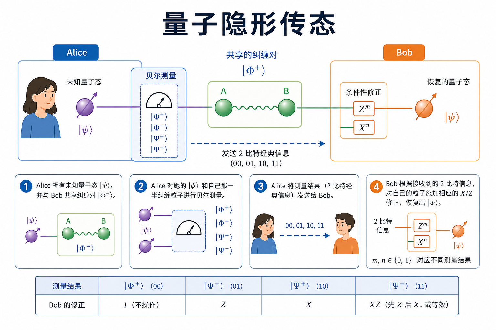
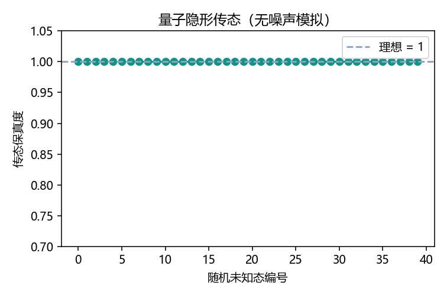
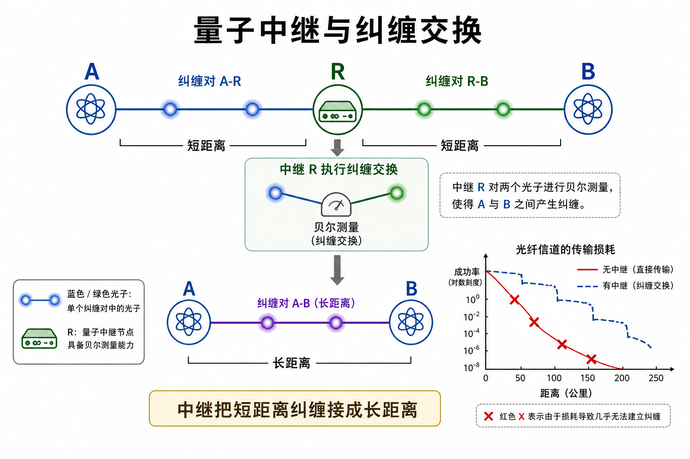
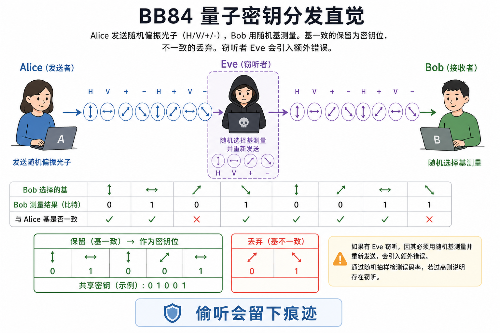
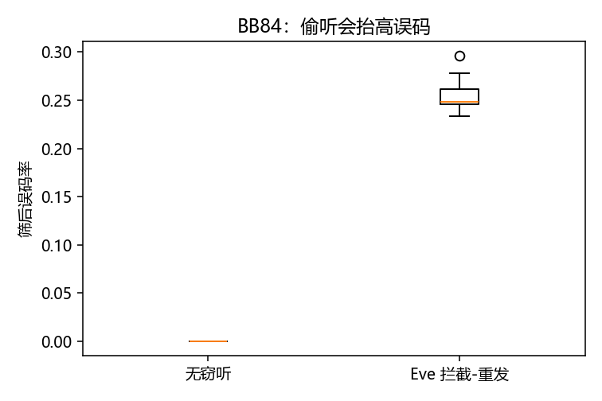

# 量子网络：把纠缠送到远方

> [!WARNING]
> 🧪 Beta公测版本提示：教程主体已完成，正在优化细节，欢迎大家提Issue反馈问题或建议。

> 量子网络的核心资源不是「更快的网线」，而是**可分发的纠缠**。有了共享 Bell 对，就可以传未知态、做纠缠交换、并给密钥分发提供物理层约束。

前置：[量子计算](/quantum/computing/)（Bell 态、测量）。存储章解释为什么中继节点需要把光子写进物质。

---

## 一、纠缠是一种可以搬运的相关

Bell 态 $|\Phi^+\rangle=(|00\rangle+|11\rangle)/\sqrt{2}$ 的性质：

- 单独看 Alice 的比特，测量 0/1 各一半（局域随机）；
- 一旦 Alice 得到 0，Bob 再测一定是 0（完美关联）。

这种关联**不能**用事先约定的经典随机数完全伪造到任意测量基。网络工程师关心的是：如何让相距很远的两方**稳定地持有**这样一对。

光纤会丢光子、会引入噪声，直接「扔一个纠缠光子对过去」距离有限。于是需要中继、存储、交换。

---

## 二、隐形传态：拆开「传态」两个字

量子隐形传态（teleportation）**不传输物质**，只传输未知态 $|\psi\rangle$ 的信息：

1. Alice 与 Bob 事先共享 $|\Phi^+\rangle$；
2. Alice 把 $|\psi\rangle$ 和她那半边纠缠做 Bell 测量，得到两个经典比特；
3. 把这两个比特发给 Bob（普通电话即可）；
4. Bob 根据比特做 $X$/$Z$ 修正，他手中的量子比特变成 $|\psi\rangle$。

Alice 手里的 $|\psi\rangle$ 在测量后被毁掉——不可克隆在这里表现为：态是「搬走」而不是「复制」。

> **图解说明**：量子资源是预先分发的纠缠；通信过程真正在线上跑的，是两个经典比特。demo 对随机未知态重复传态，无噪声时保真度应贴近 1。

---

## 三、纠缠交换与量子中继

若 Alice–中继、中继–Bob 各有一对纠缠，中继对自己的两个量子比特做 Bell 测量，就可以把纠缠「接」到 Alice–Bob 上——这叫**纠缠交换**。量子中继把短距离高品质纠缠级联成更长的链路。

没有中继时，光纤透过率大致随距离指数下降；有中继（再配量子存储对齐到达时间）才能谈城域 / 骨干量子网。

> **图解说明**：中继不是经典路由器的「存储转发 IP 包」，它消耗两段短纠缠、产出一段长纠缠。时钟同步和存储相干时间是工程瓶颈，见 [量子存储](/quantum/memory/)。

---

## 四、BB84：密钥从量子测量里长出来

BB84 是教学上最干净的量子密钥分发（QKD）协议：

- Alice 随机选比特和基（$Z$ 或 $X$），制备对应偏振（或自旋）光子发给 Bob；
- Bob 随机选基测量；
- 双方公开**基**（不是比特），只保留基一致的那些作为筛后密钥；
- 抽样核对误码率。若中间有人拦截-重发，会引入额外误码。

不可克隆保证：Eve 不能先完美复制再把原件转给 Bob。demo 用抛硬币模型对比「无窃听」与「拦截-重发」的筛后误码。

> **图解说明**：真实 QKD 还有认证经典信道、隐私放大、有限码长分析。这里只建立「偷听会在统计上露馅」的直觉。

---

## 五、小结

| 概念 | 一句话 |
|------|--------|
| 纠缠资源 | 可分发的非经典关联 |
| 传态 | 纠缠 + 两比特经典通信搬走未知态 |
| 纠缠交换 | 把两段短纠缠接成长纠缠 |
| 中继 | 交换 + 存储 + 纯化，对抗光纤指数损耗 |
| BB84 | 随机基 + 筛后密钥；窃听抬高误码 |

> 下一章 [量子存储](/quantum/memory/)：中继和同步为什么必须把「飞行比特」写成「静止比特」。

## 📥 Code

| File | View | Download |
|------|------|----------|
| demo.py | [Open](./code-demo) | <a href="/notebook/code/quantum/network/demo.py" target="_blank" download>Download</a> |
| exercise.py | [Open](./code-exercise) | <a href="/notebook/code/quantum/network/exercise.py" target="_blank" download>Download</a> |

## 参考

1. Bennett et al., *Teleporting an unknown quantum state…* PRL (1993).
2. Briegel, Dür, Cirac, Zoller, *Quantum Repeaters* PRL (1998).
3. Bennett & Brassard, BB84 (1984); Scarani et al., *The security of practical quantum key distribution* RMP (2009).
