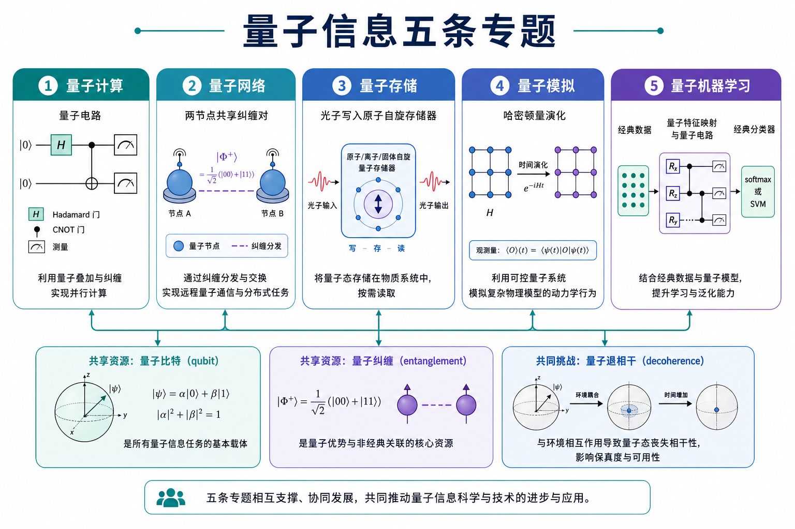
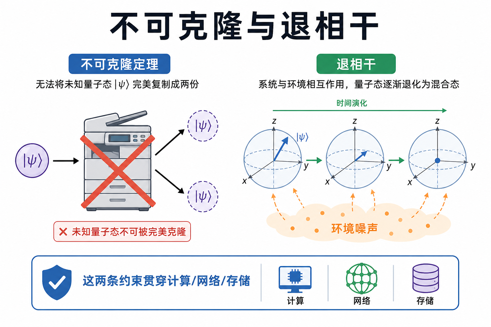
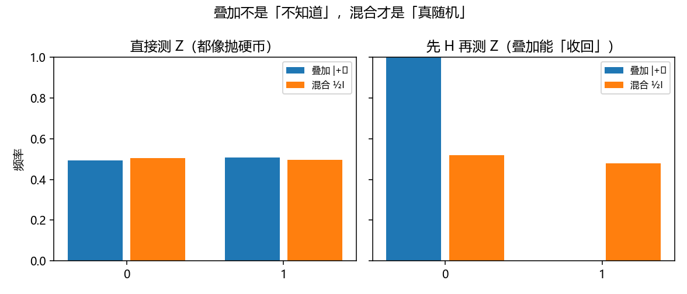

# 量子信息全景：五条专题共用的语言

> [!WARNING]
> 🧪 Beta公测版本提示：教程主体已完成，正在优化细节，欢迎大家提Issue反馈问题或建议。

> 量子信息不是「把电脑换成量子的」一句话，而是一套关于**如何编码、传送、保存、模拟和用量子系统学习**的共同语言。

本领域放在 [科学计算](/science/overview/) 与 [世界模型](/world-models/intro/) 之间：一边连物理与硬件，一边连机器学习。线性代数是硬前置，请先有 [向量 / 矩阵 / 内积](/math/linear-algebra/) 的几何直觉。

---

## 一、量子信息在问什么？

经典比特是 `{0,1}`。量子比特（qubit）是二维复向量（态矢量）

$$
|\psi\rangle = \alpha|0\rangle + \beta|1\rangle,
\quad
|\alpha|^2 + |\beta|^2 = 1.
$$

测量在计算基上只能得到 0 或 1，概率分别是 $|\alpha|^2$、$|\beta|^2$。**叠加不是「同时是 0 又是 1 的魔法」**，而是：在测量之前，系统由振幅描述；测量之后，坍缩成一个经典结果。

多个量子比特的空间是张量积 $\mathbb{C}^{2}\otimes\mathbb{C}^{2}\otimes\cdots$，维度 $2^n$。这既是算力叙事的来源（状态空间指数大），也是模拟它之所以难的原因。

---

## 二、五条专题：一张地图

本领域按**你拿量子系统干什么**拆成五章，而不是按公司或芯片名单堆名词：

> **图解说明**：计算研究门与算法；网络把纠缠当成可分发的资源；存储解决光子飞太快、物质相干太短的时间错配；模拟用可控量子系统去跟自然哈密顿量；机器学习把线路嵌进可训练管线。五条路共用量子比特、纠缠和噪声。

| 专题 | 关键问题 | 下一章 |
|------|----------|--------|
| **量子计算** | 门、线路、测量、NISQ vs 容错 | [computing](/quantum/computing/) |
| **量子网络** | 如何把纠缠分发到远处？ | [network](/quantum/network/) |
| **量子存储** | 如何把量子态「按住」一段时间？ | [memory](/quantum/memory/) |
| **量子模拟** | 如何用量子系统模拟量子系统？ | [simulation](/quantum/simulation/) |
| **量子机器学习** | 经典特征如何写进线路并训练？ | [qml](/quantum/qml/) |

阅读顺序建议：全景 → 计算 → 网络 / 存储（可并行）→ 模拟 → 机器学习。QML 章收编了混合量子分类实验（VQNet 核心随该章发布）。

---

## 三、两条贯穿约束

### 3.1 不可克隆

未知量子态不能被可靠地复制成两份相同的未知态（no-cloning）。因此：

- 不能像复制文件那样「备份一个量子比特再测量」；
- 量子密钥分发里，偷听会扰动态，从而留下痕迹；
- 纠错必须绕开「先复制再投票」的经典思路，改用纠缠与稳定子。

### 3.2 退相干

真实系统会与环境纠缠，相对相位被冲刷。常用两个时间尺度：

- $T_1$：能量弛豫（激发态掉回基态）；
- $T_2$：失相（布洛赫球赤道上的相干先没）。

计算深度、网络距离、存储时间、模拟时长，最后都撞上这两条钟。

> **图解说明**：左边是禁止的复印机；右边是布洛赫矢量被噪声往球心拽。后面每一章都会回到这两张图。

---

## 四、叠加 vs 混合：demo 在画什么

测量「0 和 1 各一半」有两种完全不同的来源：

- **相干叠加** $|+\rangle=(|0\rangle+|1\rangle)/\sqrt{2}$：有相对相位，再用 $H$ 可以几乎确定地变回 $|0\rangle$；
- **经典混合** $\rho=I/2$：真随机，再做 $H$ 仍然是 50/50。

`demo.py` 用两次测量把这件事画出来。纯度 $\mathrm{Tr}(\rho^2)$ 是配套练习：纯态为 1，单比特完全混合为 $1/2$。

---

## 五、和本笔记本其他部分的接口

- **数学**：态矢量、酉门、测量投影，全是线代；变分量子线路的训练还用得到 [梯度](/math/optimization/) 与 [KL / 交叉熵](/math/information/)。
- **深度学习**：QML 的经典压缩器就是普通网络；对照 [CNN](/applied/cv/cnn/)。
- **科学计算**：量子模拟是 AI4S 的「另一条轴」——不一定用神经网络逼近 PDE，而是让硬件自己演化哈密顿量。

---

## 六、小结

| 概念 | 一句话 |
|------|--------|
| 量子比特 | 归一化复向量；测量给出经典比特 |
| 张量积 | $n$ 比特空间维度 $2^n$ |
| 叠加 vs 混合 | 有没有相对相位；测量直方图可以长一样 |
| 不可克隆 | 未知态不能完美复印 |
| 退相干 | $T_1$ 掉能量，$T_2$ 掉相位 |
| 五条专题 | 计算 / 网络 / 存储 / 模拟 / 学习 |

> 下一章 [量子计算](/quantum/computing/)：把 $|0\rangle$、$H$、CNOT 和测量连成一条能跑的线路。

## 📥 Code

| File | View | Download |
|------|------|----------|
| demo.py | [Open](./code-demo) | <a href="/notebook/code/quantum/overview/demo.py" target="_blank" download>Download</a> |
| exercise.py | [Open](./code-exercise) | <a href="/notebook/code/quantum/overview/exercise.py" target="_blank" download>Download</a> |

## 参考

1. Nielsen, M. A. & Chuang, I. L. *Quantum Computation and Quantum Information*.
2. Wilde, M. M. *Quantum Information Theory*.
3. Preskill, J. *Quantum Computing in the NISQ era and beyond*. *Quantum* (2018).
