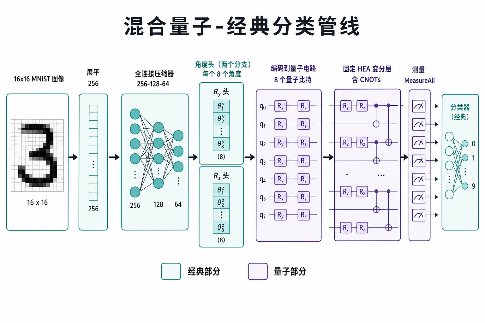
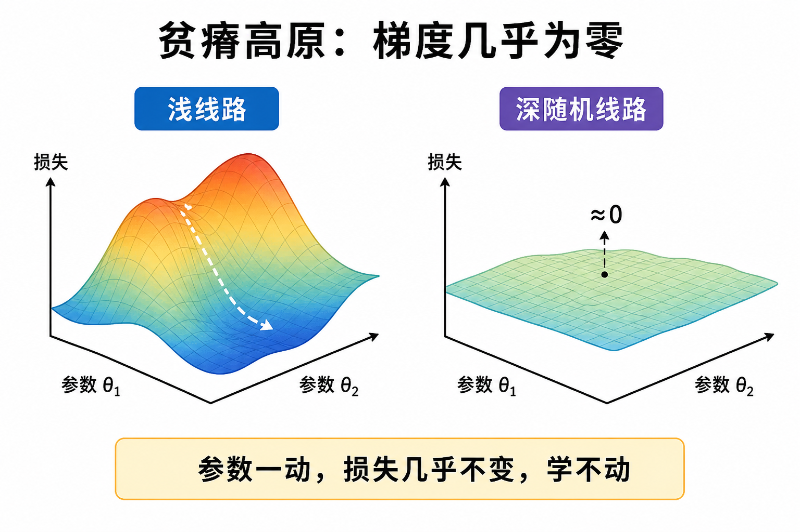
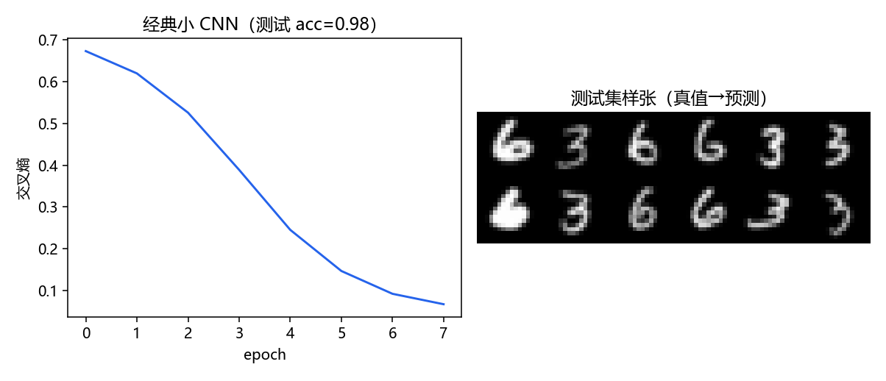

# 量子机器学习：混合线路怎么分类一张图

> [!WARNING]
> 🧪 Beta公测版本提示：教程主体已完成，正在优化细节，欢迎大家提Issue反馈问题或建议。

> 量子机器学习（QML）在 NISQ 上几乎总是**混合**的：经典网络整理特征，量子线路吃角度、吐测量，再接一个小分类头。本章把这条管线讲清楚，并收编独立示例工程 *qml-mnist-classify*（MIT，现随本章发布）里基于本源 **VQNet** 的 8 比特实验。

前置：[量子计算](/quantum/computing/) 的门与测量、[CNN](/applied/cv/cnn/) 的特征提取、[优化](/math/optimization/) 的梯度下降。`pyvqnet` **不是** notebook 默认依赖；没装也能跑经典基线。

---

## 一、QML 在 NISQ 上实际在做的事

指数维希尔伯特空间**并不自动**等于「分类更准」。当前常见的可跑通范式是：

$$
x \;\xrightarrow{\text{经典编码器}}\; \theta(x)
\;\xrightarrow{U(\theta,\phi)}\;
|\psi\rangle
\;\xrightarrow{\text{测量}}\;
\hat y.
$$

- $\theta(x)$：数据相关的旋转角（编码）；
- $\phi$：可训练的线路参数（ansatz / HEA）；
- 测量期望值当特征，后面再接线性层也常见。

需要避开的幻觉：把 16×16 图像的 256 个像素直接当成 256 个量子比特。那既编不进 NISQ，也没有证据表明更准。正确的工程直觉是：**先压缩，再编码**。



> **图解说明**：FC 压缩 → 两个角度头 → Ry/Rz 写入 8 比特 → 固定 HEA → MeasureAll → 分类。

配套示意图（SVG，可点开）：

- [整体数据流](./images/qml_pipeline.svg)
- [编码线路](./images/qml_encoding_circuit.svg)
- [编码 vs HEA 职责](./images/encoder_hea_explained.svg)
- [HEA 结构](./images/hea_structure.svg)
- [训练循环](./images/qml_training_loop.svg)

---

## 二、经典到量子的接口

原示例教程把接口拆成四步，本章直接采用：

1. **展平**：`16×16 → 256`。信息量不变，只是给全连接层吃向量。
2. **经典压缩器**：`256 → 128 → 64`，Tanh。量子比特只有 8 个，必须先提炼。
3. **角度头**：两个独立的 `Linear(64, 8)`，分别产出 Ry 与 Rz 的 8 个角。再 `Sigmoid × 2π` 把范围压到 $[0,2\pi]$。
4. **`_encode()`**：对第 $i$ 个比特施加 $R_y(\theta_i)$、$R_z(\phi_i)$。这才是经典数变成量子门参数的时刻。

之后进入**固定 Hardware Efficient Ansatz（HEA）**：交错的单比特旋转 + 邻近 CNOT。编码负责「把图写进态」，HEA 负责「再搅一搅、纠缠一下」。原仓默认配置去掉了编码阶段的 CNOT 链，让纠缠主要来自 HEA，以降低编码复杂度。

练习 `exercise.py` 不依赖 VQNet，只让你实现角度头的 NumPy 版：线性 → sigmoid → $2\pi$。

---

## 三、训练：前向、损失、验证集

混合模型的前向一旦可微（参数移位规则或框架自动求导），就可以用交叉熵 + Adam。原仓要点：

- 从**训练集内部**切验证集，测试集只在 `eval.py` 动——避免泄漏；
- 权重与报告写到 `code/model/`（已 gitignore）；
- 逐样本预测表便于检查「总在猜同一类」之类的崩法。

完整训练入口仍是 `train.py` / `eval.py` / `qml_core.py`，需要本源 VQNet（[产品页](https://qcloud.originqc.com.cn/zh/programming/VQNet)）。`demo.py` 在能 `import pyvqnet` 时做一次前向冒烟；否则打印安装说明并**继续跑经典对照**。

---

## 四、贫瘠高原与「量子一定更强吗」

随机深线路的梯度方差会随比特数指数变小——**贫瘠高原（barren plateau）**：参数怎么动，损失几乎不变。这是变分 QML 的结构性风险，和 GAN 的模式坍塌不同，但同样表现为「看起来在训、其实学不动」。



> **图解说明**：浅、有结构的编码 + 不太深的 HEA，是 NISQ 上还敢动手的原因之一；盲目加层往往会先把梯度训死。

因此本章的对照实验是**工程对比**，不是「量子击败 LeNet」的榜单：

| | 量子混合 | 同任务小 CNN | 原对照 LeNet-5 |
|--|--|--|--|
| 框架 | VQNet | PyTorch | PyTorch |
| 输入 | 16×16，数字 3 vs 6 | 同一套 npz | 28×28，数字 0 vs 1 |
| 特征 | FC 压缩 + 角度头 | 卷积 | 经典 LeNet 卷积块 |
| 量子资源 | 8 比特 + 固定 HEA | 无 | 无 |
| 数据从哪来 | `dataset/*.npz` | 同上 | torchvision MNIST（无 PNG） |
| 默认依赖 | 需自备 `pyvqnet` | notebook 已有 torch | 同上；下载失败则跳过 |

LeNet-5 的层结构与原独立示例一致（`lenet.py`），只是数据改为现场从 MNIST 筛 0/1，不再携带上千张 PNG。



---

## 五、代码地图

```
docs/quantum/qml/code/
  demo.py          # 16x16 CNN + LeNet-5 对照 + 可选 VQNet 冒烟
  lenet.py         # 28x28 LeNet-5（torchvision MNIST，0 vs 1）
  exercise.py      # 角度头（纯 NumPy）
  qml_core.py      # 共享核心（import 需要 pyvqnet）
  train.py / eval.py
  dataset/*.npz    # 1000+200 张 16x16（3 vs 6）
  LICENSE-qml-mnist-classify.txt
```

建议阅读顺序：接口 → 训练循环 → 再决定是否安装 VQNet 跑满 24 epoch。对照时记住：**16x16 小 CNN 才和量子模型同一任务**；LeNet-5 是原示例的另一条经典路线（更大图、另一对数字）。

---

## 六、小结

| 概念 | 一句话 |
|------|--------|
| 混合 QML | 经典压缩 + 量子编码 + 测量分类 |
| 角度头 | 隐藏向量 → $[0,2\pi]$ 门角 |
| HEA | 硬件友好的固定纠缠模板 |
| 贫瘠高原 | 深随机线路梯度消失 |
| 本仓库策略 | VQNet 原样可跑；缺依赖不 crash |

> 量子信息五章到此收束。可回到 [全景](/quantum/overview/) 或去 [科学计算](/science/overview/) 看经典高维模拟的另一条路。

## 📥 Code

| File | View | Download |
|------|------|----------|
| demo.py | [Open](./code-demo) | <a href="/notebook/code/quantum/qml/demo.py" target="_blank" download>Download</a> |
| lenet.py | — | <a href="/notebook/code/quantum/qml/lenet.py" target="_blank" download>Download</a> |
| exercise.py | [Open](./code-exercise) | <a href="/notebook/code/quantum/qml/exercise.py" target="_blank" download>Download</a> |

## 参考

1. 本源 VQNet：[产品介绍](https://qcloud.originqc.com.cn/zh/programming/VQNet)、[pyQPanda3 量子 ML 接口](https://qcloud.originqc.com.cn/document/vqnet_api_cn/rst/qnn_pq3.html)。
2. Cerezo et al., *Variational quantum algorithms*. Nat. Rev. Phys. (2021)；McClean et al., barren plateaus (2018).
3. Mitarai et al. / Schuld et al.：参数移位与混合量子-经典求导。
4. LeCun et al., LeNet-5；本章 `lenet.py` 为 0 vs 1 二分类改写。
