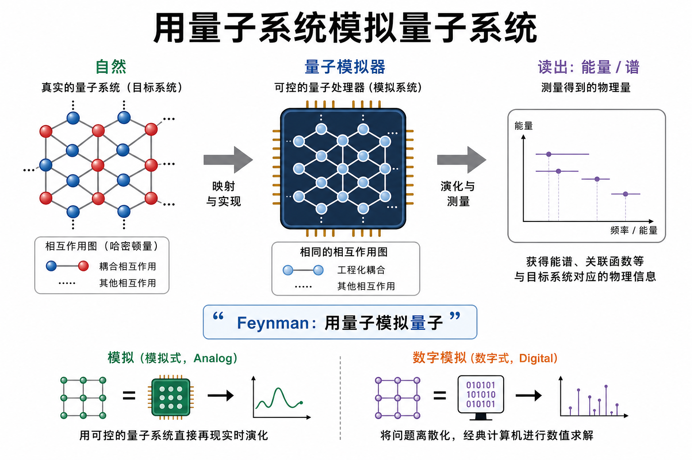
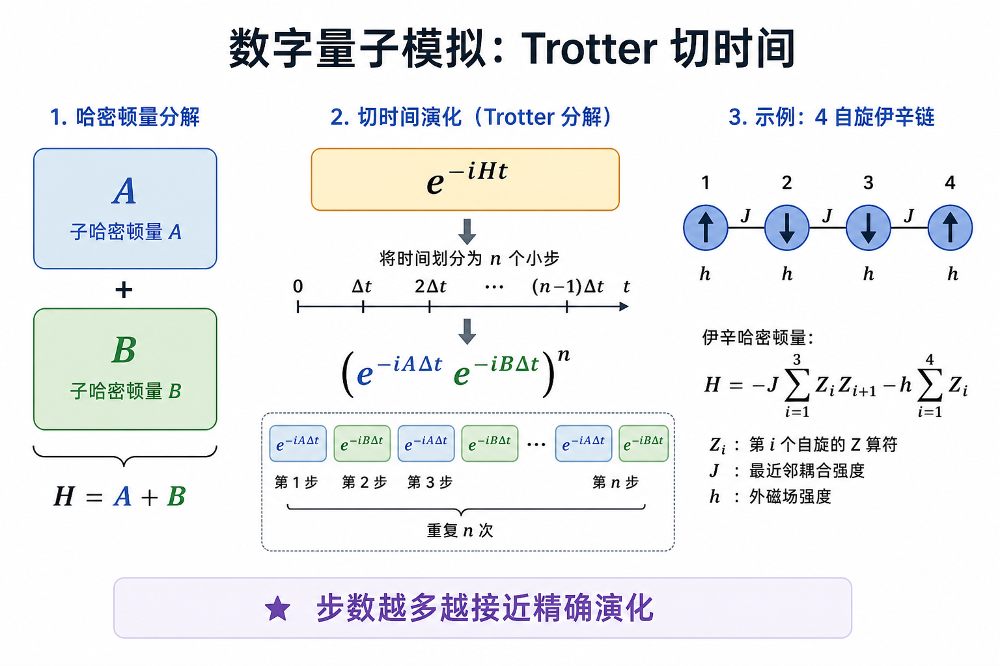
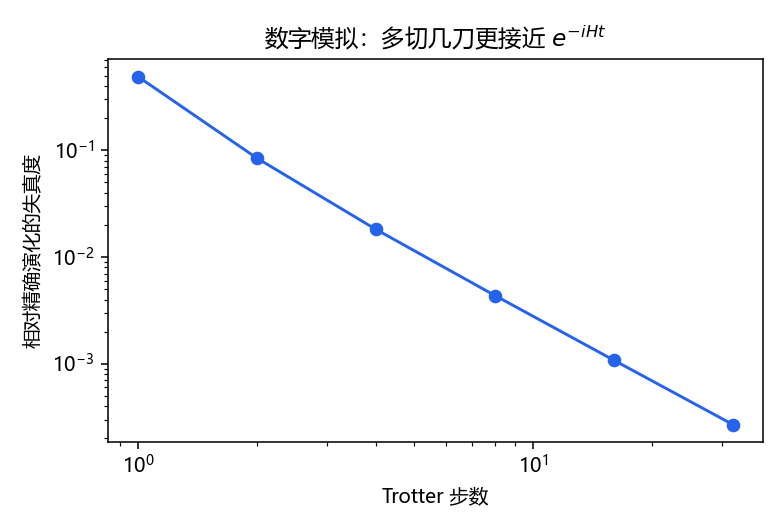

# 量子模拟：让硬件演化哈密顿量

> [!WARNING]
> 🧪 Beta公测版本提示：教程主体已完成，正在优化细节，欢迎大家提Issue反馈问题或建议。

> Feynman 的原话精神是：用量子系统去模拟量子系统。经典计算机要存 $2^n$ 个振幅；若硬件自己就是那 $n$ 个自旋，演化可以「长在」物理里。

前置：[量子计算](/quantum/computing/) 的酉演化；[科学计算全景](/science/overview/) 里维度灾难的对照。需要把 $4\times 4$ 横场 Ising 或 Trotter 误差展开时，点开「逐步推导」。

---

## 一、问题：多体量子力学难在哪

封闭系统的薛定谔方程

$$
i\hbar\frac{d}{dt}|\psi\rangle = H|\psi\rangle
\quad\Rightarrow\quad
|\psi(t)\rangle = e^{-iHt/\hbar}|\psi(0)\rangle
$$

$H$ 是 $2^n\times 2^n$ 的厄米矩阵（$n$ 个自旋）。精确对角化只对很小的 $n$ 可行。蒙特卡洛会碰上符号问题；张量网络擅长一维……**没有一种经典方法通吃所有相互作用图**。

这和 PINN / 算子学习要逼近的 PDE 不是同一句话，但痛点同类：状态空间太大。

**保姆级：$n=50$ 已经存不下。** 一个复数 $16$ 字节量级，$2^{50}$ 个振幅是拍字节——笔记本内存是笑话。量子模拟的赌注是：别存振幅表，让另一堆自旋按近似同一套 $H$ 自己转。读出的是能量、关联，不是把 $2^n$ 个数搬回家。

> **图解说明**：左边是分子或晶格，右边是可编程的自旋 / 超导 / 离子阵列。模拟成功的标志是能读出能量、关联函数或动力学，而不是「比特数广告」。

---

## 二、模拟 vs 数字模拟

- **模拟型（analog）**：直接让硬件哈密顿量 $\tilde H(t)$ 贴近目标 $H$。调耦合、磁场，少谈「门」。适合特定晶格。
- **数字型（digital）**：把 $e^{-iHt}$ 编译成基本门序列。通用，但深度随精度与时间增长，NISQ 上很快撞墙。

两者之间还有混合：变分量子本征求解器（VQE）用浅线路猜基态，经典优化器调角度——和 [QML](/quantum/qml/) 共享「参数化线路 + 经典环」。

---

## 三、Trotter：把时间切成能编译的薄片

若 $H=A+B$ 且 $[A,B]\neq 0$，则

$$
e^{-i(A+B)t} \approx \big(e^{-iA t/n}e^{-iB t/n}\big)^n
$$

$n$ 越大，一阶公式的误差大致 $O(t^2/n)$。更高阶 Suzuki 公式能再压误差，但门更多。

`demo.py` 在 **两个自旋** 的横场 Ising

$$
H = J\,Z\otimes Z + h(X\otimes I + I\otimes X)
$$

上对比「精确 `eigh`」与一阶 Trotter。参数 $J=1.0$、$h=0.7$，演化时间 $T=1.2$（令 $\hbar=1$），初态 $|00\rangle$，步数 $1,2,4,8,16,32$。你应看到：步数增加，失真度在对数图上往下掉。种子 `42`。终端打印 `步数 → 失真度`。

> **图解说明**：这是数字模拟的最小可运行内核。真实分子还要做费米到自旋的映射（Jordan–Wigner 等），本章不展开。

::: details 逐步推导：两自旋横场 Ising 的 $4\times 4$ 矩阵从哪来（点击展开）

单比特 $X,Z$ 是 Pauli。两比特算子用 Kronecker 积（demo 的 `np.kron`）：

$$
Z\otimes Z=\mathrm{diag}(1,-1,-1,1),\qquad
X\otimes I=\begin{pmatrix}0&0&1&0\\0&0&0&1\\1&0&0&0\\0&1&0&0\end{pmatrix}.
$$

$I\otimes X$ 类似，在另一因子上翻。$A=J\,ZZ$ 只含相互作用，本征基是计算基；$B=h(XI+IX)$ 是横场，把 $|0\rangle$ 和 $|1\rangle$ 搅在一起。$[A,B]\neq 0$（相互作用基与横场基不同），所以 $e^{-i(A+B)t}\neq e^{-iAt}e^{-iBt}$。精确演化：对 $H_{\mathrm{tot}}=A+B$ 做 `eigh`，再 $\sum_k e^{-i\lambda_k t}|v_k\rangle\langle v_k|$。

一阶 Trotter：把 $T$ 切成 $n$ 份，$\mathrm{d}t=T/n$，反复做 $e^{-iB\,\mathrm{d}t}e^{-iA\,\mathrm{d}t}$（demo 是 `ub @ ua`）。这里必须区分误差度量：固定 $T$ 时，一阶公式的演化算子误差、态矢量误差为 $O(1/n)$；图中画的却是失真度 $1-|\langle\psi_{\mathrm{exact}}|\psi_{\mathrm{trotter}}\rangle|^2$。对归一化纯态，失真度对小的态偏差是二阶量，通常为 $O(1/n^2)$，在渐近区对应 log-log 斜率约 $-2$，不能把一阶算子误差的 $-1$ 直接当成图的斜率。特殊初态或参数可能使最低阶系数消失。

更直接地，令近似归一化态 $|\tilde\psi\rangle=a|\psi\rangle+|\epsilon_\perp\rangle$，其中 $\langle\psi|\epsilon_\perp\rangle=0$。归一化给出 $|a|^2+\|\epsilon_\perp\|^2=1$，所以

$
1-|\langle\psi|\tilde\psi\rangle|^2=\|\epsilon_\perp\|^2.
$

若态误差的正交分量为 $O(1/n)$，失真度就是 $O(1/n^2)$。纯粹的全局相位误差不会降低保真度。因而在小误差区，步数加倍通常使图中失真度约缩小到四分之一，而不是二分之一；这不保证步数很小时也严格满足该比例。

:::

::: details 逐步推导：一阶 Trotter 误差为何 $\sim O(t^2/n)$（点击展开）

Baker–Campbell–Hausdorff：对两个一般矩阵

$$
e^{X}e^{Y}=e^{X+Y+\frac12[X,Y]+\cdots}.
$$

令 $X=-iA\,\mathrm{d}t$、$Y=-iB\,\mathrm{d}t$，则一步的生成元是 $-i(A+B)\mathrm{d}t$ 再加上 $\tfrac12[X,Y]=O((\mathrm{d}t)^2)$ 的对易修正。$n=t/\mathrm{d}t$ 步累积：每步 $O((\mathrm{d}t)^2)$，共 $O(t^2/n)$（在 $\|[A,B]\|$ 有界、时间不太长时）。这就是「多切几刀更接近 $e^{-iHt}$」。二阶 Suzuki（对称 Trotter）把对易项再消一阶，误差 $O(t^3/n^2)$，门数大约 1.5 倍。

NISQ 上 $n$ 不能无限加：每一步门都有噪声，切太细会先被退相干吃掉。实验要在 Trotter 误差和硬件误差之间折中。VQE 绕开长时间演化，改成浅线路猜基态能量，但会撞上 [QML](/quantum/qml/) 章的贫瘠高原。

:::

---

## 四、读出什么才算「模拟成功」

常见观测：

- 基态能量（化学精度是另一场战争）；
- 两点关联、结构因子；
- 淬火后的动力学（Loschmidt echo、扩散）。

NISQ 上的噪声会让长时动力学先假掉。因此实验论文会同时报：系统尺寸、演化时间、以及对照的经典方法（张量网络等）还能不能跟上。

---

## 五、小结

| 概念 | 一句话 |
|------|--------|
| 指数维 | $n$ 自旋 → $2^n$ 振幅 |
| 模拟型 | 硬件 $H$ 贴近目标 $H$ |
| 数字型 | 编译 $e^{-iHt}$ 为门 |
| Trotter | 把不对易的 $A+B$ 切成小时间步 |
| VQE | 浅线路 + 经典优化找能量 |

> 下一章 [量子机器学习](/quantum/qml/)：把可训练线路接到经典特征上，并收编 VQNet 混合分类实验。

## 📥 Code

| File | View | Download |
|------|------|----------|
| demo.py | [Open](./code-demo) | <a href="/notebook/code/quantum/simulation/demo.py" target="_blank" download>Download</a> |
| exercise.py | [Open](./code-exercise) | <a href="/notebook/code/quantum/simulation/exercise.py" target="_blank" download>Download</a> |

## 参考

1. Feynman, R. P. *Simulating physics with computers*. IJTP (1982).
2. Lloyd, S. *Universal quantum simulators*. Science (1996).
3. Childs et al., Trotter error 理论综述；Cerezo et al., VQE 综述 (2021).
