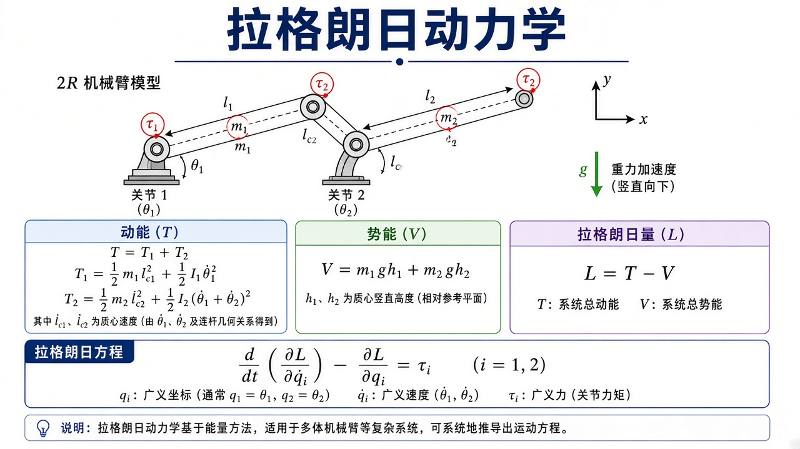
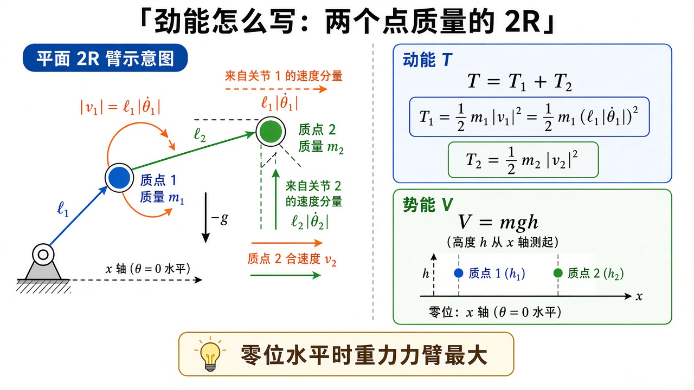
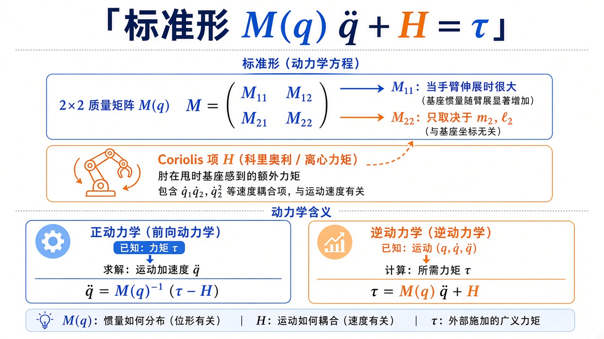
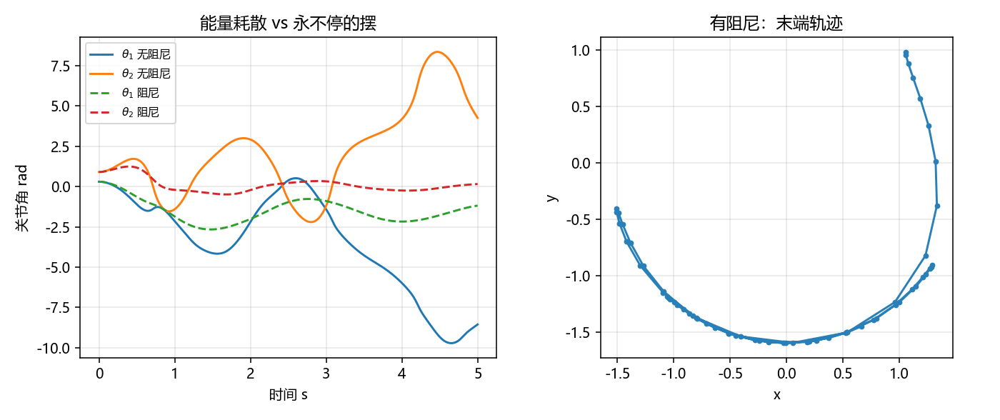

# 机器人动力学：力矩怎样变成加速度

> [!WARNING]
> 🧪 Beta公测版本提示：教程主体已完成，正在优化细节，欢迎大家提Issue反馈问题或建议。

> [运动学](/robotics/kinematics/) 告诉你手在哪。[轨迹](/robotics/trajectory/) 告诉你角如何随时间变。动力学告诉你：**要让关节按某个 $\ddot q$ 动，电机该出力矩 $\tau$ 多少**——以及反过来，零力矩时重力会把臂往哪拽。本章用平面 2R、质量集中在杆末端，把拉格朗日从能量写到 $M(q)\ddot q+H=\tau$ 的每一项。不引入牛顿-欧拉递推（那是同一方程的另一套算法，便于实时逆动力学）。

---

## 一、通俗理解：为什么不在每根杆上画受力图

牛顿定律要在每根杆上画重力、铰链反力、电机力矩，再消去「铰链里那对作用力与反作用力」。杆一多，未知内力比你关心的 $\tau$ 还多。

拉格朗日改走标量：只写动能 $T$、势能 $V$，广义坐标选关节角（约束已经被坐标吃掉，铰链反力不做功，不出现）。方程是

$$
\frac{\mathrm{d}}{\mathrm{d}t}\frac{\partial L}{\partial \dot q_i}-\frac{\partial L}{\partial q_i}=\tau_i,
\quad L=T-V.
$$

左端像「动量对时间的变化率减去势能坡度」。$\tau_i$ 是沿这个坐标的广义力——转动关节上就是电机力矩。

图解里杆可以有分布质量和转动惯量；**demo 把质量放在每根杆末端**，推导短一截，结构与带 $I_z$、质心距 $\ell_c$ 的教材完全一样。

公式看结论；$T_2$ 交叉项和 $M,H$ 从欧拉-拉格朗日怎么收，点开推导。

> **图解说明**：串联 2R，力矩标在关节 1、2；动能、势能、欧拉-拉格朗日。重力竖直向下。图示为质心与惯量；demo 把质量放在杆端。

<video controls muted loop playsinline preload="metadata" style="width:100%;max-width:960px;border-radius:8px;background:#f7fafc;margin:0.6rem 0;">
  <source src="./images/lagrange_free.mp4" type="video/mp4">
</video>

> **动画说明**：同一组拉格朗日方程、同一初值。左：无阻尼自由落体；右：关节黏性阻尼。$\theta=0$ 为水平，重力沿 $-y$。

**角度约定（必读）**：demo 里 $\theta=0$ 是**水平**（杆沿 $+x$），重力沿 $-y$，于是重力力矩里出现 $\cos\theta$（水平时力臂最大）。许多教材取竖直悬挂为 $0$，公式差一个 $\sin\leftrightarrow\cos$。抄系数前先看「零位在哪」。

---

## 二、保姆级：把 $T$ 和 $V$ 写出来

杆 1 末端速度：对 $p_1=(\ell_1\cos\theta_1,\ell_1\sin\theta_1)$ 求导，

$$
|v_1|=\ell_1|\dot\theta_1|,
\quad
T_1=\tfrac12 m_1 \ell_1^2\dot\theta_1^2.
$$

杆 2 末端就是手，速度由雅可比第一行给出（或直接对 FK 求导）。平方后

$$
T_2=\tfrac12 m_2\bigl(\ell_1^2\dot\theta_1^2+\ell_2^2(\dot\theta_1+\dot\theta_2)^2+2\ell_1\ell_2\cos\theta_2\,\dot\theta_1(\dot\theta_1+\dot\theta_2)\bigr).
$$

交叉项 $\cos\theta_2$：两杆夹角改变，两段速度的点积在变——伸直时「一起转」更费劲，折叠时部分抵消。

势能（$\theta=0$ 水平，$y$ 向上为正，重力 $-g\hat y$）：高度等于 $y$ 坐标，

$$
V=m_1 g \ell_1\sin\theta_1+m_2 g\bigl(\ell_1\sin\theta_1+\ell_2\sin(\theta_1+\theta_2)\bigr).
$$

（若你的零位是水平而势能用 $\sin$，要对一下坐标：demo 的重力项用的是 $\cos$，与「$y$ 向上、$\theta$ 从 $x$ 轴起」配套——见下一节 $H$ 里的 $g_1,g_2$。）

把 $L=T-V$ 代入欧拉-拉格朗日，对 $\theta_1,\theta_2$ 各写一行，再把含 $\ddot\theta$ 的项收到左边，就得到标准形。

> **图解说明**：质量集中在肘与手。$|v_1|=\ell_1|\dot\theta_1|$；手的速度由两关节共同贡献。零位水平时重力力臂最大，公式里出现 $\cos$。

::: details 逐步推导：杆 2 的动能交叉项 $2\ell_1\ell_2\cos\theta_2$（点击展开）

手的位置就是正运动学 $p_2$。对时间求导（链式法则，与雅可比第一列、第二列点乘 $\dot\theta$ 相同）：

$$
\begin{aligned}
\dot x &= -\ell_1 s_1\dot\theta_1-\ell_2 s_{12}(\dot\theta_1+\dot\theta_2),\\
\dot y &= \ell_1 c_1\dot\theta_1+\ell_2 c_{12}(\dot\theta_1+\dot\theta_2).
\end{aligned}
$$

平方相加。与工作空间那次推导一样，交叉项会出现 $\cos\theta_2$：

$$
|v_2|^2=\ell_1^2\dot\theta_1^2+\ell_2^2(\dot\theta_1+\dot\theta_2)^2+2\ell_1\ell_2\cos\theta_2\,\dot\theta_1(\dot\theta_1+\dot\theta_2).
$$

几何阅读：$\ell_1\dot\theta_1$ 是肘的速率；$\ell_2(\dot\theta_1+\dot\theta_2)$ 是手相对肘的速率（绝对角速度 × 第二杆长）。两段速度的夹角就是 $\theta_2$，点积带 $\cos\theta_2$。伸直（$\theta_2=0$，$\cos=1$）时两段速度几乎同向，动能最大——「一起甩」更费劲；折叠时部分抵消。

$T_2=\tfrac12 m_2|v_2|^2$ 就是正文那一行。$T_1$ 更简单：肘绕定点转，$|v_1|=\ell_1|\dot\theta_1|$。

势能：取 $y$ 向上为正，高度就是 $y$ 坐标。demo 的零位是水平（$\theta=0$ 沿 $+x$），重力沿 $-y$，所以 $V$ 用 $\sin$（高度）而重力力矩（$-\partial V/\partial\theta$）里出现 $\cos$。许多教材零位是竖直悬挂，公式差一个 $\sin\leftrightarrow\cos$。**抄系数前先看零位。**

:::

---

## 三、标准形：$M(q)\ddot q + H(q,\dot q)=\tau$

$$
M(q)\,\ddot q + H(q,\dot q) = \tau.
$$

对点质量 2R（与 `mass_matrix` / `h_vector` 一致）：

$$
\begin{aligned}
M_{11}&=(m_1+m_2)\ell_1^2+m_2\ell_2^2+2m_2\ell_1\ell_2\cos\theta_2,\\
M_{12}=M_{21}&=m_2\ell_2^2+m_2\ell_1\ell_2\cos\theta_2,\\
M_{22}&=m_2\ell_2^2.
\end{aligned}
$$

- $M$ **对称正定**（动能 $\tfrac12\dot q^\top M\dot q>0$）。求加速度用 `solve(M, ·)` 而不是显式求逆。
- $M$ **只依赖 $\theta_2$**：绕基座转一圈，两杆相对姿势不变，惯性在关节坐标里长得一样。
- **科氏 / 离心**来自 $M$ 随时间变。记 $c=-m_2\ell_1\ell_2\sin\theta_2$，则

$$
H_{\mathrm{cor},1}=c(2\dot\theta_1\dot\theta_2+\dot\theta_2^2),\quad
H_{\mathrm{cor},2}=-c\dot\theta_1^2.
$$

冰上转圈把手臂收回会转更快：那是惯性变了。这里 $\sin\theta_2$ 项让「肘在甩」时基座关节感到额外力矩。

重力（与代码一致，$\theta=0$ 水平）：

$$
g_1=(m_1+m_2)g\ell_1\cos\theta_1+m_2 g\ell_2\cos(\theta_1+\theta_2),\quad
g_2=m_2 g\ell_2\cos(\theta_1+\theta_2).
$$

$H=H_{\mathrm{cor}}+g$。速度为 0 时 $H$ 只剩重力——这就是「重力补偿」：$\tau=g(q)$ 可以让手臂停在半空（忽略摩擦）。

**正动力学**：已知 $\tau$，解 $\ddot q=M^{-1}(\tau-H)$，再积分得运动（仿真、demo）。  
**逆动力学**：已知 $q,\dot q,\ddot q$，算 $\tau=M\ddot q+H$（控制里更常用：轨迹规划给出 $\ddot q_d$，前馈这一拍力矩，PID 只补误差）。

阻尼写成 $-c\dot q$ 加进右端，对比「保守系统永远摆」和「有摩擦停下」。

[现代控制](/control/modern/) 的状态若包含 $q,\dot q$，线性化后的 $A,B$ 就是这个非线性式在平衡点的切线。

> **图解说明**：$M$ 对称正定，2R 中只依赖 $\theta_2$。正动力学由 $\tau$ 求加速度；逆动力学由计划好的运动求 $\tau$（控制更常用）。

::: details 逐步推导：欧拉-拉格朗日怎样把 $\ddot\theta$ 收到 $M(q)$ 里（点击展开）

对广义坐标 $q_i$，

$$
\frac{\mathrm{d}}{\mathrm{d}t}\frac{\partial L}{\partial \dot q_i}-\frac{\partial L}{\partial q_i}=\tau_i,\quad L=T-V.
$$

动能对速度是二次型 $T=\tfrac12\dot q^\top M(q)\dot q$。于是

$$
\frac{\partial T}{\partial \dot q}=M(q)\dot q.
$$

再对时间求导（乘积法则）：$M\ddot q+\dot M\dot q$。$\dot M$ 来自 $M$ 对 $q$ 的依赖，里面全是 $\dot q$ 的二次项，加上 $-\partial T/\partial q$ 与 $+\partial V/\partial q$，一并叫做 $H(q,\dot q)$（科氏 / 离心 + 重力）。含 $\ddot q$ 的只剩 $M\ddot q$，所以

$$
M(q)\ddot q+H(q,\dot q)=\tau.
$$

对点质量 2R，把 $T_1+T_2$ 写成 $\tfrac12\sum M_{ij}\dot\theta_i\dot\theta_j$，对照系数：

- $\dot\theta_1^2$ 的系数 $\times 2$ 给出 $M_{11}=(m_1+m_2)\ell_1^2+m_2\ell_2^2+2m_2\ell_1\ell_2\cos\theta_2$；
- $\dot\theta_2^2$ 只来自 $m_2\ell_2^2(\dot\theta_1+\dot\theta_2)^2$ 里的 $\dot\theta_2^2$，故 $M_{22}=m_2\ell_2^2$；
- 交叉 $\dot\theta_1\dot\theta_2$ 给出 $M_{12}=M_{21}$。

$M$ 只依赖 $\theta_2$：绕基座转一圈，两杆相对姿势不变，惯性在关节坐标里长得一样。

重力项是 $-\partial V/\partial q$（注意 $L=T-V$ 里对 $q$ 的偏导带负号，移到左边变成 $+g(q)$）。与代码 `h_vector` 一致，$\theta=0$ 水平：

$$
g_1=(m_1+m_2)g\ell_1\cos\theta_1+m_2 g\ell_2\cos(\theta_1+\theta_2),\quad
g_2=m_2 g\ell_2\cos(\theta_1+\theta_2).
$$

静止时 $\ddot q=\dot q=0$，要维持姿态必须 $\tau=g(q)$——这就是重力补偿。

:::

---

## 四、无主动力矩：双摆

$\tau=0$ 时手臂是双摆。无阻尼则能量在 $T$ 与 $V$ 间倒腾，关节角一直晃；有阻尼则末端轨迹螺旋靠近低势能姿态。拉格朗日在保守力下保能量，**必须额外加耗散才会停**——这不是积分 bug。

和 [PID](/control/classical/pid/) 对照：PID 在植物外面用误差造 $\tau$；植物本身仍是 $M,H$。计算力矩控制则是 $\tau=M(\ddot q_d+K_d\dot e+K_p e)+H$，先把非线性抵消，再对误差做 PD。

---

## 五、常见疑问

**Q：质量放在杆端是不是太假？**  
均质杆要把 $m$ 放在中点、再加 $\tfrac1{12}m\ell^2$。$M$ 的每一项都会多几个常数，**依赖 $\cos\theta_2$ 的结构不变**。教学用点质量，是为了让你把交叉项看清。

**Q：科氏力是不是一种新力？**  
在惯性系里没有「科氏这种额外自然力」。它是你用弯曲的关节坐标时，$M(q)$ 随 $q$ 变，加速度里多出来的二次速度项。换回笛卡尔，只剩 $ma$。

**Q：仿真步长为什么那么小？**  
显式欧拉积刚体摆会漂能量。`DT=0.002` 是凑合；真仿真用 RK4 或半隐式欧拉。本课重点是 $M,H$ 对不对，不是积分器。

**Q：如何验证 $M,H$ 没写错？**  
(1) $M$ 对称、特征值 $>0$；(2) $\tau=0$、无阻尼时总能量 $T+V$ 近似守恒；(3) 静止时 $\tau=g(q)$ 应使 $\ddot q=0$。

---

## 六、代码在做什么

`demo.py` 从 $(\theta_1,\theta_2)=(0.3,0.9)$、静止出发，分别积无阻尼与阻尼 $c=1.6$。左图关节角对时间；右图有阻尼时末端轨迹。

---

## 七、小结

| 概念 | 一句话 |
|------|--------|
| 拉格朗日 | 用 $T-V$，不画铰链内力 |
| $M(q)$ | 惯性；2R 中只靠 $\theta_2$；对称正定 |
| 科氏 / 离心 | $M$ 随构型变带来的 $\dot q$ 二次项 |
| 重力补偿 | 静止时 $\tau=g(q)$ |
| 正 / 逆动力学 | 已知 $\tau$ 求 $\ddot q$ / 已知运动求 $\tau$ |
| 下游 | 计算力矩、辨识、仿真、与 PID  nested |

> 下一章 [DH 建模](/robotics/modeling/)：把「两根杆的三角公式」换成可往 6 轴扩的齐次链。旋转本身的流形见 [李群](/robotics/lie-groups/)。

## 📥 Code

| File | View | Download |
|------|------|----------|
| demo.py | [Open](./code-demo) | <a href="/notebook/code/robotics/dynamics/demo.py" target="_blank" download>Download</a> |
| exercise.py | [Open](./code-exercise) | <a href="/notebook/code/robotics/dynamics/exercise.py" target="_blank" download>Download</a> |

## 参考

1. Spong, Hutchinson, Vidyasagar, *Robot Modeling and Control*
2. Craig, *Introduction to Robotics*（牛顿-欧拉与拉格朗日对照）
3. 上一章 [运动学](/robotics/kinematics/)（FK 与本章 `fk` 同一套角）
