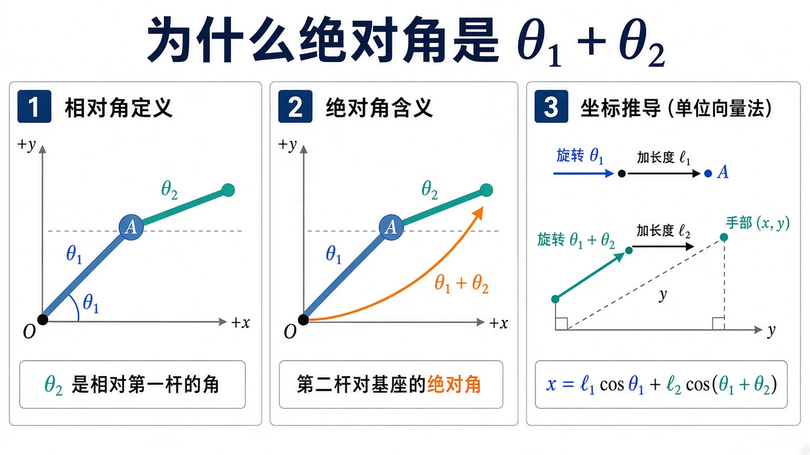
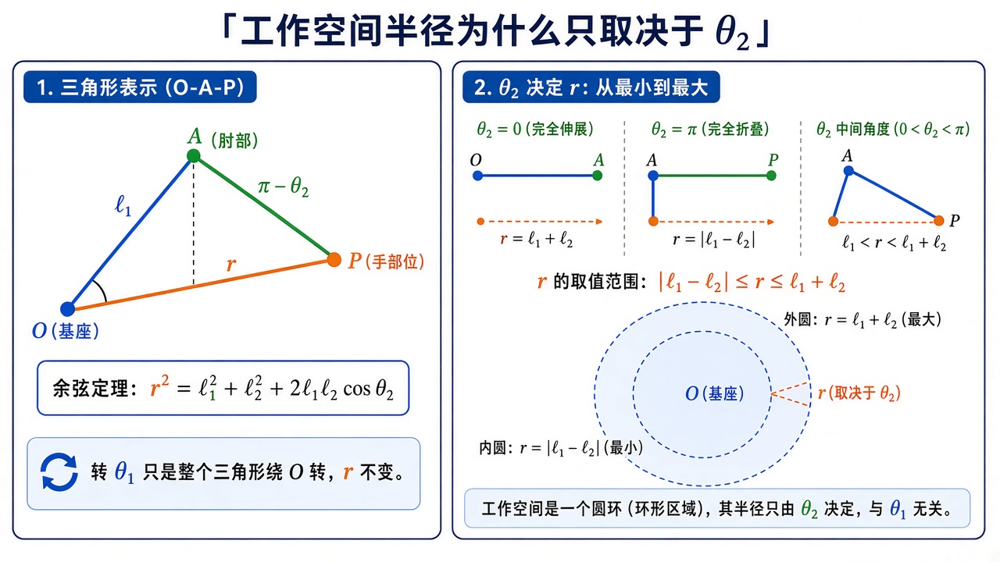
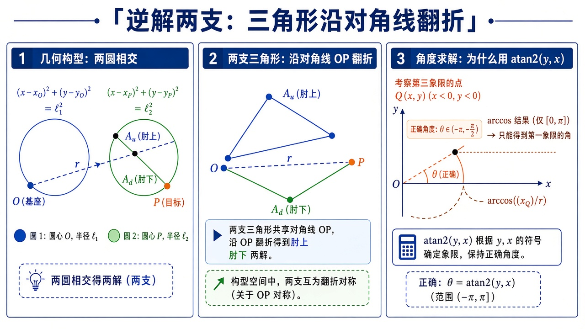
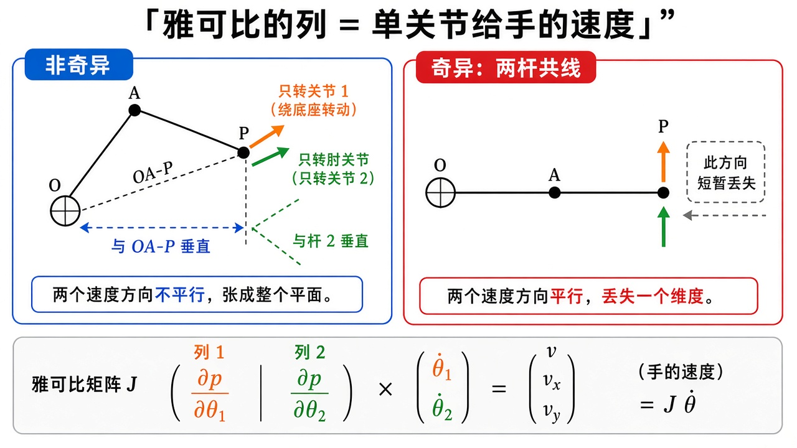
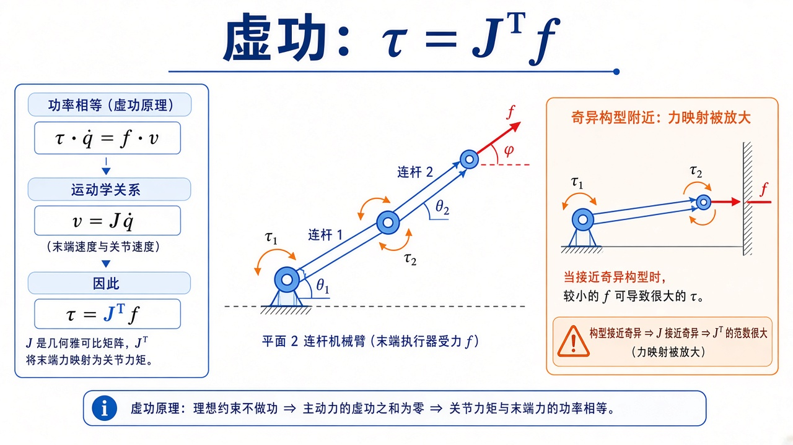

# 机器人运动学：关节角怎样变成末端坐标

> [!WARNING]
> 🧪 Beta公测版本提示：教程主体已完成，正在优化细节，欢迎大家提Issue反馈问题或建议。

> 运动学不问力，只问几何。给定关节角，手在哪（**正运动学 FK**）；给定手要去的点，关节该怎么弯（**逆运动学 IK**）；角转得快，手就瞬时往哪冲（**雅可比**）。本章用平面 2R 把这三件事从向量加法推到公式、再推到数字例子。力与加速度见 [动力学](/robotics/dynamics/)；时间轴上的 $\theta(t)$ 见 [轨迹规划](/robotics/trajectory/)；六轴怎么写成矩阵链见 [DH](/robotics/modeling/)。先读 [导论](/robotics/overview/) 里「工作空间 ≠ 构型空间」。

本章阅读方式：正文永远先给**结论公式**和几何直觉；需要逐步代数时点开灰色的「逐步推导」。每个推导旁都有一张原理图。建议第一遍只读正文和数字例，卡在某一行再展开推导。

---

## 一、先建立画面：两根刚尺，两次「转完再走一截」

把基座钉在原点 $O$。第一根杆是长度为 $\ell_1$ 的刚尺，相对基座的 $x$ 轴转过 $\theta_1$。它的末端——以后叫**肘**——只能落在以 $O$ 为圆心、$\ell_1$ 为半径的圆上：

$$
p_1=(\ell_1\cos\theta_1,\;\ell_1\sin\theta_1).
$$

第二根杆长度 $\ell_2$。关键点来了：**$\theta_2$ 不是相对 $x$ 轴的角，而是相对第一杆延长线的相对角。** 因此第二杆相对基座的**绝对角**是 $\theta_1+\theta_2$。手（末端）= 肘再沿这个绝对方向走 $\ell_2$：

$$
p_2=p_1+\bigl(\ell_2\cos(\theta_1+\theta_2),\;\ell_2\sin(\theta_1+\theta_2)\bigr).
$$

把 $p_1$ 代进去，就是正运动学。没有矩阵也能写；矩阵的好处是「转完再挪」可以标准化，以后加第三杆只多乘一次。



> **图解说明**：左图 $\theta_2$ 从第一杆的延长线量起；中图第二杆对基座的绝对角是 $\theta_1+\theta_2$；右图把两次「旋转 + 沿杆平移」接成向量和。

**保姆级数字例（先不用矩阵）。** 取与 demo 相同的杆长 $\ell_1=1$，$\ell_2=0.7$，角用弧度。

| $\theta_1$ | $\theta_2$ | 肘 $p_1$ | 手 $p_2$ | 你该看见什么 |
|-----------|-----------|----------|----------|----------------|
| $0$ | $0$ | $(1,0)$ | $(1.7,0)$ | 两杆沿 $+x$ 伸直，外边界 |
| $0$ | $\pi$ | $(1,0)$ | $(0.3,0)$ | 第二杆折回来，内边界 |
| $\pi/2$ | $0$ | $(0,1)$ | $(0,1.7)$ | 整条臂竖起来 |
| $\pi/2$ | $\pi/2$ | $(0,1)$ | $(-0.7,1)$ | 第二杆相对第一杆再转 $90^\circ$，绝对角 $\pi$ |

公式和 NumPy 的 `sin`/`cos` **只用弧度**。打印给人看时再用 `rad2deg`。混用是运动学第一大笔误。

平面齐次变换把点写成 $(x,y,1)$，把「转 $\theta$、沿杆走 $a$」收成一个 $3\times 3$：

$$
T(\theta,a)
=
\begin{pmatrix}
\cos\theta & -\sin\theta & a\cos\theta \\
\sin\theta & \cos\theta & a\sin\theta \\
0 & 0 & 1
\end{pmatrix}.
$$

$T(\theta_1,\ell_1)\,T(\theta_2,\ell_2)$ 的最后一列前两维，就是上面的 $p_2$。DH 章把这个 $3\times 3$ 抬成空间 $4\times 4$。


> **图解说明**：左是坐标系旋转平移；中是 $3\times 3$ 乘齐次点；右是两帧连乘。最后一列是原点，左上是姿态。

::: details 逐步推导：为什么 $T(\theta,a)$ 长成这样（点击展开）

先只谈一个坐标系相对另一个做「绕原点转 $\theta$，再沿**已经转过的 $x$ 轴**走 $a$」。这正是「杆绕关节转，杆长把下一关节送出去」。

**第 1 步：旋转。** 平面里把基座标 $(x,y)$ 变到转过 $\theta$ 的新轴上，或等价地把新系的基向量写在旧系里：

$$
R(\theta)=\begin{pmatrix}\cos\theta & -\sin\theta\\ \sin\theta & \cos\theta\end{pmatrix}.
$$

第一列是新 $x$ 轴（就是杆的方向），第二列是新 $y$ 轴（杆的法向）。

**第 2 步：平移。** 下一关节的原点，就在「沿新 $x$ 走 $a$」处，写在旧系里是

$$
t = a\begin{pmatrix}\cos\theta\\ \sin\theta\end{pmatrix}.
$$

**第 3 步：齐次坐标。** 旋转加平移对普通二维向量不是线性的（有常数项 $t$）。补一个 $1$，把仿射变成线性：

$$
\begin{pmatrix}x'\\ y'\\ 1\end{pmatrix}
=
\begin{pmatrix}R(\theta) & t\\ 0^\top & 1\end{pmatrix}
\begin{pmatrix}x\\ y\\ 1\end{pmatrix}.
$$

把 $R$ 和 $t$ 填进去就是正文的 $T(\theta,a)$。最后一列前两维 = 新原点；左上 $2\times 2$ = 姿态。

**第 4 步：两杆连乘。** 点先在手坐标系里是 $(0,0,1)$（手就是第二杆末端的原点）。右乘第二帧、再右乘第一帧：

$$
\begin{pmatrix}p_2\\ 1\end{pmatrix}
= T(\theta_1,\ell_1)\,T(\theta_2,\ell_2)
\begin{pmatrix}0\\ 0\\ 1\end{pmatrix}.
$$

乘出来只看最后一列，正是 $p_2$。顺序不能反：先应用靠近手的那一帧，再送回基座——Python 里写成 `T1 @ T2`。

**第 5 步：第三维为什么是 $1$ 而不是 $0$。** $1$ 表示「这是一个点」；方向向量（例如速度）齐次坐标最后一维是 $0$，平移项乘不上，这正是我们想要的：姿态转速度，原点挪不动速度的方向。

:::

---

## 二、正运动学：唯一、圆环带、以及一个必须手算的数字

把上一节的向量和写开：

$$
\begin{aligned}
x &= \ell_1\cos\theta_1 + \ell_2\cos(\theta_1+\theta_2),\\
y &= \ell_1\sin\theta_1 + \ell_2\sin(\theta_1+\theta_2).
\end{aligned}
$$

**永远唯一**：一组角只对应一个点。反向不唯一——同一点可以肘上也可以肘下。

可达半径 $r=\sqrt{x^2+y^2}$ 落在圆环带

$$
|\ell_1-\ell_2|\le r\le \ell_1+\ell_2.
$$

外圆：两杆伸直（$\theta_2=0$）；内圆：两杆尽量折叠（$\theta_2=\pm\pi$）。$\ell_1=\ell_2$ 时内圆缩成原点，手可以摸到基座。转 $\theta_1$ 只是把这个三角形绕原点转一圈，**扫满整个圆环带**，所以工作空间与 $\theta_1$ 无关。



> **图解说明**：$\triangle OAP$ 的第三边就是 $r$。余弦定理给出 $r^2=\ell_1^2+\ell_2^2+2\ell_1\ell_2\cos\theta_2$。$\theta_1$ 只旋转整个三角形。

::: details 逐步推导：从正运动学平方相加到余弦定理（点击展开）

目标：证明 $r^2=\ell_1^2+\ell_2^2+2\ell_1\ell_2\cos\theta_2$，从而 $r$ 的范围与 $\theta_1$ 无关。

把 $x,y$ 平方相加：

$$
\begin{aligned}
r^2
&= \bigl(\ell_1 c_1 + \ell_2 c_{12}\bigr)^2
+ \bigl(\ell_1 s_1 + \ell_2 s_{12}\bigr)^2 \\
&= \ell_1^2(c_1^2+s_1^2) + \ell_2^2(c_{12}^2+s_{12}^2)
+ 2\ell_1\ell_2\bigl(c_1 c_{12}+s_1 s_{12}\bigr).
\end{aligned}
$$

前两项各是 $1$，所以 $\ell_1^2+\ell_2^2$。交叉项用余弦差角公式：

$$
\cos A\cos B+\sin A\sin B=\cos(A-B),
$$

这里 $A=\theta_1$， $B=\theta_1+\theta_2$，于是 $A-B=-\theta_2$，而 $\cos$ 是偶函数，

$$
c_1 c_{12}+s_1 s_{12}=\cos\theta_2.
$$

因此

$$
r^2=\ell_1^2+\ell_2^2+2\ell_1\ell_2\cos\theta_2.
$$

$\cos\theta_2\in[-1,1]$，于是

$$
(\ell_1-\ell_2)^2 \le r^2 \le (\ell_1+\ell_2)^2,
$$

开方（半径非负）得到 $|\ell_1-\ell_2|\le r\le \ell_1+\ell_2$。几何上这就是：两圆（以 $O$ 为心半径 $\ell_1$、以手为心半径 $\ell_2$）要能交成一个肘点，两圆心距必须落在 $|\ell_1-\ell_2|$ 与 $\ell_1+\ell_2$ 之间。

:::

**数字例（与 demo 相同）。** $\ell_1=1$，$\ell_2=0.7$，理论半径区间 $[0.3,1.7]$。目标 $(1.1,0.6)$：

$$
r=\sqrt{1.1^2+0.6^2}=\sqrt{1.21+0.36}=\sqrt{1.57}\approx 1.253,
$$

落在 $(0.3,1.7)$ 内，应有两支实数逆解。若目标改成 $(2,0)$，$r=2>1.7$，两圆不相交，无解。

C++ `fk2r.hpp` 就是那两行余弦，用来对照 Python。


> **图解说明**：左图由 $\theta_1,\theta_2$ 推出末端，虚线圆是最大/最小伸长；右图同一目标有肘上、肘下两套角。余弦定理先解 $\theta_2$，再用 $\operatorname{atan2}$ 解 $\theta_1$。

<video controls muted loop playsinline preload="metadata" style="width:100%;max-width:960px;border-radius:8px;background:#f7fafc;margin:0.6rem 0;">
  <source src="./images/fk_ik.mp4" type="video/mp4">
</video>

> **动画说明**：先正运动学扫一圈；再对同一目标画出肘上 / 肘下；最后把目标拖出工作空间，两圆不再相交。

---

## 三、逆解：把「两圆相交」写成可执行的三步

已知 $(x,y)$，求 $(\theta_1,\theta_2)$。几何图像：以 $O$ 为圆心画半径 $\ell_1$ 的圆，以目标 $P$ 为圆心画半径 $\ell_2$ 的圆。交点就是肘。两个交点 = 肘上、肘下；相切 = 边界一支；不相交 = 无解。



> **图解说明**：左：两圆相交得到两个肘点；中：$\triangle OAP$ 沿对角线 $OP$ 翻折就是另一支；右：$\arccos$ 丢象限，$\operatorname{atan2}(y,x)$ 保住第三象限。

**第 1 步：只由距离定 $\theta_2$。** 余弦定理（或上节 $r^2$ 式）

$$
\cos\theta_2=\frac{r^2-\ell_1^2-\ell_2^2}{2\ell_1\ell_2}.
$$

若右边绝对值 $>1$，目标在圆环外，**无解**。代码里 `clip` 到 $[-1,1]$ 是为了浮点别让 `sqrt` 变 NaN，物理上应先检查再求解。

**第 2 步：正弦的符号 = 肘号。** $\sin\theta_2=\pm\sqrt{1-\cos^2\theta_2}$。正号、负号各给一个 $\theta_2$。几何上：三角形 $\triangle$ 基座-肘-手 可以沿「基座到手」这条对角线翻折，肘在对角线两侧，就是肘上 / 肘下。

**第 3 步：$\theta_1$ 把「指向目标的方位」扣掉第二杆造成的偏角。** 把第二杆折进第一杆：等效

$$
k_1=\ell_1+\ell_2\cos\theta_2,\quad k_2=\ell_2\sin\theta_2,
$$

则

$$
\theta_1=\operatorname{atan2}(y,x)-\operatorname{atan2}(k_2,k_1).
$$

**必须用 `atan2(y,x)`，参数顺序是先 $y$ 后 $x$。** 只用 `arccos` 会丢象限，手在第三象限时 $\theta_1$ 会错。

::: details 逐步推导：从余弦定理到 $\theta_1$ 的 $\operatorname{atan2}$ 公式（点击展开）

**A. $\theta_2$ 从哪来。** 三角形三边 $\ell_1,\ell_2,r$。夹在 $\ell_1$ 与 $\ell_2$ 之间的外角（相对角）就是 $\theta_2$。余弦定理对边 $r$：

$$
r^2=\ell_1^2+\ell_2^2-2\ell_1\ell_2\cos(\text{内角}).
$$

平面 2R 的 $\theta_2$ 定义为「相对延长线」，伸直时 $\theta_2=0$、内角为 $\pi$，折叠时 $\theta_2=\pi$、内角为 $0$。因此内角 $=\pi-\theta_2$，$\cos(\pi-\theta_2)=-\cos\theta_2$，代入后

$$
r^2=\ell_1^2+\ell_2^2+2\ell_1\ell_2\cos\theta_2,
$$

与正运动学平方相加完全一致。解出 $\cos\theta_2$ 就是正文那一行。

$\cos$ 是偶函数：$\theta_2$ 与 $-\theta_2$ 给出同一个 $\cos$，所以必须用 $\sin$ 的符号把两支分开。代码用 `atan2(s2, c2)` 而不是 `arccos`，因为 `arccos` 只返回 $[0,\pi]$，肘下的负角会被折叠掉。

**B. $\theta_1$ 从哪来。** 把正运动学看成：先把长度为 $\ell_2$ 的第二杆「折进」第一杆，得到一个等效向量

$$
\begin{pmatrix}k_1\\ k_2\end{pmatrix}
=
\begin{pmatrix}\ell_1+\ell_2\cos\theta_2\\ \ell_2\sin\theta_2\end{pmatrix},
$$

它在「第一杆坐标系」里指向手。再把这个向量绕基座转 $\theta_1$，就应落到 $(x,y)$：

$$
\begin{pmatrix}x\\ y\end{pmatrix}
=
R(\theta_1)\begin{pmatrix}k_1\\ k_2\end{pmatrix}.
$$

两边左乘 $R(\theta_1)^\top=R(-\theta_1)$，比较幅角：

$$
\operatorname{atan2}(y,x)=\theta_1+\operatorname{atan2}(k_2,k_1),
$$

移项即正文。直觉：$\operatorname{atan2}(y,x)$ 是「基座看手」的方位；$\operatorname{atan2}(k_2,k_1)$ 是「第一杆看手」相对第一杆的偏角；两者相减才是第一杆自己相对 $x$ 轴的角。

**C. 与 demo 对表。** 目标 $(1.1,0.6)$，$\ell_1=1$，$\ell_2=0.7$：

$$
\cos\theta_2=\frac{1.57-1-0.49}{1.4}=\frac{0.08}{1.4}\approx 0.05714,
\quad
\theta_2=\pm\arccos(0.05714)\approx \pm 1.514~\mathrm{rad}\ (\pm 86.7^\circ).
$$

再代入 $k_1,k_2$ 与 $\operatorname{atan2}$，FK 回去必须精确回到 $(1.1,0.6)$（浮点误差 $10^{-15}$ 量级）。对不上就查 `atan2` 顺序或肘号。

:::

工业臂还要在连续轨迹上**选哪一支**（不能这一采样肘上、下一采样肘下）。那是路径规划；本章只把两支都画出来。

---

## 四、雅可比：对 FK 逐项求导，列就是「单关节速度」

末端速度是位置对时间的导数。链式法则：

$$
\begin{pmatrix}v_x\\ v_y\end{pmatrix}
=
J(\theta)
\begin{pmatrix}\dot\theta_1\\ \dot\theta_2\end{pmatrix},
\quad
J=\frac{\partial(x,y)}{\partial(\theta_1,\theta_2)}.
$$

把正运动学逐项求导（记 $s_1=\sin\theta_1$，$s_{12}=\sin(\theta_1+\theta_2)$ 等）：

$$
J=
\begin{pmatrix}
-\ell_1 s_1-\ell_2 s_{12} & -\ell_2 s_{12}\\
\ell_1 c_1+\ell_2 c_{12} & \ell_2 c_{12}
\end{pmatrix}.
$$

**列的含义（保姆级）**：第一列是「只转关节 1、关节 2 锁死」时手的速度方向——整个臂绕基座转，手速度垂直于「基座→手」。第二列是只转肘，手绕肘转，速度垂直于第二杆。这就是平面版的「雅可比列 = 关节旋量」。



> **图解说明**：左：两列给出的速度张成平面。右：两杆共线时两支速度平行，丢失一个方向。底栏 $v=J\dot\theta$。

::: details 逐步推导：正运动学怎样变成 $J$ 的四个元素（点击展开）

从

$$
x=\ell_1\cos\theta_1+\ell_2\cos(\theta_1+\theta_2),\qquad
y=\ell_1\sin\theta_1+\ell_2\sin(\theta_1+\theta_2)
$$

出发。对 $\theta_1$ 求导（注意第二项里 $\theta_1+\theta_2$ 也含 $\theta_1$）：

$$
\frac{\partial x}{\partial\theta_1}=-\ell_1\sin\theta_1-\ell_2\sin(\theta_1+\theta_2),\qquad
\frac{\partial y}{\partial\theta_1}=\ell_1\cos\theta_1+\ell_2\cos(\theta_1+\theta_2).
$$

对 $\theta_2$ 求导（第一杆不含 $\theta_2$）：

$$
\frac{\partial x}{\partial\theta_2}=-\ell_2\sin(\theta_1+\theta_2),\qquad
\frac{\partial y}{\partial\theta_2}=\ell_2\cos(\theta_1+\theta_2).
$$

排成矩阵就是 $J$。几何核验：第二列 $= \ell_2(-\sin\phi,\cos\phi)$，其中 $\phi=\theta_1+\theta_2$ 是第二杆绝对角。向量 $(-\sin\phi,\cos\phi)$ 恰是第二杆方向 $(\cos\phi,\sin\phi)$ 逆时针转 $90^\circ$，再乘 $\ell_2\dot\theta_2$ 就是「绕肘的线速度」。第一列同理，不过半径是「基座到手」的整段。

行列式（2R 有闭式）：把 $J$ 的两列看成向量 $j_1,j_2$，

$$
\det J = j_{1x}j_{2y}-j_{1y}j_{2x}.
$$

代入后交叉项消去，只剩

$$
\det J=\ell_1\ell_2\sin\theta_2.
$$

（可以用符号计算或耐心展开验证。练习建议：令 $\ell_1=\ell_2=1$，手算一个 $\theta_2=\pi/2$ 的数值 $\det J=1$。）

$\theta_2=0$ 或 $\pm\pi$（伸直或折叠）时 $\det J=0$：**奇异**。几何上两杆共线，两个关节产生的末端速度变成平行，少了一个可动方向。工作空间的内外边界正好是这些构型。

:::


> **图解说明**：上半 $v=J\dot\theta$；下半两杆共线时 $\det J=0$。奇异附近不要硬求 $J^{-1}$。

<video controls muted loop playsinline preload="metadata" style="width:100%;max-width:960px;border-radius:8px;background:#f7fafc;margin:0.6rem 0;">
  <source src="./images/jacobian.mp4" type="video/mp4">
</video>

> **动画说明**：橙箭头是「只转基座」给手的速度方向，绿箭头是「只转肘」。伸直时两支变成平行，$|\det J|\to 0$。

速度逆解 $\dot\theta=J^{-1}v$。奇异时无解或无穷放大。实践用阻尼伪逆 $(J^\top J+\lambda I)^{-1}J^\top$，以牺牲一点跟踪换稳定。冗余臂 $J$ 不是方的，用伪逆，零空间还可以用来躲障碍。

---

## 五、静力学一句：虚功把末端力变成关节力矩

功率 $\tau\cdot\dot\theta=f\cdot v=f\cdot J\dot\theta$，对任意 $\dot\theta$ 都成立，故

$$
\tau=J^\top f.
$$

末端顶墙的力，会以 $J^\top$ 映射成关节力矩。奇异时这个映射同样病态：很小的力也可能要极大的力矩，或者某个方向的力根本「顶不住」（缺列）。



> **图解说明**：功率相等 $\tau\cdot\dot\theta=f\cdot v$。把 $v=J\dot\theta$ 代入即得 $\tau=J^\top f$。近奇异时顶墙会要很大的关节力矩。

::: details 逐步推导：从「功率相等」到 $\tau=J^\top f$（点击展开）

电机做的瞬时功率是各关节力矩乘角速度之和：$\sum_i \tau_i\dot\theta_i=\tau^\top\dot\theta$。

末端力 $f$ 对末端速度 $v$ 做的功率是 $f^\top v$。若关节无摩擦、杆为刚体，这两份功率必须相等（虚功原理：约束力不做功，铰链反力成对抵消）：

$$
\tau^\top\dot\theta = f^\top v.
$$

运动学已经给出 $v=J\dot\theta$，代入

$$
\tau^\top\dot\theta = f^\top J\dot\theta = (J^\top f)^\top\dot\theta.
$$

这对**任意** $\dot\theta$ 成立，因此向量相等：$\tau=J^\top f$。注意是 $J$ 的转置，不是逆。力映射和速度映射是对偶的：速度用 $J$ 往前推，力用 $J^\top$ 往回推。

这为 [动力学](/robotics/dynamics/) 做铺垫：那边还要加上惯性与科氏，但「力从哪来」这一段已经是 $J^\top$。

:::

---

## 六、常见疑问

**Q：肘上肘下哪一个是「上」？**  
本代码默认 $\sin\theta_2>0$ 叫 `up`。不同教材、不同基座朝向会反过来。以 **FK 核验** 为准，不要死记名字。

**Q：为什么 $\theta_2$ 用 $\mathrm{atan2}(\sin,\cos)$ 而不是 $\arccos$？**  
$\arccos$ 只返回 $[0,\pi]$，肘下的负角会被折叠掉。

**Q：工作空间里的点一定有两个 IK 吗？**  
边界上两支合成一支（$\sin\theta_2=0$）。带关节限位时可能只剩一支，甚至零支（点在圆环内但角超限）。

**Q：3D 六轴还是闭式 IK 吗？**  
部分腕部分离的臂（Pieper 条件）有代数解；一般臂用牛顿法：$q\leftarrow q+J^{+}\Delta x$。2R 的几何解是为了把「多解、奇异」看见。

**Q：角增量能不能当向量加？**  
平面一个 $\theta$ 可以。三维姿态不行，见 [李群](/robotics/lie-groups/)。

**Q：齐次矩阵最后一列和左上角分别是什么？**  
最后一列前两维 = 下一坐标系原点写在当前系；左上 $2\times 2$（空间里是 $3\times 3$）= 姿态。点用 $(x,y,1)$，方向用 $(v_x,v_y,0)$。

**Q：奇异时机器人卡死了吗？**  
不是卡死。瞬时少了一个可动的笛卡尔方向，沿那个方向的速度逆解会爆炸。你仍可以沿剩下的方向动，也可以改变构型离开奇异（例如不要走完全伸直）。

---

## 七、代码在做什么

`demo.py` 对目标 $(1.1,0.6)$ 求两支 IK，再 FK 回去核验，并打印 $\det J$。左图工作空间采样 + 两种肘形；右图固定 $\theta_1=0.4$，扫 $\theta_2$ 看行列式过零。

```bash
cd docs/robotics/kinematics/code
python demo.py
g++ -std=c++17 demo.cpp -o fk_demo
```


---

## 八、小结

| 概念 | 一句话 |
|------|--------|
| FK | 角 → 末端；唯一；两杆绝对角 $\theta_1+\theta_2$ |
| 齐次 $T(\theta,a)$ | 左上姿态，最后一列原点 |
| IK | 点 → 角；2R 常两解；`atan2` 保象限 |
| 工作空间 | 圆环带，圈外无解；$r$ 只靠 $\theta_2$ |
| $J$ 的列 | 单关节运动时手的速度 |
| 奇异 | $\sin\theta_2=0$；不要硬求逆 |
| $\tau=J^\top f$ | 力到力矩，速度映射的对偶 |
| 下游 | [轨迹](/robotics/trajectory/)、[动力学](/robotics/dynamics/)、DH、李群、旋量、ROS 2 |

> 下一章 [轨迹规划](/robotics/trajectory/)：起终点有了，中间 $\theta(t)$ 怎么走才不甩。

## 📥 Code

| File | View | Download |
|------|------|----------|
| demo.py | [Open](./code-demo) | <a href="/notebook/code/robotics/kinematics/demo.py" target="_blank" download>Download</a> |
| fk2r.hpp | — | <a href="/notebook/code/robotics/kinematics/fk2r.hpp" target="_blank" download>Download</a> |
| demo.cpp | — | <a href="/notebook/code/robotics/kinematics/demo.cpp" target="_blank" download>Download</a> |
| exercise.py | [Open](./code-exercise) | <a href="/notebook/code/robotics/kinematics/exercise.py" target="_blank" download>Download</a> |

## 参考

1. Craig, *Introduction to Robotics*（正逆解与雅可比）
2. Siciliano et al., *Robotics: Modelling, Planning and Control*
3. Lynch & Park, *Modern Robotics*（速度旋量观点）
