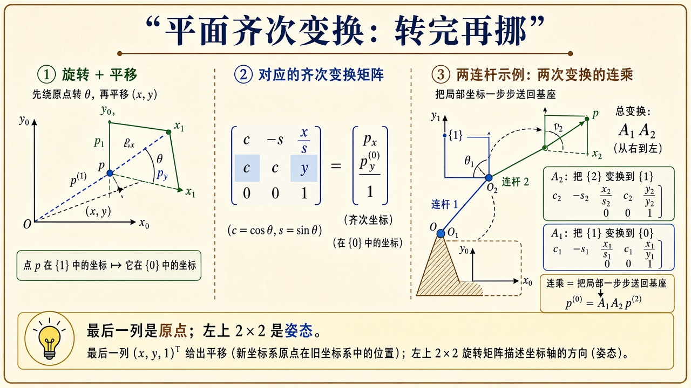
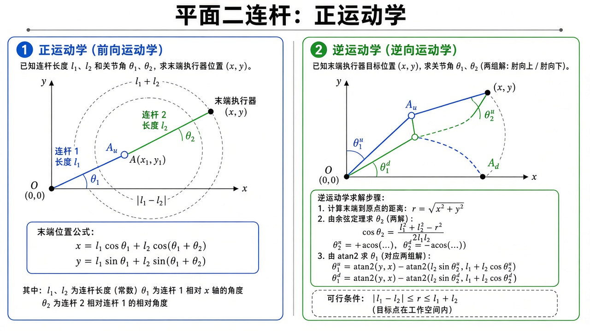
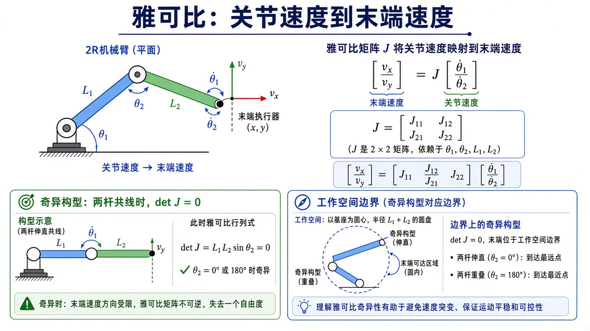
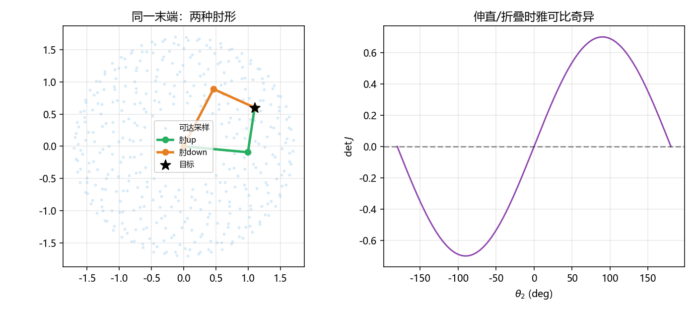

# 机器人运动学：关节角怎样变成末端坐标

> [!WARNING]
> 🧪 Beta公测版本提示：教程主体已完成，正在优化细节，欢迎大家提Issue反馈问题或建议。

> 运动学不问力，只问几何。给定关节角，手在哪（**正运动学 FK**）；给定手要去的点，关节该怎么弯（**逆运动学 IK**）；角转得快，手就瞬时往哪冲（**雅可比**）。本章用平面 2R 把这三件事从向量加法推到公式、再推到数字例子。力与加速度见 [动力学](/robotics/dynamics/)；时间轴上的 $\theta(t)$ 见 [轨迹规划](/robotics/trajectory/)；六轴怎么写成矩阵链见 [DH](/robotics/modeling/)。先读 [导论](/robotics/overview/) 里「工作空间 ≠ 构型空间」。

---

## 一、通俗理解：两根杆，就是两次「转完再走一截」

把基座当原点。第一杆长 $\ell_1$，相对基座 $x$ 轴转 $\theta_1$，它的末端（肘）一定在

$$
p_1=(\ell_1\cos\theta_1,\;\ell_1\sin\theta_1).
$$

第二杆长 $\ell_2$，相对**第一杆的延长线**再转 $\theta_2$，所以第二杆相对基座的绝对角是 $\theta_1+\theta_2$（不是 $\theta_2$ 自己）。于是手在

$$
p_2=p_1+(\ell_2\cos(\theta_1+\theta_2),\;\ell_2\sin(\theta_1+\theta_2)).
$$

这就是正运动学。没有矩阵也能写；矩阵的好处是「转完再挪」可以标准化，并且以后加第三杆只多乘一次。平面齐次变换把点写成 $(x,y,1)$：

$$
T(\theta,a)
=
\begin{pmatrix}
\cos\theta & -\sin\theta & a\cos\theta \\
\sin\theta & \cos\theta & a\sin\theta \\
0 & 0 & 1
\end{pmatrix}.
$$

$T(\theta_1,\ell_1)\,T(\theta_2,\ell_2)$ 的最后一列前两维，就是上面的 $p_2$。DH 章把这个 $3\times 3$ 抬成空间 $4\times 4$。



> **图解说明**：左是坐标系旋转平移；中是 $3\times 3$ 乘齐次点；右是两帧连乘。最后一列是原点，左上是姿态。

---

## 二、正运动学：公式、工作空间、数字例

$$
\begin{aligned}
x &= \ell_1\cos\theta_1 + \ell_2\cos(\theta_1+\theta_2),\\
y &= \ell_1\sin\theta_1 + \ell_2\sin(\theta_1+\theta_2).
\end{aligned}
$$

**永远唯一**：一组角只对应一个点。反向不唯一。

可达半径 $r=\sqrt{x^2+y^2}$ 落在圆环带 $|\ell_1-\ell_2|\le r\le \ell_1+\ell_2$。推导：把 $x,y$ 平方相加，用余弦定理，

$$
r^2=\ell_1^2+\ell_2^2+2\ell_1\ell_2\cos\theta_2,
$$

$\cos\theta_2\in[-1,1]$，于是 $r$ 在 $|\ell_1-\ell_2|$ 与 $\ell_1+\ell_2$ 之间。与 $\theta_1$ 无关——转基座只是把这个圆环转一圈，扫满整个带。

**数字例**（与 demo 相同）：$\ell_1=1$，$\ell_2=0.7$，$\theta=0$ 时手在 $(1.7,0)$，伸直，外边界。$\theta_2=\pi$ 时手在 $(0.3,0)$，折叠，内边界。目标 $(1.1,0.6)$ 的 $r\approx 1.25$，在 $(0.3,1.7)$ 内，应有解。

C++ `fk2r.hpp` 就是那两行余弦，用来对照 Python。



> **图解说明**：左图由 $\theta_1,\theta_2$ 推出末端，虚线圆是最大/最小伸长；右图同一目标有肘上、肘下两套角。余弦定理先解 $\theta_2$，再用 $\operatorname{atan2}$ 解 $\theta_1$。

---

## 三、逆解：余弦定理逐步写

已知 $(x,y)$，求 $(\theta_1,\theta_2)$。

**第 1 步：只由距离定 $\theta_2$。** 余弦定理（或上节 $r^2$ 式）

$$
\cos\theta_2=\frac{r^2-\ell_1^2-\ell_2^2}{2\ell_1\ell_2}.
$$

若右边绝对值 $>1$，目标在圆环外，**无解**。代码里 `clip` 到 $[-1,1]$ 是为了浮点别让 `sqrt` 变 NaN，物理上应先检查再求解。

**第 2 步：正弦的符号 = 肘号。** $\sin\theta_2=\pm\sqrt{1-\cos^2\theta_2}$。正号、负号各给一个 $\theta_2$。几何上：三角形 $\triangle$ 基座-肘-手 可以沿「基座到手」这条对角线翻折，肘在对角线两侧，就是肘上 / 肘下。

**第 3 步：$\theta_1$ 把「指向目标的方位」扣掉第二杆造成的偏角。** 把第二杆折进第一杆：等效

$$
k_1=\ell_1+\ell_2\cos\theta_2,\quad k_2=\ell_2\sin\theta_2,
$$

则

$$
\theta_1=\operatorname{atan2}(y,x)-\operatorname{atan2}(k_2,k_1).
$$

**必须用 `atan2(y,x)`，参数顺序是先 $y$ 后 $x$。** 只用 `arccos` 会丢象限，手在第三象限时 $\theta_1$ 会错。

**数字例**：目标 $(1.1,0.6)$，demo 打印两支 $\theta$（度）以及 FK 回去应回到 $(1.1,0.6)$。对不上就查 `atan2` 顺序或肘号。

工业臂还要在连续轨迹上**选哪一支**（不能这一采样肘上、下一采样肘下）。那是路径规划；本章只把两支都画出来。

---

## 四、雅可比：对 FK 逐项求导

末端速度是位置对时间的导数。链式法则：

$$
\begin{pmatrix}v_x\\ v_y\end{pmatrix}
=
J(\theta)
\begin{pmatrix}\dot\theta_1\\ \dot\theta_2\end{pmatrix},
\quad
J=\frac{\partial(x,y)}{\partial(\theta_1,\theta_2)}.
$$

把正运动学逐项求导（记 $s_1=\sin\theta_1$，$s_{12}=\sin(\theta_1+\theta_2)$ 等）：

$$
J=
\begin{pmatrix}
-\ell_1 s_1-\ell_2 s_{12} & -\ell_2 s_{12}\\
\ell_1 c_1+\ell_2 c_{12} & \ell_2 c_{12}
\end{pmatrix}.
$$

**列的含义（保姆级）**：第一列是「只转关节 1、关节 2 锁死」时手的速度方向——整个臂绕基座转，手速度垂直于「基座→手」。第二列是只转肘，手绕肘转，速度垂直于第二杆。这就是平面版的「雅可比列 = 关节旋量」。

对 2R 有闭式 $\det J=\ell_1\ell_2\sin\theta_2$。$\theta_2=0$ 或 $\pm\pi$（伸直或折叠）时 $\det J=0$：**奇异**。几何上两杆共线，两个关节产生的末端速度变成平行，少了一个可动方向。工作空间的内外边界正好是这些构型。



> **图解说明**：上半 $v=J\dot\theta$；下半两杆共线时 $\det J=0$。奇异附近不要硬求 $J^{-1}$。

速度逆解 $\dot\theta=J^{-1}v$。奇异时无解或无穷放大。实践用阻尼伪逆 $(J^\top J+\lambda I)^{-1}J^\top$，以牺牲一点跟踪换稳定。冗余臂 $J$ 不是方的，用伪逆，零空间还可以用来躲障碍。

**静力学一句（为动力学做铺垫）**：功率 $\tau\cdot\dot\theta=f\cdot v=f\cdot J\dot\theta$，故

$$
\tau=J^\top f.
$$

末端顶墙的力，会以 $J^\top$ 映射成关节力矩。奇异时这个映射同样病态。

---

## 五、常见疑问

**Q：肘上肘下哪一个是「上」？**  
本代码默认 $\sin\theta_2>0$ 叫 `up`。不同教材、不同基座朝向会反过来。以 **FK 核验** 为准，不要死记名字。

**Q：为什么 $\theta_2$ 用 $\mathrm{atan2}(\sin,\cos)$ 而不是 $\arccos$？**  
$\arccos$ 只返回 $[0,\pi]$，肘下的负角会被折叠掉。

**Q：工作空间里的点一定有两个 IK 吗？**  
边界上两支合成一支（$\sin\theta_2=0$）。带关节限位时可能只剩一支，甚至零支（点在圆环内但角超限）。

**Q：3D 六轴还是闭式 IK 吗？**  
部分腕部分离的臂（Pieper 条件）有代数解；一般臂用牛顿法：$q\leftarrow q+J^{+}\Delta x$。2R 的几何解是为了把「多解、奇异」看见。

**Q：角增量能不能当向量加？**  
平面一个 $\theta$ 可以。三维姿态不行，见 [李群](/robotics/lie-groups/)。

---

## 六、代码在做什么

`demo.py` 对目标 $(1.1,0.6)$ 求两支 IK，再 FK 回去核验，并打印 $\det J$。左图工作空间采样 + 两种肘形；右图固定 $\theta_1=0.4$，扫 $\theta_2$ 看行列式过零。

```bash
cd docs/robotics/kinematics/code
python demo.py
g++ -std=c++17 demo.cpp -o fk_demo
```



---

## 七、小结

| 概念 | 一句话 |
|------|--------|
| FK | 角 → 末端；唯一；两杆绝对角 $\theta_1+\theta_2$ |
| IK | 点 → 角；2R 常两解；`atan2` 保象限 |
| 工作空间 | 圆环带，圈外无解 |
| $J$ 的列 | 单关节运动时手的速度 |
| 奇异 | $\sin\theta_2=0$；不要硬求逆 |
| $\tau=J^\top f$ | 力到力矩 |
| 下游 | [轨迹](/robotics/trajectory/)、[动力学](/robotics/dynamics/)、DH、李群、旋量、ROS 2 |

> 下一章 [轨迹规划](/robotics/trajectory/)：起终点有了，中间 $\theta(t)$ 怎么走才不甩。

## 📥 Code

| File | View | Download |
|------|------|----------|
| demo.py | [Open](./code-demo) | <a href="/notebook/code/robotics/kinematics/demo.py" target="_blank" download>Download</a> |
| fk2r.hpp | — | <a href="/notebook/code/robotics/kinematics/fk2r.hpp" target="_blank" download>Download</a> |
| demo.cpp | — | <a href="/notebook/code/robotics/kinematics/demo.cpp" target="_blank" download>Download</a> |
| exercise.py | [Open](./code-exercise) | <a href="/notebook/code/robotics/kinematics/exercise.py" target="_blank" download>Download</a> |

## 参考

1. Craig, *Introduction to Robotics*（正逆解与雅可比）
2. Siciliano et al., *Robotics: Modelling, Planning and Control*
3. Lynch & Park, *Modern Robotics*（速度旋量观点）
