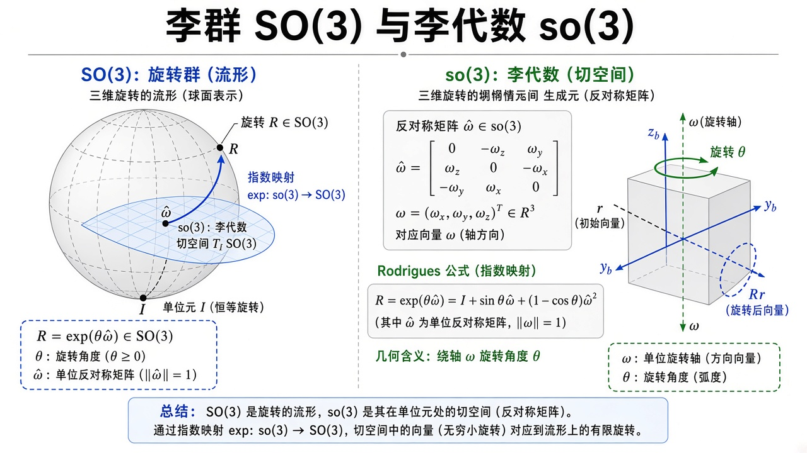
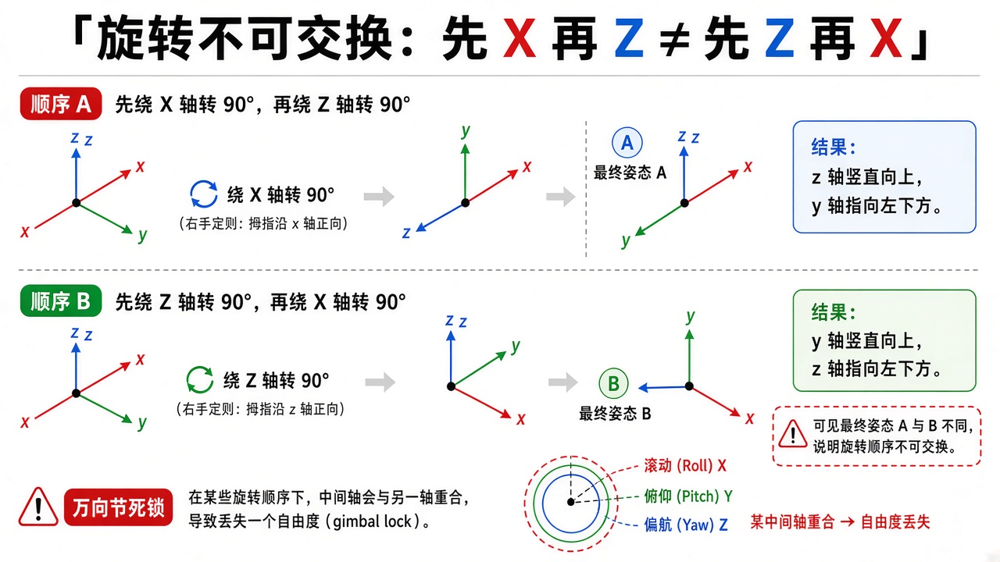
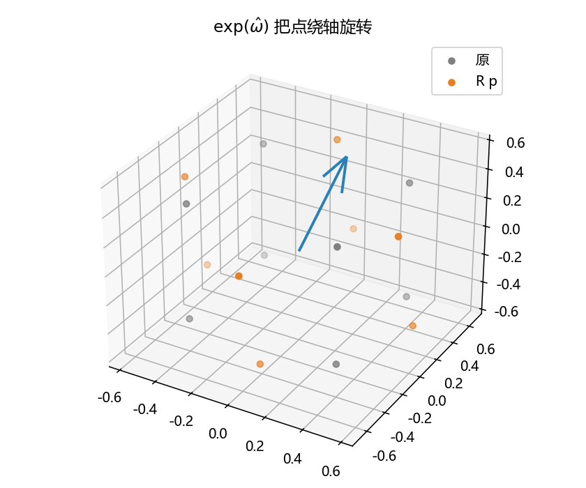

# 李群与李代数：旋转为什么不能当向量加

> [!WARNING]
> 🧪 Beta公测版本提示：教程主体已完成，正在优化细节，欢迎大家提Issue反馈问题或建议。

> 三维旋转矩阵 $R$ 满足 $R^\top R=I$ 且 $\det R=1$，全体记作 $\mathrm{SO}(3)$。两个旋转的「平均」或「一点点增量」都不能把九个数字当 $\mathbb{R}^9$ 加减——会走出合法姿态。正确的小量住在单位元处的切空间 **$\mathfrak{so}(3)$**（反对称矩阵），再用 **指数映射** 送回 $\mathrm{SO}(3)$。本章把「为什么欧拉角会万向节死锁、hat 从哪来、Rodrigues 每项在干什么」写清楚。平面刚体的「转 + 移」见 [旋量](/robotics/screw/)。DH 链上的 $R$ 块正是这里的点，见 [建模](/robotics/modeling/)。

---

## 一、通俗理解：姿态不是平面上的一个角

平面里一个 $\theta$，加 $0.1$ 还是角。空间里三个欧拉角看起来也像向量，但：

1. **乘法不交换**：$R_x R_z$ 和 $R_z R_x$ 不是同一个姿态。先低头再转身，和先转身再低头，鼻子朝向不同。
2. **欧拉角有万向节死锁（gimbal lock）**：中间角到 $\pm 90^\circ$ 时，另外两轴重合，丢了一个自由度。飞机、相机云台、欧拉积分的仿真都会踩。
3. **九个矩阵元只有三个自由**：必须 $R^\top R=I$、$\det R=1$。把 $R_1$ 和 $R_2$ 逐元平均，结果一般不再正交。

所以姿态的合法集合是弯曲的三维流形（可以想成一个三维的「球面」），不是 $\mathbb{R}^3$ 或 $\mathbb{R}^9$。在流形上，**切空间里的向量才可以加**；加完再用指数映射贴回流形。



> **图解说明**：左：球面示意旋转流形，切平面是 $\mathfrak{so}(3)$，曲线箭头是 $\exp$。右：$\omega$ 变成 $\hat\omega$，Rodrigues 给出绕轴转角。群上的点是姿态，代数上的向量是「转多少」。

<video controls muted loop playsinline preload="metadata" style="width:100%;max-width:960px;border-radius:8px;background:#f7fafc;margin:0.6rem 0;">
  <source src="./images/so3_order.mp4" type="video/mp4">
</video>

> **动画说明**：左先 $R_z 90^\circ$ 再 $R_x 90^\circ$，右先 $R_x$ 再 $R_z$。红 $x$ / 绿 $y$ / 蓝 $z$。终点姿态不同，所以欧拉角不能当 $\mathbb{R}^3$ 加减。

量子信息里的幺正群 $\mathrm{U}(n)$ 是同一类故事；见 [量子信息](/quantum/overview/)。线性代数复习见 [向量与矩阵](/math/linear-algebra/)。



> **图解说明**：先 $X$ 再 $Z$ 与先 $Z$ 再 $X$ 终点姿态不同。右下：中间角到 $90^\circ$ 时两轴重合，万向节死锁。

**保姆级：欧拉角为什么看起来像向量却不是。** 滚转、俯仰、偏航各是一个角，三个数排成向量很诱人。可是「加 $5^\circ$ 俯仰」依赖于你现在已经转了多少——姿态流形是弯曲的，切空间的向量只能在当地加。万向节死锁是弯曲的一个症状：参数化在某点退化，三个角不再覆盖三个独立方向。

---

## 二、无穷小旋转为什么一定是反对称矩阵

取 $R(t)$，$R(0)=I$。正交性 $R^\top R=I$ 两边对 $t$ 在 $0$ 求导：

$$
\dot R^\top + \dot R=0 \quad\Rightarrow\quad \dot R^\top=-\dot R.
$$

所以 $\dot R(0)$ 必须反对称。三维反对称矩阵恰好三个自由量，与轴角向量 $\omega\in\mathbb{R}^3$ 一一对应（`hat`）：

$$
\hat\omega
=
\begin{pmatrix}
0 & -\omega_z & \omega_y \\
\omega_z & 0 & -\omega_x \\
-\omega_y & \omega_x & 0
\end{pmatrix}.
$$

直接验证 $\hat\omega\, p=\omega\times p$。角速度就是「此刻姿态在切空间里的速度」。练习 `hat_02` 钉死矩阵 $(0,2)$ 格是 $+\omega_y$——符号写反则转反。

::: details 逐步推导：正交性 $R^\top R=I$ 怎样逼出反对称（点击展开）

设 $R(t)$ 是一条合法旋转曲线，$R(0)=I$。对任意 $t$，$R(t)^\top R(t)=I$。两边对 $t$ 求导：

$$
\dot R(t)^\top R(t)+R(t)^\top \dot R(t)=0.
$$

令 $t=0$，$R(0)=I$，得到

$$
\dot R(0)^\top+\dot R(0)=0,
$$

即 $\dot R(0)$ 反对称。三维反对称矩阵的独立元恰好三个：可放在 $(0,1)$、$(0,2)$、$(1,2)$ 位置，其余由 $A^\top=-A$ 决定。把这三个数叫做 $\omega_z,\omega_y,\omega_x$（符号约定使 $\hat\omega p=\omega\times p$），就得到正文的 `hat` 矩阵。

反过来：任意反对称 $K$ 给出曲线 $R(t)=\exp(tK)$，Rodrigues 保证它永远正交且行列式为 $1$，所以切空间维数 $=$ 流形维数 $=3$。

:::

---

## 三、Rodrigues：有限转角的闭式 $\exp$

令 $\theta=\|\omega\|$，$K=\hat\omega$（**不是**单位反对称阵）。绕轴 $n=\omega/\theta$ 转 $\theta$ 弧度：

$$
\exp(\hat\omega)
=
I + \frac{\sin\theta}{\theta}K + \frac{1-\cos\theta}{\theta^2}K^2
\qquad(\theta\to 0\text{ 时退回 }I+K).
$$

保姆级读三项：

- $I$：不转。
- $\sin\theta$ 项：在垂直于轴的平面里把向量拧一截（像二维旋转的 $\sin$）。
- $(1-\cos\theta)$ 项：把向量往轴上「拉近」再送回去（二维旋转的 $1-\cos$）。

教材若写单位轴 $\hat n$ 与转角 $\theta$，则 $K=\theta\hat n$，两种写法等价。$\theta\to 0$ 时 $\sin\theta/\theta\to 1$，代码用阈值避免除零。

::: details 逐步推导：Rodrigues 公式从指数级数来（点击展开）

矩阵指数 $\exp(K)=\sum_{n=0}^\infty K^n/n!$。反对称 $K=\hat\omega$ 满足 Cayley–Hamilton 的二维旋转类关系：令 $\theta=\|\omega\|$，$n=\omega/\theta$，$K_\mathrm{u}=\hat n$，则 $K=\theta K_\mathrm{u}$，且

$$
K_\mathrm{u}^3=-K_\mathrm{u}
$$

（三次叉乘绕回来，像复数 $i^3=-i$）。于是高次幂只在 $K_\mathrm{u}$ 与 $K_\mathrm{u}^2$ 之间振荡，级数收成

$$
\exp(\theta K_\mathrm{u})=I+\sin\theta\, K_\mathrm{u}+(1-\cos\theta)K_\mathrm{u}^2.
$$

代回 $K=\theta K_\mathrm{u}$ 得到正文（$\sin\theta/\theta$ 与 $(1-\cos\theta)/\theta^2$）。几何：$I$ 不动沿轴分量；$K_\mathrm{u}$ 在垂直平面里转 $90^\circ$；$K_\mathrm{u}^2$ 把垂直分量翻到轴的反方向——合起来就是绕 $n$ 转 $\theta$。

$\theta\to 0$ 用等价无穷小 $\exp(K)\approx I+K$，与「角速度 × 时间 = 小转角」一致。

:::

对数映射反向：从 $R$ 读出转角与轴，

$$
\theta=\arccos\frac{\mathrm{tr}(R)-1}{2},\quad
n=\frac{1}{2\sin\theta}\begin{pmatrix}R_{32}-R_{23}\\ R_{13}-R_{31}\\ R_{21}-R_{12}\end{pmatrix},
\quad \omega=\theta n.
$$

$\mathrm{tr}(R)=1+2\cos\theta$。上式的除法只适用于 $0<\theta<\pi$。实现中，小角度用 $\tfrac12(R-R^\top)^\vee$ 保留一阶旋转量；接近 $\pi$ 时，从 $\tfrac12(R+R^\top)$ 的最大特征值对应特征向量恢复转轴。精确 $\theta=\pi$ 时轴的正负号等价，应验证 $\exp(\log R)\approx R$，而非要求旋转向量唯一。


::: details 数值分支从哪里来：小角度与半周旋转

设单位转轴为 $n$，$K=\widehat n$。Rodrigues 给出
$
R-R^\top=2\sin\theta\,K,\qquad
S=\frac{R+R^\top}{2}
=\cos\theta\,I+(1-\cos\theta)nn^\top.
$
第一式说明代码的 `vee` 是 $2\sin\theta\,n$，所以 $\theta\to0$ 时 $\omega\approx\mathrm{vee}/2$；返回零会丢掉真实的小转角。第二式说明 $Sn=n$，而垂直于 $n$ 的方向具有特征值 $\cos\theta$。在 $\theta\approx\pi$ 时，取 $S$ 的最大特征值对应特征向量就能稳定恢复轴，避免除以几乎为零的 $\sin\theta$。

主值角在 $[0,\pi]$ 内，因此可用
$
\theta=\operatorname{atan2}\!\left(\frac{\|\mathrm{vee}\|}{2},
\frac{\operatorname{tr}R-1}{2}\right).
$
接近但未到 $\pi$ 时，用反对称部分确定轴号；精确 $\pi$ 时两个轴号表示同一姿态。可用 $R=I$、微小单轴旋转及 $R=\operatorname{diag}(1,-1,-1)$ 检查不同分支，最后一例应还原绕 $x$ 轴半周的矩阵，而不是单位阵。

**适用前提**：输入已是合法旋转矩阵。这段实现没有把任意噪声矩阵投影到 $\mathrm{SO}(3)$；`clip` 也不等价于修复非正交输入。以上是代数与源码检查，本轮未执行数值回归测试。

:::

**四元数**（不展开实现）：单位四元数也表示 $\mathrm{SO}(3)$，插值（slerp）比欧拉干净，与 $\exp$ 是同一轴角的另一套坐标。IMU 滤波常用。

---

## 四、数字例与 C++

同一组 $\omega=(0.3,-0.1,0.8)$：

- Python `so3_exp` / `so3_log` 验证 $\log(\exp(\omega))\approx\omega$、$R^\top R\approx I$、$\det R=1$，并把立方体顶点转过去；
- `so3.hpp` 里 `hat` / `so3_exp` 是同样的 Rodrigues；`demo.cpp` 只印 $\det(R)$。

```bash
cd docs/robotics/lie-groups/code
python demo.py
g++ -std=c++17 demo.cpp -o so3_demo
```

头文件 header-only。数值应 $\det\approx 1$。

---

## 五、常见疑问

**Q：那我积分姿态能不能 $\theta\leftarrow\theta+\omega\Delta t$？**  
平面可以。三维应对反对称矩阵做 $\exp(\hat\omega\Delta t)$ 再左乘（或右乘，看 $\omega$ 在体坐标还是空间坐标）。欧拉角积分既慢又死锁。

**Q：两个旋转怎么平均？**  
不能 $(R_1+R_2)/2$。正确做法在切空间：$\bar R=R_1\exp(\tfrac12\log(R_1^\top R_2))$（测地中点）。这就是「先变回向量、加完再贴回去」。

**Q：$\mathrm{SO}(3)$ 和旋转向量差在哪？**  
旋转向量 $\omega$ 是切空间坐标，$\|\omega\|$ 到 $2\pi$ 会绕回来，不是全局一一对应。滤波时误差取小 $\omega$，名义姿态用 $R$ 或四元数。

**Q：和 DH 什么关系？**  
每一帧 $A_i$ 的左上 $3\times 3$ 都是 $\mathrm{SO}(3)$ 里的点。关节转 $\Delta\theta$，相当于沿该关节 $z$ 轴做一次 $\exp$。

---

## 六、代码在做什么

`demo.py` 打印往返误差与正交性，三维散点图 `so3_exp.png`：灰点原立方体，橙点 $Rp$，蓝箭头是 $\omega$ 轴。



---

## 七、小结

| 概念 | 一句话 |
|------|--------|
| $\mathrm{SO}(3)$ | 合法三维旋转；弯曲的，不能逐元加 |
| 欧拉角 | 看起来像 $\mathbb{R}^3$，有死锁、不交换 |
| $\mathfrak{so}(3)$ | 反对称；$3$ 个数 $=\omega$ |
| `hat` | $\mathbb{R}^3\to$ 叉乘矩阵 |
| $\exp/\log$ | 切空间 $\leftrightarrow$ 群 |
| 下游 | 位姿滤波、IMU、[旋量 $\mathrm{SE}(3)$](/robotics/screw/) |

> 下一章 [机构学](/robotics/mechanisms/) 先离开矩阵，看闭链怎么动。把转动与平移合成螺旋见 [旋量](/robotics/screw/)。

## 📥 Code

| File | View | Download |
|------|------|----------|
| demo.py | [Open](./code-demo) | <a href="/notebook/code/robotics/lie-groups/demo.py" target="_blank" download>Download</a> |
| so3.hpp | — | <a href="/notebook/code/robotics/lie-groups/so3.hpp" target="_blank" download>Download</a> |
| demo.cpp | — | <a href="/notebook/code/robotics/lie-groups/demo.cpp" target="_blank" download>Download</a> |
| exercise.py | [Open](./code-exercise) | <a href="/notebook/code/robotics/lie-groups/exercise.py" target="_blank" download>Download</a> |

## 参考

1. Murray, Li, Sastry, *A Mathematical Introduction to Robotic Manipulation*
2. Solà, “Quaternion kinematics for the error-state Kalman filter”
3. 3Blue1Brown 之外，可视化 $\mathrm{SO}(3)$ 可看 *Modern Robotics* 第 3 讲
